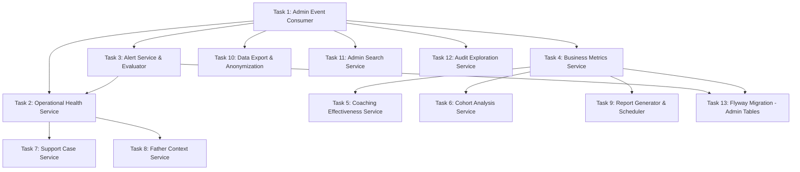

# Tasks — Administration & Analytics

## Task Dependency Graph

## Tasks

### Task 1: Admin Event Consumer
- **Description**: Implement the AdminEventConsumer that processes business events from the side-effect outbox, updating real-time operational metrics incrementally.
- **Files to create/modify**:
  - `backend/src/main/java/com/dadcoach/admin/event/AdminEventConsumer.java`
- **Acceptance criteria**:
  - [ ] Consumes events from side_effect_outbox table (SPEC-005 format)
  - [ ] Processes: CONVERSATION_COMPLETED, MISSION_COMPLETED, DELIVERY_FAILED, etc.
  - [ ] Updates metric counters incrementally (not by polling domain tables)
  - [ ] Handles backpressure: marks metrics as delayed if falling behind
  - [ ] Never drops events (catches up without loss)
  - [ ] Runs in dedicated thread pool
- **Dependencies**: None

### Task 2: Operational Health Service
- **Description**: Implement the OperationalHealthService that provides real-time health views: active conversations, AI health, delivery rates, system throughput.
- **Files to create/modify**:
  - `backend/src/main/java/com/dadcoach/admin/monitoring/OperationalHealthService.java`
  - `backend/src/main/java/com/dadcoach/admin/monitoring/HealthSnapshot.java`
- **Acceptance criteria**:
  - [ ] Real-time metrics: active_conversations, active_fathers, messages_per_hour
  - [ ] AI health: average_latency, error_rate, fallback_rate
  - [ ] Delivery: success_rate, pending_count, failed_count
  - [ ] Scheduling: triggers_fired_today, coverage_percentage
  - [ ] All metrics include freshness indicator (last_updated_at)
  - [ ] Health snapshot queryable for dashboard consumption
- **Dependencies**: Task 1, Task 3

### Task 3: Alert Service & Evaluator
- **Description**: Implement the AlertService (lifecycle management: TRIGGERED → ACKNOWLEDGED → RESOLVED → CLOSED) and AlertEvaluator (periodic threshold checking every 60 seconds).
- **Files to create/modify**:
  - `backend/src/main/java/com/dadcoach/admin/monitoring/AlertService.java`
  - `backend/src/main/java/com/dadcoach/admin/monitoring/AlertEvaluator.java`
  - `backend/src/main/java/com/dadcoach/admin/monitoring/Alert.java`
  - `backend/src/main/java/com/dadcoach/admin/monitoring/AlertRepository.java`
- **Acceptance criteria**:
  - [ ] Evaluator runs every 60 seconds
  - [ ] Checks thresholds: AI latency p95 > 10s → CRITICAL, AI error > 5% → CRITICAL
  - [ ] Delivery rate < 90% → CRITICAL, Daily coverage < 80% → WARNING
  - [ ] Unreviewed safety events > 4h → CRITICAL
  - [ ] Alert lifecycle: TRIGGERED → ACKNOWLEDGED → RESOLVED → CLOSED
  - [ ] Thresholds read from configuration (defined by owning specs)
  - [ ] Alert deduplication (same metric+threshold only creates one active alert)
- **Dependencies**: Task 1

### Task 4: Business Metrics Service
- **Description**: Implement the BusinessMetricsService that computes and stores business metrics into materialized summary tables (metric_snapshots) refreshed by scheduled jobs.
- **Files to create/modify**:
  - `backend/src/main/java/com/dadcoach/admin/analytics/BusinessMetricsService.java`
  - `backend/src/main/java/com/dadcoach/admin/analytics/MetricSnapshot.java`
  - `backend/src/main/java/com/dadcoach/admin/analytics/MetricSnapshotRepository.java`
  - `backend/src/main/java/com/dadcoach/admin/analytics/MetricRefreshJob.java`
- **Acceptance criteria**:
  - [ ] Computes daily metrics: engagement distribution, mission completion rates, active fathers
  - [ ] Stores in metric_snapshots table with dimensions (phase, category, etc.)
  - [ ] Supports DAILY, WEEKLY, MONTHLY granularity
  - [ ] Refresh job runs daily (configurable schedule)
  - [ ] Metrics are eventually consistent (never presented as real-time without freshness indicator)
  - [ ] Last known value used when source data unavailable (marked STALE)
- **Dependencies**: Task 1

### Task 5: Coaching Effectiveness Service
- **Description**: Implement the CoachingEffectivenessService that computes KPIs measuring coaching impact: mission completion improvement, engagement trends, streak growth, goal achievement rates.
- **Files to create/modify**:
  - `backend/src/main/java/com/dadcoach/admin/analytics/CoachingEffectivenessService.java`
- **Acceptance criteria**:
  - [ ] Mission completion rate trend (7-day, 30-day, 90-day windows)
  - [ ] Average engagement score by phase
  - [ ] Streak distribution across fathers
  - [ ] Goal completion rate by category
  - [ ] Relationship quality improvement over time
  - [ ] KPIs compared against SPEC-003 Req 12 targets
- **Dependencies**: Task 4

### Task 6: Cohort Analysis Service
- **Description**: Implement the CohortAnalysisService that groups fathers by activation week/month and compares engagement and retention metrics across cohorts.
- **Files to create/modify**:
  - `backend/src/main/java/com/dadcoach/admin/analytics/CohortAnalysisService.java`
- **Acceptance criteria**:
  - [ ] Groups fathers by activation_date (weekly, monthly cohorts)
  - [ ] Computes per-cohort: retention rate, engagement average, mission completion rate
  - [ ] Compares cohorts at same age (day 7, day 14, day 30, day 60, day 90)
  - [ ] Supports filtering by coaching_phase and coaching_style
  - [ ] Returns structured data suitable for visualization
- **Dependencies**: Task 4

### Task 7: Support Case Service
- **Description**: Implement the SupportCaseService for creating and tracking support interactions (agent actions on father accounts) with full audit trail.
- **Files to create/modify**:
  - `backend/src/main/java/com/dadcoach/admin/support/SupportCaseService.java`
  - `backend/src/main/java/com/dadcoach/admin/support/SupportCase.java`
  - `backend/src/main/java/com/dadcoach/admin/support/SupportCaseRepository.java`
- **Acceptance criteria**:
  - [ ] Records: agent_id, father_id, action, reason
  - [ ] All support actions logged (never deleted)
  - [ ] Queryable by father_id and agent_id
  - [ ] Actions include: status override, memory deletion, conversation inspection
  - [ ] Timestamp and reason required for every case
- **Dependencies**: Task 2

### Task 8: Father Context Service
- **Description**: Implement the FatherContextService that assembles the unified support view: profile, active conversation, active mission, recent memories, engagement trend, pending alerts, unreviewed safety events.
- **Files to create/modify**:
  - `backend/src/main/java/com/dadcoach/admin/support/FatherContextService.java`
  - `backend/src/main/java/com/dadcoach/admin/support/FatherContextDto.java`
- **Acceptance criteria**:
  - [ ] Assembles complete father context in single call
  - [ ] Includes: profile, active conversation, active mission, top 10 memories
  - [ ] Includes: 7-day engagement trend, pending alerts, unreviewed safety events
  - [ ] Delegates to subsystem services (never queries raw tables directly)
  - [ ] Handles partial failures (returns available data with missing indicators)
  - [ ] Sensitivity filtering applied based on admin role
- **Dependencies**: Task 2

### Task 9: Report Generator & Scheduler
- **Description**: Implement the ReportGenerator (creates structured reports) and ReportScheduler (triggers generation on daily/weekly/monthly schedules and on-demand).
- **Files to create/modify**:
  - `backend/src/main/java/com/dadcoach/admin/reporting/ReportGenerator.java`
  - `backend/src/main/java/com/dadcoach/admin/reporting/ReportScheduler.java`
  - `backend/src/main/java/com/dadcoach/admin/reporting/GeneratedReport.java`
  - `backend/src/main/java/com/dadcoach/admin/reporting/ReportRepository.java`
- **Acceptance criteria**:
  - [ ] Report types: DAILY_OPERATIONS, WEEKLY_BUSINESS, MONTHLY_EXECUTIVE
  - [ ] Content stored as JSONB for flexible structure
  - [ ] Scheduled reports run automatically at configured times
  - [ ] On-demand reports generated by admin request
  - [ ] Failed reports marked FAILED with partial data retained
  - [ ] Reports queryable by type and period
- **Dependencies**: Task 4

### Task 10: Data Export & Anonymization
- **Description**: Implement the DataExportService for GDPR data exports and the AnonymizationService for anonymized analytics exports (k-anonymity, k≥5).
- **Files to create/modify**:
  - `backend/src/main/java/com/dadcoach/admin/export/DataExportService.java`
  - `backend/src/main/java/com/dadcoach/admin/export/AnonymizationService.java`
- **Acceptance criteria**:
  - [ ] GDPR export: all personal data for a father in structured format
  - [ ] Export processed asynchronously (may take time for large datasets)
  - [ ] Retry 3 times on failure; escalate to SUPER_ADMIN if all fail
  - [ ] Anonymization: removes all PII, applies k-anonymity (k≥5)
  - [ ] Anonymized export suitable for analytics without individual identification
  - [ ] Export format: JSON with clear structure
- **Dependencies**: Task 1

### Task 11: Admin Search Service
- **Description**: Implement the AdminSearchService for cross-entity search across fathers, conversations, missions, and memories with role-scoped results and sensitivity masking.
- **Files to create/modify**:
  - `backend/src/main/java/com/dadcoach/admin/search/AdminSearchService.java`
- **Acceptance criteria**:
  - [ ] Search across: fathers (by name, phone, status), conversations, missions, memories
  - [ ] Results scoped by admin role (ANALYTICS → aggregated only)
  - [ ] Phone numbers masked unless SUPER_ADMIN
  - [ ] HIGH sensitivity content filtered for ANALYTICS role
  - [ ] Pagination on search results
  - [ ] Timeout: returns partial results if query takes > 5s
- **Dependencies**: Task 1

### Task 12: Audit Exploration Service
- **Description**: Implement the AuditExplorationService that provides unified query access across all audit sources (API audit, state transitions, memory audit) by actor, subject, and time range.
- **Files to create/modify**:
  - `backend/src/main/java/com/dadcoach/admin/audit/AuditExplorationService.java`
- **Acceptance criteria**:
  - [ ] Queries across: api_audit_log, state_transition_log, memory_audit_log
  - [ ] Filter by: actor_id, subject_id (father_id), time range, operation_type
  - [ ] Unified result format regardless of source table
  - [ ] Results are append-only (no modification regardless of role)
  - [ ] Supports pagination for large result sets
  - [ ] Time-range queries use indexed columns
- **Dependencies**: Task 1

### Task 13: Flyway Migration - Admin Tables
- **Description**: Create the Flyway migration for administration tables: support_cases, alerts, metric_snapshots, generated_reports.
- **Files to create/modify**:
  - `backend/src/main/resources/db/migration/V9__administration_analytics.sql`
- **Acceptance criteria**:
  - [ ] support_cases with indexes on father_id and agent_id
  - [ ] alerts with status CHECK and active-alerts index
  - [ ] metric_snapshots with unique(metric_name, dimensions, snapshot_date, granularity)
  - [ ] generated_reports with index on report_type
  - [ ] All indexes from design created
  - [ ] Migration runs successfully against PostgreSQL
- **Dependencies**: Task 3, Task 4
