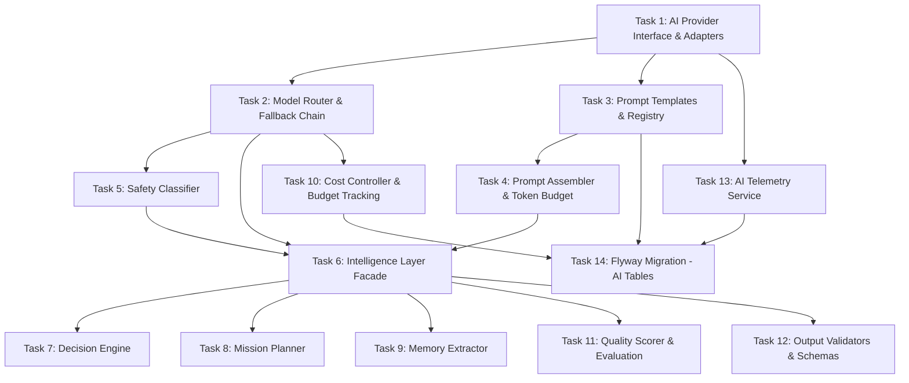

# Tasks — AI Architecture Intelligence Layer

## Task Dependency Graph

## Tasks

### Task 1: AI Provider Interface & Adapters
- **Description**: Implement the provider-agnostic `AiProvider` interface and concrete adapters for OpenAI and Anthropic, using Spring WebClient for async HTTP calls with Resilience4j circuit breakers.
- **Files to create/modify**:
  - `backend/src/main/java/com/dadcoach/ai/provider/AiProvider.java`
  - `backend/src/main/java/com/dadcoach/ai/provider/AiProviderRequest.java`
  - `backend/src/main/java/com/dadcoach/ai/provider/AiProviderResponse.java`
  - `backend/src/main/java/com/dadcoach/ai/provider/AiProviderException.java`
  - `backend/src/main/java/com/dadcoach/ai/provider/openai/OpenAiProvider.java`
  - `backend/src/main/java/com/dadcoach/ai/provider/openai/OpenAiProperties.java`
  - `backend/src/main/java/com/dadcoach/ai/provider/anthropic/AnthropicProvider.java`
  - `backend/src/main/java/com/dadcoach/ai/provider/anthropic/AnthropicProperties.java`
- **Acceptance criteria**:
  - [ ] AiProvider interface defines `sendPrompt(request) → response`
  - [ ] OpenAI adapter calls GPT-4o and GPT-4o-mini via WebClient
  - [ ] Anthropic adapter calls Claude 3.5 via WebClient
  - [ ] Each adapter has a Resilience4j circuit breaker (trips at 5% error over 1h)
  - [ ] 10-second timeout per provider call
  - [ ] Standardized request/response format hides provider differences
  - [ ] Integration test with WireMock validates API call format
- **Dependencies**: None

### Task 2: Model Router & Fallback Chain
- **Description**: Implement the ModelRouter that selects provider+model per conversation type, and the FallbackChain that attempts secondary providers on failure.
- **Files to create/modify**:
  - `backend/src/main/java/com/dadcoach/ai/routing/ModelRouter.java`
  - `backend/src/main/java/com/dadcoach/ai/routing/FallbackChain.java`
  - `backend/src/main/java/com/dadcoach/ai/routing/ModelConfig.java`
  - `backend/src/main/java/com/dadcoach/ai/routing/FallbackResponseProvider.java`
- **Acceptance criteria**:
  - [ ] Routing table maps each ConversationType to (model, temperature, top_p, max_tokens)
  - [ ] Same conversation type always maps to same model under normal conditions
  - [ ] Fallback order: same provider lower-tier → secondary provider → pre-written fallback
  - [ ] Total fallback chain completes within 30 seconds
  - [ ] No step in the chain is skipped
  - [ ] Pre-written fallbacks are in conversational Latin American Spanish
- **Dependencies**: Task 1

### Task 3: Prompt Templates & Registry
- **Description**: Implement the PromptRegistry for versioned prompt templates with A/B test group assignment, and the YAML template loading mechanism.
- **Files to create/modify**:
  - `backend/src/main/java/com/dadcoach/ai/prompt/PromptRegistry.java`
  - `backend/src/main/java/com/dadcoach/ai/prompt/PromptTemplate.java`
  - `backend/src/main/java/com/dadcoach/ai/prompt/PromptVersion.java`
  - `backend/src/main/java/com/dadcoach/ai/prompt/AbTestAssigner.java`
  - `backend/src/main/resources/prompts/` (template YAML files)
- **Acceptance criteria**:
  - [ ] Templates loaded from YAML/resource files at startup
  - [ ] Version tracking per prompt type
  - [ ] A/B test group assignment is deterministic: `hash(father_id) % 2`
  - [ ] Same father_id always gets same group ("A" or "B")
  - [ ] Active version per prompt type retrievable
  - [ ] Templates support parameterized placeholders (Mustache-style)
- **Dependencies**: None

### Task 4: Prompt Assembler & Token Budget
- **Description**: Implement the PromptAssembler that composes multi-section prompts with strict token budgets using tiktoken4j for exact token counting.
- **Files to create/modify**:
  - `backend/src/main/java/com/dadcoach/ai/prompt/PromptAssembler.java`
  - `backend/src/main/java/com/dadcoach/ai/prompt/TokenBudgetManager.java`
  - `backend/src/main/java/com/dadcoach/ai/prompt/AiMessage.java`
  - `backend/src/main/java/com/dadcoach/ai/prompt/SlidingWindowBuilder.java`
- **Acceptance criteria**:
  - [ ] Total budget: 2000 tokens (system:400, memory:500, context:300, history:600, output:200)
  - [ ] Each section never exceeds its allocated budget
  - [ ] Token counting uses tiktoken4j (cl100k_base) for exact counts
  - [ ] Sliding window always includes current user message + last assistant response
  - [ ] History truncates oldest messages first when budget exceeded
  - [ ] Assembled prompt is a list of AiMessage objects ready for provider
- **Dependencies**: Task 3

### Task 5: Safety Classifier
- **Description**: Implement the SafetyClassifier that classifies inbound messages into safety categories (SAFE, EMOTIONAL_DISTRESS, CRISIS, CHILD_SAFETY, MEDICAL, LEGAL, MANIPULATION, OFF_TOPIC) using keyword detection and semantic analysis.
- **Files to create/modify**:
  - `backend/src/main/java/com/dadcoach/ai/safety/SafetyClassifier.java`
  - `backend/src/main/java/com/dadcoach/ai/safety/SafetyClassification.java`
  - `backend/src/main/java/com/dadcoach/ai/safety/SafetyKeywords.java`
  - `backend/src/main/java/com/dadcoach/ai/safety/SafetyResponseProvider.java`
- **Acceptance criteria**:
  - [ ] Returns exactly one classification with confidence [0.0, 1.0]
  - [ ] Classification is never null or undefined
  - [ ] Spanish crisis keywords detected (self-harm, abuse, violence)
  - [ ] CRISIS → pre-written safety response with hotline numbers
  - [ ] CHILD_SAFETY → flag for human review (2h SLA)
  - [ ] Runs BEFORE any coaching generation
  - [ ] Jailbreak/manipulation patterns detected and blocked
- **Dependencies**: Task 2

### Task 6: Intelligence Layer Facade
- **Description**: Implement the IntelligenceLayer public interface that coordinates all AI sub-components (safety, prompt assembly, routing, validation) into typed method contracts.
- **Files to create/modify**:
  - `backend/src/main/java/com/dadcoach/ai/IntelligenceLayer.java`
  - `backend/src/main/java/com/dadcoach/ai/IntelligenceLayerImpl.java`
  - `backend/src/main/java/com/dadcoach/ai/output/CoachingResponse.java`
  - `backend/src/main/java/com/dadcoach/ai/output/CoachingContext.java`
  - `backend/src/main/java/com/dadcoach/ai/output/MissionOutput.java`
  - `backend/src/main/java/com/dadcoach/ai/output/MissionContext.java`
  - `backend/src/main/java/com/dadcoach/ai/output/MemoryExtractionOutput.java`
  - `backend/src/main/java/com/dadcoach/ai/output/ActionRecommendation.java`
  - `backend/src/main/java/com/dadcoach/ai/output/WeeklySummaryOutput.java`
- **Acceptance criteria**:
  - [ ] All methods are stateless: receive context, return structured output
  - [ ] `generateCoachingResponse` coordinates: safety → prompt → route → validate
  - [ ] `generateMission` returns MissionOutput record
  - [ ] `extractMemories` returns MemoryExtractionOutput record
  - [ ] `classifyMessage` delegates to SafetyClassifier
  - [ ] `decideDailyAction` delegates to DecisionEngine
  - [ ] AI never directly mutates state — all outputs are recommendations
- **Dependencies**: Task 2, Task 4, Task 5

### Task 7: Decision Engine
- **Description**: Implement the priority-tree Decision Engine that selects the daily action for each father based on context hierarchy (safety > inactivity > mission > coaching > reflection).
- **Files to create/modify**:
  - `backend/src/main/java/com/dadcoach/ai/decision/DecisionEngine.java`
  - `backend/src/main/java/com/dadcoach/ai/decision/ActionHistory.java`
  - `backend/src/main/java/com/dadcoach/ai/decision/DailyDecisionContext.java`
- **Acceptance criteria**:
  - [ ] Priority 1 (SAFETY) always takes precedence regardless of other conditions
  - [ ] Multiple matching priorities → highest (lowest-numbered) wins
  - [ ] FOUNDATION phase → never returns CHALLENGE
  - [ ] phase_day < 7 → never returns REFLECT
  - [ ] 4-hour gap enforced for proactive messages (returns WAIT if violated)
  - [ ] Action history tracked per father for gap enforcement
- **Dependencies**: Task 6

### Task 8: Mission Planner
- **Description**: Implement the MissionPlanner that generates AI-powered mission recommendations with difficulty calculation, category selection, and child equity enforcement.
- **Files to create/modify**:
  - `backend/src/main/java/com/dadcoach/ai/mission/MissionPlanner.java`
  - `backend/src/main/java/com/dadcoach/ai/mission/DifficultyCalculator.java`
  - `backend/src/main/java/com/dadcoach/ai/mission/CategoryScorer.java`
- **Acceptance criteria**:
  - [ ] Difficulty within phase bounds (never < 1)
  - [ ] Category cooldown: same child 4 days, different child 2 days
  - [ ] Child equity: |missions(childA) - missions(childB)| ≤ 1 over 7 days
  - [ ] Violated equity → next mission MUST target under-served child
  - [ ] Output validated against MissionOutput schema before return
- **Dependencies**: Task 6

### Task 9: Memory Extractor
- **Description**: Implement the MemoryExtractor that analyzes completed conversations and produces structured memory recommendations for the Memory System.
- **Files to create/modify**:
  - `backend/src/main/java/com/dadcoach/ai/extraction/MemoryExtractor.java`
  - `backend/src/main/java/com/dadcoach/ai/extraction/CompletedConversation.java`
- **Acceptance criteria**:
  - [ ] Extracts memories from conversation transcript via AI
  - [ ] Output includes: category, content, importance_score, confidence_score, subject_type
  - [ ] Content limited to 500 characters per memory
  - [ ] importance_score between 1-10, confidence between 0.0-1.0
  - [ ] Returns structured MemoryExtractionOutput (not raw AI text)
  - [ ] Never exceeds token budget for extraction prompt
- **Dependencies**: Task 6

### Task 10: Cost Controller & Budget Tracking
- **Description**: Implement the CostController that tracks daily per-father token usage and enforces cost-reduction tiers (80% → mini model, 90% → reduced memory, 95% → cached only, 100% → no AI).
- **Files to create/modify**:
  - `backend/src/main/java/com/dadcoach/ai/routing/CostController.java`
  - `backend/src/main/java/com/dadcoach/ai/routing/DailyUsageTracker.java`
- **Acceptance criteria**:
  - [ ] At 80% budget: non-critical calls use GPT-4o-mini
  - [ ] At 90%: memory injection reduced to 8
  - [ ] At 95%: cached/template responses only
  - [ ] At 100%: no AI calls at all
  - [ ] Lower tiers don't apply restrictions from higher tiers
  - [ ] Usage tracked per father per day (resets at midnight UTC)
  - [ ] Budget configurable via application.yml
- **Dependencies**: Task 2

### Task 11: Quality Scorer & Evaluation
- **Description**: Implement the QualityScorer for automated response quality evaluation and the EvaluationEngine for metrics correlation and A/B analysis.
- **Files to create/modify**:
  - `backend/src/main/java/com/dadcoach/ai/evaluation/QualityScorer.java`
  - `backend/src/main/java/com/dadcoach/ai/evaluation/EvaluationEngine.java`
- **Acceptance criteria**:
  - [ ] Quality formula: (mcr×0.3) + (nor×0.25) + (ccr×0.25) + (nsd×0.2)
  - [ ] Result always in range [0, 100]
  - [ ] Each component normalized to 0-100 before formula
  - [ ] A/B test group comparison available
  - [ ] Quality score persisted in telemetry record
- **Dependencies**: Task 6

### Task 12: Output Validators & Schemas
- **Description**: Implement the OutputValidator that validates all AI output types against their defined schemas (required fields, enum values, numeric ranges, string lengths).
- **Files to create/modify**:
  - `backend/src/main/java/com/dadcoach/ai/output/OutputValidator.java`
  - `backend/src/main/java/com/dadcoach/ai/output/ValidationResult.java`
- **Acceptance criteria**:
  - [ ] Validates CoachingResponse, MissionOutput, MemoryExtractionOutput, SafetyClassification, ActionRecommendation, WeeklySummaryOutput, ReflectionInsightOutput
  - [ ] Required fields checked for non-null
  - [ ] Enum values match allowed sets
  - [ ] Numeric values within specified ranges
  - [ ] String lengths within specified bounds
  - [ ] Confidence always in [0.0, 1.0]
  - [ ] Returns structured ValidationResult with failure details
- **Dependencies**: Task 6

### Task 13: AI Telemetry Service
- **Description**: Implement structured telemetry emission for every AI call, recording input/output tokens, latency, cost, model, validation status, and quality score.
- **Files to create/modify**:
  - `backend/src/main/java/com/dadcoach/ai/telemetry/AiTelemetryService.java`
  - `backend/src/main/java/com/dadcoach/ai/telemetry/AiTelemetryRecord.java`
  - `backend/src/main/java/com/dadcoach/ai/telemetry/AiTelemetryRepository.java`
- **Acceptance criteria**:
  - [ ] Every AI call logs: request_id, father_id, model, tokens_in, tokens_out, cost, latency
  - [ ] Records include: validation_passed, fallback_used, retry_count, quality_score
  - [ ] A/B test group recorded per call
  - [ ] Alert triggers: error_rate > 5% over 30min, latency p95 > 10s over 15min
  - [ ] Telemetry write is async (does not block response delivery)
- **Dependencies**: Task 1

### Task 14: Flyway Migration - AI Tables
- **Description**: Create the Flyway migration for AI-related tables: ai_telemetry, ai_daily_summary, prompt_versions.
- **Files to create/modify**:
  - `backend/src/main/resources/db/migration/V3__ai_intelligence_layer.sql`
- **Acceptance criteria**:
  - [ ] ai_telemetry table with all columns from design
  - [ ] ai_daily_summary table with (father_id, date) primary key
  - [ ] prompt_versions table with unique(prompt_type, version)
  - [ ] Indexes on father_id, model_name, created_at
  - [ ] Migration runs successfully against PostgreSQL
- **Dependencies**: Task 10, Task 13, Task 3
