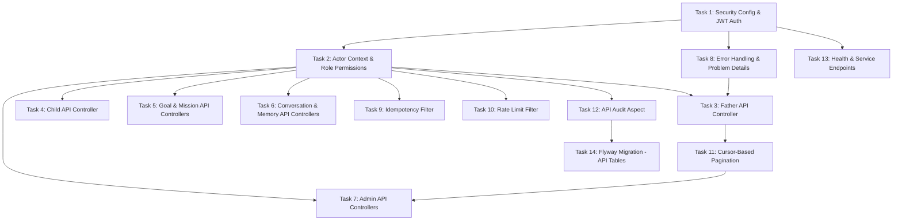

# Tasks — Application API

## Task Dependency Graph

## Tasks

### Task 1: Security Config & JWT Auth
- **Description**: Implement Spring Security configuration with JWT-based authentication, route guards for Father/Admin/Service APIs, and the JWT validation filter.
- **Files to create/modify**:
  - `backend/src/main/java/com/dadcoach/api/config/SecurityConfig.java`
  - `backend/src/main/java/com/dadcoach/api/auth/JwtAuthFilter.java`
  - `backend/src/main/java/com/dadcoach/api/config/CorsConfig.java`
- **Acceptance criteria**:
  - [ ] `/api/v1/admin/**` requires ADMIN role
  - [ ] `/api/v1/service/**` requires SERVICE role
  - [ ] `/api/v1/fathers/me/**` requires FATHER role
  - [ ] `/actuator/health/**` is public (no auth)
  - [ ] JWT token validated on every authenticated request
  - [ ] Father tokens contain father_id claim
  - [ ] Admin tokens contain role claims
  - [ ] Expired tokens return 401 with TOKEN_EXPIRED code
- **Dependencies**: None

### Task 2: Actor Context & Role Permissions
- **Description**: Implement the ActorContext (ThreadLocal with current actor type and ID) and role-permission mapping that enables ownership verification throughout the API layer.
- **Files to create/modify**:
  - `backend/src/main/java/com/dadcoach/api/auth/ActorContext.java`
  - `backend/src/main/java/com/dadcoach/api/auth/RolePermission.java`
  - `backend/src/main/java/com/dadcoach/api/auth/AuthActor.java` (annotation)
- **Acceptance criteria**:
  - [ ] ActorContext available throughout request lifecycle (ThreadLocal)
  - [ ] Contains: actorType (FATHER/ADMIN/SERVICE), actorId (UUID)
  - [ ] Cleared after request completion
  - [ ] Father actors NEVER see 403 for others' resources (always 404)
  - [ ] Resource ownership check: resource.fatherId == actor.fatherId
  - [ ] Custom @AuthActor annotation for controller parameter injection
- **Dependencies**: Task 1

### Task 3: Father API Controller
- **Description**: Implement the Father self-service API: GET /me (profile), PUT /me (update preferences), DELETE /me (account deletion request).
- **Files to create/modify**:
  - `backend/src/main/java/com/dadcoach/api/father/FatherController.java`
  - `backend/src/main/java/com/dadcoach/api/father/FatherResponseDto.java`
  - `backend/src/main/java/com/dadcoach/api/father/FatherUpdateRequest.java`
  - `backend/src/main/java/com/dadcoach/api/father/FatherMapper.java`
- **Acceptance criteria**:
  - [ ] GET /api/v1/fathers/me returns profile (public fields only)
  - [ ] PUT /api/v1/fathers/me updates preferences (timezone, coaching_time, style)
  - [ ] DELETE /api/v1/fathers/me triggers GDPR deletion flow
  - [ ] Response never contains: embeddings, AI prompts, raw confidence scores
  - [ ] Jakarta Bean Validation on update request
  - [ ] MapStruct mapper filters sensitive fields
- **Dependencies**: Task 2, Task 8

### Task 4: Child API Controller
- **Description**: Implement CRUD endpoints for children under /api/v1/fathers/me/children with ownership enforcement and business rule validation (max 8).
- **Files to create/modify**:
  - `backend/src/main/java/com/dadcoach/api/child/ChildController.java`
  - `backend/src/main/java/com/dadcoach/api/child/ChildCreateRequest.java`
  - `backend/src/main/java/com/dadcoach/api/child/ChildResponseDto.java`
  - `backend/src/main/java/com/dadcoach/api/child/ChildMapper.java`
- **Acceptance criteria**:
  - [ ] POST /api/v1/fathers/me/children creates child (max 8 enforced)
  - [ ] GET /api/v1/fathers/me/children lists father's children
  - [ ] GET /api/v1/fathers/me/children/{id} with ownership check
  - [ ] PUT /api/v1/fathers/me/children/{id} updates child details
  - [ ] DELETE /api/v1/fathers/me/children/{id} soft-deletes
  - [ ] Ownership mismatch returns 404 (not 403)
  - [ ] Birth date validation (0-18 years range)
- **Dependencies**: Task 2

### Task 5: Goal & Mission API Controllers
- **Description**: Implement CRUD for goals (/api/v1/fathers/me/goals) and read-only access to missions (/api/v1/fathers/me/missions) with pagination.
- **Files to create/modify**:
  - `backend/src/main/java/com/dadcoach/api/goal/GoalController.java`
  - `backend/src/main/java/com/dadcoach/api/goal/GoalCreateRequest.java`
  - `backend/src/main/java/com/dadcoach/api/goal/GoalResponseDto.java`
  - `backend/src/main/java/com/dadcoach/api/mission/MissionController.java`
  - `backend/src/main/java/com/dadcoach/api/mission/MissionResponseDto.java`
- **Acceptance criteria**:
  - [ ] Goal CRUD with max 5 active goals enforced
  - [ ] Goals: create, list, get, update, complete
  - [ ] Missions: list (paginated), get, get active mission
  - [ ] Missions are read-only for Father API (no direct mutation)
  - [ ] Ownership enforcement on all endpoints
  - [ ] Cursor-based pagination on list endpoints
- **Dependencies**: Task 2

### Task 6: Conversation & Memory API Controllers
- **Description**: Implement read-only conversation access (list with messages) and memory management (list, get, delete) for fathers.
- **Files to create/modify**:
  - `backend/src/main/java/com/dadcoach/api/conversation/ConversationController.java`
  - `backend/src/main/java/com/dadcoach/api/conversation/ConversationResponseDto.java`
  - `backend/src/main/java/com/dadcoach/api/memory/MemoryController.java`
  - `backend/src/main/java/com/dadcoach/api/memory/MemoryResponseDto.java`
- **Acceptance criteria**:
  - [ ] Conversations: list (paginated), get with messages
  - [ ] Conversations are read-only for Father API
  - [ ] Memories: list, get, delete (father can request deletion)
  - [ ] Memory responses never include: embeddings, raw confidence scores
  - [ ] Ownership enforcement on all endpoints
  - [ ] System prompts filtered from conversation message view
- **Dependencies**: Task 2

### Task 7: Admin API Controllers
- **Description**: Implement admin endpoints for father management, search, overrides, conversation inspection, and memory inspection with role-based data filtering.
- **Files to create/modify**:
  - `backend/src/main/java/com/dadcoach/api/father/AdminFatherController.java`
  - `backend/src/main/java/com/dadcoach/api/memory/AdminMemoryController.java`
  - `backend/src/main/java/com/dadcoach/api/admin/AdminSearchController.java`
- **Acceptance criteria**:
  - [ ] GET /api/v1/admin/fathers — list/search all fathers
  - [ ] GET /api/v1/admin/fathers/{id} — full father context
  - [ ] Admin memory view includes: archived memories, audit history
  - [ ] ANALYTICS role sees only aggregated data (no individual PII)
  - [ ] Phone numbers masked unless SUPER_ADMIN
  - [ ] Admin read operations on father data are audited
- **Dependencies**: Task 2, Task 11

### Task 8: Error Handling & Problem Details
- **Description**: Implement the global exception handler that formats all errors as RFC 9457 Problem Details responses with structured error codes.
- **Files to create/modify**:
  - `backend/src/main/java/com/dadcoach/api/error/GlobalExceptionHandler.java`
  - `backend/src/main/java/com/dadcoach/api/error/ProblemDetail.java`
  - `backend/src/main/java/com/dadcoach/api/error/ErrorCode.java`
- **Acceptance criteria**:
  - [ ] All errors return RFC 9457 format (type, title, status, detail, instance, error_code, request_id, retryable)
  - [ ] 400: VALIDATION_FAILED, FIELD_REQUIRED, FIELD_INVALID
  - [ ] 401: UNAUTHORIZED, TOKEN_EXPIRED
  - [ ] 404: RESOURCE_NOT_FOUND (covers ownership mismatch)
  - [ ] 409: STATE_TRANSITION_INVALID, DUPLICATE_RESOURCE
  - [ ] 422: LIMIT_EXCEEDED, OPERATION_NOT_ALLOWED
  - [ ] 429: RATE_LIMIT_EXCEEDED
  - [ ] 500: INTERNAL_ERROR (sanitized, no stack traces)
- **Dependencies**: Task 1

### Task 9: Idempotency Filter
- **Description**: Implement the IdempotencyFilter that checks the Idempotency-Key header on mutating requests, returning cached responses for duplicates.
- **Files to create/modify**:
  - `backend/src/main/java/com/dadcoach/api/idempotency/IdempotencyFilter.java`
  - `backend/src/main/java/com/dadcoach/api/idempotency/IdempotencyStore.java`
- **Acceptance criteria**:
  - [ ] Checks Idempotency-Key header on POST/PUT/DELETE requests
  - [ ] Duplicate key → return cached response (same status + body)
  - [ ] Key checked BEFORE any business logic executes
  - [ ] Keys stored with 24-hour TTL
  - [ ] Key scoped to actor_id (same key from different actors = different)
  - [ ] Expired keys cleaned up periodically
- **Dependencies**: Task 2

### Task 10: Rate Limit Filter
- **Description**: Implement per-actor rate limiting that enforces request quotas (configurable) and returns 429 with Retry-After header when exceeded.
- **Files to create/modify**:
  - `backend/src/main/java/com/dadcoach/api/ratelimit/RateLimitFilter.java`
  - `backend/src/main/java/com/dadcoach/api/ratelimit/RateLimitConfig.java`
- **Acceptance criteria**:
  - [ ] Rate limits enforced per actor_id (not per IP)
  - [ ] Actor identity required (no anonymous rate limiting)
  - [ ] Configurable limits per actor type (Father, Admin, Service)
  - [ ] 429 response includes Retry-After header
  - [ ] Returns RFC 9457 Problem Detail format
  - [ ] Sliding window algorithm for rate counting
- **Dependencies**: Task 2

### Task 11: Cursor-Based Pagination
- **Description**: Implement opaque cursor-based pagination (base64-encoded composite keys) for all list endpoints, with configurable page sizes and stable iteration.
- **Files to create/modify**:
  - `backend/src/main/java/com/dadcoach/api/pagination/CursorPageRequest.java`
  - `backend/src/main/java/com/dadcoach/api/pagination/CursorPageResponse.java`
  - `backend/src/main/java/com/dadcoach/api/pagination/CursorEncoder.java`
- **Acceptance criteria**:
  - [ ] Cursor is opaque base64-encoded token (composite key)
  - [ ] Response includes: items, next_cursor, has_more
  - [ ] Default page size configurable (e.g., 20)
  - [ ] Maximum page size enforced (e.g., 100)
  - [ ] Stable iteration (new inserts don't affect pagination)
  - [ ] First page requested without cursor; subsequent with cursor
- **Dependencies**: Task 3

### Task 12: API Audit Aspect
- **Description**: Implement the Spring AOP aspect that intercepts all mutating API calls and admin reads, writing audit entries synchronously with the operation.
- **Files to create/modify**:
  - `backend/src/main/java/com/dadcoach/api/audit/ApiAuditAspect.java`
  - `backend/src/main/java/com/dadcoach/api/audit/ApiAuditEntry.java`
  - `backend/src/main/java/com/dadcoach/api/audit/ApiAuditRepository.java`
- **Acceptance criteria**:
  - [ ] All POST/PUT/DELETE operations audited
  - [ ] Admin GET operations on father data audited
  - [ ] Audit written BEFORE response (synchronous)
  - [ ] Records: request_id, actor_type, actor_id, operation, resource, result
  - [ ] Changes field captures before/after state (JSONB)
  - [ ] Audit entries are append-only (no admin can modify/delete)
- **Dependencies**: Task 2

### Task 13: Health & Service Endpoints
- **Description**: Implement health check endpoints: public liveness/readiness via Actuator and authenticated detailed health via Service API.
- **Files to create/modify**:
  - `backend/src/main/java/com/dadcoach/api/health/HealthController.java`
  - `backend/src/main/resources/application.yml` (modify actuator config)
- **Acceptance criteria**:
  - [ ] /actuator/health/liveness — public, returns UP/DOWN
  - [ ] /actuator/health/readiness — public, checks DB connectivity
  - [ ] /api/v1/service/health — authenticated (SERVICE role), detailed subsystem status
  - [ ] Detailed health includes: database, AI provider, WhatsApp API status
  - [ ] Custom health indicators for each subsystem
- **Dependencies**: Task 1

### Task 14: Flyway Migration - API Tables
- **Description**: Create the Flyway migration for API-related tables: api_audit_log and idempotency_keys.
- **Files to create/modify**:
  - `backend/src/main/resources/db/migration/V7__application_api.sql`
- **Acceptance criteria**:
  - [ ] api_audit_log with all columns from design
  - [ ] Indexes on actor_id and resource_type+resource_id
  - [ ] idempotency_keys with 24h TTL expires_at
  - [ ] Index on expires_at for cleanup
  - [ ] Migration runs successfully against PostgreSQL
- **Dependencies**: Task 12
