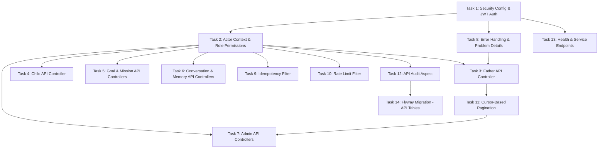

# Implementation Plan

## Overview

Implementation of the Application API layer for the Dad Coach platform, providing three API surfaces (Father, Admin, Service) with JWT authentication, cursor-based pagination, idempotency, rate limiting, audit logging, and RFC 9457 error handling.

## Task Dependency Graph



```json
{
  "waves": [
    {"wave": 1, "tasks": [1]},
    {"wave": 2, "tasks": [2, 8, 13]},
    {"wave": 3, "tasks": [3, 4, 5, 6, 9, 10, 12]},
    {"wave": 4, "tasks": [11, 14]},
    {"wave": 5, "tasks": [7]}
  ]
}
```

## Tasks

- [x] 1. Implement Spring Security configuration with JWT-based authentication, route guards for Father/Admin/Service APIs, and the JWT validation filter.
  - [x] 1.1 Create SecurityConfig.java with route guards: `/api/v1/admin/**` requires ADMIN role, `/api/v1/service/**` requires SERVICE role, `/api/v1/fathers/me/**` requires FATHER role, `/actuator/health/**` is public
  - [x] 1.2 Create JwtAuthFilter.java that validates JWT token on every authenticated request, extracts father_id claim from Father tokens, extracts role claims from Admin tokens, and returns 401 with TOKEN_EXPIRED code for expired tokens
  - [x] 1.3 Create CorsConfig.java with configurable allowed origins
  **Files**: `backend/src/main/java/com/dadcoach/api/config/SecurityConfig.java`, `backend/src/main/java/com/dadcoach/api/auth/JwtAuthFilter.java`, `backend/src/main/java/com/dadcoach/api/config/CorsConfig.java`
  **Requirements**: Requirement 6 (Authentication and Authorization), Requirement 13 (Security Requirements)

- [x] 2. Implement the ActorContext (ThreadLocal with current actor type and ID) and role-permission mapping that enables ownership verification throughout the API layer.
  - [x] 2.1 Create ActorContext.java with ThreadLocal storage containing actorType (FATHER/ADMIN/SERVICE) and actorId (UUID), cleared after request completion
  - [x] 2.2 Create RolePermission.java with role-to-permission mapping enforcing that Father actors NEVER see 403 for others' resources (always 404) and resource ownership check (resource.fatherId == actor.fatherId)
  - [x] 2.3 Create AuthActor.java annotation for controller parameter injection of the current actor context
  **Files**: `backend/src/main/java/com/dadcoach/api/auth/ActorContext.java`, `backend/src/main/java/com/dadcoach/api/auth/RolePermission.java`, `backend/src/main/java/com/dadcoach/api/auth/AuthActor.java`
  **Requirements**: Requirement 6 (Authentication and Authorization)
  **Dependencies**: Task 1

- [x] 3. Implement the Father self-service API: GET /me (profile), PUT /me (update preferences), DELETE /me (account deletion request).
  - [x] 3.1 Create FatherController.java with GET /api/v1/fathers/me returning profile (public fields only), PUT /api/v1/fathers/me updating preferences (timezone, coaching_time, style), DELETE /api/v1/fathers/me triggering GDPR deletion flow
  - [x] 3.2 Create FatherResponseDto.java ensuring response never contains embeddings, AI prompts, or raw confidence scores
  - [x] 3.3 Create FatherUpdateRequest.java with Jakarta Bean Validation annotations
  - [x] 3.4 Create FatherMapper.java using MapStruct to filter sensitive fields
  **Files**: `backend/src/main/java/com/dadcoach/api/father/FatherController.java`, `backend/src/main/java/com/dadcoach/api/father/FatherResponseDto.java`, `backend/src/main/java/com/dadcoach/api/father/FatherUpdateRequest.java`, `backend/src/main/java/com/dadcoach/api/father/FatherMapper.java`
  **Requirements**: Requirement 3 (Father Resource Operations), Requirement 7 (Validation Rules)
  **Dependencies**: Task 2, Task 8

- [x] 4. Implement CRUD endpoints for children under /api/v1/fathers/me/children with ownership enforcement and business rule validation (max 8).
  - [x] 4.1 Create ChildController.java with POST (max 8 enforced), GET list, GET by id with ownership check, PUT update, DELETE soft-delete, ownership mismatch returns 404 (not 403)
  - [x] 4.2 Create ChildCreateRequest.java with birth date validation (0-18 years range)
  - [x] 4.3 Create ChildResponseDto.java and ChildMapper.java
  **Files**: `backend/src/main/java/com/dadcoach/api/child/ChildController.java`, `backend/src/main/java/com/dadcoach/api/child/ChildCreateRequest.java`, `backend/src/main/java/com/dadcoach/api/child/ChildResponseDto.java`, `backend/src/main/java/com/dadcoach/api/child/ChildMapper.java`
  **Requirements**: Requirement 4 (Child Resource Operations), Requirement 7 (Validation Rules)
  **Dependencies**: Task 2

- [x] 5. Implement CRUD for goals (/api/v1/fathers/me/goals) and read-only access to missions (/api/v1/fathers/me/missions) with pagination.
  - [x] 5.1 Create GoalController.java with goal CRUD (max 5 active goals enforced): create, list, get, update, complete
  - [x] 5.2 Create MissionController.java with read-only missions: list (paginated), get, get active mission
  - [x] 5.3 Create GoalCreateRequest.java, GoalResponseDto.java, MissionResponseDto.java with ownership enforcement and cursor-based pagination on list endpoints
  **Files**: `backend/src/main/java/com/dadcoach/api/goal/GoalController.java`, `backend/src/main/java/com/dadcoach/api/goal/GoalCreateRequest.java`, `backend/src/main/java/com/dadcoach/api/goal/GoalResponseDto.java`, `backend/src/main/java/com/dadcoach/api/mission/MissionController.java`, `backend/src/main/java/com/dadcoach/api/mission/MissionResponseDto.java`
  **Requirements**: Requirement 5 (Goal, Mission Operations), Requirement 10 (Pagination)
  **Dependencies**: Task 2

- [x] 6. Implement read-only conversation access (list with messages) and memory management (list, get, delete) for fathers.
  - [x] 6.1 Create ConversationController.java with read-only list (paginated) and get with messages, filtering system prompts from conversation message view
  - [x] 6.2 Create MemoryController.java with list, get, delete (father can request deletion), ensuring memory responses never include embeddings or raw confidence scores
  - [x] 6.3 Create ConversationResponseDto.java and MemoryResponseDto.java with ownership enforcement
  **Files**: `backend/src/main/java/com/dadcoach/api/conversation/ConversationController.java`, `backend/src/main/java/com/dadcoach/api/conversation/ConversationResponseDto.java`, `backend/src/main/java/com/dadcoach/api/memory/MemoryController.java`, `backend/src/main/java/com/dadcoach/api/memory/MemoryResponseDto.java`
  **Requirements**: Requirement 5 (Conversation, Memory Operations), Requirement 13 (Security - field sensitivity)
  **Dependencies**: Task 2

- [x] 7. Implement admin endpoints for father management, search, overrides, conversation inspection, and memory inspection with role-based data filtering.
  - [x] 7.1 Create AdminFatherController.java with GET /api/v1/admin/fathers (list/search all fathers), GET /api/v1/admin/fathers/{id} (full father context), phone numbers masked unless SUPER_ADMIN
  - [x] 7.2 Create AdminMemoryController.java with admin memory view including archived memories and audit history
  - [x] 7.3 Create AdminSearchController.java with ANALYTICS role seeing only aggregated data (no individual PII), admin read operations on father data audited
  **Files**: `backend/src/main/java/com/dadcoach/api/father/AdminFatherController.java`, `backend/src/main/java/com/dadcoach/api/memory/AdminMemoryController.java`, `backend/src/main/java/com/dadcoach/api/admin/AdminSearchController.java`
  **Requirements**: Requirement 3 (Admin Father Operations), Requirement 5 (Admin Memory Operations), Requirement 13 (Security - PII masking)
  **Dependencies**: Task 2, Task 11

- [x] 8. Implement the global exception handler that formats all errors as RFC 9457 Problem Details responses with structured error codes.
  - [x] 8.1 Create GlobalExceptionHandler.java handling all error categories: 400 (VALIDATION_FAILED, FIELD_REQUIRED, FIELD_INVALID), 401 (UNAUTHORIZED, TOKEN_EXPIRED), 404 (RESOURCE_NOT_FOUND covers ownership mismatch), 409 (STATE_TRANSITION_INVALID, DUPLICATE_RESOURCE), 422 (LIMIT_EXCEEDED, OPERATION_NOT_ALLOWED), 429 (RATE_LIMIT_EXCEEDED), 500 (INTERNAL_ERROR sanitized, no stack traces)
  - [x] 8.2 Create ProblemDetail.java with RFC 9457 format (type, title, status, detail, instance, error_code, request_id, retryable)
  - [x] 8.3 Create ErrorCode.java enum with all error codes
  **Files**: `backend/src/main/java/com/dadcoach/api/error/GlobalExceptionHandler.java`, `backend/src/main/java/com/dadcoach/api/error/ProblemDetail.java`, `backend/src/main/java/com/dadcoach/api/error/ErrorCode.java`
  **Requirements**: Requirement 9 (Error Model)
  **Dependencies**: Task 1

- [x] 9. Implement the IdempotencyFilter that checks the Idempotency-Key header on mutating requests, returning cached responses for duplicates.
  - [x] 9.1 Create IdempotencyFilter.java that checks Idempotency-Key header on POST/PUT/DELETE requests, key checked BEFORE any business logic executes, key scoped to actor_id
  - [x] 9.2 Create IdempotencyStore.java storing keys with 24-hour TTL, returning cached response (same status + body) for duplicate keys, with periodic cleanup of expired keys
  **Files**: `backend/src/main/java/com/dadcoach/api/idempotency/IdempotencyFilter.java`, `backend/src/main/java/com/dadcoach/api/idempotency/IdempotencyStore.java`
  **Requirements**: Requirement 8 (Idempotency)
  **Dependencies**: Task 2

- [x] 10. Implement per-actor rate limiting that enforces request quotas (configurable) and returns 429 with Retry-After header when exceeded.
  - [x] 10.1 Create RateLimitFilter.java enforcing rate limits per actor_id (not per IP), actor identity required, sliding window algorithm
  - [x] 10.2 Create RateLimitConfig.java with configurable limits per actor type (Father: 60/min, Admin: 300/min, Service: 1000/min), 429 response includes Retry-After header and RFC 9457 Problem Detail format
  **Files**: `backend/src/main/java/com/dadcoach/api/ratelimit/RateLimitFilter.java`, `backend/src/main/java/com/dadcoach/api/ratelimit/RateLimitConfig.java`
  **Requirements**: Requirement 12 (Performance - Rate Limits)
  **Dependencies**: Task 2

- [x] 11. Implement opaque cursor-based pagination (base64-encoded composite keys) for all list endpoints, with configurable page sizes and stable iteration.
  - [x] 11.1 Create CursorPageRequest.java parsing opaque base64-encoded cursor tokens, first page requested without cursor, subsequent with cursor
  - [x] 11.2 Create CursorPageResponse.java with items, next_cursor, has_more fields
  - [x] 11.3 Create CursorEncoder.java for encoding/decoding composite keys, default page size 20, maximum page size 100, ensuring stable iteration
  **Files**: `backend/src/main/java/com/dadcoach/api/pagination/CursorPageRequest.java`, `backend/src/main/java/com/dadcoach/api/pagination/CursorPageResponse.java`, `backend/src/main/java/com/dadcoach/api/pagination/CursorEncoder.java`
  **Requirements**: Requirement 10 (Pagination)
  **Dependencies**: Task 3

- [x] 12. Implement the Spring AOP aspect that intercepts all mutating API calls and admin reads, writing audit entries synchronously with the operation.
  - [x] 12.1 Create ApiAuditAspect.java intercepting all POST/PUT/DELETE operations and admin GET operations on father data, audit written BEFORE response (synchronous)
  - [x] 12.2 Create ApiAuditEntry.java recording request_id, actor_type, actor_id, operation, resource, result, with changes field capturing before/after state (JSONB), append-only entries
  - [x] 12.3 Create ApiAuditRepository.java for persisting audit entries
  **Files**: `backend/src/main/java/com/dadcoach/api/audit/ApiAuditAspect.java`, `backend/src/main/java/com/dadcoach/api/audit/ApiAuditEntry.java`, `backend/src/main/java/com/dadcoach/api/audit/ApiAuditRepository.java`
  **Requirements**: Requirement 14 (Audit)
  **Dependencies**: Task 2

- [x] 13. Implement health check endpoints: public liveness/readiness via Actuator and authenticated detailed health via Service API.
  - [x] 13.1 Configure application.yml for actuator health endpoints: /actuator/health/liveness (public, UP/DOWN) and /actuator/health/readiness (public, checks DB connectivity)
  - [x] 13.2 Create HealthController.java with /api/v1/service/health (authenticated SERVICE role) returning detailed subsystem status including database, AI provider, WhatsApp API status with custom health indicators
  **Files**: `backend/src/main/java/com/dadcoach/api/health/HealthController.java`, `backend/src/main/resources/application.yml`
  **Requirements**: Requirement 15 (Health)
  **Dependencies**: Task 1

- [x] 14. Create the Flyway migration for API-related tables: api_audit_log and idempotency_keys.
  - [x] 14.1 Create V7__application_api.sql with api_audit_log table (all columns from design), indexes on actor_id and resource_type+resource_id
  - [x] 14.2 Add idempotency_keys table with 24h TTL expires_at column, index on expires_at for cleanup
  - [x] 14.3 Verify migration runs successfully against PostgreSQL
  **Files**: `backend/src/main/resources/db/migration/V7__application_api.sql`
  **Requirements**: Requirement 14 (Audit), Requirement 8 (Idempotency)
  **Dependencies**: Task 12

## Notes

- All controllers delegate to domain services; no direct DB writes in controllers
- MapStruct mappers are used for all entity-to-DTO conversions
- JWT token format and identity provider are external/configurable
- Spring Boot Actuator is used for basic health endpoints
