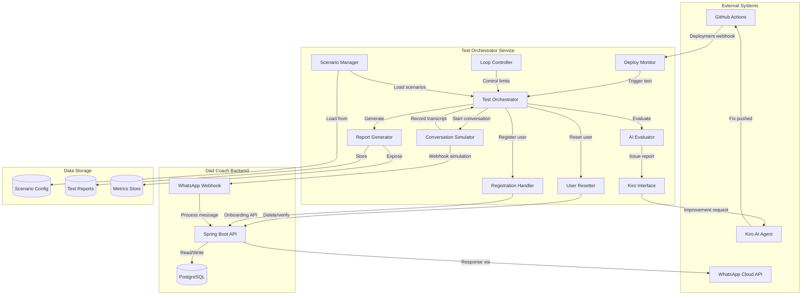
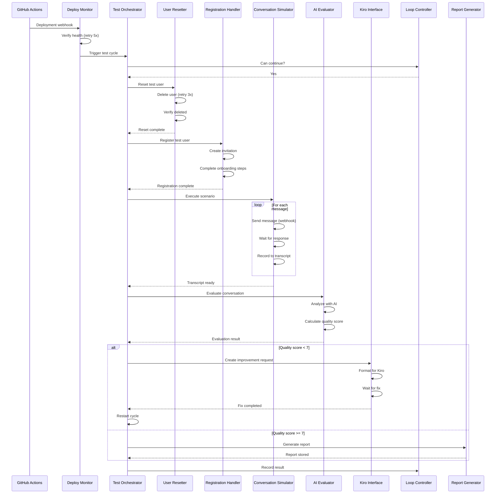
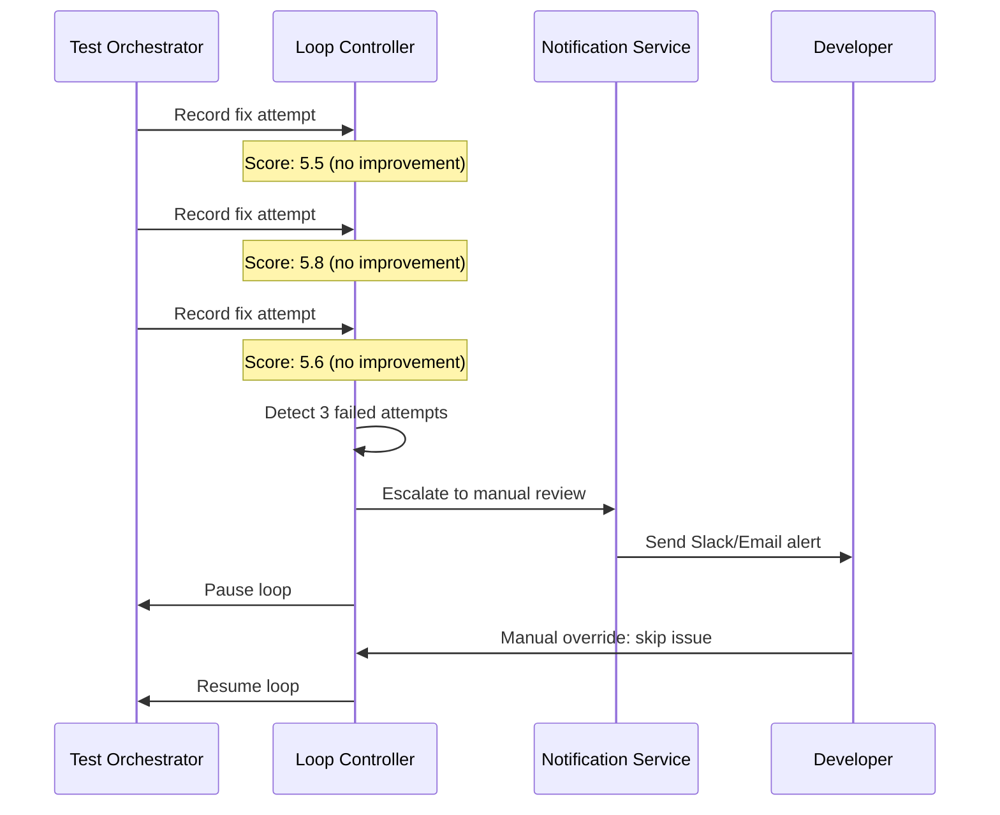

# Design Document: Automated Bot Testing Loop

## Overview

This design describes an automated testing and continuous improvement system for the Dad Coach WhatsApp bot. The system creates a closed-loop feedback cycle that:

1. **Detects deployments** to the main branch and triggers test cycles
2. **Resets test users** to ensure clean test environments
3. **Completes registration** programmatically through the onboarding flow
4. **Simulates WhatsApp conversations** with realistic scenarios
5. **Evaluates conversation quality** using AI-powered analysis
6. **Interfaces with Kiro** to implement fixes when issues are detected
7. **Enforces safety controls** to prevent infinite loops
8. **Manages test scenarios** through configuration
9. **Generates reports** for observability and historical analysis

The system runs as an independent Python service that orchestrates the entire testing pipeline, leveraging the existing `test_e2e.py` script as a foundation while adding AI evaluation, Kiro integration, and continuous loop capabilities.

## Architecture




### Key Architectural Decisions

1. **Python Service**: Built as a standalone Python service (extending `test_e2e.py`) rather than a Java module to:
   - Enable rapid iteration and scripting flexibility
   - Leverage Python's AI/ML ecosystem for evaluation
   - Keep testing infrastructure decoupled from production code

2. **Webhook Simulation**: Messages are sent by constructing WhatsApp webhook payloads and POSTing directly to the backend's `/api/v1/webhook/whatsapp` endpoint, avoiding the need for actual WhatsApp API integration in tests.

3. **AI Evaluation via API**: The AI Evaluator uses OpenAI/Anthropic APIs directly (not the backend's AI layer) to ensure independent evaluation and avoid circular dependencies.

4. **File-Based Kiro Interface**: Communication with Kiro happens through structured markdown files that Kiro can read and act upon, following Kiro's spec-driven development pattern.

## Components and Interfaces

### 1. Deploy Monitor

**Purpose**: Detects successful deployments and triggers test cycles.

```python
@dataclass
class DeploymentEvent:
    commit_sha: str
    branch: str
    environment: str
    timestamp: datetime
    triggered_by: str

class DeployMonitor:
    """Monitors for deployment events and triggers test cycles."""
    
    def __init__(self, config: DeployMonitorConfig):
        self.config = config
        self.webhook_server: Optional[HTTPServer] = None
    
    async def start(self) -> None:
        """Start listening for deployment webhooks."""
        pass
    
    async def check_health(self, base_url: str, retries: int = 5) -> bool:
        """Verify backend is healthy before triggering tests."""
        pass
    
    async def on_deployment(self, event: DeploymentEvent) -> None:
        """Handle incoming deployment event."""
        pass
```

**Integration Points**:
- GitHub Actions webhook (POST to `/webhooks/deploy`)
- Backend health endpoint (`/actuator/health`)

### 2. Test Orchestrator

**Purpose**: Coordinates the entire test cycle from start to finish.

```python
@dataclass
class TestCycleContext:
    cycle_id: str
    deployment: DeploymentEvent
    start_time: datetime
    iteration: int
    max_iterations: int
    previous_quality_score: Optional[float]

class TestOrchestrator:
    """Main orchestrator for the automated testing loop."""
    
    def __init__(
        self,
        deploy_monitor: DeployMonitor,
        user_resetter: UserResetter,
        registration_handler: RegistrationHandler,
        conversation_simulator: ConversationSimulator,
        ai_evaluator: AIEvaluator,
        kiro_interface: KiroInterface,
        loop_controller: LoopController,
        scenario_manager: ScenarioManager,
        report_generator: ReportGenerator,
    ):
        self._running_cycle: Optional[TestCycleContext] = None
    
    async def run_test_cycle(self, deployment: DeploymentEvent) -> TestCycleResult:
        """Execute a complete test cycle."""
        pass
    
    def is_cycle_in_progress(self) -> bool:
        """Check if a test cycle is currently running."""
        return self._running_cycle is not None
    
    async def handle_kiro_fix_completed(self, commit_sha: str) -> None:
        """Handle notification that Kiro has pushed a fix."""
        pass
```

### 3. User Resetter

**Purpose**: Resets the test user to a clean state before each test.

```python
@dataclass
class TestUserConfig:
    phone_number: str = "0503020551"
    display_name: str = "Oren Gaifman"
    email: str = "e2e-test@dadcoach.test"
    timezone: str = "Asia/Jerusalem"
    language: str = "he"

class UserResetter:
    """Handles complete reset of test user data."""
    
    def __init__(self, api_client: BackendApiClient, config: TestUserConfig):
        self.api_client = api_client
        self.config = config
    
    async def reset_user(self, max_retries: int = 3) -> ResetResult:
        """Delete test user and verify deletion."""
        pass
    
    async def verify_user_deleted(self) -> bool:
        """Verify the test user no longer exists in the system."""
        pass
    
    async def clear_cached_data(self) -> None:
        """Clear any cached data associated with the test user."""
        pass
```

**API Endpoints Used**:
- `DELETE /api/v1/admin/fathers/{id}` - Delete user
- `GET /api/v1/admin/fathers?phone={phone}` - Find user by phone

### 4. Registration Handler

**Purpose**: Completes the full onboarding flow for the test user.

```python
@dataclass
class ChildConfig:
    name: str
    birth_date: str
    gender: str

@dataclass
class RegistrationConfig:
    user: TestUserConfig
    children: List[ChildConfig]
    goals: List[str]
    preferences: Dict[str, str]

class RegistrationHandler:
    """Handles automated registration/onboarding of test user."""
    
    def __init__(self, api_client: BackendApiClient, config: RegistrationConfig):
        self.api_client = api_client
        self.config = config
        self.session_id: Optional[str] = None
        self.father_id: Optional[int] = None
    
    async def complete_registration(self) -> RegistrationResult:
        """Complete full onboarding flow."""
        pass
    
    async def create_invitation(self) -> str:
        """Create new invitation and return token."""
        pass
    
    async def create_session(self, invitation_token: str) -> str:
        """Create onboarding session."""
        pass
    
    async def submit_step(self, step: str, data: Dict) -> str:
        """Submit an onboarding step and return next step."""
        pass
    
    async def complete_onboarding(self) -> int:
        """Finalize onboarding and return father_id."""
        pass
    
    async def verify_active_status(self, father_id: int) -> bool:
        """Verify user is in ACTIVE status."""
        pass
```

**Onboarding Steps**:
1. `LANGUAGE` - Language selection (Hebrew)
2. `FATHER_PROFILE` - Name, phone, email, timezone
3. `CHILDREN` - Child information
4. `GOALS` - Parenting goals
5. `PREFERENCES` - Coaching preferences
6. `complete` - Final activation

### 5. Conversation Simulator

**Purpose**: Simulates realistic WhatsApp conversations with the bot.

```python
@dataclass
class Message:
    direction: Literal["inbound", "outbound"]
    content: str
    timestamp: datetime
    message_id: str

@dataclass
class ConversationTranscript:
    scenario_name: str
    messages: List[Message]
    started_at: datetime
    completed_at: datetime
    success: bool
    failure_reason: Optional[str]

class ConversationSimulator:
    """Simulates WhatsApp conversations with the bot."""
    
    def __init__(
        self,
        api_client: BackendApiClient,
        phone_number: str,
        response_timeout: int = 30,
        typing_delay_range: Tuple[float, float] = (1.0, 3.0),
    ):
        self.api_client = api_client
        self.phone_number = phone_number
        self.response_timeout = response_timeout
        self.typing_delay_range = typing_delay_range
        self.transcript: List[Message] = []
    
    async def execute_scenario(self, scenario: TestScenario) -> ConversationTranscript:
        """Execute a complete conversation scenario."""
        pass
    
    async def send_message(self, text: str) -> None:
        """Send a message via webhook simulation."""
        pass
    
    async def wait_for_response(self, timeout: int = 30) -> Optional[str]:
        """Wait for bot response within timeout."""
        pass
    
    def _build_webhook_payload(self, text: str) -> Dict:
        """Construct WhatsApp webhook payload."""
        pass
```


**Webhook Payload Structure**:
```json
{
    "object": "whatsapp_business_account",
    "entry": [{
        "id": "test",
        "changes": [{
            "value": {
                "messaging_product": "whatsapp",
                "metadata": {
                    "display_phone_number": "972123456789",
                    "phone_number_id": "test"
                },
                "contacts": [{"profile": {"name": "Test User"}, "wa_id": "972503020551"}],
                "messages": [{
                    "from": "972503020551",
                    "id": "test_<timestamp>",
                    "timestamp": "<unix_timestamp>",
                    "text": {"body": "<message_content>"},
                    "type": "text"
                }]
            },
            "field": "messages"
        }]
    }]
}
```

### 6. AI Evaluator

**Purpose**: Analyzes conversation quality using AI.

```python
@dataclass
class EvaluationCriteria:
    response_relevance: float  # 1-10
    emotional_intelligence: float  # 1-10
    coaching_quality: float  # 1-10
    language_appropriateness: float  # 1-10
    conversation_flow: float  # 1-10

@dataclass
class IssueDetail:
    message_index: int
    user_message: str
    bot_response: str
    expected_behavior: str
    actual_behavior: str
    suggested_fix: str
    severity: Literal["critical", "high", "medium", "low"]

@dataclass
class EvaluationResult:
    quality_score: float  # 1-10, weighted average
    criteria: EvaluationCriteria
    issues: List[IssueDetail]
    regression_detected: bool
    previous_score: Optional[float]
    recommendations: List[str]

class AIEvaluator:
    """AI-powered conversation quality evaluator."""
    
    def __init__(
        self,
        ai_provider: Literal["openai", "anthropic"],
        api_key: str,
        model: str = "gpt-4o",
        history_store: HistoryStore = None,
    ):
        self.ai_provider = ai_provider
        self.api_key = api_key
        self.model = model
        self.history_store = history_store
    
    async def evaluate(
        self,
        transcript: ConversationTranscript,
        scenario: TestScenario,
    ) -> EvaluationResult:
        """Evaluate conversation quality."""
        pass
    
    async def detect_regression(
        self,
        current_score: float,
        scenario_name: str,
    ) -> bool:
        """Compare against historical scores to detect regression."""
        pass
    
    def _build_evaluation_prompt(
        self,
        transcript: ConversationTranscript,
        scenario: TestScenario,
    ) -> str:
        """Build the AI evaluation prompt."""
        pass
```

**Evaluation Prompt Structure**:
```
You are evaluating a WhatsApp conversation between a parenting coach bot and a father.

SCENARIO: {scenario_name}
EXPECTED BEHAVIOR: {expected_behavior}

CONVERSATION TRANSCRIPT:
{formatted_transcript}

Evaluate the bot's performance on these criteria (1-10):
1. Response Relevance - Did responses address the user's needs?
2. Emotional Intelligence - Did the bot show empathy and understanding?
3. Coaching Quality - Were coaching suggestions helpful and actionable?
4. Language Appropriateness - Was the Hebrew natural and appropriate?
5. Conversation Flow - Did the conversation progress smoothly?

For any score below 7, identify the specific problematic message exchanges.
Provide an overall quality score and specific improvement recommendations.

Respond in JSON format: {...}
```

### 7. Kiro Interface

**Purpose**: Communicates issues and improvement requests to Kiro.

```python
@dataclass
class ImprovementRequest:
    issue_id: str
    title: str
    description: str
    problematic_exchange: Dict
    expected_behavior: str
    suggested_fix: str
    relevant_files: List[str]
    priority: Literal["critical", "high", "medium", "low"]

class KiroInterface:
    """Interface for communicating with Kiro AI agent."""
    
    def __init__(
        self,
        kiro_workspace_path: str,
        specs_dir: str = ".kiro/specs",
    ):
        self.workspace_path = kiro_workspace_path
        self.specs_dir = specs_dir
    
    async def create_improvement_request(
        self,
        evaluation: EvaluationResult,
        scenario: TestScenario,
    ) -> str:
        """Create structured improvement request for Kiro."""
        pass
    
    def _map_issue_to_files(self, issue: IssueDetail) -> List[str]:
        """Map issue type to likely relevant code files."""
        # Maps issue categories to backend files:
        # - response_relevance -> ai/prompt/, workflow/state/
        # - emotional_intelligence -> ai/prompt/, resources/prompts/
        # - coaching_quality -> coaching/, ai/agent/
        # - language_appropriateness -> i18n/, resources/i18n/
        # - conversation_flow -> workflow/, statemachine/
        pass
    
    def _format_for_kiro(self, request: ImprovementRequest) -> str:
        """Format request as markdown that Kiro can understand."""
        pass
    
    async def wait_for_fix(self, issue_id: str, timeout: int = 3600) -> bool:
        """Wait for Kiro to push a fix (monitors git for commits)."""
        pass
```

**Kiro Request Format** (`.kiro/specs/bot-improvements/issue-{id}.md`):
```markdown
# Bot Improvement Request: {title}

## Issue Summary
Quality Score: {score}/10
Severity: {priority}
Scenario: {scenario_name}

## Problematic Exchange
**User Message**: "{user_message}"
**Bot Response**: "{bot_response}"

## Expected Behavior
{expected_behavior}

## Suggested Fix
{suggested_fix}

## Relevant Files
- {file1}
- {file2}

## Acceptance Criteria
1. The bot should respond with {expected_behavior}
2. The conversation quality score should improve to >= 7
```

### 8. Loop Controller

**Purpose**: Enforces safety limits and controls the improvement loop.

```python
@dataclass
class LoopLimits:
    max_cycles_per_deployment: int = 5
    max_consecutive_failures: int = 3
    max_fix_attempts_per_issue: int = 3
    cooldown_between_cycles_seconds: int = 60

@dataclass
class LoopState:
    deployment_id: str
    cycle_count: int
    consecutive_failures: int
    issue_fix_attempts: Dict[str, int]
    paused: bool
    pause_reason: Optional[str]

class LoopController:
    """Controls the automated improvement loop with safety limits."""
    
    def __init__(self, limits: LoopLimits, notification_service: NotificationService):
        self.limits = limits
        self.notification_service = notification_service
        self._state: Dict[str, LoopState] = {}
    
    def can_continue(self, deployment_id: str) -> Tuple[bool, Optional[str]]:
        """Check if loop can continue or should stop."""
        pass
    
    def record_cycle_result(
        self,
        deployment_id: str,
        quality_score: float,
        issues: List[IssueDetail],
    ) -> None:
        """Record the result of a test cycle."""
        pass
    
    def should_escalate(self, deployment_id: str, issue_id: str) -> bool:
        """Check if issue should be escalated to manual review."""
        pass
    
    async def escalate_to_manual_review(
        self,
        deployment_id: str,
        issue: IssueDetail,
        reason: str,
    ) -> None:
        """Send notification for manual review."""
        pass
    
    def set_manual_override(self, deployment_id: str, action: str) -> None:
        """Allow manual override to continue or skip issues."""
        pass
    
    def pause_loop(self, deployment_id: str, reason: str) -> None:
        """Pause the loop until manual approval."""
        pass
    
    def resume_loop(self, deployment_id: str) -> None:
        """Resume a paused loop after manual approval."""
        pass
```

### 9. Scenario Manager

**Purpose**: Manages and rotates test conversation scenarios.

```python
@dataclass
class TestScenario:
    name: str
    description: str
    category: str
    messages: List[Dict[str, str]]  # {"role": "user/expected", "content": "..."}
    expected_behaviors: List[str]
    stability_score: int  # Consecutive passes
    last_run: Optional[datetime]
    is_stable: bool

class ScenarioManager:
    """Manages test conversation scenarios."""
    
    def __init__(self, config_path: str, stability_threshold: int = 10):
        self.config_path = config_path
        self.stability_threshold = stability_threshold
        self.scenarios: List[TestScenario] = []
    
    def load_scenarios(self) -> None:
        """Load scenarios from configuration file."""
        pass
    
    def get_scenarios_for_cycle(self) -> List[TestScenario]:
        """Get scenarios to run in next test cycle (prioritizing unstable)."""
        pass
    
    def update_scenario_stability(self, name: str, passed: bool) -> None:
        """Update scenario stability based on test result."""
        pass
    
    def add_scenario(self, scenario: TestScenario) -> None:
        """Add new scenario without code changes."""
        pass
    
    def get_coverage_report(self) -> Dict:
        """Get report of scenario coverage and stability."""
        pass
```

**Scenario Configuration File** (`test_scenarios.yaml`):
```yaml
scenarios:
  - name: "happy_path_onboarding"
    category: "onboarding"
    description: "Standard welcome flow after activation"
    messages:
      - role: user
        content: "🚀 התחל"
      - role: expected
        behavior: "Welcome message with introduction to coaching"
      - role: user
        content: "שלום, קוראים לי אורן"
      - role: expected
        behavior: "Acknowledge name, ask about children"
    expected_behaviors:
      - "Warm, personalized welcome"
      - "Clear next steps for the user"
      - "Natural Hebrew conversation"

  - name: "emotional_support_request"
    category: "emotional"
    description: "Father expresses frustration with child"
    messages:
      - role: user
        content: "אני מתוסכל מהילד שלי, הוא לא שומע לי"
      - role: expected
        behavior: "Empathetic response acknowledging frustration"
      - role: user
        content: "מה אני עושה לא בסדר?"
      - role: expected
        behavior: "Supportive coaching without judgment"
    expected_behaviors:
      - "Validate father's feelings"
      - "Avoid blame or criticism"
      - "Offer constructive perspective"

  - name: "edge_case_empty_message"
    category: "edge_cases"
    description: "Handle empty or whitespace messages"
    messages:
      - role: user
        content: "   "
      - role: expected
        behavior: "Graceful handling, prompt for actual message"
```

### 10. Report Generator

**Purpose**: Generates reports and exposes metrics.

```python
@dataclass
class TestReport:
    cycle_id: str
    deployment: DeploymentEvent
    timestamp: datetime
    quality_score: float
    scenario_results: List[Dict]
    issues_found: List[IssueDetail]
    improvements_made: List[str]
    pass_fail: Literal["pass", "fail"]
    duration_seconds: float

class ReportGenerator:
    """Generates test reports and exposes metrics."""
    
    def __init__(self, storage_path: str, metrics_port: int = 9090):
        self.storage_path = storage_path
        self.metrics_port = metrics_port
    
    def generate_report(self, result: TestCycleResult) -> TestReport:
        """Generate report for a test cycle."""
        pass
    
    def store_report(self, report: TestReport) -> None:
        """Store report for historical analysis."""
        pass
    
    def get_metrics(self) -> Dict:
        """Get current metrics for API endpoint."""
        # Returns: average_quality_score, total_test_cycles,
        # improvement_success_rate, common_issue_types
        pass
    
    def generate_daily_summary(self) -> str:
        """Generate daily summary of all test cycles."""
        pass
    
    async def send_alert(self, alert_type: str, message: str) -> None:
        """Send alert for critical conditions."""
        pass
    
    def start_metrics_server(self) -> None:
        """Start HTTP server for metrics endpoint."""
        pass
```

**Metrics API Response** (`GET /metrics`):
```json
{
    "average_quality_score": 7.8,
    "total_test_cycles": 156,
    "cycles_today": 12,
    "improvement_success_rate": 0.73,
    "common_issue_types": {
        "response_relevance": 23,
        "emotional_intelligence": 15,
        "language_appropriateness": 8
    },
    "last_deployment": "2024-01-15T10:30:00Z",
    "current_status": "idle"
}
```

## Data Models

### Database Schema (PostgreSQL - New Tables)

```sql
-- Test cycle records
CREATE TABLE test_cycles (
    id UUID PRIMARY KEY DEFAULT gen_random_uuid(),
    deployment_commit_sha VARCHAR(40) NOT NULL,
    deployment_branch VARCHAR(255) NOT NULL,
    environment VARCHAR(50) NOT NULL,
    started_at TIMESTAMP WITH TIME ZONE NOT NULL,
    completed_at TIMESTAMP WITH TIME ZONE,
    quality_score DECIMAL(3,1),
    status VARCHAR(20) NOT NULL, -- running, passed, failed, escalated
    iteration_number INTEGER NOT NULL DEFAULT 1,
    created_at TIMESTAMP WITH TIME ZONE DEFAULT NOW()
);

-- Scenario results per cycle
CREATE TABLE test_scenario_results (
    id UUID PRIMARY KEY DEFAULT gen_random_uuid(),
    cycle_id UUID REFERENCES test_cycles(id),
    scenario_name VARCHAR(255) NOT NULL,
    passed BOOLEAN NOT NULL,
    quality_score DECIMAL(3,1),
    transcript JSONB,
    issues JSONB,
    duration_ms INTEGER,
    created_at TIMESTAMP WITH TIME ZONE DEFAULT NOW()
);

-- Issue tracking
CREATE TABLE test_issues (
    id UUID PRIMARY KEY DEFAULT gen_random_uuid(),
    cycle_id UUID REFERENCES test_cycles(id),
    issue_type VARCHAR(50) NOT NULL,
    severity VARCHAR(20) NOT NULL,
    description TEXT NOT NULL,
    problematic_exchange JSONB,
    suggested_fix TEXT,
    fix_attempt_count INTEGER DEFAULT 0,
    status VARCHAR(20) NOT NULL, -- open, fixing, resolved, escalated
    resolved_at TIMESTAMP WITH TIME ZONE,
    created_at TIMESTAMP WITH TIME ZONE DEFAULT NOW()
);

-- Scenario stability tracking
CREATE TABLE test_scenario_stability (
    scenario_name VARCHAR(255) PRIMARY KEY,
    consecutive_passes INTEGER DEFAULT 0,
    is_stable BOOLEAN DEFAULT FALSE,
    last_run_at TIMESTAMP WITH TIME ZONE,
    last_quality_score DECIMAL(3,1),
    updated_at TIMESTAMP WITH TIME ZONE DEFAULT NOW()
);

-- Quality score history for regression detection
CREATE TABLE quality_score_history (
    id UUID PRIMARY KEY DEFAULT gen_random_uuid(),
    scenario_name VARCHAR(255) NOT NULL,
    quality_score DECIMAL(3,1) NOT NULL,
    recorded_at TIMESTAMP WITH TIME ZONE DEFAULT NOW()
);

CREATE INDEX idx_test_cycles_commit ON test_cycles(deployment_commit_sha);
CREATE INDEX idx_test_cycles_status ON test_cycles(status);
CREATE INDEX idx_scenario_results_cycle ON test_scenario_results(cycle_id);
CREATE INDEX idx_test_issues_status ON test_issues(status);
CREATE INDEX idx_quality_history_scenario ON quality_score_history(scenario_name, recorded_at);
```


### Configuration File Schema

**`config.yaml`**:
```yaml
test_orchestrator:
  base_url: "https://dad-coach-api.up.railway.app"
  test_user:
    phone: "0503020551"
    name: "Oren Gaifman"
    email: "e2e-test@dadcoach.test"
    timezone: "Asia/Jerusalem"
    language: "he"
    children:
      - name: "Test Child"
        birth_date: "2020-01-15"
        gender: "male"

deploy_monitor:
  webhook_port: 8081
  health_check_retries: 5
  health_check_interval_seconds: 30

conversation_simulator:
  response_timeout_seconds: 30
  typing_delay_min: 1.0
  typing_delay_max: 3.0
  min_exchanges: 5

ai_evaluator:
  provider: "openai"  # or "anthropic"
  model: "gpt-4o"
  quality_threshold: 7

loop_controller:
  max_cycles_per_deployment: 5
  max_consecutive_failures: 3
  max_fix_attempts_per_issue: 3
  cooldown_seconds: 60

notifications:
  slack_webhook_url: "${SLACK_WEBHOOK_URL}"
  email_recipients:
    - "dev@dadcoach.com"

storage:
  reports_path: "./reports"
  scenarios_path: "./scenarios"
  database_url: "${DATABASE_URL}"
```


## Correctness Properties

*A property is a characteristic or behavior that should hold true across all valid executions of a system—essentially, a formal statement about what the system should do. Properties serve as the bridge between human-readable specifications and machine-verifiable correctness guarantees.*

### Property 1: Quality Score Range Validity

*For any* evaluation result produced by the AI_Evaluator, the quality_score SHALL be a value between 1 and 10 inclusive.

**Validates: Requirements 5.2**

### Property 2: Health Check Retry Behavior

*For any* sequence of health check failures (up to N failures), the Deploy_Monitor SHALL retry exactly min(N, 5) times before either succeeding or marking the deployment as unhealthy.

**Validates: Requirements 1.3**

### Property 3: Deletion Retry Behavior

*For any* sequence of user deletion failures (up to N failures), the User_Resetter SHALL retry exactly min(N, 3) times before either succeeding or failing the reset operation.

**Validates: Requirements 2.4**


### Property 4: Mutual Exclusion of Test Cycles

*For any* concurrent test cycle requests while a cycle is in progress, the Test_Orchestrator SHALL reject or queue the additional requests and only execute one cycle at a time.

**Validates: Requirements 1.5**

### Property 5: Threshold-Based Report Generation

*For any* evaluation result, the AI_Evaluator SHALL generate an Issue_Report if and only if the quality_score is less than 7.

**Validates: Requirements 5.5, 6.1**

### Property 6: Issue Report Completeness

*For any* Issue_Report generated by the AI_Evaluator, the report SHALL contain all four required fields: problematic_message_exchange, expected_behavior, actual_behavior, and suggested_fix.

**Validates: Requirements 5.8**

### Property 7: Transcript Message Completeness

*For any* conversation executed by the Conversation_Simulator, the resulting transcript SHALL contain all sent and received messages with timestamps in chronological order.

**Validates: Requirements 4.4**

### Property 8: Sequential Message Exchange

*For any* conversation scenario, the Conversation_Simulator SHALL wait for a bot response (or timeout) before sending the next user message.

**Validates: Requirements 4.2**


### Property 9: Minimum Conversation Exchanges

*For any* completed test conversation, the Conversation_Simulator SHALL execute at least 5 message exchanges before marking the conversation as complete.

**Validates: Requirements 4.7**

### Property 10: Timeout Failure Marking

*For any* conversation where the bot fails to respond within 30 seconds, the Conversation_Simulator SHALL mark the conversation as failed with the timeout as the failure reason.

**Validates: Requirements 4.6**

### Property 11: Cycle Limit Enforcement

*For any* deployment, the Test_Orchestrator SHALL execute at most 5 consecutive improvement cycles before pausing for manual approval.

**Validates: Requirements 7.1, 7.6**

### Property 12: Issue Escalation Threshold

*For any* issue where the quality_score does not improve after 3 consecutive fix attempts, the Test_Orchestrator SHALL escalate to manual review and send a notification.

**Validates: Requirements 7.2, 7.3**

### Property 13: Evaluation Criteria Completeness

*For any* evaluation result, the AI_Evaluator SHALL include scores for all five criteria: response_relevance, emotional_intelligence, coaching_quality, language_appropriateness, and conversation_flow.

**Validates: Requirements 5.3**


### Property 14: Regression Detection Accuracy

*For any* evaluation where the current quality_score is lower than the historical average for that scenario, the AI_Evaluator SHALL flag it as a regression.

**Validates: Requirements 5.6**

### Property 15: Test Report Completeness

*For any* completed test cycle, the generated Test_Report SHALL include all six required fields: cycle_id, timestamp, quality_score, issues_found, improvements_made, and pass_fail_status.

**Validates: Requirements 9.2**

### Property 16: Test Report Generation Per Cycle

*For any* completed test cycle (success or failure), the Report_Generator SHALL produce exactly one test report.

**Validates: Requirements 9.1**

### Property 17: Metrics API Completeness

*For any* metrics API request, the response SHALL include all four required metrics: average_quality_score, total_test_cycles, improvement_success_rate, and common_issue_types.

**Validates: Requirements 9.4**

### Property 18: Scenario Structure Validity

*For any* Test_Conversation_Scenario loaded from configuration, the scenario SHALL contain a name, expected_bot_behavior list, and user_message_sequence.

**Validates: Requirements 8.2**


### Property 19: Scenario Rotation Coverage

*For any* series of N test cycles (where N ≥ number of scenarios), every scenario SHALL be executed at least once, ensuring comprehensive coverage.

**Validates: Requirements 8.4**

### Property 20: Scenario Stability Tracking

*For any* scenario that passes 10 consecutive test cycles, the Scenario_Manager SHALL mark it as stable and reduce its execution frequency.

**Validates: Requirements 8.6**

### Property 21: Alert Threshold Enforcement

*For any* test cycle where quality_score drops below 5, OR where 3 consecutive tests fail, the Report_Generator SHALL send an alert notification.

**Validates: Requirements 9.5**

### Property 22: Issue Priority Ordering

*For any* set of multiple issues identified in an evaluation, the Kiro_Interface SHALL address them in order of severity (critical → high → medium → low).

**Validates: Requirements 6.5**

### Property 23: Onboarding Step Failure Logging

*For any* onboarding step that fails, the log entry SHALL contain both the step name and the error details.

**Validates: Requirements 3.6**


### Property 24: Test Cycle Logging Completeness

*For any* test cycle started, the log SHALL contain the start_time, deployment_commit_sha, and environment.

**Validates: Requirements 1.4, 7.4**

### Property 25: Manual Override Respect

*For any* manual override command (skip issue or continue beyond limits), the Test_Orchestrator SHALL modify its behavior according to the override.

**Validates: Requirements 7.5**

## Error Handling

### Deployment Detection Errors

| Error Condition | Handling Strategy | Recovery |
|----------------|-------------------|----------|
| Webhook payload invalid | Log error, return 400 | Ignore, wait for next deployment |
| Health check network error | Retry with exponential backoff | After 5 retries, mark unhealthy |
| Health check returns DOWN | Retry after 30 seconds | After 5 retries, mark unhealthy |
| Backend unreachable | Log error, send alert | Pause loop, wait for manual review |

### User Reset Errors

| Error Condition | Handling Strategy | Recovery |
|----------------|-------------------|----------|
| User not found | Log info, continue | Treat as successful reset |
| Delete API returns 500 | Retry up to 3 times | Fail test cycle, log error |
| Delete API unauthorized | Log error, send alert | Pause loop, check admin token |
| Verification fails (user still exists) | Retry delete | After 3 retries, fail cycle |


### Registration Errors

| Error Condition | Handling Strategy | Recovery |
|----------------|-------------------|----------|
| Invitation creation fails | Log error with step name | Fail cycle, trigger alert |
| Session creation fails | Log error with invitation token | Fail cycle |
| Step submission fails | Log step name and error | Fail cycle, include in report |
| Onboarding completion fails | Log final state | Fail cycle, include in report |
| User not in ACTIVE status | Retry verification once | If still not active, fail cycle |

### Conversation Simulation Errors

| Error Condition | Handling Strategy | Recovery |
|----------------|-------------------|----------|
| Webhook POST fails | Retry once | Mark message as failed |
| Response timeout (30s) | Mark conversation failed | Include timeout in evaluation |
| Malformed response | Log raw response | Continue with next message |
| Bot returns error message | Record as-is | Include in evaluation |

### AI Evaluation Errors

| Error Condition | Handling Strategy | Recovery |
|----------------|-------------------|----------|
| AI API rate limited | Exponential backoff | Retry up to 5 times |
| AI API returns error | Log error, use fallback | Assign score of 5, flag for review |
| Invalid JSON response | Retry with simpler prompt | If still fails, manual evaluation |
| Evaluation timeout | Log timeout | Retry once, then flag for review |


### Kiro Integration Errors

| Error Condition | Handling Strategy | Recovery |
|----------------|-------------------|----------|
| File write fails | Retry with different path | Alert if persistent |
| Git monitoring timeout | Log timeout | Continue without fix validation |
| No fix pushed within 1 hour | Log timeout | Escalate to manual review |
| Fix causes regression | Detect in next cycle | Escalate immediately |

### Loop Control Errors

| Error Condition | Handling Strategy | Recovery |
|----------------|-------------------|----------|
| Database connection lost | Retry with backoff | Pause loop if persistent |
| Notification delivery fails | Log error, continue | Don't block on notification |
| State corruption detected | Log state dump | Reset loop state, alert |

## Testing Strategy

### Unit Testing

Unit tests focus on individual component logic with mocked dependencies.

**Key Areas**:
- `DeployMonitor`: Webhook payload parsing, health check logic
- `UserResetter`: Reset flow logic, retry counting
- `RegistrationHandler`: Step sequencing, data formatting
- `ConversationSimulator`: Webhook payload construction, message ordering
- `AIEvaluator`: Prompt construction, response parsing, score calculation
- `KiroInterface`: File formatting, issue-to-file mapping
- `LoopController`: Limit enforcement, escalation logic
- `ScenarioManager`: Scenario loading, rotation algorithm, stability tracking
- `ReportGenerator`: Report structure, metrics calculation


### Property-Based Testing

Property-based tests use Hypothesis (Python) to verify universal properties across generated inputs.

**Testing Framework**: Hypothesis for Python
**Minimum Iterations**: 100 per property test

```python
from hypothesis import given, strategies as st, settings

# Feature: automated-bot-testing-loop, Property 1: Quality Score Range Validity
@settings(max_examples=100)
@given(transcript=st.builds(ConversationTranscript, ...))
def test_quality_score_always_in_range(transcript):
    result = evaluator.evaluate(transcript, scenario)
    assert 1 <= result.quality_score <= 10

# Feature: automated-bot-testing-loop, Property 2: Health Check Retry Behavior
@settings(max_examples=100)
@given(failure_count=st.integers(min_value=0, max_value=10))
def test_health_check_retries_capped_at_five(failure_count):
    monitor = DeployMonitor(config)
    retries = monitor.simulate_health_checks(failure_count)
    assert retries == min(failure_count, 5)

# Feature: automated-bot-testing-loop, Property 5: Threshold-Based Report Generation
@settings(max_examples=100)
@given(score=st.floats(min_value=1, max_value=10))
def test_report_generated_iff_score_below_seven(score):
    result = EvaluationResult(quality_score=score, ...)
    report = evaluator.maybe_generate_report(result)
    assert (report is not None) == (score < 7)
```


```python
# Feature: automated-bot-testing-loop, Property 6: Issue Report Completeness
@settings(max_examples=100)
@given(issue=st.builds(IssueDetail, ...))
def test_issue_report_has_all_required_fields(issue):
    report = generator.generate_issue_report(issue)
    assert report.problematic_exchange is not None
    assert report.expected_behavior is not None
    assert report.actual_behavior is not None
    assert report.suggested_fix is not None

# Feature: automated-bot-testing-loop, Property 11: Cycle Limit Enforcement
@settings(max_examples=100)
@given(cycle_count=st.integers(min_value=1, max_value=20))
def test_cycle_limit_enforced_at_five(cycle_count):
    controller = LoopController(limits)
    for i in range(cycle_count):
        can_continue, _ = controller.can_continue(deployment_id)
        controller.record_cycle_result(deployment_id, 5.0, [])
        if i >= 4:  # After 5 cycles
            assert not can_continue or controller.is_paused(deployment_id)

# Feature: automated-bot-testing-loop, Property 15: Test Report Completeness
@settings(max_examples=100)
@given(result=st.builds(TestCycleResult, ...))
def test_report_has_all_required_fields(result):
    report = generator.generate_report(result)
    assert report.cycle_id is not None
    assert report.timestamp is not None
    assert report.quality_score is not None
    assert report.issues_found is not None
    assert report.improvements_made is not None
    assert report.pass_fail in ["pass", "fail"]
```


### Integration Testing

Integration tests verify component interactions with real or mocked external services.

**Key Scenarios**:
1. **Full Test Cycle**: Deployment → Reset → Register → Simulate → Evaluate → Report
2. **Health Check Flow**: Verify health checks, retries, and unhealthy marking
3. **Conversation Flow**: Full conversation with real/mock WhatsApp webhook
4. **AI Evaluation Flow**: Real AI API call with test transcript
5. **Kiro Integration Flow**: File creation, git monitoring
6. **Database Persistence**: Test cycle storage and retrieval

### End-to-End Testing

E2E tests run the complete system against a test environment.

```python
class TestAutomatedLoop:
    """End-to-end tests for the automated testing loop."""
    
    def test_full_cycle_on_deployment(self):
        """Test complete cycle triggered by deployment."""
        # Simulate deployment webhook
        # Verify: reset, register, simulate, evaluate, report
        pass
    
    def test_loop_stops_at_cycle_limit(self):
        """Test that loop pauses after 5 cycles."""
        pass
    
    def test_escalation_after_failed_fixes(self):
        """Test escalation after 3 non-improving fix attempts."""
        pass
    
    def test_regression_detection(self):
        """Test that quality regressions are detected and flagged."""
        pass
```


### Test Configuration

**Property-Based Testing Configuration**:
```python
# conftest.py
from hypothesis import settings, Verbosity

settings.register_profile("ci", max_examples=100, deadline=None)
settings.register_profile("dev", max_examples=20, deadline=None)
settings.register_profile("debug", max_examples=5, verbosity=Verbosity.verbose)
```

**Test Data Generators**:
```python
# generators.py
from hypothesis import strategies as st

@st.composite
def conversation_transcripts(draw):
    """Generate random conversation transcripts."""
    message_count = draw(st.integers(min_value=2, max_value=20))
    messages = []
    for i in range(message_count):
        direction = "inbound" if i % 2 == 0 else "outbound"
        messages.append(Message(
            direction=direction,
            content=draw(st.text(min_size=1, max_size=500)),
            timestamp=datetime.now() + timedelta(seconds=i * 5),
            message_id=f"msg_{i}"
        ))
    return ConversationTranscript(
        scenario_name=draw(st.text(min_size=1, max_size=50)),
        messages=messages,
        started_at=messages[0].timestamp,
        completed_at=messages[-1].timestamp,
        success=draw(st.booleans()),
        failure_reason=draw(st.none() | st.text(max_size=100))
    )

@st.composite
def evaluation_results(draw):
    """Generate random evaluation results."""
    score = draw(st.floats(min_value=1, max_value=10))
    return EvaluationResult(
        quality_score=score,
        criteria=EvaluationCriteria(
            response_relevance=draw(st.floats(min_value=1, max_value=10)),
            emotional_intelligence=draw(st.floats(min_value=1, max_value=10)),
            coaching_quality=draw(st.floats(min_value=1, max_value=10)),
            language_appropriateness=draw(st.floats(min_value=1, max_value=10)),
            conversation_flow=draw(st.floats(min_value=1, max_value=10)),
        ),
        issues=draw(st.lists(st.builds(IssueDetail, ...), max_size=5)),
        regression_detected=draw(st.booleans()),
        previous_score=draw(st.none() | st.floats(min_value=1, max_value=10)),
        recommendations=draw(st.lists(st.text(max_size=200), max_size=3))
    )
```


### Test Coverage Requirements

| Component | Unit Test Coverage | Property Tests | Integration Tests |
|-----------|-------------------|----------------|-------------------|
| DeployMonitor | ≥80% | Property 2 | Health check flow |
| UserResetter | ≥80% | Property 3 | Reset + verify flow |
| RegistrationHandler | ≥80% | Property 23 | Full onboarding flow |
| ConversationSimulator | ≥80% | Properties 7, 8, 9, 10 | Webhook interaction |
| AIEvaluator | ≥80% | Properties 1, 5, 6, 13, 14 | AI API integration |
| KiroInterface | ≥80% | Property 22 | File creation, git |
| LoopController | ≥80% | Properties 4, 11, 12, 25 | State persistence |
| ScenarioManager | ≥80% | Properties 18, 19, 20 | Config loading |
| ReportGenerator | ≥80% | Properties 15, 16, 17, 21 | Storage, API |

## Implementation Notes

### File Structure

```
scripts/
├── automated_testing/
│   ├── __init__.py
│   ├── main.py                    # Entry point
│   ├── config.py                  # Configuration loading
│   ├── models.py                  # Data classes
│   ├── deploy_monitor.py          # Deployment detection
│   ├── test_orchestrator.py       # Main orchestration
│   ├── user_resetter.py           # User reset logic
│   ├── registration_handler.py    # Onboarding automation
│   ├── conversation_simulator.py  # WhatsApp simulation
│   ├── ai_evaluator.py           # AI-powered evaluation
│   ├── kiro_interface.py         # Kiro communication
│   ├── loop_controller.py        # Safety controls
│   ├── scenario_manager.py       # Scenario management
│   ├── report_generator.py       # Reporting and metrics
│   ├── backend_client.py         # API client
│   └── notification_service.py   # Alerts and notifications
├── tests/
│   ├── __init__.py
│   ├── conftest.py               # Pytest configuration
│   ├── generators.py             # Hypothesis generators
│   ├── test_deploy_monitor.py
│   ├── test_user_resetter.py
│   ├── test_registration_handler.py
│   ├── test_conversation_simulator.py
│   ├── test_ai_evaluator.py
│   ├── test_kiro_interface.py
│   ├── test_loop_controller.py
│   ├── test_scenario_manager.py
│   ├── test_report_generator.py
│   └── test_integration.py
├── scenarios/
│   └── test_scenarios.yaml       # Test scenario definitions
├── config.yaml                   # Main configuration
└── requirements.txt              # Python dependencies
```


### Dependencies

```
# requirements.txt
requests>=2.31.0
aiohttp>=3.9.0
pyyaml>=6.0
pydantic>=2.5.0
openai>=1.6.0
anthropic>=0.8.0
hypothesis>=6.92.0
pytest>=7.4.0
pytest-asyncio>=0.23.0
psycopg2-binary>=2.9.9
sqlalchemy>=2.0.23
prometheus-client>=0.19.0
slack-sdk>=3.23.0
gitpython>=3.1.40
```

### Environment Variables

```bash
# Backend API
BACKEND_BASE_URL=https://dad-coach-api.up.railway.app
ADMIN_TOKEN=<admin-jwt-token>

# AI Provider
AI_PROVIDER=openai  # or anthropic
OPENAI_API_KEY=<key>
ANTHROPIC_API_KEY=<key>

# Database
DATABASE_URL=postgresql://...

# Notifications
SLACK_WEBHOOK_URL=<webhook-url>

# Kiro
KIRO_WORKSPACE_PATH=/path/to/dad-coach
```

### Deployment

The automated testing service runs as a separate container/process:

```yaml
# docker-compose.test-loop.yml
services:
  test-orchestrator:
    build:
      context: ./scripts/automated_testing
      dockerfile: Dockerfile
    environment:
      - BACKEND_BASE_URL=${BACKEND_BASE_URL}
      - OPENAI_API_KEY=${OPENAI_API_KEY}
      - DATABASE_URL=${DATABASE_URL}
      - SLACK_WEBHOOK_URL=${SLACK_WEBHOOK_URL}
    ports:
      - "8081:8081"  # Webhook receiver
      - "9090:9090"  # Metrics endpoint
    volumes:
      - ./reports:/app/reports
      - ./scenarios:/app/scenarios
```


### GitHub Actions Integration

```yaml
# .github/workflows/deploy.yml (addition)
jobs:
  deploy:
    # ... existing deployment steps ...
    
  notify-test-orchestrator:
    needs: deploy
    if: success() && github.ref == 'refs/heads/main'
    runs-on: ubuntu-latest
    steps:
      - name: Notify Test Orchestrator
        run: |
          curl -X POST ${{ secrets.TEST_ORCHESTRATOR_WEBHOOK_URL }} \
            -H "Content-Type: application/json" \
            -d '{
              "commit_sha": "${{ github.sha }}",
              "branch": "${{ github.ref_name }}",
              "environment": "prod",
              "triggered_by": "${{ github.actor }}"
            }'
```

## Sequence Diagrams

### Complete Test Cycle Flow



### Escalation Flow


