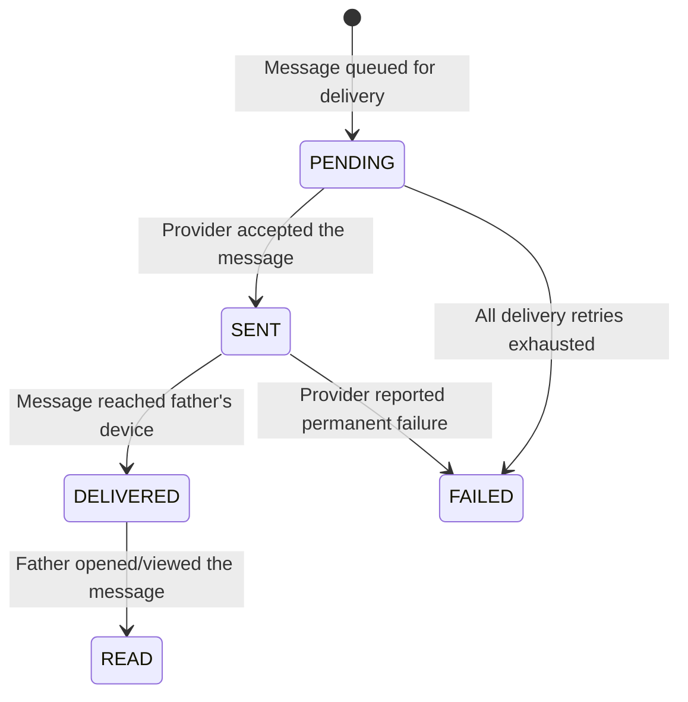

# Requirements Document

## Introduction

**SPEC-006: Communication Channels**

This specification defines the communication layer of the Dad Coach application. It is responsible for all inbound and outbound communication between the system and fathers, abstracting the underlying messaging provider behind a channel-agnostic interface. The Conversation_Engine (SPEC-005) produces and consumes messages in an internal format; this specification defines how those messages are received from and delivered to external communication providers.

This document defines ONLY communication channel behavior — message ingestion, delivery, formatting, delivery tracking, session rules, template management, and provider abstraction. It does not define conversation orchestration (SPEC-005), domain logic (SPEC-002), AI behavior (SPEC-003), or memory operations (SPEC-004).

**Scope boundaries:**
- SPEC-001 defines infrastructure and deployment
- SPEC-002 defines domain entities, state machines, and business rules
- SPEC-003 defines AI prompt assembly, model routing, and output contracts
- SPEC-004 defines memory lifecycle, storage, and retrieval
- SPEC-005 defines conversation orchestration
- SPEC-006 (this document) defines how messages enter and leave the system through communication channels

**Provider strategy:** WhatsApp Cloud API is the first supported channel. The specification defines provider-agnostic requirements where possible, with WhatsApp-specific requirements clearly marked. The architecture must support adding future channels (SMS, Telegram, web chat) without modifying the core orchestration or domain layers.

**Boundary with SPEC-005:** The Communication_Channel layer receives raw provider messages, normalizes them into internal Inbound_Message format, and passes them to the Conversation_Engine. Conversely, it receives Outbound_Message from the Conversation_Engine in internal format and translates them to the appropriate provider format for delivery. The Communication_Channel owns transport concerns; the Conversation_Engine owns business orchestration.

## Glossary

- **Communication_Channel**: An abstraction representing a messaging provider (e.g., WhatsApp, SMS, Telegram) that can send and receive messages
- **Channel_Adapter**: The component that translates between a specific provider's format and the internal message format, and declares the provider's supported capabilities
- **Channel_Capabilities**: The set of message types, features, and constraints supported by a specific Channel_Adapter (e.g., text, media, templates, interactive, session windows)
- **Communication_Endpoint**: A registered association between a father and a specific channel, identified by the father's channel-specific identity. A father may have one or more endpoints.
- **Inbound_Message**: A normalized internal message received from a father, as defined in SPEC-005 (provider-agnostic)
- **Outbound_Message**: A normalized internal message to be delivered to a father, as defined in SPEC-005 (provider-agnostic)
- **Provider_Message**: A raw message in the format of a specific communication provider (before normalization or after formatting)
- **Delivery_Status**: The lifecycle state of an outbound message's delivery (PENDING, SENT, DELIVERED, READ, FAILED)
- **Session_Window**: A provider-defined time period during which free-form messages may be sent (WhatsApp: 24 hours from last father message)
- **Template_Message**: A pre-approved message format required for initiating contact outside the Session_Window
- **Webhook_Event**: An inbound notification from a communication provider (message received, status update, error)
- **Message_Type**: The content classification of a message (TEXT, IMAGE, AUDIO, VIDEO, DOCUMENT, LOCATION, REACTION, INTERACTIVE)
- **Father_Channel_Identity**: The provider-specific identifier for a father on a given channel (e.g., WhatsApp phone number in E.164 format)
- **Idempotency_Key**: A unique identifier enabling duplicate detection (as defined in SPEC-005)
- **Quiet_Hours**: 21:00-07:00 father's local time (as defined in SPEC-002)
- **Rate_Limit**: Provider-imposed or self-imposed constraints on message sending frequency
- **Media_Asset**: An image, audio, video, or document file associated with a message
- **Webhook_Signature**: A cryptographic signature used to verify the authenticity of provider webhook events

---

## Requirements

### Requirement 1: Channel Abstraction

**User Story:** As a product owner, I want communication providers abstracted behind a stable interface, so that the core system is independent of any specific messaging platform and new channels can be added without modifying the orchestration layer.

#### Acceptance Criteria

1. THE Communication_Channel layer SHALL define a provider-agnostic internal message format for both inbound and outbound messages. This format is the sole interface between the Communication_Channel and the Conversation_Engine (SPEC-005).

2. THE internal Inbound_Message format SHALL contain:
   - message_id: unique identifier assigned by the Communication_Channel
   - idempotency_key: derived from provider message identifier (for duplicate detection per SPEC-005)
   - father_channel_identity: the provider-specific sender identifier (e.g., phone number)
   - channel: identifier of the originating channel (e.g., WHATSAPP, SMS)
   - message_type: TEXT, IMAGE, AUDIO, VIDEO, DOCUMENT, LOCATION, REACTION, INTERACTIVE
   - text_content: the message text (for TEXT type; null for media-only messages)
   - media_reference: reference to media asset (for media types; null for text-only)
   - received_at: timestamp when the provider received the message from the father
   - ingested_at: timestamp when the system accepted the message

3. THE internal Outbound_Message format SHALL contain:
   - message_id: unique identifier assigned by the Conversation_Engine
   - father_id: the internal father identifier (endpoint resolution is handled by the Communication_Channel)
   - channel: optional target delivery channel (if null, the Communication_Channel delivers to the primary endpoint)
   - message_type: TEXT, IMAGE, AUDIO, INTERACTIVE
   - text_content: the message text
   - media_reference: reference to media asset (if applicable)
   - is_template: boolean indicating whether a template message is required
   - template_name: the template identifier (if is_template = true)
   - template_parameters: key-value pairs for template variable substitution (if is_template = true)
   - priority: IMMEDIATE (conversation reply) or SCHEDULED (proactive notification)
   - requested_at: timestamp when the Conversation_Engine requested delivery

4. THE Communication_Channel layer SHALL translate Provider_Messages into the internal Inbound_Message format before passing to the Conversation_Engine. Provider-specific metadata not in the internal format is discarded after processing.

5. THE Communication_Channel layer SHALL translate internal Outbound_Messages into the appropriate Provider_Message format before delivery. The translation logic is channel-specific and owned by the Channel_Adapter.

6. THE Communication_Channel layer SHALL manage Communication_Endpoints for each father:
   - A father may have one or more registered Communication_Endpoints (e.g., WhatsApp on one phone number, future SMS on a different number)
   - Each endpoint consists of: father_id, channel (WHATSAPP, SMS, etc.), father_channel_identity, registered_at, last_active_at, is_primary (boolean)
   - Exactly one endpoint per father SHALL be marked as primary at any time
   - The primary endpoint is determined by: the endpoint through which the father most recently sent an inbound message
   - WHEN routing an outbound message, THE Communication_Channel SHALL deliver to the father's primary endpoint unless the Outbound_Message explicitly specifies a channel
   - The Conversation_Engine does NOT know or manage endpoints; it produces Outbound_Messages addressed to a father_id, and the Communication_Channel resolves the delivery endpoint

7. THE Communication_Channel layer SHALL never expose provider-specific concepts (webhook payloads, API response formats, provider error codes) to the Conversation_Engine. All provider details are encapsulated within the Channel_Adapter.

8. EACH Channel_Adapter SHALL declare its Channel_Capabilities upon registration:

   | Capability | Description | WhatsApp |
   |-----------|-------------|----------|
   | TEXT | Plain text messages | Supported |
   | IMAGE | Image with optional caption | Supported |
   | AUDIO | Voice/audio messages | Supported |
   | VIDEO | Video with optional caption | Supported |
   | DOCUMENT | File attachments | Supported |
   | INTERACTIVE | Buttons, lists, quick replies | Supported |
   | TEMPLATE | Pre-approved template messages | Supported |
   | SESSION_WINDOW | Provider-managed messaging window | Supported (24h) |
   | DELIVERY_RECEIPTS | Read/delivered status callbacks | Supported |
   | REACTIONS | Emoji reactions to messages | Supported (receive only) |

9. WHEN the Communication_Channel receives an Outbound_Message with a message_type not supported by the target endpoint's Channel_Adapter, THE Communication_Channel SHALL:
   - Attempt automatic downgrade: convert to the closest supported equivalent (e.g., INTERACTIVE → TEXT with numbered options; IMAGE → TEXT with description if image sending unavailable)
   - If no reasonable downgrade exists: reject the delivery, return an UNSUPPORTED_TYPE error to the Conversation_Engine, and log the incompatibility
   - The Conversation_Engine remains unaware of provider-specific capabilities; it always produces messages in the full internal format

10. THE Communication_Channel layer SHALL define the following automatic downgrade rules when a capability is unsupported:

    | Requested Type | Downgrade | Behavior |
    |---------------|-----------|----------|
    | INTERACTIVE | TEXT | Render button/list options as numbered text list ("1. Option A\n2. Option B") |
    | IMAGE | TEXT | Deliver text_content only; log that image was dropped |
    | AUDIO | TEXT | Reject delivery (no reasonable text equivalent for voice) |
    | TEMPLATE | TEXT | If session is open: send as free-form text using template body with variables substituted. If session closed: reject delivery. |


---

### Requirement 2: Inbound Message Lifecycle

**User Story:** As a product owner, I want every inbound message reliably received, validated, and normalized regardless of provider quirks, so that the Conversation_Engine receives clean, consistent input.

#### Acceptance Criteria

1. WHEN a Webhook_Event arrives from a communication provider, THE Communication_Channel SHALL process it through these phases: (1) Authenticate, (2) Parse, (3) Normalize, (4) Deduplicate, (5) Deliver to Conversation_Engine

2. THE Communication_Channel SHALL authenticate every inbound Webhook_Event by verifying the Webhook_Signature against the provider's signing key. Events that fail signature verification SHALL be rejected immediately without processing.

3. THE Communication_Channel SHALL parse the provider-specific payload and extract: sender identity, message content, message type, media references, and provider-assigned message identifier

4. THE Communication_Channel SHALL normalize the parsed data into the internal Inbound_Message format (Requirement 1 criteria 2), discarding provider-specific metadata not needed by the Conversation_Engine

5. THE Communication_Channel SHALL derive the Idempotency_Key from the provider-assigned message identifier, ensuring that the same provider message always produces the same key regardless of how many times the webhook is delivered

6. THE Communication_Channel SHALL detect and discard duplicate webhook deliveries using the Idempotency_Key. If a message with the same key has already been accepted, the webhook response indicates success without reprocessing.

7. THE Communication_Channel SHALL deliver the normalized Inbound_Message to the Conversation_Engine synchronously within the webhook processing window. The Conversation_Engine's 30-second latency budget (SPEC-002 Requirement 10 criteria 11) begins at delivery.

8. WHEN the provider sends a webhook for a message type the system does not support (e.g., stickers, contacts, live location), THE Communication_Channel SHALL discard the message and log the unsupported type without responding to the father

9. THE Communication_Channel SHALL resolve the Father_Channel_Identity to a Father entity using the identity format defined for the channel (WhatsApp: E.164 phone number per SPEC-002 Requirement 1 criteria 2). If no Father exists, the Conversation_Engine handles registration (per SPEC-005 Requirement 2 criteria 6).

---

### Requirement 3: Outbound Message Lifecycle

**User Story:** As a product owner, I want every outbound message reliably delivered with status tracking, so that the system knows whether fathers received their coaching messages.

#### Acceptance Criteria

1. WHEN the Conversation_Engine produces an Outbound_Message, THE Communication_Channel SHALL process it through these phases: (1) Session evaluation, (2) Format translation, (3) Delivery attempt, (4) Status tracking

2. THE Communication_Channel SHALL evaluate the Session_Window before sending:
   - If the father's Session_Window is OPEN (last inbound message within the provider's free-form window): send as free-form message
   - If the father's Session_Window is CLOSED: send as Template_Message (the Outbound_Message must have is_template = true and template_name specified)
   - If the Session_Window is CLOSED and the message is not a template: reject delivery, notify the Conversation_Engine, and log the rejection

3. THE Communication_Channel SHALL translate the internal Outbound_Message into the provider's delivery format, applying any channel-specific formatting rules (Requirement 8)

4. THE Communication_Channel SHALL track delivery status for every outbound message through the Delivery_Status lifecycle (Requirement 5)

5. THE Communication_Channel SHALL enforce Quiet_Hours (per SPEC-002 Requirement 10 criteria 1): outbound messages with priority SCHEDULED that fall within Quiet_Hours SHALL be queued and delivered at the end of Quiet_Hours (07:00 father's local time). Messages with priority IMMEDIATE (conversation replies to father-initiated messages) are delivered regardless of Quiet_Hours.

6. THE Communication_Channel SHALL act as a downstream delivery gate for the daily outbound notification limit (5 proactive messages per day per SPEC-002 Requirement 10 criteria 2): it rejects SCHEDULED messages that would exceed the limit. The Conversation_Engine (SPEC-005 Requirement 12 criteria 7) owns the authoritative counter. The Communication_Channel reads this counter before delivery — it does not maintain its own independent count.

7. WHEN delivery to the provider fails, THE Communication_Channel SHALL follow the retry policy defined in Requirement 7

8. THE Communication_Channel SHALL assign a provider-specific message identifier to each successfully sent message and store the mapping between internal message_id and provider message_id for status correlation

---

### Requirement 4: Supported Message Types

**User Story:** As a product owner, I want clear definition of which message types are supported for sending and receiving, so that the system handles all expected content correctly.

#### Acceptance Criteria

1. THE Communication_Channel SHALL support receiving the following inbound message types:

   | Type | Description | Processing |
   |------|------------|-----------|
   | TEXT | Plain text message | Normalize and deliver to Conversation_Engine |
   | IMAGE | Photo with optional caption | Store media, extract caption as text_content, deliver both |
   | AUDIO | Voice message | Store media, deliver with media_reference (transcription is a future capability) |
   | VIDEO | Video with optional caption | Store media, extract caption, deliver both |
   | DOCUMENT | File attachment (PDF, etc.) | Store media, deliver with media_reference |
   | LOCATION | Geographic coordinates | Convert to text description, deliver as TEXT |
   | REACTION | Emoji reaction to a previous message | Map to a text representation, deliver as TEXT |
   | INTERACTIVE | Button/list reply | Extract selected option as text_content, deliver as TEXT |

2. THE Communication_Channel SHALL support sending the following outbound message types:

   | Type | Description | When Used |
   |------|------------|----------|
   | TEXT | Plain text message | All coaching responses (primary type) |
   | IMAGE | Photo with caption | Mission illustrations, celebration images (future) |
   | AUDIO | Voice note | Voice coaching responses (future, per SPEC-003 Req 13) |
   | INTERACTIVE | Buttons or lists | Structured choices (onboarding, mission acceptance) |

3. THE Communication_Channel SHALL default to TEXT for all AI-generated coaching responses. Other outbound types are used only when explicitly specified by the Conversation_Engine.

4. WHEN an inbound message contains both text and media (e.g., image with caption), THE Communication_Channel SHALL deliver both the text_content (caption) and the media_reference in a single Inbound_Message

5. WHEN an inbound message type cannot be processed (unsupported type), THE Communication_Channel SHALL NOT deliver it to the Conversation_Engine and SHALL NOT respond to the father. The event is logged for operational awareness.

---

### Requirement 5: Delivery Status Lifecycle

**User Story:** As a product owner, I want delivery status tracked for every outbound message, so that the system can detect delivery failures and understand engagement patterns.

#### Acceptance Criteria

1. THE Communication_Channel SHALL track every outbound message through the following Delivery_Status state machine:



2. WHEN a status update Webhook_Event arrives from the provider (e.g., "delivered", "read"), THE Communication_Channel SHALL update the corresponding outbound message's Delivery_Status

3. THE Communication_Channel SHALL correlate status updates to internal messages using the provider message_id mapping established at send time (Requirement 3 criteria 8)

4. WHEN a message reaches FAILED status, THE Communication_Channel SHALL:
   - Determine if the failure is permanent (invalid number, blocked, account deactivated) or transient (network error, rate limit)
   - For transient failures: trigger retry per Requirement 7
   - For permanent failures: mark as FAILED, notify the Conversation_Engine, and log the failure reason

5. THE Communication_Channel SHALL NOT require status updates to arrive in order. A READ status may arrive without a prior DELIVERED status from the provider; the system SHALL accept it and infer the intermediate states.

6. THE Communication_Channel SHALL retain delivery status records for 90 days for operational analysis (per SPEC-010 Requirement 12 consolidated retention schedule), after which they are permanently deleted

7. WHEN a message remains in SENT status without progressing to DELIVERED for more than 24 hours, THE Communication_Channel SHALL flag it as a potential delivery issue for operational monitoring (but NOT retry — SENT means the provider accepted it)

---

### Requirement 6: Media Lifecycle

**User Story:** As a product owner, I want media files (images, audio, video, documents) handled consistently, so that media content is available when needed but does not consume unlimited storage.

#### Acceptance Criteria

1. WHEN an inbound message contains media, THE Communication_Channel SHALL download the media from the provider within the provider's availability window (WhatsApp media URLs expire after a provider-defined period)

2. THE Communication_Channel SHALL store downloaded media assets with:
   - A unique media_reference identifier
   - The media MIME type
   - The file size in bytes
   - The originating message_id
   - The father_id
   - The download timestamp

3. THE Communication_Channel SHALL enforce maximum media sizes per type:
   - Images: maximum 5 MB
   - Audio: maximum 16 MB
   - Video: maximum 16 MB
   - Documents: maximum 100 MB
   Media exceeding these limits SHALL be rejected and the father notified with a friendly message asking them to send a smaller file.

4. THE Communication_Channel SHALL retain inbound media assets for 90 days, after which they are permanently deleted. Media referenced by active memories or conversations in ACTIVE state SHALL NOT be deleted until those references expire.

5. WHEN the Conversation_Engine requests an outbound message with media (IMAGE or AUDIO type), THE Communication_Channel SHALL upload the media asset to the provider and include the provider media reference in the delivery payload

6. THE Communication_Channel SHALL NOT process media content itself (no transcription, no image analysis). Media processing is a future capability owned by the Intelligence_Layer (per SPEC-003 Requirement 13). The Communication_Channel only stores and retrieves media.

7. WHEN media download from the provider fails (timeout, expired URL), THE Communication_Channel SHALL:
   - Deliver the Inbound_Message without media_reference (text content still delivered if present)
   - Log the media download failure
   - Do NOT block message processing — text content is sufficient for conversation continuity


---

### Requirement 7: Error Handling and Retries

**User Story:** As a product owner, I want communication failures handled gracefully with appropriate retries, so that transient provider issues do not result in lost messages.

#### Acceptance Criteria

1. THE Communication_Channel SHALL classify delivery failures into:
   - **Transient**: Rate limits, temporary network errors, provider maintenance windows — retryable
   - **Permanent**: Invalid recipient, account blocked, content policy violation, deactivated number — not retryable

2. WHEN a transient delivery failure occurs, THE Communication_Channel SHALL retry with exponential backoff: delays of 2s, 4s, 8s, 16s, 32s (5 attempts maximum). These are transport-level retries for transient network/provider failures. If all 5 transport retries fail, the message is reported as a transport failure to the Conversation_Engine. The business-level retry policy (SPEC-002 Requirement 14 criteria 4: re-attempts at 5 minutes, 30 minutes, 2 hours) governs whether the Conversation_Engine re-submits the message for a new delivery attempt at a later time. If no business-level retry succeeds, the message transitions to FAILED status.

3. WHEN a permanent delivery failure occurs, THE Communication_Channel SHALL immediately transition the message to FAILED status without retrying and notify the Conversation_Engine with the failure reason

4. WHEN a delivery failure indicates the father's account is deactivated or the number is invalid, THE Communication_Channel SHALL notify the Conversation_Engine which may trigger a Father status change (operational concern, not automatic CHURNED — requires human review)

5. THE Communication_Channel SHALL implement rate-limit awareness: if the provider returns a rate-limit response, THE Communication_Channel SHALL pause outbound delivery for the indicated backoff period and queue messages for delivery after the pause

6. THE Communication_Channel SHALL never retry indefinitely. All retry policies have a bounded maximum attempt count and total retry duration (maximum 5 minutes from first attempt to final failure).

7. WHEN an inbound webhook processing fails internally (after signature verification succeeds), THE Communication_Channel SHALL respond to the provider with a success status to prevent provider-side retries, then handle the failure internally (queue for reprocessing or log and alert)

8. THE Communication_Channel SHALL maintain a circuit breaker for provider communication: if more than 10 consecutive outbound deliveries fail within a 5-minute window, THE Communication_Channel SHALL pause all outbound delivery for that provider for 60 seconds, then retry with a single probe message before resuming normal flow

---

### Requirement 8: WhatsApp Session Rules

**User Story:** As a product owner, I want WhatsApp's messaging window rules enforced correctly, so that the system never violates platform policies and messages are always deliverable.

#### Acceptance Criteria

1. THE Communication_Channel SHALL track the Session_Window per father on the WhatsApp channel:
   - A Session_Window OPENS when the father sends a message to the system
   - A Session_Window is valid for 24 hours from the father's last inbound message
   - A Session_Window CLOSES when 24 hours have elapsed since the last inbound message

2. WHILE a father's WhatsApp Session_Window is OPEN, THE Communication_Channel SHALL deliver outbound messages as free-form messages (any content, any format)

3. WHILE a father's WhatsApp Session_Window is CLOSED, THE Communication_Channel SHALL deliver outbound messages ONLY as Template_Messages using pre-approved templates (per Requirement 9)

4. THE Communication_Channel SHALL track session_window_opens_at and session_window_closes_at per father on the WhatsApp channel, updating session_window_closes_at to (last_inbound_at + 24 hours) on every received message

5. WHEN the Conversation_Engine requests delivery of a free-form message and the Session_Window is CLOSED, THE Communication_Channel SHALL:
   - Reject the delivery attempt
   - Return a SESSION_CLOSED error to the Conversation_Engine
   - The Conversation_Engine is responsible for deciding whether to convert to a template message or defer delivery

6. THE Communication_Channel SHALL expose the current Session_Window state (OPEN/CLOSED, closes_at) to the Conversation_Engine on request, enabling proactive scheduling decisions

7. WHEN a proactive outbound message is scheduled during Quiet_Hours AND the Session_Window will expire before Quiet_Hours end (07:00), THE Communication_Channel SHALL flag this conflict to the Conversation_Engine. The Conversation_Engine decides whether to send as a template after Quiet_Hours or discard.

---

### Requirement 9: Template Message Rules

**User Story:** As a product owner, I want template messages managed and used correctly, so that the system can initiate contact with fathers outside the messaging window without violating platform policies.

#### Acceptance Criteria

1. THE Communication_Channel SHALL maintain a registry of approved Template_Messages with:
   - template_name: unique identifier
   - template_language: language code ('en' for English, 'he' for Hebrew)
   - template_category: UTILITY, MARKETING, or AUTHENTICATION
   - template_body: the message body with variable placeholders (e.g., {{1}}, {{2}})
   - template_status: APPROVED, PENDING, REJECTED
   - max_variables: number of variable placeholders

2. THE Communication_Channel SHALL use Template_Messages for these scenarios:
   - Daily coaching initiation when Session_Window is CLOSED
   - Inactivity check messages (3-day, 7-day, 14-day)
   - Weekly Summary delivery when Session_Window is CLOSED
   - Birthday reminders and celebration triggers
   - Welcome-back messages after pause expiration
   - System maintenance notifications

3. WHEN sending a Template_Message, THE Communication_Channel SHALL:
   - Resolve the template by template_name from the registry
   - Verify the template status is APPROVED
   - Substitute template variables with the provided template_parameters
   - Validate that all required variables are provided and within length limits
   - Deliver to the provider in the template-specific format

4. THE Communication_Channel SHALL never send a Template_Message with status other than APPROVED. If a template is needed but not in APPROVED status, the delivery fails with TEMPLATE_UNAVAILABLE error.

5. THE Dad_Coach SHALL require the following minimum templates for day-one operation (templates exist for both English and Hebrew):
   - `daily_coaching_en`: "Hi {{1}} 👋 {{2}}" — for daily coaching initiation (English)
   - `daily_coaching_he`: "שלום {{1}} 👋 {{2}}" — for daily coaching initiation (Hebrew)
   - `inactivity_check_en`: "Hi {{1}}, we haven't talked in a few days. {{2}}" — for re-engagement (English)
   - `inactivity_check_he`: "שלום {{1}}, לא דיברנו כמה ימים. {{2}}" — for re-engagement (Hebrew)
   - `weekly_summary_en`: "{{1}}, here's your weekly summary 📊 {{2}}" — for weekly summary (English)
   - `weekly_summary_he`: "{{1}}, הנה הסיכום השבועי שלך 📊 {{2}}" — for weekly summary (Hebrew)
   - `mission_reminder_en`: "{{1}}, you have a pending mission with {{2}} 🎯" — for mission follow-up (English)
   - `mission_reminder_he`: "{{1}}, יש לך משימה ממתינה עם {{2}} 🎯" — for mission follow-up (Hebrew)
   - `welcome_back_en`: "{{1}}! Great to see you back 💪 {{2}}" — for reactivation (English)
   - `welcome_back_he`: "{{1}}! טוב לראות אותך שוב 💪 {{2}}" — for reactivation (Hebrew)
   - `system_notice`: "{{1}}" — for system-level notifications (language-agnostic)

6. THE Communication_Channel SHALL log every template send with: template_name, father_id, variables_used, delivery_status, and timestamp — enabling template performance analysis

7. WHEN the provider rejects a template send (wrong parameters, template deleted, policy violation), THE Communication_Channel SHALL mark the delivery as FAILED, log the provider rejection reason, and notify the Conversation_Engine

---

### Requirement 10: Security and Webhook Validation

**User Story:** As a product owner, I want all inbound communication verified for authenticity, so that the system never processes forged or tampered messages.

#### Acceptance Criteria

1. THE Communication_Channel SHALL verify the Webhook_Signature on every inbound webhook event before any processing occurs. Verification uses the provider's documented signature algorithm and the system's configured signing secret.

2. THE Communication_Channel SHALL reject (discard without processing) any webhook event that fails signature verification. The rejection SHALL be logged with: source IP, timestamp, and failure reason.

3. THE Communication_Channel SHALL validate that webhook events originate from expected provider IP ranges or domains, where the provider publishes such information

4. THE Communication_Channel SHALL protect outbound API credentials (access tokens, API keys) by:
   - Never logging credential values
   - Never including credentials in error messages or business events
   - Rotating credentials according to the provider's recommended schedule

5. THE Communication_Channel SHALL use encrypted transport for all communication with providers (outbound API calls and inbound webhook reception)

6. THE Communication_Channel SHALL implement replay protection for webhook events: events with timestamps older than 5 minutes SHALL be rejected (where the provider includes timestamps in the signature payload)

7. WHEN a webhook verification endpoint is required by the provider (e.g., WhatsApp verification challenge), THE Communication_Channel SHALL respond correctly to verification challenges without exposing internal system state

8. THE Communication_Channel SHALL enforce that Father_Channel_Identity values match the expected format for the channel (WhatsApp: E.164 phone number matching `^\+[1-9]\d{1,14}$` per SPEC-002 Requirement 1 criteria 2). Invalid identities are rejected.

---

### Requirement 11: Localization and Formatting

**User Story:** As a product owner, I want messages formatted correctly for the target platform, so that coaching messages display beautifully and naturally on the father's device.

#### Acceptance Criteria

1. THE Communication_Channel SHALL format outbound TEXT messages for the target platform's rendering capabilities:
   - WhatsApp: support bold (*text*), italic (_text_), strikethrough (~text~), monospace (```text```)
   - Messages produced by the Conversation_Engine use a platform-neutral format; the Channel_Adapter applies platform-specific formatting

2. THE Communication_Channel SHALL enforce character limits per channel:
   - WhatsApp free-form messages: maximum 4096 characters
   - WhatsApp template messages: maximum length defined per template (typically 1024 characters for body)
   If an outbound message exceeds the limit, THE Communication_Channel SHALL truncate at the last complete sentence within the limit and log the truncation.

3. THE Communication_Channel SHALL preserve emoji characters in both inbound and outbound messages without modification or escaping

4. THE Communication_Channel SHALL support line breaks in outbound messages, translating from the internal format to the platform-specific newline representation

5. THE Communication_Channel SHALL NOT modify the language or content of outbound messages. The AI layer (SPEC-003) is responsible for generating content in the father's preferred language (English or Hebrew). The Communication_Channel only formats for the delivery platform.

6. WHEN an outbound message contains structured content (numbered lists, bullet points), THE Communication_Channel SHALL format them using the target platform's supported markup or plain-text equivalents

---

### Requirement 12: Provider Independence and Future Extensibility

**User Story:** As a product owner, I want the communication architecture designed for multiple providers, so that adding new channels does not require changes to the orchestration or domain layers.

#### Acceptance Criteria

1. THE Communication_Channel layer SHALL define a Channel_Adapter contract that any new provider must implement:
   - `receiveWebhook(rawPayload) → Inbound_Message | RejectionReason`
   - `sendMessage(Outbound_Message, Father_Channel_Identity) → DeliveryResult`
   - `getSessionState(father_channel_identity) → SessionState`
   - `getDeliveryStatus(provider_message_id) → Delivery_Status`
   - `getCapabilities() → Channel_Capabilities`

2. THE Communication_Channel layer SHALL route inbound messages to the correct Channel_Adapter based on the webhook source, and outbound messages based on the resolved Communication_Endpoint for the target father

3. THE Communication_Channel layer SHALL NOT require the Conversation_Engine to know which channel or endpoint is being used. The Conversation_Engine produces Outbound_Messages addressed to a father_id; the Communication_Channel resolves the endpoint, evaluates capabilities, applies downgrades if needed, and delivers.

4. WHEN a new channel is added in the future, THE Communication_Channel layer SHALL require ONLY:
   - A new Channel_Adapter implementation for that provider declaring its Channel_Capabilities
   - Registration of the adapter in the channel routing configuration
   - Any provider-specific template or session rules defined within the adapter
   - Downgrade rules for capabilities the new adapter does not support (per Requirement 1 criteria 9-10)
   No changes to SPEC-002, SPEC-003, SPEC-004, or SPEC-005 SHALL be required.

5. THE Communication_Channel layer SHALL support endpoint migration: if a father registers a new Communication_Endpoint on a different channel (e.g., adds Telegram), the new endpoint can become primary when the father sends a message through it. Existing conversation state and memory are preserved — only the delivery path changes. Old endpoints remain registered but inactive.

6. THE Communication_Channel layer SHALL normalize provider-specific error codes into a channel-agnostic error taxonomy:
   - RATE_LIMITED: provider throttling
   - SESSION_CLOSED: messaging window expired
   - RECIPIENT_INVALID: number/account not reachable
   - CONTENT_REJECTED: message violates provider content policy
   - TEMPLATE_UNAVAILABLE: required template not approved
   - PROVIDER_ERROR: unclassified provider failure
   - NETWORK_ERROR: connectivity failure

7. THE Communication_Channel layer SHALL emit channel-agnostic delivery events (MESSAGE_DELIVERY_SUCCEEDED, MESSAGE_DELIVERY_FAILED) that the Conversation_Engine can consume without knowledge of the underlying provider


---

### Requirement 13: Operational Monitoring

**User Story:** As a product owner, I want visibility into communication channel health and performance, so that delivery issues are detected and resolved before they impact coaching quality.

#### Acceptance Criteria

1. THE Communication_Channel SHALL track and report the following operational metrics:
   - Inbound messages received per hour (by channel)
   - Outbound messages sent per hour (by channel, by type: free-form vs template)
   - Delivery success rate (messages reaching DELIVERED or READ status / total sent)
   - Average delivery latency (time from send request to DELIVERED status)
   - Failure rate by error category (RATE_LIMITED, SESSION_CLOSED, RECIPIENT_INVALID, etc.)
   - Template send rate and success rate per template_name
   - Webhook processing latency (time from webhook receipt to Inbound_Message delivery)
   - Media download success rate and average download time

2. THE Communication_Channel SHALL alert operations when:
   - Delivery success rate drops below 90% over a 30-minute window
   - Webhook processing latency exceeds 5 seconds (p95) over a 15-minute window
   - More than 10 permanent delivery failures occur for distinct fathers within 1 hour
   - A circuit breaker trips (per Requirement 7 criteria 8)
   - Template rejection rate exceeds 5% over a 24-hour window

3. THE Communication_Channel SHALL retain message delivery logs (message_id, direction, channel, status, timestamps, error details if failed) for 90 days for operational analysis

4. THE Communication_Channel SHALL NOT log message content in operational metrics or alerts. Only metadata (message_id, type, status, timestamps) appears in logs. Content is accessible only through the conversation record.

---

### Requirement 14: Cross-Spec Compatibility

**User Story:** As an architect, I want explicit verification that the communication layer is compatible with all other specifications, so that no contradictions exist across the system.

#### Acceptance Criteria

1. THE Communication_Channel SHALL use the Inbound_Message and Outbound_Message formats defined in this specification as the sole interface with the Conversation_Engine (SPEC-005). No provider-specific data crosses this boundary.

2. THE Communication_Channel SHALL enforce the father identity format defined in SPEC-002 Requirement 1 criteria 2 (E.164 phone number for WhatsApp). The Communication_Channel normalizes raw sender identifiers to this format before delivering to the Conversation_Engine.

3. THE Communication_Channel SHALL enforce Quiet_Hours (SPEC-002 Requirement 10 criteria 1) for SCHEDULED outbound messages. IMMEDIATE messages (replies within active conversations) are exempt. This is consistent with SPEC-005 Requirement 13 criteria 9. Quiet_Hours evaluation uses the father's timezone regardless of which Communication_Endpoint is used for delivery.

4. THE Communication_Channel SHALL enforce WhatsApp's 24-hour messaging window (SPEC-002 Requirement 10 criteria 17) through the Session_Window tracking defined in Requirement 8. This is the implementation of the business rule; the business rule definition remains in SPEC-002.

5. THE Communication_Channel SHALL derive the Idempotency_Key that SPEC-005 Requirement 2 uses for duplicate detection. The key derivation logic is owned by the Communication_Channel; the deduplication logic is owned by the Conversation_Engine.

6. THE Communication_Channel SHALL NOT make conversation orchestration decisions. It does not determine what to say, when to initiate conversations, or how to handle safety classifications. It only transports messages between the external provider and the Conversation_Engine.

7. THE Communication_Channel SHALL NOT interpret message content. Content interpretation (safety classification, intent detection, memory extraction) belongs to SPEC-003 and SPEC-005. The Communication_Channel normalizes and delivers without semantic understanding.

8. THE Communication_Channel SHALL support the 30-second latency budget (SPEC-002 Requirement 10 criteria 11) by completing inbound webhook processing (authentication through Inbound_Message delivery to Conversation_Engine) within 3 seconds, leaving the remaining budget for orchestration and AI processing.

9. THE Communication_Channel SHALL NOT own or enforce conversation message limits (8 per conversation per SPEC-002). That enforcement belongs to the Conversation_Engine (SPEC-005 Requirement 1 criteria 8). The Communication_Channel delivers every message it receives from the Conversation_Engine.

10. THE Communication_Channel SHALL support the Event_Publisher pattern from SPEC-005 Requirement 11: delivery status events (MESSAGE_DELIVERY_SUCCEEDED, MESSAGE_DELIVERY_FAILED) are published as business events, enabling the Conversation_Engine to react to delivery failures without polling.
