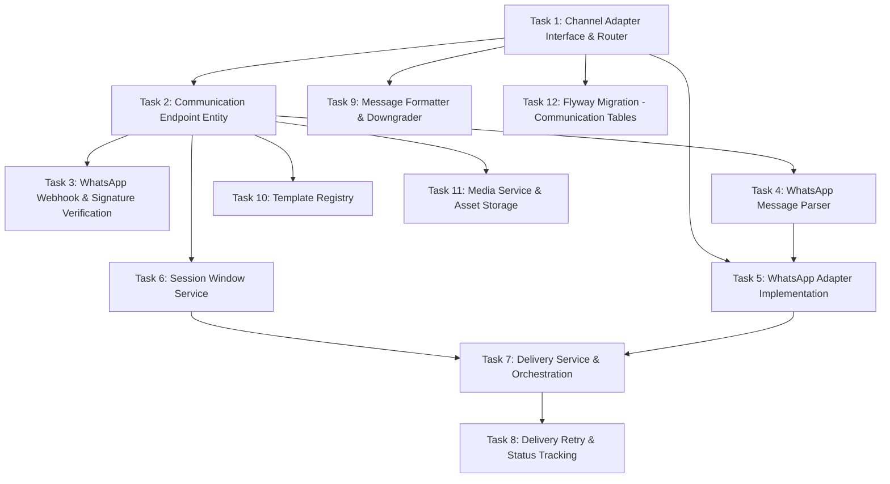

# Implementation Plan

## Overview

Implementation of the Communication Channels layer (SPEC-006) for the Dad Coach application. This layer abstracts messaging providers behind a channel-agnostic interface, handling inbound/outbound message normalization, delivery tracking, session windows, template management, and media lifecycle. WhatsApp Cloud API is the first supported channel.

## Task Dependency Graph



```json
{
  "waves": [
    {"tasks": [1]},
    {"tasks": [2, 9, 12]},
    {"tasks": [3, 4, 6, 10, 11]},
    {"tasks": [5]},
    {"tasks": [7]},
    {"tasks": [8]}
  ]
}
```

## Tasks

- [x] 1. Channel Adapter Interface & Router
  - [x] 1.1 Create ChannelAdapter interface with methods: getChannelName, getCapabilities, normalizeInbound, sendMessage, getSessionState, getDeliveryStatus
  - [x] 1.2 Create ChannelRouter that selects adapter by endpoint channel type
  - [x] 1.3 Create ChannelCapabilities value object describing supported features (text, image, audio, video, document, template)
  - [x] 1.4 Create InboundMessageDto and OutboundMessageDto as normalized internal formats
  - [x] 1.5 Verify extensibility: new channel = new adapter bean + endpoint entry (no core changes)

- [x] 2. Communication Endpoint Entity
  - [x] 2.1 Create CommunicationEndpoint JPA entity mapping to communication_endpoints table
  - [x] 2.2 Define fields: father_id, channel, channel_identity, is_primary, session timestamps
  - [x] 2.3 Add unique constraint on (channel, channel_identity)
  - [x] 2.4 Create CommunicationEndpointRepository with findPrimaryByFatherId and findByChannelAndIdentity
  - [x] 2.5 Support multiple endpoints per father with is_primary flag

- [x] 3. WhatsApp Webhook & Signature Verification
  - [x] 3.1 Implement HMAC-SHA256 signature verification BEFORE any payload parsing
  - [x] 3.2 Return 401 response immediately on invalid signature
  - [x] 3.3 Log source IP and timestamp on rejection
  - [x] 3.4 Use X-Hub-Signature-256 header for verification
  - [x] 3.5 Load webhook secret from secure configuration
  - [x] 3.6 Forward verified payload to message parser

- [x] 4. WhatsApp Message Parser
  - [x] 4.1 Parse text messages, media messages, and status updates from webhook payload
  - [x] 4.2 Extract sender phone, message content, message type, timestamp, provider_message_id
  - [x] 4.3 Handle all WhatsApp message types: text, image, audio, video, document, location
  - [x] 4.4 Extract status updates (sent, delivered, read) for delivery tracking
  - [x] 4.5 Log and discard invalid/unparseable payloads without exception propagation

- [x] 5. WhatsApp Adapter Implementation
  - [x] 5.1 Implement ChannelAdapter interface fully in WhatsAppAdapter
  - [x] 5.2 Use Spring WebClient for non-blocking outbound API calls
  - [x] 5.3 Report capabilities: text, image, audio, video, document, template
  - [x] 5.4 Send messages via WhatsApp Cloud API with proper format
  - [x] 5.5 Handle rate limit responses from WhatsApp API
  - [x] 5.6 Implement circuit breaker: 10 consecutive failures in 5min → pause 60s

- [x] 6. Session Window Service
  - [x] 6.1 Open window when inbound message received (session_opens_at = now)
  - [x] 6.2 Close window 24 hours after last inbound (session_closes_at = opens_at + 24h)
  - [x] 6.3 Check session state BEFORE every outbound delivery
  - [x] 6.4 Require template message or deferred delivery when session is closed
  - [x] 6.5 Persist session state in communication_endpoints table
  - [x] 6.6 Implement isOpen(endpoint) method returning boolean

- [x] 7. Delivery Service & Orchestration
  - [x] 7.1 Resolve primary endpoint for father
  - [x] 7.2 Check session window (closed + non-template → rejected)
  - [x] 7.3 Check capabilities and downgrade if needed
  - [x] 7.4 Return structured DeliveryResult (success/failure/rejected with reason)
  - [x] 7.5 Return SESSION_CLOSED result to Conversation Engine for decision
  - [x] 7.6 Return TEMPLATE_UNAVAILABLE result when template not approved

- [x] 8. Delivery Retry & Status Tracking
  - [x] 8.1 Implement retry schedule: 2s, 4s, 8s, 16s, 32s (5 attempts max)
  - [x] 8.2 Track delivery status: PENDING → SENT → DELIVERED → READ / FAILED
  - [x] 8.3 Correlate status updates by provider_message_id
  - [x] 8.4 Discard unknown provider_message_id status updates
  - [x] 8.5 Persist full lifecycle per message in DeliveryRecord
  - [x] 8.6 Mark failed deliveries after max retries as FAILED with reason

- [x] 9. Message Formatter & Downgrader
  - [x] 9.1 Format outbound messages: text, template with variables, media messages
  - [x] 9.2 Apply WhatsApp markdown (bold, italic, monospace)
  - [x] 9.3 Enforce character limits (4096 for text)
  - [x] 9.4 Implement downgrader: unsupported media → text description with link
  - [x] 9.5 Implement downgrader: unsupported template → plain text equivalent
  - [x] 9.6 Ensure emoji properly encoded in messages

- [x] 10. Template Registry
  - [x] 10.1 Store templates with: name, language (es), category, body, max_variables
  - [x] 10.2 Only make APPROVED templates available for sending
  - [x] 10.3 Implement variable substitution in template body
  - [x] 10.4 Implement lookup by name and language
  - [x] 10.5 Support templates registered/updated via admin process

- [x] 11. Media Service & Asset Storage
  - [x] 11.1 Download media from WhatsApp API URL on inbound
  - [x] 11.2 Store as BYTEA in database (launch scale; future: object storage)
  - [x] 11.3 Set 90-day retention with expires_at at download time
  - [x] 11.4 Implement daily cleanup job to delete expired media assets
  - [x] 11.5 Deliver message without media if download fails (text still sent)
  - [x] 11.6 Track MIME type and file size

- [x] 12. Flyway Migration - Communication Tables
  - [x] 12.1 Create communication_endpoints table with unique(channel, channel_identity)
  - [x] 12.2 Create delivery_records table with status tracking and indexes
  - [x] 12.3 Create template_messages table with unique template_name
  - [x] 12.4 Create media_assets table with BYTEA content and expiration index
  - [x] 12.5 Create all indexes from design
  - [x] 12.6 Verify migration runs successfully against PostgreSQL

## Notes

- Files to create/modify per task are documented in the design.md package structure
- WhatsApp-specific implementations go in `com.dadcoach.whatsapp` package
- Channel-agnostic abstractions go in `com.dadcoach.channel` package
- Task 12 (Flyway migration) should use filename `V6__communication_channels.sql`
