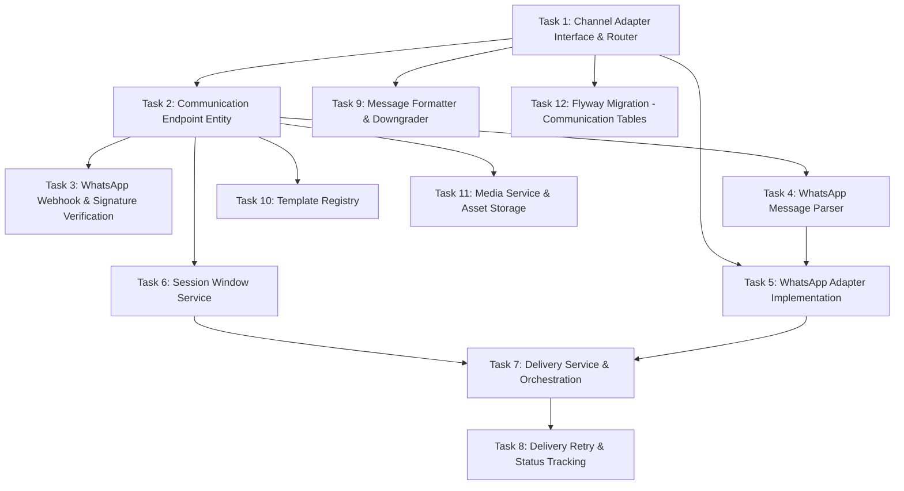

# Tasks — Communication Channels

## Task Dependency Graph

## Tasks

### Task 1: Channel Adapter Interface & Router
- **Description**: Implement the ChannelAdapter interface and ChannelRouter that routes messages to the correct adapter based on the father's primary communication endpoint.
- **Files to create/modify**:
  - `backend/src/main/java/com/dadcoach/channel/ChannelAdapter.java`
  - `backend/src/main/java/com/dadcoach/channel/ChannelRouter.java`
  - `backend/src/main/java/com/dadcoach/channel/capability/ChannelCapabilities.java`
  - `backend/src/main/java/com/dadcoach/channel/dto/InboundMessageDto.java`
  - `backend/src/main/java/com/dadcoach/channel/dto/OutboundMessageDto.java`
- **Acceptance criteria**:
  - [ ] ChannelAdapter interface defines: getChannelName, getCapabilities, normalizeInbound, sendMessage, getSessionState, getDeliveryStatus
  - [ ] ChannelRouter selects adapter by endpoint channel type
  - [ ] ChannelCapabilities describes supported features (text, image, audio, video, document, template)
  - [ ] InboundMessageDto/OutboundMessageDto are the normalized internal formats
  - [ ] New channel = new adapter bean + endpoint entry (no core changes)
- **Dependencies**: None

### Task 2: Communication Endpoint Entity
- **Description**: Implement the CommunicationEndpoint JPA entity that maps fathers to their channel identities (phone numbers), tracking session state and primary endpoint.
- **Files to create/modify**:
  - `backend/src/main/java/com/dadcoach/channel/CommunicationEndpoint.java`
  - `backend/src/main/java/com/dadcoach/channel/CommunicationEndpointRepository.java`
- **Acceptance criteria**:
  - [ ] Entity maps to communication_endpoints table
  - [ ] Fields: father_id, channel, channel_identity, is_primary, session timestamps
  - [ ] Unique constraint on (channel, channel_identity)
  - [ ] Repository: findPrimaryByFatherId, findByChannelAndIdentity
  - [ ] Supports multiple endpoints per father (is_primary flag)
- **Dependencies**: Task 1

### Task 3: WhatsApp Webhook & Signature Verification
- **Description**: Refactor the existing WhatsApp webhook controller to add HMAC-SHA256 signature verification, ensuring no unsigned payload enters the system.
- **Files to create/modify**:
  - `backend/src/main/java/com/dadcoach/whatsapp/WhatsAppWebhookController.java` (modify)
  - `backend/src/main/java/com/dadcoach/whatsapp/WhatsAppSignatureVerifier.java`
- **Acceptance criteria**:
  - [ ] HMAC-SHA256 signature verified BEFORE any payload parsing
  - [ ] Invalid signature → 401 response immediately
  - [ ] Source IP and timestamp logged on rejection
  - [ ] Verification uses X-Hub-Signature-256 header
  - [ ] Webhook secret loaded from secure configuration
  - [ ] Verified payload forwarded to message parser
- **Dependencies**: Task 2

### Task 4: WhatsApp Message Parser
- **Description**: Implement the WhatsAppMessageParser that transforms raw WhatsApp webhook JSON payloads into normalized InboundMessageDto objects.
- **Files to create/modify**:
  - `backend/src/main/java/com/dadcoach/whatsapp/WhatsAppMessageParser.java`
  - `backend/src/main/java/com/dadcoach/whatsapp/dto/WhatsAppWebhookPayload.java`
- **Acceptance criteria**:
  - [ ] Parses text messages, media messages, status updates
  - [ ] Extracts: sender phone, message content, message type, timestamp, provider_message_id
  - [ ] Handles all WhatsApp message types: text, image, audio, video, document, location
  - [ ] Status updates (sent, delivered, read) extracted for delivery tracking
  - [ ] Invalid/unparseable payloads logged and discarded (no exception propagation)
- **Dependencies**: Task 2

### Task 5: WhatsApp Adapter Implementation
- **Description**: Implement the WhatsAppAdapter (ChannelAdapter implementation) that coordinates inbound normalization, outbound sending via the Cloud API, and session state management.
- **Files to create/modify**:
  - `backend/src/main/java/com/dadcoach/whatsapp/WhatsAppAdapter.java`
  - `backend/src/main/java/com/dadcoach/whatsapp/WhatsAppApiClient.java`
- **Acceptance criteria**:
  - [ ] Implements ChannelAdapter interface fully
  - [ ] Uses Spring WebClient for non-blocking outbound API calls
  - [ ] Reports capabilities: text, image, audio, video, document, template
  - [ ] Sends messages via WhatsApp Cloud API with proper format
  - [ ] Handles rate limit responses from WhatsApp API
  - [ ] Circuit breaker: 10 consecutive failures in 5min → pause 60s
- **Dependencies**: Task 1, Task 4

### Task 6: Session Window Service
- **Description**: Implement the SessionWindowService that tracks WhatsApp's 24-hour messaging window per endpoint, opening on inbound message and closing 24 hours later.
- **Files to create/modify**:
  - `backend/src/main/java/com/dadcoach/channel/session/SessionWindowService.java`
  - `backend/src/main/java/com/dadcoach/channel/session/SessionState.java`
- **Acceptance criteria**:
  - [ ] Window opens when inbound message received (session_opens_at = now)
  - [ ] Window closes 24 hours after last inbound (session_closes_at = opens_at + 24h)
  - [ ] Session state checked BEFORE every outbound delivery
  - [ ] Closed session → requires template message or deferred delivery
  - [ ] Session state persisted in communication_endpoints table
  - [ ] Method: `isOpen(endpoint)` → boolean
- **Dependencies**: Task 2

### Task 7: Delivery Service & Orchestration
- **Description**: Implement the DeliveryService that orchestrates outbound message delivery: resolve endpoint → check session → check capabilities → downgrade if needed → send via adapter.
- **Files to create/modify**:
  - `backend/src/main/java/com/dadcoach/channel/delivery/DeliveryService.java`
  - `backend/src/main/java/com/dadcoach/channel/delivery/DeliveryResult.java`
  - `backend/src/main/java/com/dadcoach/channel/delivery/DeliveryStatus.java`
- **Acceptance criteria**:
  - [ ] Resolves primary endpoint for father
  - [ ] Checks session window (closed + non-template → rejected)
  - [ ] Checks capabilities and downgrades if needed
  - [ ] Returns structured DeliveryResult (success/failure/rejected with reason)
  - [ ] SESSION_CLOSED result returned to Conversation Engine for decision
  - [ ] TEMPLATE_UNAVAILABLE result when template not approved
- **Dependencies**: Task 5, Task 6

### Task 8: Delivery Retry & Status Tracking
- **Description**: Implement transport-level retry (exponential backoff: 2s-32s, max 5 attempts) and delivery status tracking correlated by provider_message_id.
- **Files to create/modify**:
  - `backend/src/main/java/com/dadcoach/channel/delivery/DeliveryRetryService.java`
  - `backend/src/main/java/com/dadcoach/channel/delivery/DeliveryRecord.java`
  - `backend/src/main/java/com/dadcoach/channel/delivery/DeliveryRecordRepository.java`
- **Acceptance criteria**:
  - [ ] Retry schedule: 2s, 4s, 8s, 16s, 32s (5 attempts max)
  - [ ] Delivery status tracked: PENDING → SENT → DELIVERED → READ / FAILED
  - [ ] Status updates correlated by provider_message_id
  - [ ] Unknown provider_message_id status updates discarded
  - [ ] DeliveryRecord persists full lifecycle per message
  - [ ] Failed deliveries after max retries marked FAILED with reason
- **Dependencies**: Task 7

### Task 9: Message Formatter & Downgrader
- **Description**: Implement the WhatsAppMessageFormatter (OutboundMessageDto → WhatsApp API format) and MessageDowngrader (automatic type downgrade when channel doesn't support a feature).
- **Files to create/modify**:
  - `backend/src/main/java/com/dadcoach/whatsapp/WhatsAppMessageFormatter.java`
  - `backend/src/main/java/com/dadcoach/channel/capability/MessageDowngrader.java`
- **Acceptance criteria**:
  - [ ] Formatter handles: text, template with variables, media messages
  - [ ] WhatsApp markdown applied (bold, italic, monospace)
  - [ ] Character limits enforced (4096 for text)
  - [ ] Downgrader: unsupported media → text description with link
  - [ ] Downgrader: unsupported template → plain text equivalent
  - [ ] Emoji properly encoded in messages
- **Dependencies**: Task 1

### Task 10: Template Registry
- **Description**: Implement the TemplateRegistry that stores and retrieves approved WhatsApp message templates for use when session window is closed.
- **Files to create/modify**:
  - `backend/src/main/java/com/dadcoach/channel/template/TemplateRegistry.java`
  - `backend/src/main/java/com/dadcoach/channel/template/TemplateMessage.java`
  - `backend/src/main/java/com/dadcoach/channel/template/TemplateMessageRepository.java`
- **Acceptance criteria**:
  - [ ] Templates stored with: name, language (es), category, body, max_variables
  - [ ] Only APPROVED templates available for sending
  - [ ] Variable substitution in template body
  - [ ] Lookup by name and language
  - [ ] Templates registered/updated via admin process
- **Dependencies**: Task 2

### Task 11: Media Service & Asset Storage
- **Description**: Implement the MediaService for downloading, storing, and retrieving media assets (images, audio, video, documents) with 90-day retention and daily cleanup.
- **Files to create/modify**:
  - `backend/src/main/java/com/dadcoach/channel/media/MediaService.java`
  - `backend/src/main/java/com/dadcoach/channel/media/MediaAsset.java`
  - `backend/src/main/java/com/dadcoach/channel/media/MediaAssetRepository.java`
  - `backend/src/main/java/com/dadcoach/channel/media/MediaCleanupJob.java`
- **Acceptance criteria**:
  - [ ] Downloads media from WhatsApp API URL on inbound
  - [ ] Stores as BYTEA in database (launch scale; future: object storage)
  - [ ] 90-day retention; expires_at set at download time
  - [ ] Daily cleanup job deletes expired media assets
  - [ ] If download fails, message delivered without media (text still sent)
  - [ ] MIME type and file size tracked
- **Dependencies**: Task 2

### Task 12: Flyway Migration - Communication Tables
- **Description**: Create the Flyway migration for communication tables: communication_endpoints, delivery_records, template_messages, media_assets.
- **Files to create/modify**:
  - `backend/src/main/resources/db/migration/V6__communication_channels.sql`
- **Acceptance criteria**:
  - [ ] communication_endpoints with unique(channel, channel_identity)
  - [ ] delivery_records with status tracking and indexes
  - [ ] template_messages with unique template_name
  - [ ] media_assets with BYTEA content and expiration index
  - [ ] All indexes from design created
  - [ ] Migration runs successfully against PostgreSQL
- **Dependencies**: Task 1
