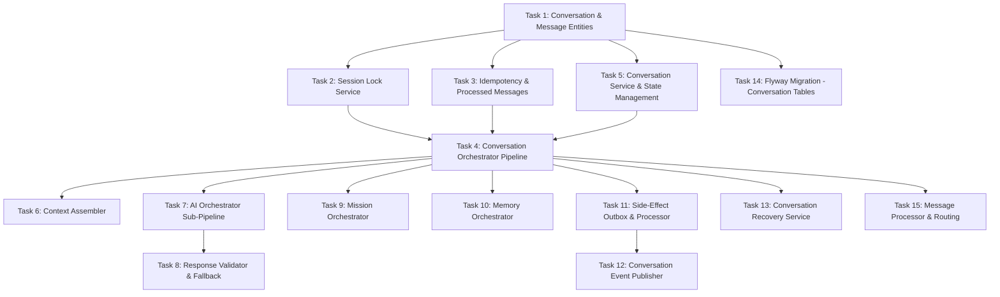

# Tasks — Conversation Engine & Orchestration

## Task Dependency Graph

## Tasks

### Task 1: Conversation & Message Entities
- **Description**: Implement the JPA entities for Conversation, ConversationMessage, ProcessedMessage, and SideEffectOutbox with all fields, constraints, and repository interfaces.
- **Files to create/modify**:
  - `backend/src/main/java/com/dadcoach/conversation/entity/Conversation.java`
  - `backend/src/main/java/com/dadcoach/conversation/entity/ConversationMessage.java`
  - `backend/src/main/java/com/dadcoach/conversation/entity/ProcessedMessage.java`
  - `backend/src/main/java/com/dadcoach/conversation/entity/SideEffectOutbox.java`
  - `backend/src/main/java/com/dadcoach/conversation/repository/ConversationRepository.java`
  - `backend/src/main/java/com/dadcoach/conversation/repository/ConversationMessageRepository.java`
  - `backend/src/main/java/com/dadcoach/conversation/repository/ProcessedMessageRepository.java`
  - `backend/src/main/java/com/dadcoach/conversation/repository/SideEffectOutboxRepository.java`
  - `backend/src/main/java/com/dadcoach/conversation/dto/InboundMessageDto.java`
  - `backend/src/main/java/com/dadcoach/conversation/dto/OutboundMessageDto.java`
- **Acceptance criteria**:
  - [ ] Conversation entity with type, status, message counts, expiration fields
  - [ ] ConversationMessage with direction (INBOUND/OUTBOUND), sequence_number, metadata JSONB
  - [ ] ProcessedMessage with idempotency_key, expires_at (24h TTL)
  - [ ] SideEffectOutbox with effect_type, payload, status, retry_count
  - [ ] Repository methods: findActiveByFatherId, findByStatusAndExpiresAtBefore
  - [ ] InboundMessageDto/OutboundMessageDto as normalized internal formats
- **Dependencies**: None

### Task 2: Session Lock Service
- **Description**: Implement the per-father advisory lock using PostgreSQL `pg_advisory_xact_lock`, with configurable timeout (45s) and automatic release on transaction completion.
- **Files to create/modify**:
  - `backend/src/main/java/com/dadcoach/conversation/SessionLockService.java`
- **Acceptance criteria**:
  - [ ] Uses `pg_advisory_xact_lock(father_id_hash)` for per-father serialization
  - [ ] Lock is transaction-scoped (auto-releases on commit/rollback)
  - [ ] Timeout configurable (default 45 seconds)
  - [ ] If lock cannot be acquired within timeout, message queued for retry
  - [ ] Different fathers can be processed concurrently
  - [ ] Integration test verifies mutual exclusion for same father
- **Dependencies**: Task 1

### Task 3: Idempotency & Processed Messages
- **Description**: Implement idempotency detection using the ProcessedMessage table. Duplicate messages return cached responses without re-executing the pipeline.
- **Files to create/modify**:
  - `backend/src/main/java/com/dadcoach/conversation/IdempotencyService.java`
- **Acceptance criteria**:
  - [ ] Idempotency key checked BEFORE any business logic
  - [ ] Duplicate detected → return cached response immediately
  - [ ] Key stored with 24-hour TTL after successful processing
  - [ ] Unique constraint on idempotency_key column
  - [ ] Expired keys cleaned up periodically
  - [ ] Response_id links to the outbound message produced
- **Dependencies**: Task 1

### Task 4: Conversation Orchestrator Pipeline
- **Description**: Implement the main ConversationOrchestrator that coordinates the full 12-step pipeline: idempotency → lock → resolve father → conversation routing → mission check → context → AI → follow-up → persist → evaluate → side-effects → record key.
- **Files to create/modify**:
  - `backend/src/main/java/com/dadcoach/conversation/ConversationOrchestrator.java`
- **Acceptance criteria**:
  - [ ] Single @Transactional method coordinates entire pipeline
  - [ ] Steps execute in order: idempotency, lock, resolve, route, context, AI, persist, evaluate, side-effects
  - [ ] Unknown father → create Father + start ONBOARDING conversation
  - [ ] Expired conversation → transition to EXPIRED, create new
  - [ ] Father always receives a response (never fails silently)
  - [ ] Transaction commit releases advisory lock
  - [ ] Latency budget: 30 seconds total
- **Dependencies**: Task 2, Task 3, Task 5

### Task 5: Conversation Service & State Management
- **Description**: Implement the ConversationService for CRUD operations, status transitions (ACTIVE → COMPLETED/EXPIRED/ABANDONED), and conversation type evaluation.
- **Files to create/modify**:
  - `backend/src/main/java/com/dadcoach/conversation/ConversationService.java`
  - `backend/src/main/java/com/dadcoach/conversation/ConversationServiceImpl.java`
- **Acceptance criteria**:
  - [ ] Maximum 1 ACTIVE conversation per father enforced
  - [ ] DIFFICULT_SITUATION preempts existing active conversation
  - [ ] Status transitions validated (only defined transitions allowed)
  - [ ] Expiration windows configurable per conversation type
  - [ ] Completion reasons tracked: OBJECTIVE_MET, MAX_MESSAGES, PREEMPTED, EXPIRATION, ABANDONED
  - [ ] Message count updated on each new message
- **Dependencies**: Task 1

### Task 6: Context Assembler
- **Description**: Implement the ContextAssembler that collects data from all subsystems (father profile, children, goals, missions, memories) into a unified context object for AI generation.
- **Files to create/modify**:
  - `backend/src/main/java/com/dadcoach/conversation/context/ContextAssembler.java`
  - `backend/src/main/java/com/dadcoach/conversation/context/ContextRequest.java`
  - `backend/src/main/java/com/dadcoach/conversation/context/ConversationContext.java`
- **Acceptance criteria**:
  - [ ] Assembles: father profile, children, active goals, active missions, ranked memories
  - [ ] Delegates to subsystem services (never queries DB directly)
  - [ ] Handles partial failures gracefully (assembles with available data)
  - [ ] Context object includes conversation history (last N messages)
  - [ ] Memory retrieval scoped by conversation topic/type
  - [ ] Returns structured ConversationContext ready for AI
- **Dependencies**: Task 4

### Task 7: AI Orchestrator Sub-Pipeline
- **Description**: Implement the AiOrchestrator that executes: safety classification → generate response → validate → retry with correction → fallback.
- **Files to create/modify**:
  - `backend/src/main/java/com/dadcoach/conversation/ai/AiOrchestrator.java`
  - `backend/src/main/java/com/dadcoach/conversation/ai/AiResult.java`
- **Acceptance criteria**:
  - [ ] Safety classification runs FIRST (before any coaching generation)
  - [ ] Escalation (CRISIS, CHILD_SAFETY) → immediate safety response
  - [ ] Generate → validate → if fails → retry once with correction
  - [ ] If retry fails → deliver fallback response
  - [ ] Provider exception → deliver fallback response
  - [ ] NEVER throws — always produces a deliverable response
  - [ ] AiResult tracks whether fallback or retry was used
- **Dependencies**: Task 4

### Task 8: Response Validator & Fallback
- **Description**: Implement the ResponseValidator for schema + business rule validation of AI responses, and the FallbackResponseProvider for pre-written safe responses per conversation type.
- **Files to create/modify**:
  - `backend/src/main/java/com/dadcoach/conversation/ai/ResponseValidator.java`
  - `backend/src/main/java/com/dadcoach/conversation/ai/FallbackResponseProvider.java`
- **Acceptance criteria**:
  - [ ] Validates AI response structure and content rules
  - [ ] Checks for forbidden content (shame, diagnoses, PII)
  - [ ] Returns ValidationResult with pass/fail + failure details
  - [ ] FallbackResponseProvider has pre-written messages per conversation type
  - [ ] Fallback messages are static text (never AI-generated)
  - [ ] Fallback messages in conversational Latin American Spanish
  - [ ] Max 3 consecutive fallback responses before alerting operations
- **Dependencies**: Task 7

### Task 9: Mission Orchestrator
- **Description**: Implement the MissionOrchestrator that handles mission state transitions triggered by AI follow-up actions within conversations (GENERATE_MISSION, mission acceptance/completion).
- **Files to create/modify**:
  - `backend/src/main/java/com/dadcoach/conversation/mission/MissionOrchestrator.java`
- **Acceptance criteria**:
  - [ ] Processes GENERATE_MISSION action from AI response
  - [ ] Validates mission generation preconditions (no active mission for child)
  - [ ] Handles mission acceptance/completion within conversation flow
  - [ ] Delegates to MissionEngine for actual generation
  - [ ] Persists mission state changes within same transaction
- **Dependencies**: Task 4

### Task 10: Memory Orchestrator
- **Description**: Implement the MemoryOrchestrator that schedules memory extraction, tracks memory injection into conversations, and handles memory confirmation triggers.
- **Files to create/modify**:
  - `backend/src/main/java/com/dadcoach/conversation/memory/MemoryOrchestrator.java`
- **Acceptance criteria**:
  - [ ] Schedules memory extraction as side-effect on conversation completion
  - [ ] Records which memories were injected into each conversation
  - [ ] Triggers memory confirmation when father explicitly validates info
  - [ ] Extraction only scheduled if conversation has 2+ father messages
  - [ ] Delegates to MemoryService for actual operations
- **Dependencies**: Task 4

### Task 11: Side-Effect Outbox & Processor
- **Description**: Implement the SideEffectScheduler (writes to outbox within transaction) and SideEffectProcessor (background poller that processes pending entries with retry logic).
- **Files to create/modify**:
  - `backend/src/main/java/com/dadcoach/conversation/sideeffect/SideEffectScheduler.java`
  - `backend/src/main/java/com/dadcoach/conversation/sideeffect/SideEffectProcessor.java`
  - `backend/src/main/java/com/dadcoach/conversation/sideeffect/SideEffect.java`
- **Acceptance criteria**:
  - [ ] Scheduler writes to outbox within main transaction (guaranteed commit with state)
  - [ ] Processor polls every 5 seconds for PENDING entries (batch of 20)
  - [ ] Exponential backoff on failure: retry_count incremented
  - [ ] Max 3 retries for best-effort effects; unlimited for mandatory
  - [ ] Status transitions: PENDING → PROCESSING → COMPLETED/FAILED
  - [ ] Processor runs in separate thread pool from request threads
  - [ ] Resumes processing on application startup
- **Dependencies**: Task 4

### Task 12: Conversation Event Publisher
- **Description**: Implement the ConversationEventPublisher that emits business events (CONVERSATION_COMPLETED, CONVERSATION_EXPIRED, etc.) via the outbox as mandatory side-effects.
- **Files to create/modify**:
  - `backend/src/main/java/com/dadcoach/conversation/event/ConversationEventPublisher.java`
  - `backend/src/main/java/com/dadcoach/conversation/event/ConversationEvent.java`
- **Acceptance criteria**:
  - [ ] Publishes events: CONVERSATION_STARTED, CONVERSATION_COMPLETED, CONVERSATION_EXPIRED
  - [ ] Events written to outbox as mandatory side-effects (unlimited retries)
  - [ ] Event payload includes: conversation_id, father_id, type, completion_reason
  - [ ] Events consumed by analytics/admin layer
  - [ ] Event publication failure does not block conversation response
- **Dependencies**: Task 11

### Task 13: Conversation Recovery Service
- **Description**: Implement the ConversationRecoveryService that detects stale ACTIVE conversations past expiration and transitions them, running on startup and every 15 minutes.
- **Files to create/modify**:
  - `backend/src/main/java/com/dadcoach/conversation/recovery/ConversationRecoveryService.java`
- **Acceptance criteria**:
  - [ ] Runs on application startup and every 15 minutes
  - [ ] Detects ACTIVE conversations past their expires_at
  - [ ] Transitions stale conversations to EXPIRED with reason EXPIRATION
  - [ ] Schedules memory extraction if conversation had 2+ father messages
  - [ ] Publishes CONVERSATION_EXPIRED event
  - [ ] Handles cooldowns after expiration (configurable per type)
- **Dependencies**: Task 4

### Task 14: Flyway Migration - Conversation Tables
- **Description**: Create the Flyway migration for conversation engine tables: conversations, conversation_messages, processed_messages, side_effect_outbox.
- **Files to create/modify**:
  - `backend/src/main/resources/db/migration/V5__conversation_engine.sql`
- **Acceptance criteria**:
  - [ ] conversations table with all columns, CHECK constraints on status and type
  - [ ] conversation_messages with direction CHECK, sequence_number
  - [ ] processed_messages with TTL-based expires_at
  - [ ] side_effect_outbox with status CHECK constraint
  - [ ] Indexes: father_active, expires, pending outbox
  - [ ] Migration runs successfully against PostgreSQL
- **Dependencies**: Task 1

### Task 15: Message Processor & Routing
- **Description**: Implement the MessageProcessor that validates inbound messages and routes them to the appropriate conversation (existing active or new).
- **Files to create/modify**:
  - `backend/src/main/java/com/dadcoach/conversation/MessageProcessor.java`
- **Acceptance criteria**:
  - [ ] Validates inbound message format and required fields
  - [ ] Resolves father by channel identity
  - [ ] Routes to active conversation if exists and not expired
  - [ ] Creates new conversation if none active (evaluates type)
  - [ ] Handles message batching (3+ in 10s → combine after 5s wait)
  - [ ] Rejects malformed messages with clear error
- **Dependencies**: Task 4
