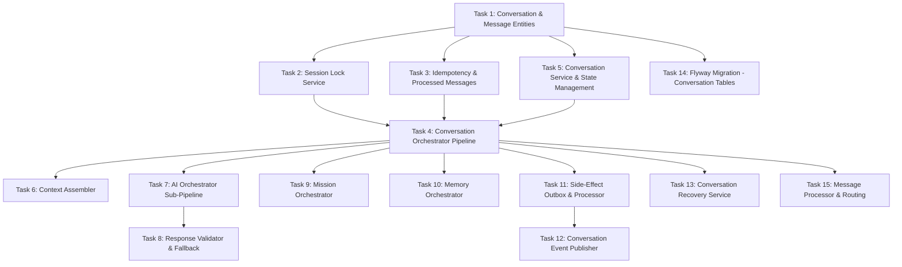

# Implementation Plan

## Overview

Implementation of the Conversation Engine & Orchestration layer (SPEC-005) for the Dad Coach platform. This includes JPA entities, session locking, idempotency, the main orchestration pipeline, context assembly, AI orchestration, mission/memory orchestration, side-effect processing, event publishing, recovery, database migrations, and message routing.

## Task Dependency Graph



```json
{
  "waves": [
    { "tasks": [1] },
    { "tasks": [2, 3, 5, 14] },
    { "tasks": [4] },
    { "tasks": [6, 7, 9, 10, 11, 13, 15] },
    { "tasks": [8, 12] }
  ]
}
```

## Tasks

- [x] 1. Implement JPA entities for Conversation, ConversationMessage, ProcessedMessage, and SideEffectOutbox with all fields, constraints, and repository interfaces
  - [x] 1.1 Create Conversation entity with type, status, message counts, expiration fields
  - [x] 1.2 Create ConversationMessage entity with direction (INBOUND/OUTBOUND), sequence_number, metadata JSONB
  - [x] 1.3 Create ProcessedMessage entity with idempotency_key, expires_at (24h TTL)
  - [x] 1.4 Create SideEffectOutbox entity with effect_type, payload, status, retry_count
  - [x] 1.5 Create repository interfaces with methods: findActiveByFatherId, findByStatusAndExpiresAtBefore
  - [x] 1.6 Create InboundMessageDto and OutboundMessageDto as normalized internal formats

- [x] 2. Implement the per-father advisory lock using PostgreSQL pg_advisory_xact_lock with configurable timeout (45s) and automatic release on transaction completion
  - [x] 2.1 Implement SessionLockService using pg_advisory_xact_lock(father_id_hash) for per-father serialization
  - [x] 2.2 Ensure lock is transaction-scoped (auto-releases on commit/rollback)
  - [x] 2.3 Make timeout configurable (default 45 seconds)
  - [x] 2.4 If lock cannot be acquired within timeout, message queued for retry
  - [x] 2.5 Ensure different fathers can be processed concurrently

- [x] 3. Implement idempotency detection using the ProcessedMessage table with duplicate detection returning cached responses
  - [x] 3.1 Implement IdempotencyService checking idempotency key BEFORE any business logic
  - [x] 3.2 On duplicate detected, return cached response immediately
  - [x] 3.3 Store key with 24-hour TTL after successful processing
  - [x] 3.4 Ensure unique constraint on idempotency_key column
  - [x] 3.5 Implement periodic cleanup of expired keys
  - [x] 3.6 Link response_id to the outbound message produced

- [x] 4. Implement the main ConversationOrchestrator coordinating the full pipeline: idempotency, lock, resolve father, conversation routing, mission check, context, AI, follow-up, persist, evaluate, side-effects, record key
  - [x] 4.1 Single @Transactional method coordinates entire pipeline
  - [x] 4.2 Steps execute in order: idempotency, lock, resolve, route, context, AI, persist, evaluate, side-effects
  - [x] 4.3 Unknown father triggers create Father + start ONBOARDING conversation
  - [x] 4.4 Expired conversation triggers transition to EXPIRED and create new
  - [x] 4.5 Father always receives a response (never fails silently)
  - [x] 4.6 Transaction commit releases advisory lock
  - [x] 4.7 Latency budget: 30 seconds total

- [x] 5. Implement the ConversationService for CRUD operations, status transitions (ACTIVE to COMPLETED/EXPIRED/ABANDONED), and conversation type evaluation
  - [x] 5.1 Enforce maximum 1 ACTIVE conversation per father
  - [x] 5.2 DIFFICULT_SITUATION preempts existing active conversation
  - [x] 5.3 Validate status transitions (only defined transitions allowed)
  - [x] 5.4 Make expiration windows configurable per conversation type
  - [x] 5.5 Track completion reasons: OBJECTIVE_MET, MAX_MESSAGES, PREEMPTED, EXPIRATION, ABANDONED
  - [x] 5.6 Update message count on each new message

- [x] 6. Implement the ContextAssembler that collects data from all subsystems into a unified context object for AI generation
  - [x] 6.1 Assemble father profile, children, active goals, active missions, ranked memories
  - [x] 6.2 Delegate to subsystem services (never query DB directly)
  - [x] 6.3 Handle partial failures gracefully (assemble with available data)
  - [x] 6.4 Include conversation history (last N messages) in context object
  - [x] 6.5 Scope memory retrieval by conversation topic/type
  - [x] 6.6 Return structured ConversationContext ready for AI

- [x] 7. Implement the AiOrchestrator that executes: safety classification, generate response, validate, retry with correction, fallback
  - [x] 7.1 Safety classification runs FIRST (before any coaching generation)
  - [x] 7.2 Escalation (CRISIS, CHILD_SAFETY) triggers immediate safety response
  - [x] 7.3 Generate then validate; if fails then retry once with correction
  - [x] 7.4 If retry fails deliver fallback response
  - [x] 7.5 Provider exception triggers fallback response delivery
  - [x] 7.6 Never throws - always produces a deliverable response
  - [x] 7.7 AiResult tracks whether fallback or retry was used

- [x] 8. Implement the ResponseValidator for schema + business rule validation and the FallbackResponseProvider for pre-written safe responses per conversation type
  - [x] 8.1 Validate AI response structure and content rules
  - [x] 8.2 Check for forbidden content (shame, diagnoses, PII)
  - [x] 8.3 Return ValidationResult with pass/fail + failure details
  - [x] 8.4 FallbackResponseProvider has pre-written messages per conversation type
  - [x] 8.5 Fallback messages are static text (never AI-generated)
  - [x] 8.6 Fallback messages in father's preferred language (English or Hebrew)
  - [x] 8.7 Max 3 consecutive fallback responses before alerting operations

- [x] 9. Implement the MissionOrchestrator that handles mission state transitions triggered by AI follow-up actions within conversations
  - [x] 9.1 Process GENERATE_MISSION action from AI response
  - [x] 9.2 Validate mission generation preconditions (no active mission for child)
  - [x] 9.3 Handle mission acceptance/completion within conversation flow
  - [x] 9.4 Delegate to MissionEngine for actual generation
  - [x] 9.5 Persist mission state changes within same transaction

- [x] 10. Implement the MemoryOrchestrator that schedules memory extraction, tracks memory injection into conversations, and handles memory confirmation triggers
  - [x] 10.1 Schedule memory extraction as side-effect on conversation completion
  - [x] 10.2 Record which memories were injected into each conversation
  - [x] 10.3 Trigger memory confirmation when father explicitly validates info
  - [x] 10.4 Extraction only scheduled if conversation has 2+ father messages
  - [x] 10.5 Delegate to MemoryService for actual operations

- [x] 11. Implement the SideEffectScheduler (writes to outbox within transaction) and SideEffectProcessor (background poller that processes pending entries with retry logic)
  - [x] 11.1 Scheduler writes to outbox within main transaction (guaranteed commit with state)
  - [x] 11.2 Processor polls every 5 seconds for PENDING entries (batch of 20)
  - [x] 11.3 Exponential backoff on failure with retry_count incremented
  - [x] 11.4 Max 3 retries for best-effort effects; unlimited for mandatory
  - [x] 11.5 Status transitions: PENDING to PROCESSING to COMPLETED/FAILED
  - [x] 11.6 Processor runs in separate thread pool from request threads
  - [x] 11.7 Resume processing on application startup

- [x] 12. Implement the ConversationEventPublisher that emits business events via the outbox as mandatory side-effects
  - [x] 12.1 Publish events: CONVERSATION_STARTED, CONVERSATION_COMPLETED, CONVERSATION_EXPIRED
  - [x] 12.2 Events written to outbox as mandatory side-effects (unlimited retries)
  - [x] 12.3 Event payload includes: conversation_id, father_id, type, completion_reason
  - [x] 12.4 Events consumed by analytics/admin layer
  - [x] 12.5 Event publication failure does not block conversation response

- [x] 13. Implement the ConversationRecoveryService that detects stale ACTIVE conversations past expiration and transitions them
  - [x] 13.1 Run on application startup and every 15 minutes
  - [x] 13.2 Detect ACTIVE conversations past their expires_at
  - [x] 13.3 Transition stale conversations to EXPIRED with reason EXPIRATION
  - [x] 13.4 Schedule memory extraction if conversation had 2+ father messages
  - [x] 13.5 Publish CONVERSATION_EXPIRED event
  - [x] 13.6 Handle cooldowns after expiration (configurable per type)

- [x] 14. Create the Flyway migration for conversation engine tables: conversations, conversation_messages, processed_messages, side_effect_outbox
  - [x] 14.1 Create conversations table with all columns, CHECK constraints on status and type
  - [x] 14.2 Create conversation_messages table with direction CHECK, sequence_number
  - [x] 14.3 Create processed_messages table with TTL-based expires_at
  - [x] 14.4 Create side_effect_outbox table with status CHECK constraint
  - [x] 14.5 Create indexes: father_active, expires, pending outbox
  - [x] 14.6 Ensure migration runs successfully against PostgreSQL

- [x] 15. Implement the MessageProcessor that validates inbound messages and routes them to the appropriate conversation
  - [x] 15.1 Validate inbound message format and required fields
  - [x] 15.2 Resolve father by channel identity
  - [x] 15.3 Route to active conversation if exists and not expired
  - [x] 15.4 Create new conversation if none active (evaluate type)
  - [x] 15.5 Handle message batching (3+ in 10s combined after 5s wait)
  - [x] 15.6 Reject malformed messages with clear error

## Notes

- Files to create are under `backend/src/main/java/com/dadcoach/conversation/` following the package structure defined in the design document.
- The Flyway migration goes to `backend/src/main/resources/db/migration/V5__conversation_engine.sql`.
- All services delegate to subsystem interfaces (IntelligenceLayer, MemoryService, MissionService, FatherService) - these may need stub/interface implementations if not yet available.
