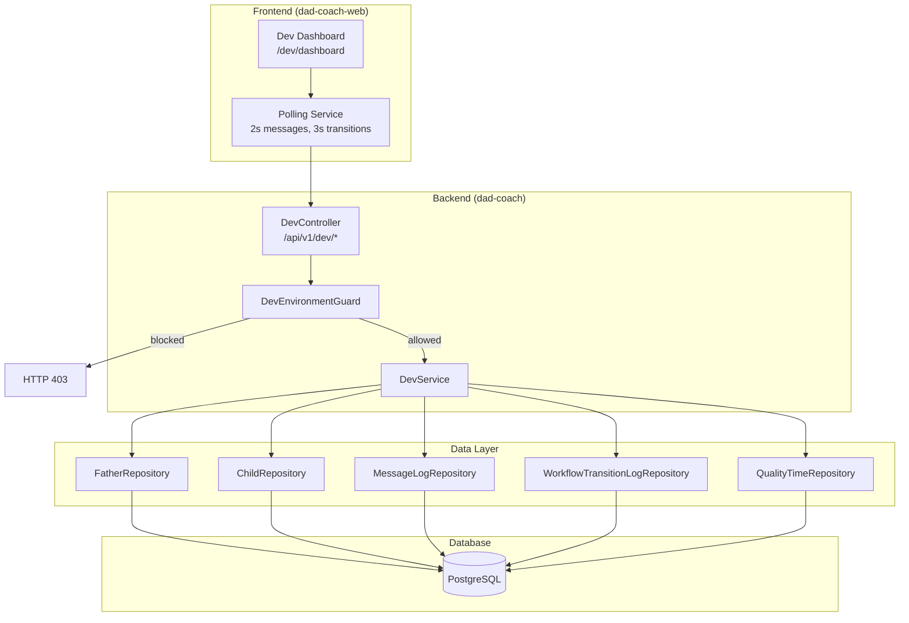
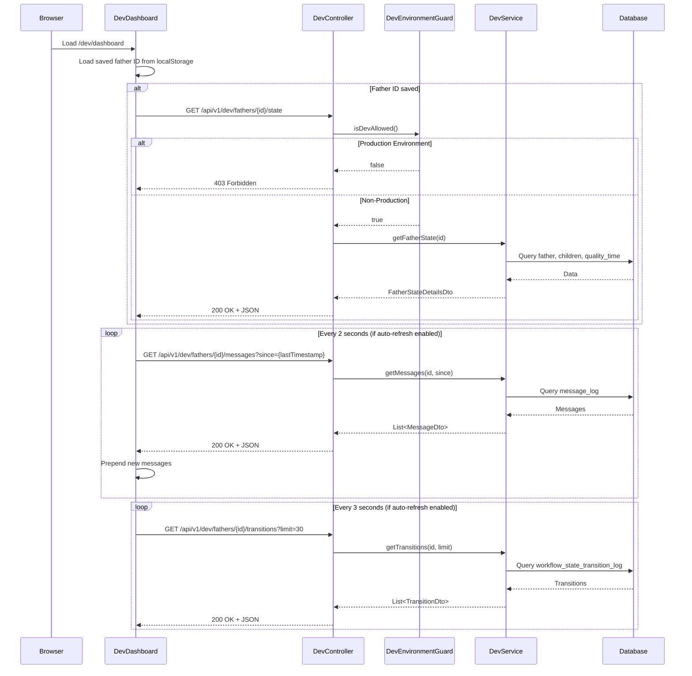

# Design Document: Dev Dashboard

## Overview

The Dev Dashboard is a debugging tool for WhatsApp workflow conversations in the Dad Coach application. It provides developers and QA engineers with real-time visibility into the internal state machine behavior, message history, and state transitions for any father in the system.

### Goals

1. **Debugging Visibility**: Enable developers to see the "under the hood" state of the workflow engine
2. **Real-Time Monitoring**: Provide live updates of messages and state transitions
3. **Security**: Ensure dev endpoints are completely blocked in production environments
4. **Developer Experience**: Create an intuitive, searchable interface for quick debugging

### Non-Goals

- Production user-facing features
- Analytics or reporting beyond debugging
- Administrative actions (user management handled elsewhere)
- Historical data archival

## Architecture

### High-Level System Architecture



### Request Flow Sequence



## Components and Interfaces

### Backend Components

#### 1. DevEnvironmentGuard

**Location**: `com.dadcoach.api.dev.DevEnvironmentGuard`

**Purpose**: Centralized environment detection component that determines if dev endpoints are allowed.

```java
@Component
public class DevEnvironmentGuard {
    
    private final Boolean devEnabled;
    private final Environment environment;
    private static final Logger log = LoggerFactory.getLogger(DevEnvironmentGuard.class);
    
    public DevEnvironmentGuard(
            @Value("${dadcoach.dev.enabled:#{null}}") Boolean devEnabled,
            Environment environment) {
        this.devEnabled = devEnabled;
        this.environment = environment;
    }
    
    /**
     * Determines if dev endpoints are allowed in the current environment.
     * 
     * Priority:
     * 1. If dadcoach.dev.enabled is explicitly set, use that value
     * 2. Otherwise, block if Spring profile is "prod" or "production"
     * 3. Allow for all other profiles (dev, local, staging, test, qa)
     * 
     * @return true if dev endpoints should be allowed
     */
    public boolean isDevAllowed() {
        try {
            // Explicit configuration takes precedence
            if (devEnabled != null) {
                return devEnabled;
            }
            
            // Check Spring profiles
            String[] activeProfiles = environment.getActiveProfiles();
            for (String profile : activeProfiles) {
                if ("prod".equalsIgnoreCase(profile) || 
                    "production".equalsIgnoreCase(profile)) {
                    return false;
                }
            }
            
            return true;
        } catch (Exception e) {
            // Security precaution: block access if we can't determine environment
            log.error("Failed to determine environment, blocking dev access", e);
            return false;
        }
    }
    
    /**
     * Throws DevEndpointsDisabledException if dev access is not allowed.
     */
    public void requireDevAccess() {
        if (!isDevAllowed()) {
            log.warn("Dev endpoint access rejected in production environment");
            throw new DevEndpointsDisabledException();
        }
    }
}
```

#### 2. DevController

**Location**: `com.dadcoach.api.dev.DevController`

**Purpose**: REST controller exposing debugging endpoints for the Dev Dashboard.

```java
@RestController
@RequestMapping("/api/v1/dev")
public class DevController {

    private final DevEnvironmentGuard environmentGuard;
    private final DevService devService;
    
    // GET /api/v1/dev/fathers
    // Query params: search, page (default 0), page_size (default 20, max 100)
    @GetMapping("/fathers")
    public ResponseEntity<PaginatedResponse<FatherListItemDto>> listFathers(
            @RequestParam(required = false) String search,
            @RequestParam(defaultValue = "0") int page,
            @RequestParam(name = "page_size", defaultValue = "20") int pageSize);
    
    // GET /api/v1/dev/fathers/{id}/state
    @GetMapping("/fathers/{id}/state")
    public ResponseEntity<FatherStateDetailsDto> getFatherState(
            @PathVariable Long id);
    
    // GET /api/v1/dev/fathers/{id}/messages
    // Query params: limit (default 50, max 200), since (ISO 8601 timestamp)
    @GetMapping("/fathers/{id}/messages")
    public ResponseEntity<List<MessageDto>> getMessages(
            @PathVariable Long id,
            @RequestParam(defaultValue = "50") int limit,
            @RequestParam(required = false) Instant since);
    
    // GET /api/v1/dev/fathers/{id}/transitions
    // Query params: limit (default 30, max 100)
    @GetMapping("/fathers/{id}/transitions")
    public ResponseEntity<List<TransitionDto>> getTransitions(
            @PathVariable Long id,
            @RequestParam(defaultValue = "30") int limit);
}
```

#### 3. DevService

**Location**: `com.dadcoach.api.dev.DevService`

**Purpose**: Business logic layer coordinating data retrieval for dev endpoints.

```java
@Service
public class DevService {
    
    private final FatherRepository fatherRepository;
    private final ChildRepository childRepository;
    private final MessageLogRepository messageLogRepository;
    private final WorkflowTransitionLogRepository transitionLogRepository;
    private final QualityTimeRepository qualityTimeRepository;
    
    public Page<FatherListItemDto> listFathers(String search, Pageable pageable);
    public FatherStateDetailsDto getFatherState(Long fatherId);
    public List<MessageDto> getMessages(Long fatherId, int limit, Instant since);
    public List<TransitionDto> getTransitions(Long fatherId, int limit);
}
```

### API Endpoint Specifications

#### 1. List All Fathers

**Endpoint**: `GET /api/v1/dev/fathers`

**Query Parameters**:
| Parameter | Type | Default | Max | Description |
|-----------|------|---------|-----|-------------|
| search | string | - | - | Filter by phone or display_name (case-insensitive) |
| page | int | 0 | - | Zero-indexed page number |
| page_size | int | 20 | 100 | Results per page |

**Response**: `200 OK`
```json
{
  "items": [
    {
      "id": 123,
      "display_name": "אבא טוב",
      "phone": "+972501234567",
      "status": "ACTIVE",
      "current_workflow_state": "WAITING",
      "previous_workflow_state": "SCHEDULE_QUALITY_TIME",
      "current_belt": "YELLOW",
      "last_interaction_at": "2025-01-15T10:30:00+02:00"
    }
  ],
  "page": 0,
  "page_size": 20,
  "total_items": 42,
  "total_pages": 3,
  "_links": {
    "self": "/api/v1/dev/fathers?page=0&page_size=20",
    "next": "/api/v1/dev/fathers?page=1&page_size=20",
    "last": "/api/v1/dev/fathers?page=2&page_size=20"
  }
}
```

**Error Responses**:
- `400 Bad Request`: page_size exceeds 100
- `403 Forbidden`: Production environment

#### 2. Get Father State Details

**Endpoint**: `GET /api/v1/dev/fathers/{id}/state`

**Response**: `200 OK`
```json
{
  "id": 123,
  "display_name": "אבא טוב",
  "phone": "+972501234567",
  "status": "ACTIVE",
  "workflow": {
    "current_state": "WAITING",
    "previous_state": "SCHEDULE_QUALITY_TIME",
    "state_entered_at": "2025-01-15T08:00:00+02:00",
    "welcomed_at": "2025-01-10T09:15:00+02:00"
  },
  "belt": {
    "current": "YELLOW",
    "total_quality_times_completed": 5,
    "current_streak_weeks": 2
  },
  "children": [
    {
      "id": 456,
      "name": "דני",
      "birth_date": "2018-05-15"
    }
  ],
  "scheduled_quality_times": [
    {
      "id": "uuid-here",
      "child_name": "דני",
      "scheduled_start": "2025-01-16T17:00:00+02:00",
      "scheduled_end": "2025-01-16T18:00:00+02:00",
      "status": "SCHEDULED"
    }
  ],
  "_partial": false,
  "_errors": []
}
```

**Error Responses**:
- `403 Forbidden`: Production environment
- `404 Not Found`: Father ID does not exist

#### 3. Get Message Log

**Endpoint**: `GET /api/v1/dev/fathers/{id}/messages`

**Query Parameters**:
| Parameter | Type | Default | Max | Description |
|-----------|------|---------|-----|-------------|
| limit | int | 50 | 200 | Maximum messages to return |
| since | ISO 8601 | - | - | Return only messages after this timestamp |

**Response**: `200 OK`
```json
{
  "messages": [
    {
      "id": 789,
      "direction": "INBOUND",
      "content": "היי, אני רוצה לתכנן זמן איכות",
      "created_at": "2025-01-15T10:30:00+02:00"
    },
    {
      "id": 790,
      "direction": "OUTBOUND",
      "content": "מצוין! עם איזה ילד תרצה לבלות?",
      "created_at": "2025-01-15T10:30:05+02:00"
    }
  ],
  "count": 2
}
```

**Error Responses**:
- `400 Bad Request`: limit exceeds 200
- `403 Forbidden`: Production environment
- `404 Not Found`: Father ID does not exist

#### 4. Get State Transitions

**Endpoint**: `GET /api/v1/dev/fathers/{id}/transitions`

**Query Parameters**:
| Parameter | Type | Default | Max | Description |
|-----------|------|---------|-----|-------------|
| limit | int | 30 | 100 | Maximum transitions to return |

**Response**: `200 OK`
```json
{
  "transitions": [
    {
      "id": "uuid-here",
      "from_state": "SCHEDULE_QUALITY_TIME",
      "to_state": "WAITING",
      "trigger_reason": "CALENDAR_EVENT_CREATED",
      "trigger_message_id": "msg-uuid-here",
      "created_at": "2025-01-15T08:00:00+02:00"
    }
  ],
  "count": 1
}
```

**Error Responses**:
- `400 Bad Request`: limit exceeds 100
- `403 Forbidden`: Production environment
- `404 Not Found`: Father ID does not exist

### Frontend Components

#### Component Hierarchy

```
/app/dev/dashboard/
├── page.tsx                    # Main dashboard page
├── layout.tsx                  # Dev layout with warning banner
└── components/
    ├── DevWarningBanner.tsx    # "Development Only" warning
    ├── FatherSelector.tsx      # Searchable father dropdown
    ├── FatherStatePanel.tsx    # State display with belt badge
    ├── MessageLogPanel.tsx     # Chat-style message view
    ├── TransitionTimeline.tsx  # State transition history
    ├── AutoRefreshToggle.tsx   # Live mode toggle
    └── TimezoneIndicator.tsx   # Israel timezone display
```

#### Page Layout

```mermaid
graph TB
    subgraph "Dev Dashboard Page"
        WB[Warning Banner<br/>"Development Only"]
        
        subgraph "Header Row"
            FS[Father Selector<br/>with Search]
            ART[Auto-Refresh Toggle]
            TZI[Timezone Indicator<br/>Asia/Jerusalem]
        end
        
        subgraph "Main Content Grid"
            subgraph "Left Column (40%)"
                FSP[Father State Panel]
                CP[Children Panel]
                QTP[Quality Time Panel]
            end
            
            subgraph "Right Column (60%)"
                MLP[Message Log Panel<br/>Polling: 2s]
                TTP[Transition Timeline<br/>Polling: 3s]
            end
        end
    end
    
    WB --> FS
    FS --> FSP
    FS --> MLP
    ART --> MLP
    ART --> TTP
```

#### Key Frontend Interfaces

```typescript
// Types for Dev Dashboard

interface DevFatherListItem {
  id: number;
  display_name: string | null;
  phone: string;
  status: string;
  current_workflow_state: string | null;
  previous_workflow_state: string | null;
  current_belt: string;
  last_interaction_at: string | null;
}

interface DevFatherState {
  id: number;
  display_name: string | null;
  phone: string;
  status: string;
  workflow: {
    current_state: string;
    previous_state: string | null;
    state_entered_at: string | null;
    welcomed_at: string | null;
  };
  belt: {
    current: string;
    total_quality_times_completed: number;
    current_streak_weeks: number;
  };
  children: DevChild[];
  scheduled_quality_times: DevQualityTime[];
  _partial: boolean;
  _errors: string[];
}

interface DevChild {
  id: number;
  name: string;
  birth_date: string;
}

interface DevQualityTime {
  id: string;
  child_name: string;
  scheduled_start: string;
  scheduled_end: string;
  status: string;
}

interface DevMessage {
  id: number;
  direction: 'INBOUND' | 'OUTBOUND';
  content: string;
  created_at: string;
}

interface DevTransition {
  id: string;
  from_state: string;
  to_state: string;
  trigger_reason: string;
  trigger_message_id: string | null;
  created_at: string;
}
```

## Data Models

### Backend DTOs

#### FatherListItemDto

```java
public record FatherListItemDto(
    Long id,
    String displayName,
    String phone,
    String status,
    String currentWorkflowState,
    String previousWorkflowState,
    String currentBelt,
    Instant lastInteractionAt
) {}
```

#### FatherStateDetailsDto

```java
public record FatherStateDetailsDto(
    Long id,
    String displayName,
    String phone,
    String status,
    WorkflowInfo workflow,
    BeltInfo belt,
    List<ChildDto> children,
    List<QualityTimeDto> scheduledQualityTimes,
    boolean partial,
    List<String> errors
) {
    public record WorkflowInfo(
        String currentState,
        String previousState,
        Instant stateEnteredAt,
        Instant welcomedAt
    ) {}
    
    public record BeltInfo(
        String current,
        int totalQualityTimesCompleted,
        int currentStreakWeeks
    ) {}
}
```

#### MessageDto

```java
public record MessageDto(
    Long id,
    String direction,
    String content,
    Instant createdAt
) {}
```

#### TransitionDto

```java
public record TransitionDto(
    UUID id,
    String fromState,
    String toState,
    String triggerReason,
    UUID triggerMessageId,
    Instant createdAt
) {}
```

#### ChildDto

```java
public record ChildDto(
    Long id,
    String name,
    LocalDate birthDate
) {}
```

#### QualityTimeDto

```java
public record QualityTimeDto(
    UUID id,
    String childName,
    Instant scheduledStart,
    Instant scheduledEnd,
    String status
) {}
```

### Pagination Response

```java
public record PaginatedResponse<T>(
    List<T> items,
    int page,
    int pageSize,
    long totalItems,
    int totalPages,
    Map<String, String> links
) {}
```

## Error Handling

### Backend Error Handling

#### Custom Exceptions

```java
// Thrown when dev endpoints are accessed in production
public class DevEndpointsDisabledException extends RuntimeException {
    public DevEndpointsDisabledException() {
        super("Dev endpoints disabled in production");
    }
}
```

#### Global Exception Handler

```java
@RestControllerAdvice
public class DevExceptionHandler {
    
    @ExceptionHandler(DevEndpointsDisabledException.class)
    public ResponseEntity<ErrorResponse> handleDevDisabled(DevEndpointsDisabledException ex) {
        // No stack trace, no internal details
        return ResponseEntity
            .status(HttpStatus.FORBIDDEN)
            .body(new ErrorResponse(
                "FORBIDDEN",
                "Dev endpoints disabled in production"
            ));
    }
    
    @ExceptionHandler(FatherNotFoundException.class)
    public ResponseEntity<ErrorResponse> handleNotFound(FatherNotFoundException ex) {
        return ResponseEntity
            .status(HttpStatus.NOT_FOUND)
            .body(new ErrorResponse("NOT_FOUND", ex.getMessage()));
    }
    
    @ExceptionHandler(ConstraintViolationException.class)
    public ResponseEntity<ErrorResponse> handleValidation(ConstraintViolationException ex) {
        return ResponseEntity
            .status(HttpStatus.BAD_REQUEST)
            .body(new ErrorResponse("BAD_REQUEST", "Invalid parameter value"));
    }
}
```

#### Partial Data Handling

When a database query partially fails (e.g., children load but quality_time fails), the service returns HTTP 200 with partial data:

```java
public FatherStateDetailsDto getFatherState(Long fatherId) {
    Father father = fatherRepository.findById(fatherId)
        .orElseThrow(() -> new FatherNotFoundException(fatherId));
    
    List<String> errors = new ArrayList<>();
    boolean partial = false;
    
    List<ChildDto> children;
    try {
        children = childRepository.findByFatherId(fatherId).stream()
            .map(this::toChildDto)
            .toList();
    } catch (Exception e) {
        log.warn("Failed to load children for father {}", fatherId, e);
        children = List.of();
        errors.add("Failed to load children");
        partial = true;
    }
    
    // Similar pattern for quality times...
    
    return new FatherStateDetailsDto(
        father.getId(),
        // ... other fields
        children,
        qualityTimes,
        partial,
        errors
    );
}
```

### Frontend Error Handling

```typescript
// Error states in React components
interface PanelState<T> {
  data: T | null;
  loading: boolean;
  error: string | null;
  lastRefreshed: Date | null;
}

// Error display component
function ErrorBanner({ message }: { message: string }) {
  return (
    <div className="bg-red-500/10 border border-red-500/30 rounded-lg p-3">
      <p className="text-red-300 text-sm">⚠️ {message}</p>
    </div>
  );
}

// Partial data indicator
function PartialDataWarning({ errors }: { errors: string[] }) {
  if (errors.length === 0) return null;
  return (
    <div className="bg-yellow-500/10 border border-yellow-500/30 rounded-lg p-2 mt-2">
      <p className="text-yellow-300 text-xs">
        ⚠️ Some data could not be loaded: {errors.join(', ')}
      </p>
    </div>
  );
}
```

## Testing Strategy

### Test Categories

#### 1. Unit Tests

- **DevEnvironmentGuard**: Test all environment detection scenarios
- **DevService**: Test business logic with mocked repositories
- **DTO Mapping**: Test entity-to-DTO conversions
- **Validation**: Test parameter validation (limit, page_size bounds)

#### 2. Integration Tests

- **Controller Tests**: Test full request/response cycle with `@WebMvcTest`
- **Repository Tests**: Test custom queries with `@DataJpaTest`
- **Environment Protection**: Test 403 response in production profile

#### 3. Frontend Tests

- **Component Tests**: Test React components with React Testing Library
- **Polling Logic**: Test auto-refresh behavior
- **Timezone Conversion**: Test Israel timezone display

### Key Test Cases

```java
// DevEnvironmentGuardTest
@Test
void shouldBlockAccessWhenDevEnabledIsFalse() {
    DevEnvironmentGuard guard = new DevEnvironmentGuard(false, mockEnvironment);
    assertFalse(guard.isDevAllowed());
}

@Test
void shouldAllowAccessWhenDevEnabledIsTrue() {
    DevEnvironmentGuard guard = new DevEnvironmentGuard(true, mockEnvironment);
    assertTrue(guard.isDevAllowed());
}

@Test
void shouldBlockAccessForProdProfile() {
    when(mockEnvironment.getActiveProfiles()).thenReturn(new String[]{"prod"});
    DevEnvironmentGuard guard = new DevEnvironmentGuard(null, mockEnvironment);
    assertFalse(guard.isDevAllowed());
}

@Test
void shouldAllowAccessForDevProfile() {
    when(mockEnvironment.getActiveProfiles()).thenReturn(new String[]{"dev"});
    DevEnvironmentGuard guard = new DevEnvironmentGuard(null, mockEnvironment);
    assertTrue(guard.isDevAllowed());
}

@Test
void shouldBlockAccessOnException() {
    when(mockEnvironment.getActiveProfiles()).thenThrow(new RuntimeException("Failure"));
    DevEnvironmentGuard guard = new DevEnvironmentGuard(null, mockEnvironment);
    assertFalse(guard.isDevAllowed()); // Security precaution
}

// DevControllerTest
@Test
@WithMockUser
void listFathers_inProduction_returns403() {
    when(environmentGuard.isDevAllowed()).thenReturn(false);
    
    mockMvc.perform(get("/api/v1/dev/fathers"))
        .andExpect(status().isForbidden())
        .andExpect(jsonPath("$.message").value("Dev endpoints disabled in production"));
}

@Test
void listFathers_pageSizeExceedsMax_returns400() {
    when(environmentGuard.isDevAllowed()).thenReturn(true);
    
    mockMvc.perform(get("/api/v1/dev/fathers").param("page_size", "101"))
        .andExpect(status().isBadRequest());
}
```

### JSON Serialization Round-Trip Test

```java
@Test
void jsonRoundTrip_preservesAllFields() throws Exception {
    FatherStateDetailsDto original = new FatherStateDetailsDto(
        123L,
        "אבא טוב",
        "+972501234567",
        "ACTIVE",
        new WorkflowInfo("WAITING", "SCHEDULE_QUALITY_TIME", 
            Instant.parse("2025-01-15T08:00:00Z"), null),
        new BeltInfo("YELLOW", 5, 2),
        List.of(new ChildDto(456L, "דני", LocalDate.of(2018, 5, 15))),
        List.of(),
        false,
        List.of()
    );
    
    String json = objectMapper.writeValueAsString(original);
    FatherStateDetailsDto deserialized = objectMapper.readValue(json, FatherStateDetailsDto.class);
    
    assertEquals(original, deserialized);
}
```

## Correctness Properties

*A property is a characteristic or behavior that should hold true across all valid executions of a system—essentially, a formal statement about what the system should do. Properties serve as the bridge between human-readable specifications and machine-verifiable correctness guarantees.*

### Property 1: Search Filtering Correctness

*For any* search query string and any set of fathers in the database, all fathers returned by the search endpoint SHALL have either their phone number or display_name containing the search string (case-insensitive match).

**Validates: Requirements 1.2**

### Property 2: Limit Enforcement

*For any* valid limit parameter value (within allowed bounds) and any endpoint that supports limiting (`/fathers`, `/messages`, `/transitions`), the number of items returned SHALL be at most equal to the specified limit, and SHALL equal `min(limit, actual_count)` where `actual_count` is the total matching items.

**Validates: Requirements 1.3, 3.2, 4.2**

### Property 3: Temporal Ordering Invariant

*For any* API response that returns a list of items with timestamps (`/fathers` ordered by `last_interaction_at`, `/messages` ordered by `created_at`, `/transitions` ordered by `created_at`), the items SHALL be ordered in strictly descending order by their timestamp field, such that for any two consecutive items A and B in the list, `timestamp(A) >= timestamp(B)`.

**Validates: Requirements 1.5, 3.3, 4.3**

### Property 4: Related Data Inclusion Completeness

*For any* father that exists in the database, when requesting their state details via `/fathers/{id}/state`:
- All children associated with that father SHALL appear in the `children` array
- All scheduled quality_time entries associated with that father SHALL appear in the `scheduled_quality_times` array

**Validates: Requirements 2.2, 2.3**

### Property 5: Timestamp Filtering Correctness

*For any* `since` timestamp parameter provided to the messages endpoint and any set of messages for a father, all returned messages SHALL have a `created_at` timestamp strictly greater than the `since` parameter.

**Validates: Requirements 3.4**

### Property 6: Error Response Sanitization

*For any* error response generated by the Dev API in production mode (HTTP 403), the response body SHALL NOT contain:
- Java stack traces (no `at com.dadcoach.` patterns)
- Internal class names or package paths
- Database query details
- Server configuration details

**Validates: Requirements 5.4**

### Property 7: Timezone Conversion Correctness

*For any* UTC timestamp stored in the database, when displayed in the Dev Dashboard frontend, the timestamp SHALL be converted to Israel timezone (Asia/Jerusalem) with correct offset handling for both standard time (UTC+2) and daylight saving time (UTC+3).

**Validates: Requirements 10.1**

### Property 8: Display Formatting Consistency

*For any* date displayed in the Dev Dashboard, the format SHALL match `DD/MM/YYYY` (two-digit day, two-digit month, four-digit year).
*For any* time displayed in the Dev Dashboard, the format SHALL match `HH:mm:ss` (24-hour format with leading zeros).

**Validates: Requirements 10.2, 10.3**

### Property 9: Environment Detection Priority

*For any* combination of `dadcoach.dev.enabled` property value (true, false, or unset) and active Spring profile(s), the DevEnvironmentGuard SHALL determine access according to this priority:
1. If `dadcoach.dev.enabled` is explicitly `true`, allow access
2. If `dadcoach.dev.enabled` is explicitly `false`, deny access
3. If `dadcoach.dev.enabled` is unset and profile contains "prod" or "production" (case-insensitive), deny access
4. If `dadcoach.dev.enabled` is unset and profile does not contain production values, allow access

**Validates: Requirements 12.1, 12.2, 12.3, 12.4, 12.5**

### Property 10: Serialization Format Correctness

*For any* response DTO:
- All `Instant` fields SHALL be serialized to ISO 8601 format with timezone offset (e.g., `"2025-01-15T10:30:00+02:00"`)
- All enum fields (WorkflowState, Belt, FatherStatus, Direction) SHALL be serialized as uppercase strings matching the enum constant name

**Validates: Requirements 13.1, 13.2**

### Property 11: JSON Round-Trip Preservation

*For any* valid response DTO instance (FatherListItemDto, FatherStateDetailsDto, MessageDto, TransitionDto), serializing to JSON then deserializing back SHALL produce an object equal to the original, with all field values preserved.

**Validates: Requirements 13.4**
