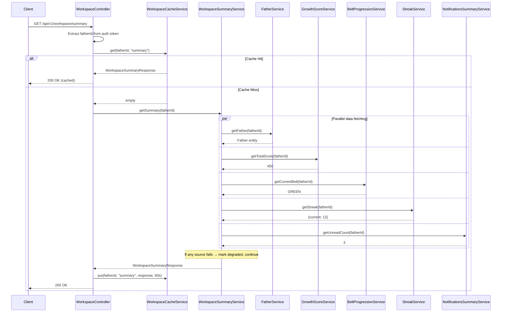
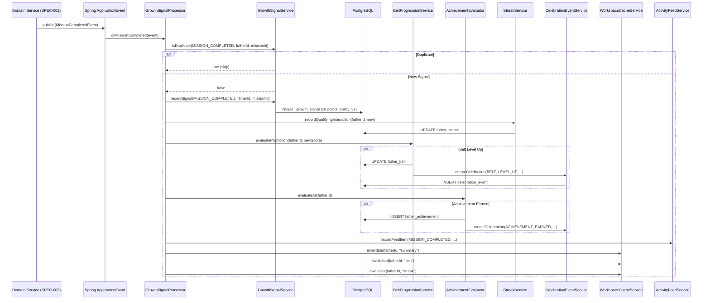
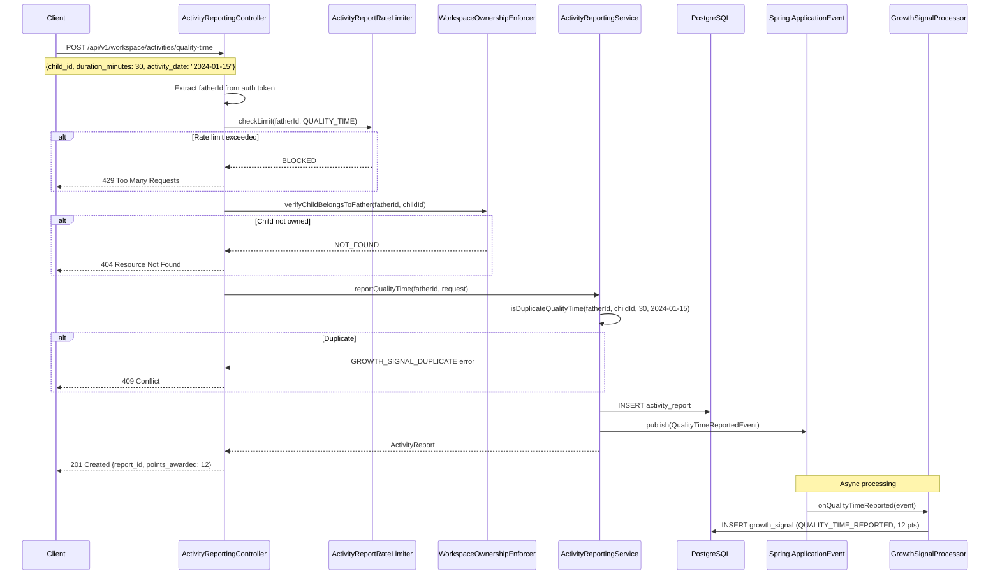
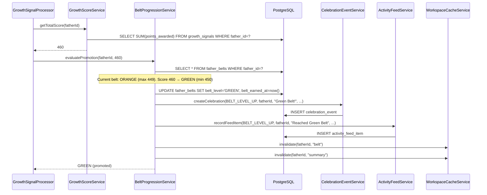
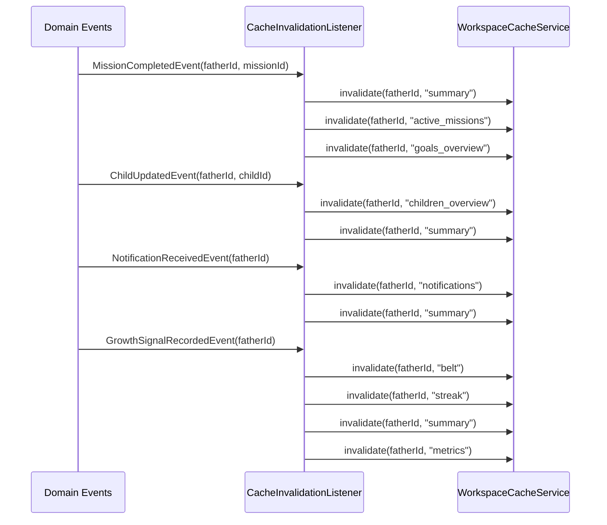

# Technical Design — Father Workspace Backend

## Overview

The Father Workspace Backend (SPEC-008) implements the backend services powering the father's post-login experience. It has two clearly separated architectural concerns:

1. **Read Aggregation Layer** — Stateless facades that compose data from existing domain services (Father, Child, Goal, Mission, Conversation, Notification) into read-optimized API responses. These services own NO domain state.

2. **Growth System (Command Layer)** — A new bounded context that owns its own domain state and implements the gamification/progression engine: growth signals, belts, achievements, streaks, celebrations, and activity reporting.

The system operates within the Spring Boot monolith, follows the same patterns as SPEC-007 (User Onboarding), and exposes REST APIs consumed by any frontend (web, mobile, WhatsApp bot).

---

## Architecture

### Architecture Decisions

**AD-1: CQRS-Lite with Separate Read and Write Services**
The workspace separates read aggregation (query) from growth system commands (write). Read services compose data from existing domain services and cache layers. Write services own growth domain state and process mutations. This prevents God-service anti-patterns and keeps each service focused.

**AD-2: Event-Driven Growth Signal Processing**
Growth signals are processed asynchronously via Spring Application Events. Domain events (MISSION_COMPLETED, CONVERSATION_ENDED, etc.) are published by their owning specs. The Growth System subscribes to these events and records signals without coupling to the API request path. This ensures user-facing operations are never blocked by score calculations.

**AD-3: Immutable Append-Only Signal Store**
Growth signals are immutable event records. The Growth_Score is the sum of all signals — never recomputed from raw domain events. This provides auditability, simplifies debugging, and enables scoring policy versioning without retroactive recalculation.

**AD-4: Cache-Aside Pattern with Granular Invalidation**
Each data type is cached independently per father with its own TTL. Domain events trigger targeted cache invalidation (only the affected father's affected data type). Cache stampede protection uses `@Cacheable` with lock-based population.

**AD-5: Activity Reporting Commands in Growth System**
Quality time and positive activity endpoints are commands that CREATE growth signals. They belong to the Growth System because: (a) they are the input mechanism for manual growth signals, (b) signal processing, validation, and duplicate detection logic is owned by the Growth System, (c) they produce domain events consumed by the Growth System's own signal processor.

**AD-6: Partial Degradation over Total Failure**
The workspace summary aggregates data from multiple sources. If any source is unavailable, the response includes available data with a `degraded_sections` array and `response_status: "partial"`. No single-source failure crashes the entire workspace response.

**AD-7: Scoring Policy Versioning (Forward-Only)**
Each signal record includes a `scoring_policy_version`. Existing points are immutable. New rules apply only to new signals. This avoids retroactive recalculation while supporting evolution of the scoring model.

**AD-8: Belt Monotonicity (No Regression)**
Once a father reaches a belt level, they retain it permanently. Belt transitions are one-way. This is a motivational design choice — fathers never lose progress.

**AD-9: Incremental Score Caching with Authoritative Signal Store**
`GrowthScoreService` maintains a cached total score in `father_belts.current_score` that is updated incrementally when each new signal is recorded (current_score += new_signal_points). This avoids a `SUM()` query on every read. However, `growth_signals` remains the single source of truth. If the cached score diverges (e.g., due to a bug or failed update), it can be rebuilt by summing all growth_signals for the father. The `GrowthScoreService.rebuildScore(fatherId)` method performs this reconciliation. Belt transitions are always evaluated against the authoritative signal sum, not the cached value alone.


### Package Structure

```
com.dadcoach.workspace/
├── WorkspaceController.java               # Workspace summary, quick actions
├── ProfileController.java                 # Profile read endpoint
├── ChildrenOverviewController.java        # Children overview & child summary
├── GoalsOverviewController.java           # Goals overview & goal progress
├── MissionsController.java                # Active missions
├── ConversationsController.java           # Recent conversations
├── ActivityFeedController.java            # Activity feed timeline
├── NotificationsController.java           # Notifications summary, mark-read
├── StatisticsController.java              # Weekly/monthly statistics
├── ActivityReportingController.java       # Quality time & positive activity commands
├── GrowthController.java                  # Belt, score, streak, achievements
├── CelebrationController.java            # Celebration events
├── WorkspaceExceptionHandler.java         # @ControllerAdvice for workspace errors
│
├── aggregation/                           # READ AGGREGATION SERVICES (Query Side)
│   ├── WorkspaceSummaryService.java       # Composes workspace summary response
│   ├── ChildrenOverviewService.java       # Aggregates children + metrics
│   ├── GoalsOverviewService.java          # Aggregates goals + progress
│   ├── MissionsOverviewService.java       # Active missions read model
│   ├── ConversationsOverviewService.java  # Recent conversations read model
│   ├── NotificationsSummaryService.java   # Notification counts + list
│   ├── QuickActionsService.java           # Computes contextual suggestions
│   ├── StatisticsService.java            # Weekly/monthly statistics aggregation
│   └── ProfileReadService.java            # Profile data composition
│
├── growth/                                # COMMAND SERVICES (Write Side)
│   ├── signal/
│   │   ├── GrowthSignal.java             # JPA entity (immutable event record)
│   │   ├── GrowthSignalRepository.java
│   │   ├── GrowthSignalType.java         # Enum of signal types
│   │   ├── GrowthSignalProcessor.java    # Processes domain events → signals
│   │   ├── GrowthSignalService.java      # Signal recording + duplicate detection
│   │   └── SignalWeight.java             # Points configuration per signal type
│   ├── belt/
│   │   ├── FatherBelt.java               # JPA entity
│   │   ├── FatherBeltRepository.java
│   │   ├── BeltLevel.java                # Enum: WHITE → BLACK
│   │   ├── BeltProgressionService.java   # Belt transition logic
│   │   └── BeltThreshold.java            # Score thresholds per belt
│   ├── streak/
│   │   ├── FatherStreak.java             # JPA entity
│   │   ├── FatherStreakRepository.java
│   │   └── StreakService.java            # Streak calculation + reset
│   ├── achievement/
│   │   ├── Achievement.java              # JPA entity (definition)
│   │   ├── FatherAchievement.java        # JPA entity (earned record)
│   │   ├── AchievementRepository.java
│   │   ├── FatherAchievementRepository.java
│   │   ├── AchievementCategory.java      # Enum
│   │   ├── AchievementEvaluator.java     # Checks criteria + awards
│   │   └── AchievementCriteria.java      # Machine-readable rule definitions
│   ├── milestone/
│   │   ├── Milestone.java                # JPA entity (definition)
│   │   ├── FatherMilestone.java          # JPA entity (reached record)
│   │   ├── MilestoneRepository.java
│   │   ├── FatherMilestoneRepository.java
│   │   └── MilestoneEvaluator.java       # Checks milestone conditions
│   ├── celebration/
│   │   ├── CelebrationEvent.java         # JPA entity
│   │   ├── CelebrationEventRepository.java
│   │   ├── CelebrationEventService.java  # Creates celebration events
│   │   └── CelebrationEventType.java     # Enum
│   └── score/
│       ├── GrowthScoreService.java       # Score aggregation + breakdown
│       └── ScoringPolicyVersion.java     # Policy version constants
│
├── activity/                              # ACTIVITY REPORTING (Write Side)
│   ├── ActivityReport.java               # JPA entity
│   ├── ActivityReportRepository.java
│   ├── ActivityReportingService.java     # Validates + records + emits events
│   ├── ActivityType.java                 # Enum: PRAISE, SHARED_ACTIVITY, etc.
│   └── ActivityReportValidator.java      # Duplicate detection + rate limits
│
├── feed/                                  # ACTIVITY FEED (Write + Read)
│   ├── ActivityFeedItem.java             # JPA entity
│   ├── ActivityFeedRepository.java
│   ├── ActivityFeedService.java          # Writes feed items from events, reads
│   └── ActivityFeedEventType.java        # Enum of event types
│
├── statistics/                            # STATISTICS (Write + Read)
│   ├── StatisticsAggregate.java          # JPA entity (pre-computed)
│   ├── StatisticsAggregateRepository.java
│   ├── StatisticsAggregationJob.java     # @Scheduled nightly job
│   └── StatisticsPeriodType.java         # Enum: DAILY, WEEKLY, MONTHLY
│
├── cache/
│   ├── WorkspaceCacheService.java        # Cache operations + invalidation
│   ├── CacheKeyBuilder.java             # workspace:{father_id}:{data_type}
│   └── CacheInvalidationListener.java   # Event → cache invalidation mapping
│
├── event/
│   ├── WorkspaceDomainEvent.java         # Base event class
│   ├── GrowthSignalRecordedEvent.java
│   ├── BeltLevelUpEvent.java
│   ├── AchievementEarnedEvent.java
│   ├── MilestoneReachedEvent.java
│   ├── StreakMilestoneEvent.java
│   ├── QualityTimeReportedEvent.java
│   ├── PositiveActivityReportedEvent.java
│   └── DomainEventListener.java         # Listens to external domain events
│
├── dto/
│   ├── request/
│   │   ├── QualityTimeRequest.java
│   │   ├── PositiveActivityRequest.java
│   │   ├── MarkNotificationsReadRequest.java
│   │   └── MarkCelebrationDisplayedRequest.java
│   └── response/
│       ├── WorkspaceSummaryResponse.java
│       ├── ProfileResponse.java
│       ├── ChildrenOverviewResponse.java
│       ├── ChildSummaryResponse.java
│       ├── GoalsOverviewResponse.java
│       ├── GoalProgressResponse.java
│       ├── ActiveMissionsResponse.java
│       ├── RecentConversationsResponse.java
│       ├── ActivityFeedResponse.java
│       ├── NotificationsSummaryResponse.java
│       ├── WeeklyStatisticsResponse.java
│       ├── MonthlyStatisticsResponse.java
│       ├── QuickActionsResponse.java
│       ├── BeltProgressionResponse.java
│       ├── GrowthScoreBreakdownResponse.java
│       ├── StreakResponse.java
│       ├── AchievementsResponse.java
│       ├── CelebrationEventsResponse.java
│       ├── MetricsDashboardResponse.java
│       ├── ActivityReportResponse.java
│       └── PartialResponse.java          # Wrapper for degraded responses
│
└── security/
    ├── WorkspaceOwnershipEnforcer.java   # Service-layer ownership check
    ├── WorkspaceRateLimiter.java         # Per-father rate limiting
    └── ActivityReportRateLimiter.java    # Activity-specific rate limits
```


## Components and Interfaces

### Architectural Boundary: Read Aggregation vs. Command Services

```
┌─────────────────────────────────────────────────────────────────────────┐
│                        Father Workspace Backend                          │
├──────────────────────────────┬──────────────────────────────────────────┤
│   READ AGGREGATION (Query)   │        COMMAND SERVICES (Write)           │
│                              │                                          │
│  WorkspaceSummaryService     │  GrowthSignalProcessor                   │
│  ChildrenOverviewService     │  ActivityReportingService                │
│  GoalsOverviewService        │  StreakService                           │
│  MissionsOverviewService     │  BeltProgressionService                  │
│  ConversationsOverviewService│  AchievementEvaluator                   │
│  NotificationsSummaryService │  CelebrationEventService                │
│  QuickActionsService         │  GrowthScoreService                     │
│  StatisticsService           │  ActivityFeedService                    │
│  ProfileReadService          │  StatisticsAggregationJob               │
│                              │                                          │
│  ► Own NO domain state       │  ► OWN their domain state:              │
│  ► Read from existing        │    growth_signals, father_belts,         │
│    domain services + cache   │    achievements, streaks,                │
│  ► Never mutate core         │    activity_reports, celebration_events, │
│    resources                 │    activity_feed_items,                  │
│                              │    statistics_aggregates                 │
└──────────────────────────────┴──────────────────────────────────────────┘
```

### WorkspaceSummaryService (Read Aggregation)

```java
/**
 * Composes the workspace summary from multiple domain services.
 * Owns NO state — reads from Father, Growth, Notification services.
 * Implements partial degradation: returns available data when sources fail.
 */
public interface WorkspaceSummaryService {
    WorkspaceSummaryResponse getSummary(UUID fatherId);
}
```

### ChildrenOverviewService (Read Aggregation)

```java
public interface ChildrenOverviewService {
    ChildrenOverviewResponse getChildrenOverview(UUID fatherId);
    ChildSummaryResponse getChildSummary(UUID fatherId, UUID childId);
}
```

### GoalsOverviewService (Read Aggregation)

```java
public interface GoalsOverviewService {
    GoalsOverviewResponse getGoalsOverview(UUID fatherId, GoalFilterParams filters);
    GoalProgressResponse getGoalProgress(UUID fatherId, UUID goalId);
}
```

### MissionsOverviewService (Read Aggregation)

```java
public interface MissionsOverviewService {
    ActiveMissionsResponse getActiveMissions(UUID fatherId);
}
```

### ConversationsOverviewService (Read Aggregation)

```java
public interface ConversationsOverviewService {
    RecentConversationsResponse getRecentConversations(UUID fatherId, int limit);
}
```

### NotificationsSummaryService (Read Aggregation)

```java
public interface NotificationsSummaryService {
    NotificationsSummaryResponse getSummary(UUID fatherId, int page, int pageSize);
    void markAsRead(UUID fatherId, List<UUID> notificationIds);
    void markAllRead(UUID fatherId);
}
```

### QuickActionsService (Read Aggregation)

```java
public interface QuickActionsService {
    QuickActionsResponse getQuickActions(UUID fatherId);
}
```

### ProfileReadService (Read Aggregation)

```java
public interface ProfileReadService {
    ProfileResponse getProfile(UUID fatherId);
}
```

### StatisticsService (Read + Write)

```java
public interface StatisticsService {
    WeeklyStatisticsResponse getWeeklyStatistics(UUID fatherId, LocalDate weekStart);
    MonthlyStatisticsResponse getMonthlyStatistics(UUID fatherId, YearMonth month);
    MetricsDashboardResponse getMetricsDashboard(UUID fatherId);
}
```

---

### GrowthSignalService (Command — Growth System)

```java
/**
 * Records growth signals with duplicate detection.
 * Each signal is immutable once recorded.
 */
public interface GrowthSignalService {
    GrowthSignal recordSignal(GrowthSignalType type, UUID fatherId,
                              UUID sourceEntityId, String sourceEntityType);
    boolean isDuplicate(GrowthSignalType type, UUID fatherId, UUID sourceEntityId);
    List<GrowthSignal> getRecentSignals(UUID fatherId, int limit);
    Map<GrowthSignalType, Integer> getScoreBreakdown(UUID fatherId);
    int getTotalScore(UUID fatherId);
    List<GrowthSignal> getSignalsInPeriod(UUID fatherId, Instant from, Instant to);
}
```

### GrowthSignalProcessor (Command — Growth System)

```java
/**
 * Event listener that converts domain events into growth signals.
 * Subscribes to Spring Application Events from other specs.
 */
public interface GrowthSignalProcessor {
    void onMissionCompleted(MissionCompletedEvent event);
    void onMissionReflected(MissionReflectedEvent event);
    void onGoalProgress(GoalProgressEvent event);
    void onGoalCompleted(GoalCompletedEvent event);
    void onConversationCompleted(ConversationCompletedEvent event);
    void onDailyEngagement(DailyEngagementEvent event);
    void replaySignalsForFather(UUID fatherId);  // Admin recalculation
}
```

### BeltProgressionService (Command — Growth System)

```java
/**
 * Manages belt level transitions. Belt never regresses.
 */
public interface BeltProgressionService {
    FatherBelt getCurrentBelt(UUID fatherId);
    BeltProgressionResponse getProgression(UUID fatherId);
    Optional<BeltLevel> evaluatePromotion(UUID fatherId, int currentScore);
    void promoteBelt(UUID fatherId, BeltLevel newBelt);
}
```

### StreakService (Command — Growth System)

```java
/**
 * Tracks consecutive engagement days per father.
 */
public interface StreakService {
    FatherStreak getStreak(UUID fatherId);
    StreakResponse getStreakResponse(UUID fatherId);
    void recordQualifyingInteraction(UUID fatherId, Instant timestamp);
    void resetExpiredStreaks();  // Called by scheduled job
    boolean isStreakAtRisk(UUID fatherId);
}
```

### AchievementEvaluator (Command — Growth System)

```java
/**
 * Evaluates achievement criteria after growth events.
 * Awards achievements idempotently (earned once, never revoked).
 */
public interface AchievementEvaluator {
    List<FatherAchievement> evaluateAll(UUID fatherId);
    AchievementsResponse getAchievements(UUID fatherId);
    Optional<Achievement> getNextAchievable(UUID fatherId);
}
```

### CelebrationEventService (Command — Growth System)

```java
/**
 * Creates celebration events for significant growth moments.
 * Generates encouragement metadata via Intelligence Layer (SPEC-003).
 */
public interface CelebrationEventService {
    CelebrationEvent createCelebration(CelebrationEventType type, UUID fatherId,
                                       String title, String description,
                                       Integer relatedPoints);
    CelebrationEventsResponse getUndisplayed(UUID fatherId);
    void markDisplayed(UUID fatherId, List<UUID> eventIds);
}
```

### ActivityReportingService (Command — Growth System)

```java
/**
 * Handles quality time and positive activity commands.
 * Validates, persists, and emits domain events for growth signal processing.
 * Belongs to Growth System because these commands CREATE growth signals.
 */
public interface ActivityReportingService {
    ActivityReport reportQualityTime(UUID fatherId, QualityTimeRequest request);
    ActivityReport reportPositiveActivity(UUID fatherId, PositiveActivityRequest request);
    boolean isDuplicateQualityTime(UUID fatherId, UUID childId,
                                   int durationMinutes, LocalDate activityDate);
}
```

### ActivityFeedService (Command + Read)

```java
/**
 * Writes activity feed items from domain events; reads for the feed endpoint.
 */
public interface ActivityFeedService {
    void recordFeedItem(ActivityFeedEventType type, UUID fatherId,
                        String title, String description,
                        UUID relatedEntityId, String relatedEntityType);
    ActivityFeedResponse getFeed(UUID fatherId, String cursor, int pageSize);
    void purgeExpiredItems();  // Called by scheduled job (90 days retention)
}
```

### WorkspaceCacheService

```java
/**
 * Encapsulates cache operations with stampede protection.
 */
public interface WorkspaceCacheService {
    <T> Optional<T> get(UUID fatherId, String dataType, Class<T> responseType);
    <T> void put(UUID fatherId, String dataType, T value, Duration ttl);
    void invalidate(UUID fatherId, String dataType);
    void invalidateAll(UUID fatherId);
    boolean isAvailable();
}
```

### Integration Points

| Source Spec | Event / Interface | Direction | Purpose |
|-------------|-------------------|-----------|---------|
| SPEC-002 (Domain) | `MissionCompletedEvent` | Inbound | Trigger MISSION_COMPLETED signal |
| SPEC-002 (Domain) | `MissionReflectedEvent` | Inbound | Trigger MISSION_REFLECTED signal |
| SPEC-002 (Domain) | `GoalProgressEvent` | Inbound | Trigger GOAL_PROGRESS signal |
| SPEC-002 (Domain) | `GoalCompletedEvent` | Inbound | Trigger GOAL_COMPLETED signal |
| SPEC-005 (Conversation) | `ConversationCompletedEvent` | Inbound | Trigger MEANINGFUL_CONVERSATION signal |
| SPEC-006 (Channels) | `NotificationService` | Read | Notifications summary |
| SPEC-007 (Application API) | `FatherService` | Read | Father profile data |
| SPEC-007 (Application API) | `ChildService` | Read | Children data |
| SPEC-007 (Application API) | `GoalService` | Read | Goals data |
| SPEC-007 (Application API) | `MissionService` | Read | Active missions |
| SPEC-003 (Intelligence) | `IntelligenceLayer` | Outbound | Generate encouragement metadata |
| SPEC-004 (Memory) | `MemoryService` | Read | Recent memories (for quick actions) |

---

## Sequence Diagrams

### Workspace Summary Request Flow




### Growth Signal Processing Flow (Event-Driven)



### Activity Reporting Flow (Quality Time)




### Belt Progression Check Flow



### Cache Invalidation Flow



---

## Data Models

### Entity Relationship Diagram

```mermaid
erDiagram
    Father ||--o| FatherBelt : "has current"
    Father ||--o| FatherStreak : "has"
    Father ||--o{ GrowthSignal : "accumulates"
    Father ||--o{ FatherAchievement : "earns"
    Father ||--o{ FatherMilestone : "reaches"
    Father ||--o{ CelebrationEvent : "receives"
    Father ||--o{ ActivityReport : "submits"
    Father ||--o{ ActivityFeedItem : "has timeline"
    Father ||--o{ StatisticsAggregate : "has stats"

    GrowthSignal {
        UUID signal_id PK
        UUID father_id FK
        string signal_type
        int points_awarded
        UUID source_entity_id
        string source_entity_type
        int scoring_policy_version
        timestamp created_at
    }

    FatherBelt {
        UUID belt_id PK
        UUID father_id FK "UNIQUE"
        string belt_level
        int current_score "cached read-model; source of truth is SUM(growth_signals.points_awarded)"
        timestamp belt_earned_at
        timestamp created_at
        timestamp updated_at
    }

    FatherStreak {
        UUID streak_id PK
        UUID father_id FK "UNIQUE"
        int current_streak_days
        int longest_streak_days
        date streak_start_date
        date last_qualifying_date
        string timezone
        timestamp updated_at
    }

    Achievement {
        UUID achievement_id PK
        string name
        string description
        string category
        string criteria_json
        int criteria_version "supports rule evolution without breaking existing earned achievements"
        string icon_key
        int sort_order
    }

    FatherAchievement {
        UUID id PK
        UUID father_id FK
        UUID achievement_id FK
        timestamp earned_at
    }

    Milestone {
        UUID milestone_id PK
        string name
        string description
        string trigger_condition_json
        int sort_order
    }

    FatherMilestone {
        UUID id PK
        UUID father_id FK
        UUID milestone_id FK
        timestamp reached_at
    }

    CelebrationEvent {
        UUID event_id PK
        UUID father_id FK
        string event_type
        string title
        string description
        int related_points
        string celebration_message
        string motivational_prompt
        boolean displayed
        timestamp created_at
    }

    ActivityReport {
        UUID report_id PK
        UUID father_id FK
        UUID child_id FK "nullable"
        string report_type
        int duration_minutes "nullable"
        string activity_type "nullable"
        string description "nullable"
        date activity_date
        timestamp created_at
    }

    ActivityFeedItem {
        UUID item_id PK
        UUID father_id FK
        string event_type
        string title
        string description
        UUID related_entity_id "nullable"
        string related_entity_type "nullable"
        jsonb metadata "nullable, event-specific attributes for extensibility"
        timestamp event_timestamp
        timestamp expires_at
    }

    StatisticsAggregate {
        UUID aggregate_id PK
        UUID father_id FK
        string period_type
        date period_start
        string metrics_json
        timestamp computed_at
    }
```




---

## Database Schema (Flyway Migrations)

### V8.001 — Growth Signals Table

```sql
-- V8.001__create_growth_signals.sql
CREATE TABLE growth_signals (
    signal_id           UUID PRIMARY KEY DEFAULT gen_random_uuid(),
    father_id           UUID NOT NULL,
    signal_type         VARCHAR(50) NOT NULL,
    points_awarded      INTEGER NOT NULL CHECK (points_awarded > 0),
    source_entity_id    UUID NOT NULL,
    source_entity_type  VARCHAR(50) NOT NULL,
    scoring_policy_version INTEGER NOT NULL DEFAULT 1,
    created_at          TIMESTAMP WITH TIME ZONE NOT NULL DEFAULT NOW(),

    CONSTRAINT fk_growth_signals_father FOREIGN KEY (father_id) REFERENCES fathers(id),
    CONSTRAINT uq_growth_signal_dedup UNIQUE (father_id, signal_type, source_entity_id)
);

CREATE INDEX idx_growth_signals_father_id ON growth_signals(father_id);
CREATE INDEX idx_growth_signals_father_created ON growth_signals(father_id, created_at DESC);
CREATE INDEX idx_growth_signals_father_type ON growth_signals(father_id, signal_type);
```

### V8.002 — Father Belts Table

```sql
-- V8.002__create_father_belts.sql
CREATE TABLE father_belts (
    belt_id         UUID PRIMARY KEY DEFAULT gen_random_uuid(),
    father_id       UUID NOT NULL UNIQUE,
    belt_level      VARCHAR(20) NOT NULL DEFAULT 'WHITE',
    current_score   INTEGER NOT NULL DEFAULT 0,  -- Cached read-model; authoritative source is SUM(growth_signals.points_awarded)
    belt_earned_at  TIMESTAMP WITH TIME ZONE NOT NULL DEFAULT NOW(),
    created_at      TIMESTAMP WITH TIME ZONE NOT NULL DEFAULT NOW(),
    updated_at      TIMESTAMP WITH TIME ZONE NOT NULL DEFAULT NOW(),

    CONSTRAINT fk_father_belts_father FOREIGN KEY (father_id) REFERENCES fathers(id),
    CONSTRAINT chk_belt_level CHECK (belt_level IN ('WHITE','YELLOW','ORANGE','GREEN','BLUE','PURPLE','BROWN','BLACK'))
);
```

### V8.003 — Father Streaks Table

```sql
-- V8.003__create_father_streaks.sql
CREATE TABLE father_streaks (
    streak_id           UUID PRIMARY KEY DEFAULT gen_random_uuid(),
    father_id           UUID NOT NULL UNIQUE,
    current_streak_days INTEGER NOT NULL DEFAULT 0,
    longest_streak_days INTEGER NOT NULL DEFAULT 0,
    streak_start_date   DATE,
    last_qualifying_date DATE,
    timezone            VARCHAR(50) NOT NULL DEFAULT 'UTC',
    updated_at          TIMESTAMP WITH TIME ZONE NOT NULL DEFAULT NOW(),

    CONSTRAINT fk_father_streaks_father FOREIGN KEY (father_id) REFERENCES fathers(id),
    CONSTRAINT chk_streak_non_negative CHECK (current_streak_days >= 0),
    CONSTRAINT chk_longest_streak CHECK (longest_streak_days >= current_streak_days)
);
```

### V8.004 — Achievements Tables

```sql
-- V8.004__create_achievements.sql
CREATE TABLE achievements (
    achievement_id  UUID PRIMARY KEY DEFAULT gen_random_uuid(),
    name            VARCHAR(100) NOT NULL UNIQUE,
    description     VARCHAR(500) NOT NULL,
    category        VARCHAR(30) NOT NULL,
    criteria_json   JSONB NOT NULL,
    criteria_version INTEGER NOT NULL DEFAULT 1,
    icon_key        VARCHAR(100) NOT NULL,
    sort_order      INTEGER NOT NULL DEFAULT 0,
    created_at      TIMESTAMP WITH TIME ZONE NOT NULL DEFAULT NOW(),

    CONSTRAINT chk_achievement_category CHECK (category IN ('MISSIONS','CONSISTENCY','GROWTH','CONVERSATIONS','GOALS','SPECIAL'))
);

CREATE TABLE father_achievements (
    id              UUID PRIMARY KEY DEFAULT gen_random_uuid(),
    father_id       UUID NOT NULL,
    achievement_id  UUID NOT NULL,
    earned_at       TIMESTAMP WITH TIME ZONE NOT NULL DEFAULT NOW(),

    CONSTRAINT fk_father_achievements_father FOREIGN KEY (father_id) REFERENCES fathers(id),
    CONSTRAINT fk_father_achievements_achievement FOREIGN KEY (achievement_id) REFERENCES achievements(achievement_id),
    CONSTRAINT uq_father_achievement UNIQUE (father_id, achievement_id)
);

CREATE INDEX idx_father_achievements_father ON father_achievements(father_id);
```


### V8.005 — Milestones Tables

```sql
-- V8.005__create_milestones.sql
CREATE TABLE milestones (
    milestone_id            UUID PRIMARY KEY DEFAULT gen_random_uuid(),
    name                    VARCHAR(100) NOT NULL UNIQUE,
    description             VARCHAR(500) NOT NULL,
    trigger_condition_json  JSONB NOT NULL,
    sort_order              INTEGER NOT NULL DEFAULT 0,
    created_at              TIMESTAMP WITH TIME ZONE NOT NULL DEFAULT NOW()
);

CREATE TABLE father_milestones (
    id              UUID PRIMARY KEY DEFAULT gen_random_uuid(),
    father_id       UUID NOT NULL,
    milestone_id    UUID NOT NULL,
    reached_at      TIMESTAMP WITH TIME ZONE NOT NULL DEFAULT NOW(),

    CONSTRAINT fk_father_milestones_father FOREIGN KEY (father_id) REFERENCES fathers(id),
    CONSTRAINT fk_father_milestones_milestone FOREIGN KEY (milestone_id) REFERENCES milestones(milestone_id),
    CONSTRAINT uq_father_milestone UNIQUE (father_id, milestone_id)
);

CREATE INDEX idx_father_milestones_father ON father_milestones(father_id);
```

### V8.006 — Celebration Events Table

```sql
-- V8.006__create_celebration_events.sql
CREATE TABLE celebration_events (
    event_id            UUID PRIMARY KEY DEFAULT gen_random_uuid(),
    father_id           UUID NOT NULL,
    event_type          VARCHAR(30) NOT NULL,
    title               VARCHAR(200) NOT NULL,
    description         VARCHAR(500),
    related_points      INTEGER,
    celebration_message VARCHAR(500),
    motivational_prompt VARCHAR(500),
    displayed           BOOLEAN NOT NULL DEFAULT FALSE,
    created_at          TIMESTAMP WITH TIME ZONE NOT NULL DEFAULT NOW(),

    CONSTRAINT fk_celebration_events_father FOREIGN KEY (father_id) REFERENCES fathers(id),
    CONSTRAINT chk_celebration_type CHECK (event_type IN ('BELT_LEVEL_UP','ACHIEVEMENT_EARNED','MILESTONE_REACHED','STREAK_MILESTONE'))
);

CREATE INDEX idx_celebration_events_father_undisplayed ON celebration_events(father_id) WHERE displayed = FALSE;
CREATE INDEX idx_celebration_events_father_created ON celebration_events(father_id, created_at DESC);
```

### V8.007 — Activity Reports Table

```sql
-- V8.007__create_activity_reports.sql
CREATE TABLE activity_reports (
    report_id       UUID PRIMARY KEY DEFAULT gen_random_uuid(),
    father_id       UUID NOT NULL,
    child_id        UUID,
    report_type     VARCHAR(30) NOT NULL,
    duration_minutes INTEGER,
    activity_type   VARCHAR(30),
    description     VARCHAR(200),
    activity_date   DATE NOT NULL,
    created_at      TIMESTAMP WITH TIME ZONE NOT NULL DEFAULT NOW(),

    CONSTRAINT fk_activity_reports_father FOREIGN KEY (father_id) REFERENCES fathers(id),
    CONSTRAINT fk_activity_reports_child FOREIGN KEY (child_id) REFERENCES children(id),
    CONSTRAINT chk_report_type CHECK (report_type IN ('QUALITY_TIME', 'POSITIVE_ACTIVITY')),
    CONSTRAINT chk_activity_type CHECK (activity_type IN ('PRAISE','SHARED_ACTIVITY','TEACHING_MOMENT','QUALITY_CONVERSATION','OTHER') OR activity_type IS NULL),
    CONSTRAINT chk_duration CHECK (duration_minutes IS NULL OR (duration_minutes >= 15 AND duration_minutes <= 480)),
    CONSTRAINT uq_quality_time_dedup UNIQUE (father_id, child_id, duration_minutes, activity_date)
);

CREATE INDEX idx_activity_reports_father_date ON activity_reports(father_id, activity_date DESC);
CREATE INDEX idx_activity_reports_father_type_date ON activity_reports(father_id, report_type, activity_date);
```

### V8.008 — Activity Feed Items Table

```sql
-- V8.008__create_activity_feed_items.sql
CREATE TABLE activity_feed_items (
    item_id             UUID PRIMARY KEY DEFAULT gen_random_uuid(),
    father_id           UUID NOT NULL,
    event_type          VARCHAR(50) NOT NULL,
    title               VARCHAR(200) NOT NULL,
    description         VARCHAR(500),
    related_entity_id   UUID,
    related_entity_type VARCHAR(50),
    metadata            JSONB,
    event_timestamp     TIMESTAMP WITH TIME ZONE NOT NULL DEFAULT NOW(),
    expires_at          TIMESTAMP WITH TIME ZONE NOT NULL DEFAULT (NOW() + INTERVAL '90 days'),

    CONSTRAINT fk_feed_items_father FOREIGN KEY (father_id) REFERENCES fathers(id)
);

CREATE INDEX idx_feed_items_father_time ON activity_feed_items(father_id, event_timestamp DESC);
CREATE INDEX idx_feed_items_expires ON activity_feed_items(expires_at);
```


### V8.009 — Statistics Aggregates Table

```sql
-- V8.009__create_statistics_aggregates.sql
CREATE TABLE statistics_aggregates (
    aggregate_id    UUID PRIMARY KEY DEFAULT gen_random_uuid(),
    father_id       UUID NOT NULL,
    period_type     VARCHAR(10) NOT NULL,
    period_start    DATE NOT NULL,
    metrics_json    JSONB NOT NULL,
    computed_at     TIMESTAMP WITH TIME ZONE NOT NULL DEFAULT NOW(),

    CONSTRAINT fk_stats_father FOREIGN KEY (father_id) REFERENCES fathers(id),
    CONSTRAINT chk_period_type CHECK (period_type IN ('DAILY', 'WEEKLY', 'MONTHLY')),
    CONSTRAINT uq_stats_father_period UNIQUE (father_id, period_type, period_start)
);

CREATE INDEX idx_stats_father_period ON statistics_aggregates(father_id, period_type, period_start DESC);
```

### V8.010 — Seed Achievements Data

```sql
-- V8.010__seed_achievements.sql
INSERT INTO achievements (achievement_id, name, description, category, criteria_json, icon_key, sort_order) VALUES
  (gen_random_uuid(), 'First Steps', 'Complete your first mission', 'MISSIONS', '{"type":"mission_count","threshold":1}', 'trophy-first', 1),
  (gen_random_uuid(), 'Mission Master 10', 'Complete 10 missions', 'MISSIONS', '{"type":"mission_count","threshold":10}', 'trophy-10', 2),
  (gen_random_uuid(), 'Mission Master 50', 'Complete 50 missions', 'MISSIONS', '{"type":"mission_count","threshold":50}', 'trophy-50', 3),
  (gen_random_uuid(), 'Mission Master 100', 'Complete 100 missions', 'MISSIONS', '{"type":"mission_count","threshold":100}', 'trophy-100', 4),
  (gen_random_uuid(), 'Week Warrior', '7-day engagement streak', 'CONSISTENCY', '{"type":"streak_days","threshold":7}', 'streak-7', 5),
  (gen_random_uuid(), 'Month Champion', '30-day engagement streak', 'CONSISTENCY', '{"type":"streak_days","threshold":30}', 'streak-30', 6),
  (gen_random_uuid(), 'Quarter Legend', '90-day engagement streak', 'CONSISTENCY', '{"type":"streak_days","threshold":90}', 'streak-90', 7),
  (gen_random_uuid(), 'Goal Getter', 'Complete your first goal', 'GOALS', '{"type":"goal_count","threshold":1}', 'goal-first', 8),
  (gen_random_uuid(), 'Goal Crusher', 'Complete 5 goals', 'GOALS', '{"type":"goal_count","threshold":5}', 'goal-5', 9),
  (gen_random_uuid(), 'Deep Talker', '10 meaningful conversations', 'CONVERSATIONS', '{"type":"conversation_count","threshold":10}', 'chat-10', 10),
  (gen_random_uuid(), 'Connection King', '50 meaningful conversations', 'CONVERSATIONS', '{"type":"conversation_count","threshold":50}', 'chat-50', 11),
  (gen_random_uuid(), 'Rising Star', 'Reach Yellow Belt', 'GROWTH', '{"type":"belt_reached","belt":"YELLOW"}', 'belt-yellow', 12),
  (gen_random_uuid(), 'Green Machine', 'Reach Green Belt', 'GROWTH', '{"type":"belt_reached","belt":"GREEN"}', 'belt-green', 13),
  (gen_random_uuid(), 'Elite Father', 'Reach Purple Belt', 'GROWTH', '{"type":"belt_reached","belt":"PURPLE"}', 'belt-purple', 14),
  (gen_random_uuid(), 'Grandmaster', 'Reach Black Belt', 'GROWTH', '{"type":"belt_reached","belt":"BLACK"}', 'belt-black', 15);
```

### V8.011 — Seed Milestones Data

```sql
-- V8.011__seed_milestones.sql
INSERT INTO milestones (milestone_id, name, description, trigger_condition_json, sort_order) VALUES
  (gen_random_uuid(), '25 Missions', 'Completed 25 missions total', '{"type":"mission_count","threshold":25}', 1),
  (gen_random_uuid(), '50 Missions', 'Completed 50 missions total', '{"type":"mission_count","threshold":50}', 2),
  (gen_random_uuid(), '100 Missions', 'Completed 100 missions total', '{"type":"mission_count","threshold":100}', 3),
  (gen_random_uuid(), '250 Missions', 'Completed 250 missions total', '{"type":"mission_count","threshold":250}', 4),
  (gen_random_uuid(), '500 Missions', 'Completed 500 missions total', '{"type":"mission_count","threshold":500}', 5),
  (gen_random_uuid(), '30 Days Active', 'Active for 30 days', '{"type":"account_age_days","threshold":30}', 6),
  (gen_random_uuid(), '90 Days Active', 'Active for 90 days', '{"type":"account_age_days","threshold":90}', 7),
  (gen_random_uuid(), '180 Days Active', 'Active for 180 days', '{"type":"account_age_days","threshold":180}', 8),
  (gen_random_uuid(), '1 Year Journey', 'Active for 1 year', '{"type":"account_age_days","threshold":365}', 9);
```

---

## API Contracts

### Base URL

All workspace endpoints are prefixed with `/api/v1/workspace`.

### Error Response Format (consistent with Application API)

```json
{
  "error_code": "GROWTH_SIGNAL_DUPLICATE",
  "message": "A quality time report already exists for this child on this date with the same duration.",
  "details": [
    {"field": "child_id", "issue": "duplicate_entry"}
  ],
  "request_id": "req_abc123def456",
  "retryable": false
}
```


### GET /api/v1/workspace/summary

**Response 200 OK:**
```json
{
  "response_status": "complete",
  "degraded_sections": [],
  "data": {
    "display_name": "David",
    "coaching_phase": "ACTIVE_COACHING",
    "current_belt": "GREEN",
    "growth_score": 462,
    "active_children_count": 2,
    "active_goals_count": 3,
    "current_streak_days": 12,
    "active_mission": {
      "mission_id": "uuid-123",
      "title": "Practice active listening during dinner",
      "status": "IN_PROGRESS"
    },
    "last_conversation_timestamp": "2024-01-15T18:30:00Z",
    "unread_notifications_count": 3
  }
}
```

**Response 200 OK (Partial Degradation):**
```json
{
  "response_status": "partial",
  "degraded_sections": ["notifications"],
  "data": {
    "display_name": "David",
    "coaching_phase": "ACTIVE_COACHING",
    "current_belt": "GREEN",
    "growth_score": 462,
    "active_children_count": 2,
    "active_goals_count": 3,
    "current_streak_days": 12,
    "active_mission": {
      "mission_id": "uuid-123",
      "title": "Practice active listening during dinner",
      "status": "IN_PROGRESS"
    },
    "last_conversation_timestamp": "2024-01-15T18:30:00Z",
    "unread_notifications_count": null
  }
}
```

### GET /api/v1/workspace/profile

**Response 200 OK:**
```json
{
  "display_name": "David",
  "phone_masked": "+972-5***-**89",
  "timezone": "Asia/Jerusalem",
  "coaching_style": "SUPPORTIVE",
  "preferred_coaching_time": "EVENING",
  "language_preference": "he",
  "coaching_phase": "ACTIVE_COACHING",
  "days_since_activation": 45,
  "account_status": "ACTIVE"
}
```

### GET /api/v1/workspace/children

**Response 200 OK:**
```json
{
  "children": [
    {
      "child_id": "uuid-child-1",
      "name": "Yael",
      "computed_age": "4 years 2 months",
      "active_goals_count": 2,
      "completed_missions_count": 15,
      "recent_mission": {
        "mission_id": "uuid-m1",
        "title": "Read a bedtime story together",
        "completed_at": "2024-01-14T20:00:00Z"
      },
      "interests": ["art", "animals", "stories"]
    },
    {
      "child_id": "uuid-child-2",
      "name": "Noam",
      "computed_age": "7 years 8 months",
      "active_goals_count": 1,
      "completed_missions_count": 22,
      "recent_mission": null,
      "interests": ["soccer", "lego", "science"]
    }
  ]
}
```

### GET /api/v1/workspace/children/{childId}/summary

**Response 200 OK:**
```json
{
  "name": "Yael",
  "birth_date": "2019-11-03",
  "computed_age": "4 years 2 months",
  "interests": ["art", "animals", "stories"],
  "challenges": ["separation anxiety", "sharing with siblings"],
  "active_goals": [
    {
      "goal_id": "uuid-g1",
      "description": "Build bedtime routine independence",
      "progress_percentage": 60
    }
  ],
  "mission_history_summary": {
    "total": 20,
    "completed": 15,
    "skipped": 3
  },
  "upcoming_birthday": false
}
```


### GET /api/v1/workspace/goals?status=active&child_id={childId}

**Response 200 OK:**
```json
{
  "goals": [
    {
      "goal_id": "uuid-g1",
      "description": "Build bedtime routine independence",
      "category": "DAILY_ROUTINES",
      "priority": "HIGH",
      "progress_percentage": 60,
      "related_child": {
        "child_id": "uuid-child-1",
        "name": "Yael"
      },
      "missions_completed_count": 6,
      "missions_remaining_estimate": 4
    }
  ],
  "total_count": 3,
  "filters_applied": {
    "status": "active",
    "child_id": "uuid-child-1"
  }
}
```

### GET /api/v1/workspace/missions/active

**Response 200 OK:**
```json
{
  "missions": [
    {
      "mission_id": "uuid-m1",
      "title": "Practice active listening during dinner",
      "description": "Tonight at dinner, put your phone away and ask each child about their day...",
      "assigned_child": {
        "child_id": "uuid-child-2",
        "name": "Noam"
      },
      "category": "COMMUNICATION",
      "difficulty_level": "MEDIUM",
      "assigned_at": "2024-01-15T08:00:00Z",
      "status": "IN_PROGRESS"
    }
  ]
}
```

### GET /api/v1/workspace/conversations?limit=10

**Response 200 OK:**
```json
{
  "conversations": [
    {
      "conversation_id": "uuid-conv-1",
      "type": "COACHING_SESSION",
      "started_at": "2024-01-15T18:30:00Z",
      "last_message_at": "2024-01-15T18:45:00Z",
      "message_count": 12,
      "summary": "Discussed strategies for managing sibling rivalry during playtime.",
      "status": "COMPLETED"
    }
  ],
  "total_count": 45
}
```

### GET /api/v1/workspace/activity-feed?cursor={cursor}&page_size=20

**Response 200 OK:**
```json
{
  "items": [
    {
      "event_id": "uuid-event-1",
      "event_type": "MISSION_COMPLETED",
      "timestamp": "2024-01-15T20:00:00Z",
      "title": "Mission Completed!",
      "description": "You completed 'Read a bedtime story together'",
      "related_entity_id": "uuid-m1",
      "related_entity_type": "MISSION"
    },
    {
      "event_id": "uuid-event-2",
      "event_type": "ACHIEVEMENT_EARNED",
      "timestamp": "2024-01-15T20:01:00Z",
      "title": "Achievement Unlocked: Mission Master 10",
      "description": "You've completed 10 missions!",
      "related_entity_id": "uuid-achievement-1",
      "related_entity_type": "ACHIEVEMENT"
    }
  ],
  "next_cursor": "eyJvZmZzZXQiOjIwfQ==",
  "has_more": true
}
```

### GET /api/v1/workspace/notifications?page=1&page_size=20

**Response 200 OK:**
```json
{
  "unread_count": 3,
  "total_count": 28,
  "notifications": [
    {
      "notification_id": "uuid-notif-1",
      "type": "MISSION_ASSIGNED",
      "title": "New Mission Available",
      "body": "You have a new mission: Practice active listening during dinner",
      "created_at": "2024-01-15T08:00:00Z",
      "read_at": null,
      "action_url": "/missions/uuid-m1",
      "priority": "MEDIUM"
    }
  ]
}
```

### POST /api/v1/workspace/notifications/mark-read

**Request:**
```json
{
  "notification_ids": ["uuid-notif-1", "uuid-notif-2"]
}
```

**Response 204 No Content**


### GET /api/v1/workspace/growth/belt

**Response 200 OK:**
```json
{
  "current_belt": "GREEN",
  "current_score": 462,
  "next_belt": "BLUE",
  "points_to_next_belt": 238,
  "progress_percentage_to_next_belt": 4.8,
  "belt_earned_at": "2024-01-10T14:30:00Z"
}
```

### GET /api/v1/workspace/growth/score

**Response 200 OK:**
```json
{
  "total_score": 462,
  "score_by_signal_type": {
    "MISSION_COMPLETED": 150,
    "MISSION_REFLECTED": 25,
    "GOAL_PROGRESS": 60,
    "GOAL_COMPLETED": 50,
    "MEANINGFUL_CONVERSATION": 72,
    "DAILY_ENGAGEMENT": 45,
    "STREAK_BONUS_7": 20,
    "STREAK_BONUS_14": 30,
    "QUALITY_TIME_REPORTED": 10
  },
  "signals_this_week": 5,
  "signals_this_month": 22,
  "recent_signals": [
    {
      "signal_id": "uuid-sig-1",
      "signal_type": "MISSION_COMPLETED",
      "points_awarded": 10,
      "source_entity_type": "MISSION",
      "created_at": "2024-01-15T20:00:00Z"
    }
  ]
}
```

### GET /api/v1/workspace/growth/streak

**Response 200 OK:**
```json
{
  "current_streak_days": 12,
  "longest_streak_days": 18,
  "streak_start_date": "2024-01-04",
  "last_qualifying_interaction_date": "2024-01-15",
  "streak_at_risk": false
}
```

### GET /api/v1/workspace/growth/achievements

**Response 200 OK:**
```json
{
  "total_available": 15,
  "total_earned": 6,
  "achievements": [
    {
      "achievement_id": "uuid-ach-1",
      "name": "First Steps",
      "description": "Complete your first mission",
      "category": "MISSIONS",
      "icon_key": "trophy-first",
      "earned_at": "2023-12-01T10:00:00Z"
    },
    {
      "achievement_id": "uuid-ach-2",
      "name": "Mission Master 10",
      "description": "Complete 10 missions",
      "category": "MISSIONS",
      "icon_key": "trophy-10",
      "earned_at": "2024-01-10T15:00:00Z"
    },
    {
      "achievement_id": "uuid-ach-3",
      "name": "Mission Master 50",
      "description": "Complete 50 missions",
      "category": "MISSIONS",
      "icon_key": "trophy-50",
      "earned_at": null
    }
  ],
  "next_achievable": {
    "achievement_id": "uuid-ach-3",
    "name": "Mission Master 50",
    "description": "Complete 50 missions",
    "current_progress": "15/50"
  }
}
```

### POST /api/v1/workspace/activities/quality-time

**Request:**
```json
{
  "child_id": "uuid-child-1",
  "duration_minutes": 30,
  "activity_description": "We built a lego castle together",
  "activity_date": "2024-01-15"
}
```

**Response 201 Created:**
```json
{
  "report_id": "uuid-report-1",
  "report_type": "QUALITY_TIME",
  "child_id": "uuid-child-1",
  "duration_minutes": 30,
  "activity_date": "2024-01-15",
  "points_awarded": 12,
  "created_at": "2024-01-15T21:00:00Z"
}
```

### POST /api/v1/workspace/activities/positive-activity

**Request:**
```json
{
  "child_id": "uuid-child-2",
  "activity_type": "PRAISE",
  "description": "Praised Noam for helping his sister",
  "activity_date": "2024-01-15"
}
```

**Response 201 Created:**
```json
{
  "report_id": "uuid-report-2",
  "report_type": "POSITIVE_ACTIVITY",
  "child_id": "uuid-child-2",
  "activity_type": "PRAISE",
  "activity_date": "2024-01-15",
  "points_awarded": 5,
  "created_at": "2024-01-15T21:05:00Z"
}
```


### GET /api/v1/workspace/growth/celebrations?undisplayed_only=true

**Response 200 OK:**
```json
{
  "celebrations": [
    {
      "event_id": "uuid-celeb-1",
      "event_type": "BELT_LEVEL_UP",
      "title": "Green Belt Achieved!",
      "description": "You've reached the Green Belt level — Growing Strong!",
      "related_points": 15,
      "celebration_message": "Amazing progress, David! Your consistent effort is paying off.",
      "motivational_prompt": "Try a new bedtime routine activity with Yael this week.",
      "displayed": false,
      "created_at": "2024-01-10T14:30:00Z"
    }
  ]
}
```

### POST /api/v1/workspace/growth/celebrations/mark-displayed

**Request:**
```json
{
  "event_ids": ["uuid-celeb-1"]
}
```

**Response 204 No Content**

### GET /api/v1/workspace/statistics/weekly?week_start=2024-01-08

**Response 200 OK:**
```json
{
  "week_start": "2024-01-08",
  "week_end": "2024-01-14",
  "missions_assigned": 5,
  "missions_completed": 4,
  "missions_skipped": 0,
  "conversations_count": 6,
  "total_conversation_minutes": 45,
  "goals_progressed": 2,
  "growth_score_delta": 68,
  "streak_days_this_week": 7,
  "quality_time_minutes": 90
}
```

### GET /api/v1/workspace/statistics/monthly?month=2024-01

**Response 200 OK:**
```json
{
  "month": "2024-01",
  "missions_completed": 18,
  "goals_completed": 1,
  "conversations_count": 22,
  "average_daily_engagement": 0.85,
  "growth_score_at_month_start": 380,
  "growth_score_at_month_end": 462,
  "belt_changes": ["ORANGE → GREEN"],
  "achievements_earned": 2,
  "longest_streak_in_month": 14
}
```

### GET /api/v1/workspace/quick-actions

**Response 200 OK:**
```json
{
  "actions": [
    {
      "action_id": "qa-1",
      "action_type": "VIEW_MISSION",
      "title": "Continue Your Mission",
      "description": "Practice active listening during dinner tonight",
      "priority": 9,
      "action_metadata": {"mission_id": "uuid-m1", "deep_link": "/missions/uuid-m1"}
    },
    {
      "action_id": "qa-2",
      "action_type": "LOG_QUALITY_TIME",
      "title": "Log Quality Time",
      "description": "Record time spent with your kids today",
      "priority": 7,
      "action_metadata": {"deep_link": "/activities/quality-time"}
    },
    {
      "action_id": "qa-3",
      "action_type": "CHECK_NOTIFICATIONS",
      "title": "3 New Notifications",
      "description": "You have unread coaching notifications",
      "priority": 6,
      "action_metadata": {"unread_count": 3, "deep_link": "/notifications"}
    }
  ]
}
```

### GET /api/v1/workspace/metrics

**Response 200 OK:**
```json
{
  "engagement": {
    "conversations_this_week": 6,
    "conversations_this_month": 22,
    "total_conversations": 89,
    "average_conversation_depth": 8.5,
    "logins_this_week": 7,
    "total_active_days": 45
  },
  "quality_time": {
    "quality_time_this_week_minutes": 90,
    "quality_time_this_month_minutes": 320,
    "activities_reported_this_week": 4,
    "quality_time_by_child": {
      "uuid-child-1": 50,
      "uuid-child-2": 40
    }
  },
  "completion": {
    "goals_completed_total": 3,
    "goals_in_progress": 3,
    "missions_completed_total": 45,
    "missions_completed_this_week": 4,
    "mission_completion_rate": 0.82
  }
}
```

---


## Caching Design

### Cache Key Structure

```
workspace:{father_id}:summary          → WorkspaceSummaryResponse (TTL: 60s)
workspace:{father_id}:profile          → ProfileResponse (TTL: 120s)
workspace:{father_id}:children         → ChildrenOverviewResponse (TTL: 120s)
workspace:{father_id}:goals            → GoalsOverviewResponse (TTL: 120s)
workspace:{father_id}:active_missions  → ActiveMissionsResponse (TTL: 60s)
workspace:{father_id}:conversations    → RecentConversationsResponse (TTL: 120s)
workspace:{father_id}:notifications    → NotificationsSummaryResponse (TTL: 30s)
workspace:{father_id}:weekly_stats     → WeeklyStatisticsResponse (TTL: 300s)
workspace:{father_id}:monthly_stats    → MonthlyStatisticsResponse (TTL: 3600s)
workspace:{father_id}:belt             → BeltProgressionResponse (TTL: 300s)
workspace:{father_id}:streak           → StreakResponse (TTL: 120s)
workspace:{father_id}:achievements     → AchievementsResponse (TTL: 600s)
workspace:{father_id}:metrics          → MetricsDashboardResponse (TTL: 120s)
```

### Invalidation Mapping

| Domain Event | Cache Keys Invalidated |
|-------------|----------------------|
| `MissionCompletedEvent` | summary, active_missions, goals, weekly_stats |
| `MissionAssignedEvent` | summary, active_missions |
| `GoalProgressEvent` | summary, goals |
| `GoalCompletedEvent` | summary, goals, weekly_stats |
| `ConversationCompletedEvent` | summary, conversations |
| `ChildUpdatedEvent` | summary, children |
| `NotificationReceivedEvent` | summary, notifications |
| `GrowthSignalRecordedEvent` | summary, belt, streak, metrics |
| `AchievementEarnedEvent` | achievements |
| `FatherProfileUpdatedEvent` | summary, profile |
| `StreakResetEvent` | summary, streak |

### Stampede Protection

When multiple concurrent requests miss the cache for the same key:
1. The first request acquires a lock (in-process `ReentrantLock` per cache key)
2. Subsequent requests wait on the lock (with 2s timeout)
3. When the first request populates the cache, waiting requests read from cache
4. If lock acquisition times out, the request bypasses cache and hits the source directly

---

## Integration Points with Existing Specs

### Reads from Other Specs (no ownership)

| Spec | Service Used | Data Read | Purpose |
|------|-------------|-----------|---------|
| SPEC-002 | FatherRepository | Father entity, status, phase | Profile read, workspace summary |
| SPEC-002 | ChildRepository | Children list, birth_date, interests | Children overview |
| SPEC-002 | GoalRepository | Goals, progress, category | Goals overview |
| SPEC-002 | MissionRepository | Active missions, status | Missions endpoint |
| SPEC-005 | ConversationRepository | Recent conversations, summaries | Conversations endpoint |
| SPEC-006 | NotificationService | Unread count, notification list | Notifications summary |
| SPEC-003 | IntelligenceLayer | Generated encouragement text | Celebration events |
| SPEC-004 | MemoryService | Recent memories | Quick actions context |

### Domain Events Consumed (inbound)

| Event | Published By | Growth Signal Generated |
|-------|-------------|----------------------|
| `MissionCompletedEvent` | SPEC-002 Mission State Machine | MISSION_COMPLETED (10 pts) |
| `MissionReflectedEvent` | SPEC-002 Mission State Machine | MISSION_REFLECTED (5 pts) |
| `GoalProgressEvent` | SPEC-002 Goal Progress Tracker | GOAL_PROGRESS (15 pts, if ≥10% increase) |
| `GoalCompletedEvent` | SPEC-002 Goal State Machine | GOAL_COMPLETED (50 pts) |
| `ConversationCompletedEvent` | SPEC-005 Conversation Engine | MEANINGFUL_CONVERSATION (8 pts, if quality) |

### Domain Events Published (outbound)

| Event | Consumed By | Purpose |
|-------|-------------|---------|
| `QualityTimeReportedEvent` | Self (GrowthSignalProcessor) | Generate QUALITY_TIME_REPORTED signal |
| `PositiveActivityReportedEvent` | Self (GrowthSignalProcessor) | Generate POSITIVE_ACTIVITY signal |
| `BeltLevelUpEvent` | SPEC-006 (optional notification) | Notify father of belt promotion |
| `AchievementEarnedEvent` | SPEC-006 (optional notification) | Notify father of achievement |


## Correctness Properties

*A property is a characteristic or behavior that should hold true across all valid executions of a system — essentially, a formal statement about what the system should do. Properties serve as the bridge between human-readable specifications and machine-verifiable correctness guarantees.*

### Property 1: Growth Score Monotonicity

*For any* father and any sequence of valid growth signals recorded, the total Growth_Score SHALL be monotonically non-decreasing. Each new signal increases the score by exactly its defined point value, and no operation ever decreases the score.

**Validates: Requirements 11.1, 11.4**

### Property 2: Signal Duplicate Idempotency

*For any* growth signal type, father, and source entity, recording the signal N times (N ≥ 1) SHALL produce the same total Growth_Score as recording it exactly once. The duplicate detection on (father_id, signal_type, source_entity_id) ensures at-most-once scoring regardless of delivery count.

**Validates: Requirements 11.6, 23.2**

### Property 3: Belt Progression Monotonicity

*For any* father and any sequence of growth signals, the belt level SHALL be monotonically non-decreasing. Once a father reaches a belt, they retain that belt permanently — even if their score were hypothetically reduced, the belt level never regresses.

**Validates: Requirements 10.3, 10.4**

### Property 4: Belt-Score Threshold Consistency

*For any* non-negative integer score, exactly one belt level SHALL be assigned. For any score crossing a belt threshold upward, the belt SHALL transition to the corresponding higher belt.

**Validates: Requirements 10.2, 10.3**

### Property 5: Streak Calculation Correctness

*For any* sequence of interaction dates (with timezone) for a father, the current_streak_days SHALL equal the length of the longest consecutive calendar-day run ending at the most recent interaction date. If a calendar day is missed (no qualifying interaction by 23:59 in the father's timezone), the streak resets to 0 and a new streak begins on the next qualifying day.

**Validates: Requirements 12.1, 12.5**

### Property 6: Longest Streak Invariant

*For any* father at any point in time, longest_streak_days SHALL be greater than or equal to current_streak_days. The longest streak value is the maximum of all historical streaks and is never reset.

**Validates: Requirements 12.6**

### Property 7: Streak Milestone Uniqueness

*For any* father whose streak reaches a milestone value (7, 14, 21, 30, 60, 90, 180, 365), exactly one STREAK_MILESTONE celebration event and one streak bonus signal SHALL be emitted per milestone per streak. Re-reaching the same milestone on a new streak emits a new event.

**Validates: Requirements 12.4**

### Property 8: Achievement Permanence

*For any* earned achievement, it SHALL remain earned permanently regardless of subsequent father state changes. The earned_at timestamp is immutable and the achievement is never revoked.

**Validates: Requirements 13.4, 13.5**

### Property 9: Goal Progress Calculation

*For any* goal with completed_missions and estimated_missions values, progress_percentage SHALL equal min(completed_missions / estimated_missions * 100, 100) when estimated_missions > 0, or min(completed_missions / 10 * 100, 100) when estimated_missions is 0 or unavailable.

**Validates: Requirements 4.3**

### Property 10: Active Mission Filter Correctness

*For any* set of missions belonging to a father, the active missions endpoint SHALL return exactly those missions with status in {ASSIGNED, ACCEPTED, IN_PROGRESS} and no others.

**Validates: Requirements 5.1**

### Property 11: Resource Ownership Isolation

*For any* workspace endpoint and any authenticated father, requests targeting data belonging to a different father SHALL return Resource Not Found (404). No error message SHALL reveal the existence of another father's data.

**Validates: Requirements 16.1, 3.5, 25.6**

### Property 12: Cache Invalidation Correctness

*For any* domain event type, the corresponding cache keys (as defined in the invalidation mapping) SHALL be invalidated. After invalidation, the next read for that data type SHALL reflect the latest state from the source services.

**Validates: Requirements 1.4, 17.3**

### Property 13: Partial Degradation Correctness

*For any* combination of available and unavailable downstream services, the workspace summary response SHALL: (a) include all data from available services with correct values, (b) set unavailable sections to null, (c) list unavailable section names in `degraded_sections`, and (d) set `response_status` to "partial" if any section is degraded.

**Validates: Requirements 1.5, 19.3**

### Property 14: Activity Report Validation

*For any* quality time report, it SHALL be accepted if and only if: child_id belongs to the father, duration_minutes is between 15 and 480 inclusive, activity_date is not in the future, and activity_date is not more than 7 days in the past. For positive activities, activity_type must be a valid enum value.

**Validates: Requirements 25.1, 25.2**

### Property 15: Activity Report Rate Limiting

*For any* father on a given calendar day, the system SHALL accept at most 10 quality time reports and at most 20 positive activity reports. The (N+1)th report SHALL be rejected with HTTP 429.

**Validates: Requirements 25.5**

### Property 16: Quality Time Duplicate Prevention

*For any* (father_id, child_id, duration_minutes, activity_date) tuple, the second submission SHALL be rejected as a duplicate. The first submission generates exactly one growth signal.

**Validates: Requirements 25.7**

### Property 17: Scoring Policy Immutability

*For any* previously recorded growth signal, its points_awarded value SHALL remain unchanged regardless of subsequent scoring policy changes. New policy versions apply only to signals recorded after the change.

**Validates: Requirements 23.7**

### Property 18: Goal Filter Correctness

*For any* goal filter combination (status, category, child_id), all returned goals SHALL match every applied filter criterion. No goal failing any filter criterion SHALL appear in results.

**Validates: Requirements 4.4**

---


## Error Handling

### Error Codes (Growth System specific)

| Error Code | HTTP Status | Description | Retryable |
|------------|-------------|-------------|-----------|
| `GROWTH_SIGNAL_DUPLICATE` | 409 | Duplicate signal for the same source event | No |
| `CELEBRATION_NOT_FOUND` | 404 | Referenced celebration event does not exist | No |
| `STATISTICS_NOT_AVAILABLE` | 404 | Requested time period has no computed statistics | No |
| `CACHE_DEGRADED` | 200 (header) | Response served without cache; may be slower | Yes |
| `ACTIVITY_RATE_LIMIT_EXCEEDED` | 429 | Daily activity report limit exceeded | No (until next day) |
| `INVALID_ACTIVITY_DATE` | 400 | Activity date is in the future or > 7 days ago | No |
| `INVALID_DURATION` | 400 | Duration outside 15-480 minutes range | No |
| `CHILD_NOT_FOUND` | 404 | Child does not belong to the authenticated father | No |

### Error Response Structure

All errors follow the Application API error model:

```java
public record ErrorResponse(
    String errorCode,
    String message,
    List<FieldError> details,
    String requestId,
    boolean retryable
) {
    public record FieldError(String field, String issue) {}
}
```

### Partial Degradation Strategy

```java
public record PartialResponse<T>(
    String responseStatus,        // "complete" or "partial"
    List<String> degradedSections, // e.g. ["notifications", "growth_system"]
    T data
) {}
```

**Rules:**
- HTTP status remains 200 OK for partial responses (the request itself succeeded)
- Individual section timeout: 2 seconds
- Overall endpoint timeout: 5 seconds
- Unavailable sections are `null` in the response (not omitted, not default values)
- The `response_status` header is also set for observability tools

### Dead-Letter Queue for Failed Signals

When signal processing fails:
1. The failed event is persisted to a `growth_signal_failures` table with: event_payload, failure_reason, attempt_count, last_attempted_at
2. A retry job runs every 5 minutes, retrying up to 3 times with exponential backoff
3. After 3 failures, the signal moves to permanent DLQ status for manual investigation
4. Failed signals never block subsequent signal processing

---

## Testing Strategy

### Property-Based Testing (jqwik)

The project uses [jqwik](https://jqwik.net/) for property-based testing (already present in the project — see `.jqwik-database` file). Each correctness property maps to one property-based test with minimum 100 iterations.

**Tag format:** `Feature: father-workspace, Property {N}: {title}`

**Property tests to implement:**

| Property | Test Class | Key Generators |
|----------|-----------|----------------|
| P1: Score Monotonicity | `GrowthScorePropertyTest` | Random signal sequences |
| P2: Signal Idempotency | `GrowthSignalPropertyTest` | Random signals with repeats |
| P3: Belt Monotonicity | `BeltProgressionPropertyTest` | Random score progressions |
| P4: Belt-Score Threshold | `BeltThresholdPropertyTest` | Random scores 0-2000 |
| P5: Streak Calculation | `StreakCalculationPropertyTest` | Random date sequences with gaps |
| P6: Longest Streak Invariant | `StreakInvariantPropertyTest` | Random streak histories |
| P7: Streak Milestone Uniqueness | `StreakMilestonePropertyTest` | Streaks reaching milestones |
| P8: Achievement Permanence | `AchievementPropertyTest` | Achievement + state regression |
| P9: Goal Progress | `GoalProgressPropertyTest` | Random mission counts |
| P10: Active Mission Filter | `ActiveMissionsPropertyTest` | Random mission sets |
| P11: Ownership Isolation | `OwnershipPropertyTest` | Cross-father access attempts |
| P12: Cache Invalidation | `CacheInvalidationPropertyTest` | Random event types |
| P13: Partial Degradation | `PartialDegradationPropertyTest` | Random service availability |
| P14: Activity Validation | `ActivityReportPropertyTest` | Valid + invalid reports |
| P15: Rate Limiting | `RateLimitPropertyTest` | Report sequences exceeding limits |
| P16: Duplicate Prevention | `DuplicateDetectionPropertyTest` | Duplicate report tuples |
| P17: Policy Immutability | `ScoringPolicyPropertyTest` | Signals across policy changes |
| P18: Goal Filter | `GoalFilterPropertyTest` | Random goals + filters |

### Unit Tests

Focus on:
- `GrowthSignalService` — signal recording with mocked repository
- `BeltProgressionService` — threshold edge cases (99→100, 1199→1200)
- `StreakService` — timezone handling, day boundary transitions
- `AchievementEvaluator` — each achievement criteria individually
- `WorkspaceSummaryService` — composition logic, degradation handling
- `ActivityReportingService` — validation rules, duplicate detection
- `QuickActionsService` — priority ordering logic
- `GoalsOverviewService` — progress percentage edge cases (0 missions, null estimates)

### Integration Tests

Focus on:
- Full API endpoint tests with real PostgreSQL (Testcontainers)
- Cache integration (Caffeine in-process cache)
- Domain event processing pipeline (publish event → signal recorded → belt checked → celebration created)
- Cross-father access rejection at API layer
- Rate limiting enforcement
- Partial degradation with mocked unavailable services
- ETag/conditional request handling
- OpenAPI contract validation (response matches schema)

### Performance Tests

- Workspace summary with cached data: < 50ms
- Workspace summary with cache miss (5 parallel source queries): < 300ms
- Growth signal processing end-to-end: < 5 seconds
- 100 concurrent fathers requesting workspace summary: all < 300ms at p95

---

## Implementation Strategy

The implementation follows a phased approach where each phase builds on the previous one. Phases are designed so that each completed phase delivers independently testable and deployable functionality.

### Phase 1: Infrastructure (Database + Foundation)
Database migrations, base entities, repository interfaces, shared utilities (cache service, ownership enforcer, rate limiter). This phase establishes the data layer without any business logic or APIs.

### Phase 2: Growth Engine Core
Growth signals domain — signal entity, service, duplicate detection, signal types, and the event-driven processor. This is the heart of the Growth System and must be solid before belts, achievements, or streaks depend on it.

### Phase 3: Belt Progression
Belt entity, level enum, threshold configuration, progression service, and belt-level-up celebration events. Depends on Growth Engine (Phase 2) to provide the score that drives belt transitions.

### Phase 4: Streak Tracking
Streak entity, timezone-aware calculation, qualifying interaction detection, streak reset job, and streak milestone events. Partially depends on Phase 2 (streak milestones award signals).

### Phase 5: Achievements & Milestones
Achievement definitions, evaluator, father-achievement records, milestone definitions, milestone evaluator. Depends on Phases 2-4 for the metrics that trigger achievements.

### Phase 6: Activity Reporting
Activity report entity, reporting service, validation, duplicate detection, rate limiting, and event emission. Depends on Phase 2 (emits events that become signals).

### Phase 7: Workspace Read APIs (Aggregation Layer)
Workspace summary, profile, children overview, goals overview, active missions, recent conversations, notifications summary. These are the read-only facades that compose data from existing domain services.

### Phase 8: Activity Feed & Statistics
Activity feed items, feed service (writes from events, reads for API), statistics aggregation job, weekly/monthly endpoints. Depends on all prior phases for the events that populate the feed.

### Phase 9: Celebrations & Quick Actions
Celebration event service, encouragement metadata generation (Intelligence Layer integration), celebration display tracking, quick actions computation. Depends on Phases 3-5 for the events that trigger celebrations.

### Phase 10: Caching, Performance & Security
Cache implementation, stampede protection, cache invalidation listeners, rate limiting enforcement, ETag support, ownership enforcement integration across all endpoints.

### Phase 11: Integration & End-to-End Testing
Full pipeline integration tests, domain event wiring to existing specs, performance validation, property-based tests, and OpenAPI contract tests.

**MVP phases:** 1-7, 10 (core infrastructure, growth engine, belt/streak/achievements, activity reporting, workspace APIs, and security/caching)

**Future phases:** 8 (activity feed, statistics), 9 (celebrations, quick actions), 11 (full integration testing suite)

