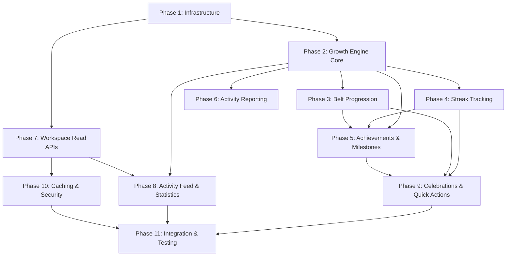

# Implementation Plan: Father Workspace Backend

## Overview

Implementation of the Father Workspace Backend (SPEC-008) for the Dad Coach application. This subsystem powers the father's post-login experience with two architectural concerns: (1) Read Aggregation Layer — stateless facades composing data from existing domain services into read-optimized API responses, and (2) Growth System (Command Layer) — a new bounded context owning gamification/progression state: growth signals, belts, achievements, streaks, celebrations, and activity reporting.

**Architecture:** CQRS-Lite with event-driven growth signal processing within the Spring Boot monolith. Read services own NO domain state. Command services own their own tables.

**MVP Phases:** 1-7, 10 (infrastructure, growth engine, belt/streak/achievements, activity reporting, workspace read APIs, caching/security)
**Future Phases:** 8, 9, 11 (activity feed, statistics, celebrations, quick actions, full integration tests)

## Phase Dependencies



## Tasks

- [x] 1. Phase 1: Infrastructure — Database Migrations & Foundation *[MVP]*
  - [x] 1.1 Create `V8.001__create_growth_signals.sql` — growth_signals table with UUID PK, father_id FK, signal_type, points_awarded (CHECK > 0), source_entity_id, source_entity_type, scoring_policy_version, created_at. Add unique constraint on (father_id, signal_type, source_entity_id) for dedup. Add indexes on father_id, (father_id, created_at DESC), (father_id, signal_type).
    - _Requirements: 11.3, 11.6, 23.7_
  - [x] 1.2 Create `V8.002__create_father_belts.sql` — father_belts table with UUID PK, father_id (UNIQUE FK), belt_level (CHECK constraint for valid levels), current_score (cached read-model), belt_earned_at, timestamps. Default belt_level='WHITE', current_score=0.
    - _Requirements: 10.1, 10.2_
  - [x] 1.3 Create `V8.003__create_father_streaks.sql` — father_streaks table with UUID PK, father_id (UNIQUE FK), current_streak_days, longest_streak_days, streak_start_date, last_qualifying_date, timezone, updated_at. CHECK constraints for non-negative streaks and longest >= current.
    - _Requirements: 12.1, 12.6_
  - [x] 1.4 Create `V8.004__create_achievements.sql` — achievements definition table (achievement_id, name UNIQUE, description, category CHECK, criteria_json JSONB, criteria_version, icon_key, sort_order) and father_achievements join table (id, father_id FK, achievement_id FK, earned_at, UNIQUE(father_id, achievement_id)).
    - _Requirements: 13.1, 13.4_
  - [x] 1.5 Create `V8.005__create_milestones.sql` — milestones definition table and father_milestones join table with same pattern as achievements.
    - _Requirements: 13.7, 13.8_
  - [x] 1.6 Create `V8.006__create_celebration_events.sql` — celebration_events table with event_type CHECK, displayed boolean, indexes on (father_id WHERE displayed=FALSE) and (father_id, created_at DESC).
    - _Requirements: 14.2_
  - [x] 1.7 Create `V8.007__create_activity_reports.sql` — activity_reports table with report_type CHECK, activity_type CHECK, duration CHECK (15-480), unique constraint on (father_id, child_id, duration_minutes, activity_date) for dedup.
    - _Requirements: 25.1, 25.7_
  - [x] 1.8 Create `V8.008__create_activity_feed_items.sql` — activity_feed_items table with event_type, metadata JSONB, expires_at (default NOW()+90 days), indexes on (father_id, event_timestamp DESC) and (expires_at).
    - _Requirements: 6.3, 6.5_
  - [x] 1.9 Create `V8.009__create_statistics_aggregates.sql` — statistics_aggregates table with period_type CHECK, unique constraint on (father_id, period_type, period_start).
    - _Requirements: 8.1, 8.2_
  - [x] 1.10 Create `V8.010__seed_achievements.sql` — INSERT 15 predefined achievements (First Steps, Mission Master 10/50/100, Week Warrior, Month Champion, Quarter Legend, Goal Getter, Goal Crusher, Deep Talker, Connection King, Rising Star, Green Machine, Elite Father, Grandmaster).
    - _Requirements: 13.3_
  - [x] 1.11 Create `V8.011__seed_milestones.sql` — INSERT milestones for mission count thresholds (25, 50, 100, 250, 500) and account age markers (30, 90, 180, 365 days).
    - _Requirements: 13.7_
  - [x] 1.12 Create shared foundation classes: `WorkspaceDomainEvent` base class, `WorkspaceExceptionHandler` (@ControllerAdvice), error codes enum, and DTO base classes (PartialResponse wrapper).
    - _Requirements: 19.1, 19.3_
  - [x] 1.13 Verify all migrations run successfully against PostgreSQL using Flyway and confirm FK ordering with existing SPEC-002/SPEC-006/SPEC-007 tables.
    - _Requirements: 24.3_

- [x] 2. Phase 2: Growth Engine Core — Signal Processing *[MVP]*
  - [x] 2.1 Create `GrowthSignalType` enum with all signal types: MISSION_COMPLETED, MISSION_REFLECTED, GOAL_PROGRESS, GOAL_COMPLETED, MEANINGFUL_CONVERSATION, DAILY_ENGAGEMENT, STREAK_BONUS_7/14/21/30/60/90/180/365, QUALITY_TIME_REPORTED, POSITIVE_ACTIVITY.
    - _Requirements: 11.2_
  - [x] 2.2 Create `SignalWeight` configuration class mapping each GrowthSignalType to its point value (10, 5, 15, 50, 8, 3, 20, 30, 40, 50, 75, 100, 150, 300, 12, 5).
    - _Requirements: 11.2_
  - [x] 2.3 Create `GrowthSignal` JPA entity mapping to growth_signals table with all fields. Mark entity as immutable (no setters, created via builder/constructor only).
    - _Requirements: 11.3, 11.4_
  - [x] 2.4 Create `GrowthSignalRepository` (Spring Data JPA) with: findByFatherIdOrderByCreatedAtDesc, countByFatherIdAndSignalType, sumPointsByFatherId, findByFatherIdAndCreatedAtBetween, existsByFatherIdAndSignalTypeAndSourceEntityId (for dedup).
    - _Requirements: 11.4, 11.6_
  - [x] 2.5 Create `ScoringPolicyVersion` constants class (current version = 1) and `GrowthSignalService` implementing: recordSignal (with duplicate detection via unique constraint), isDuplicate, getRecentSignals, getScoreBreakdown, getTotalScore, getSignalsInPeriod.
    - _Requirements: 11.4, 11.5, 11.6, 23.7_
  - [x] 2.6 Create `GrowthScoreService` implementing: getTotalScore (reads cached score from father_belts.current_score), rebuildScore (SUM from growth_signals), incrementScore (update cached score atomically after signal recording).
    - _Requirements: 11.4, 11.7_
  - [x] 2.7 Create domain event classes: `GrowthSignalRecordedEvent`, `QualityTimeReportedEvent`, `PositiveActivityReportedEvent` extending `WorkspaceDomainEvent`.
    - _Requirements: 23.1_
  - [x] 2.8 Create `GrowthSignalProcessor` (@EventListener) implementing: onMissionCompleted, onMissionReflected, onGoalProgress (only if ≥10% increase), onGoalCompleted, onConversationCompleted (only if quality rating > 0.6 and > 5 exchanges), onQualityTimeReported, onPositiveActivityReported. Each handler: check duplicate → record signal → update cached score → publish GrowthSignalRecordedEvent.
    - _Requirements: 23.1, 23.2, 11.2_
  - [x] 2.9 Create `DomainEventListener` that subscribes to external domain events (MissionCompletedEvent, MissionReflectedEvent, GoalProgressEvent, GoalCompletedEvent, ConversationCompletedEvent from other specs) and delegates to GrowthSignalProcessor.
    - _Requirements: 23.1, 23.3_
  - [ ]* 2.10 Write property test for Growth Score Monotonicity (Property 1) — verify score never decreases when valid signals are recorded, using random signal sequences.
    - **Property 1: Growth Score Monotonicity**
    - **Validates: Requirements 11.1, 11.4**
  - [ ]* 2.11 Write property test for Signal Duplicate Idempotency (Property 2) — verify recording same signal N times produces same score as recording once.
    - **Property 2: Signal Duplicate Idempotency**
    - **Validates: Requirements 11.6, 23.2**
  - [ ]* 2.12 Write unit tests for GrowthSignalService — signal recording, duplicate detection, score breakdown calculation, policy versioning.
    - _Requirements: 11.4, 11.5, 11.6, 24.1_

- [x] 3. Phase 3: Belt Progression *[MVP]*
  - [x] 3.1 Create `BeltLevel` enum with ordered constants: WHITE, YELLOW, ORANGE, GREEN, BLUE, PURPLE, BROWN, BLACK. Include isHigherThan(BeltLevel) method.
    - _Requirements: 10.1_
  - [x] 3.2 Create `BeltThreshold` configuration class mapping each BeltLevel to its min/max score thresholds (WHITE 0-99, YELLOW 100-249, ORANGE 250-449, GREEN 450-699, BLUE 700-899, PURPLE 900-1049, BROWN 1050-1199, BLACK 1200+). Include static method beltForScore(int score).
    - _Requirements: 10.2_
  - [x] 3.3 Create `FatherBelt` JPA entity mapping to father_belts table with fields: belt_id, father_id, belt_level (BeltLevel enum), current_score, belt_earned_at, timestamps.
    - _Requirements: 10.2_
  - [x] 3.4 Create `FatherBeltRepository` (Spring Data JPA) with: findByFatherId, existsByFatherId.
    - _Requirements: 10.5_
  - [x] 3.5 Create `BeltProgressionService` implementing: getCurrentBelt, getProgression (current belt, score, next belt, points remaining, progress %), evaluatePromotion (check if current score crosses next belt threshold), promoteBelt (update belt_level, set belt_earned_at, emit BeltLevelUpEvent). Enforce monotonicity — never downgrade belt.
    - _Requirements: 10.3, 10.4, 10.5_
  - [x] 3.6 Create `BeltLevelUpEvent` domain event and integrate with GrowthSignalProcessor — after each signal recording, call evaluatePromotion.
    - _Requirements: 10.3_
  - [x] 3.7 Create `BeltProgressionResponse` DTO with: current_belt, current_score, next_belt, points_to_next_belt, progress_percentage_to_next_belt, belt_earned_at.
    - _Requirements: 10.5_
  - [ ]* 3.8 Write property test for Belt Progression Monotonicity (Property 3) — verify belt level never regresses regardless of signal sequence.
    - **Property 3: Belt Progression Monotonicity**
    - **Validates: Requirements 10.3, 10.4**
  - [ ]* 3.9 Write property test for Belt-Score Threshold Consistency (Property 4) — verify exactly one belt assigned for any non-negative score and correct transitions at thresholds.
    - **Property 4: Belt-Score Threshold Consistency**
    - **Validates: Requirements 10.2, 10.3**
  - [ ]* 3.10 Write unit tests for BeltProgressionService — threshold edge cases (99→100, 449→450, 1199→1200), monotonicity enforcement, BLACK belt (no next belt).
    - _Requirements: 10.2, 10.3, 10.4, 24.1_

- [x] 4. Checkpoint — Ensure all tests pass for Phases 1-3
  - Ensure all tests pass, ask the user if questions arise.

- [x] 5. Phase 4: Streak Tracking *[MVP]*
  - [x] 5.1 Create `FatherStreak` JPA entity mapping to father_streaks table with fields: streak_id, father_id, current_streak_days, longest_streak_days, streak_start_date, last_qualifying_date, timezone, updated_at.
    - _Requirements: 12.1_
  - [x] 5.2 Create `FatherStreakRepository` (Spring Data JPA) with: findByFatherId, findStreaksNotUpdatedSince(LocalDate) (for reset detection).
    - _Requirements: 12.1, 12.5_
  - [x] 5.3 Create `StreakService` implementing: getStreak, getStreakResponse, recordQualifyingInteraction (timezone-aware day calculation, increment streak or start new one, update longest if applicable), resetExpiredStreaks (called by scheduled job — check all streaks where last_qualifying_date < yesterday in father's timezone), isStreakAtRisk (true if no interaction today and past 18:00 in father's timezone).
    - _Requirements: 12.1, 12.2, 12.3, 12.5_
  - [x] 5.4 Define qualifying interactions for streak: mission completed/reflected, coaching conversation with ≥3 exchanges, quality time reported, positive activity logged.
    - _Requirements: 12.2_
  - [x] 5.5 Integrate StreakService with GrowthSignalProcessor — after recording signals for qualifying events, call recordQualifyingInteraction. On streak milestones (7, 14, 21, 30, 60, 90, 180, 365), emit StreakMilestoneEvent and record corresponding STREAK_BONUS signal.
    - _Requirements: 12.4_
  - [x] 5.6 Create `StreakResponse` DTO with: current_streak_days, longest_streak_days, streak_start_date, last_qualifying_interaction_date, streak_at_risk.
    - _Requirements: 12.3_
  - [x] 5.7 Create `@Scheduled` streak reset job running daily at 00:30 UTC — finds and resets expired streaks for each timezone.
    - _Requirements: 12.5_
  - [ ]* 5.8 Write property test for Streak Calculation Correctness (Property 5) — verify streak equals longest consecutive calendar-day run ending at most recent interaction, with timezone awareness.
    - **Property 5: Streak Calculation Correctness**
    - **Validates: Requirements 12.1, 12.5**
  - [ ]* 5.9 Write property test for Longest Streak Invariant (Property 6) — verify longest_streak_days >= current_streak_days at all times.
    - **Property 6: Longest Streak Invariant**
    - **Validates: Requirements 12.6**
  - [ ]* 5.10 Write property test for Streak Milestone Uniqueness (Property 7) — verify exactly one celebration event and one bonus signal per milestone per streak.
    - **Property 7: Streak Milestone Uniqueness**
    - **Validates: Requirements 12.4**
  - [ ]* 5.11 Write unit tests for StreakService — timezone day boundary handling, streak reset logic, streak_at_risk calculation, milestone detection.
    - _Requirements: 12.1, 12.3, 12.5, 24.1_

- [x] 6. Phase 5: Achievements & Milestones *[MVP]*
  - [x] 6.1 Create `AchievementCategory` enum: MISSIONS, CONSISTENCY, GROWTH, CONVERSATIONS, GOALS, SPECIAL.
    - _Requirements: 13.2_
  - [x] 6.2 Create `Achievement` JPA entity (definition table) with: achievement_id, name, description, category, criteria_json (JSONB), criteria_version, icon_key, sort_order.
    - _Requirements: 13.1_
  - [x] 6.3 Create `FatherAchievement` JPA entity (earned record) with: id, father_id, achievement_id, earned_at. Unique constraint on (father_id, achievement_id).
    - _Requirements: 13.4_
  - [x] 6.4 Create `AchievementRepository` and `FatherAchievementRepository` with: findAllByCategory, findByFatherId, countByFatherId, existsByFatherIdAndAchievementId.
    - _Requirements: 13.6_
  - [x] 6.5 Create `AchievementCriteria` sealed interface with implementations for each criteria type: MissionCountCriteria, StreakDaysCriteria, GoalCountCriteria, ConversationCountCriteria, BeltReachedCriteria. Each provides an `isMet(UUID fatherId)` method.
    - _Requirements: 13.1, 13.3_
  - [x] 6.6 Create `AchievementEvaluator` service implementing: evaluateAll (check all unearned achievements, award any whose criteria are met), getAchievements (return all with earned_at or null), getNextAchievable (closest unearned achievement with progress). Award is idempotent — UNIQUE constraint prevents duplicates.
    - _Requirements: 13.4, 13.5, 13.6_
  - [x] 6.7 Create `Milestone` and `FatherMilestone` JPA entities, `MilestoneRepository` and `FatherMilestoneRepository`, and `MilestoneEvaluator` service with same pattern as achievements. Milestones: mission count (25, 50, 100, 250, 500) and account age (30, 90, 180, 365 days).
    - _Requirements: 13.7, 13.8_
  - [x] 6.8 Create `AchievementEarnedEvent` and `MilestoneReachedEvent` domain events. Integrate AchievementEvaluator and MilestoneEvaluator into GrowthSignalProcessor — after each signal, evaluate both.
    - _Requirements: 13.4, 13.8_
  - [x] 6.9 Create `AchievementsResponse` DTO with: total_available, total_earned, achievements list (each with earned_at or null), next_achievable.
    - _Requirements: 13.6_
  - [ ]* 6.10 Write property test for Achievement Permanence (Property 8) — verify earned achievements remain earned permanently regardless of subsequent state changes.
    - **Property 8: Achievement Permanence**
    - **Validates: Requirements 13.4, 13.5**
  - [ ]* 6.11 Write unit tests for AchievementEvaluator — each criteria type individually, idempotent award, next_achievable calculation.
    - _Requirements: 13.1, 13.3, 13.6, 24.1_

- [x] 7. Phase 6: Activity Reporting *[MVP]*
  - [x] 7.1 Create `ActivityType` enum: PRAISE, SHARED_ACTIVITY, TEACHING_MOMENT, QUALITY_CONVERSATION, OTHER.
    - _Requirements: 25.2_
  - [x] 7.2 Create `ActivityReport` JPA entity mapping to activity_reports table with: report_id, father_id, child_id (nullable), report_type, duration_minutes (nullable), activity_type (nullable), description (nullable), activity_date, created_at.
    - _Requirements: 25.1, 25.2_
  - [x] 7.3 Create `ActivityReportRepository` with: findByFatherIdAndActivityDate, countByFatherIdAndReportTypeAndActivityDate (for rate limiting), existsByFatherIdAndChildIdAndDurationMinutesAndActivityDate (for dedup).
    - _Requirements: 25.5, 25.7_
  - [x] 7.4 Create `ActivityReportValidator` implementing validation rules: child belongs to father, duration 15-480 minutes, activity_date not future and not > 7 days past, activity_type valid enum.
    - _Requirements: 25.1, 25.2, 25.6_
  - [x] 7.5 Create `ActivityReportRateLimiter` enforcing: max 10 quality time reports/day, max 20 positive activity reports/day per father. Return 429 when exceeded.
    - _Requirements: 25.5_
  - [x] 7.6 Create `ActivityReportingService` implementing: reportQualityTime (validate → check duplicate → check rate limit → persist → emit QualityTimeReportedEvent), reportPositiveActivity (same flow with PositiveActivityReportedEvent), isDuplicateQualityTime.
    - _Requirements: 25.1, 25.2, 25.3, 25.4, 25.7_
  - [x] 7.7 Create `QualityTimeRequest` and `PositiveActivityRequest` DTOs with Jakarta Bean Validation annotations. Create `ActivityReportResponse` DTO with: report_id, report_type, child_id, activity_date, points_awarded.
    - _Requirements: 25.1, 25.2_
  - [x] 7.8 Create `ActivityReportingController` with POST endpoints: `/api/v1/workspace/activities/quality-time` and `/api/v1/workspace/activities/positive-activity`. Extract fatherId from auth token, enforce ownership, delegate to service.
    - _Requirements: 25.1, 25.2_
  - [ ]* 7.9 Write property test for Activity Report Validation (Property 14) — verify acceptance/rejection rules for duration, date range, child ownership.
    - **Property 14: Activity Report Validation**
    - **Validates: Requirements 25.1, 25.2**
  - [ ]* 7.10 Write property test for Activity Report Rate Limiting (Property 15) — verify (N+1)th report rejected with 429 when daily limit exceeded.
    - **Property 15: Activity Report Rate Limiting**
    - **Validates: Requirements 25.5**
  - [ ]* 7.11 Write property test for Quality Time Duplicate Prevention (Property 16) — verify second submission of same tuple rejected, first generates exactly one signal.
    - **Property 16: Quality Time Duplicate Prevention**
    - **Validates: Requirements 25.7**
  - [ ]* 7.12 Write unit tests for ActivityReportingService — validation rules, duplicate detection, rate limit enforcement, event emission.
    - _Requirements: 25.1, 25.5, 25.7, 24.1_

- [x] 8. Checkpoint — Ensure all tests pass for Phases 4-6
  - Ensure all tests pass, ask the user if questions arise.

- [x] 9. Phase 7: Workspace Read APIs (Aggregation Layer) *[MVP]*
  - [x] 9.1 Create `WorkspaceSummaryService` implementing getSummary: parallel fetch from FatherService, GrowthScoreService, BeltProgressionService, StreakService, NotificationsSummaryService. Implement partial degradation — catch exceptions per source, build PartialResponse with degraded_sections list.
    - _Requirements: 1.1, 1.2, 1.5_
  - [x] 9.2 Create `WorkspaceSummaryResponse` DTO and `WorkspaceController` with GET `/api/v1/workspace/summary`. Return 200 with response_status "complete" or "partial".
    - _Requirements: 1.1, 1.5, 19.3_
  - [x] 9.3 Create `ProfileReadService` implementing getProfile: read Father entity, compute days_since_activation, mask phone number. Create `ProfileResponse` DTO and `ProfileController` with GET `/api/v1/workspace/profile`.
    - _Requirements: 2.1, 2.2_
  - [x] 9.4 Create `ChildrenOverviewService` implementing: getChildrenOverview (aggregate children with mission counts, recent mission, interests), getChildSummary (detailed child view with goals, mission history, upcoming birthday indicator within 7 days). Compute age dynamically from birth_date.
    - _Requirements: 3.1, 3.2, 3.3_
  - [x] 9.5 Create `ChildrenOverviewResponse`, `ChildSummaryResponse` DTOs and `ChildrenOverviewController` with GET `/api/v1/workspace/children` and GET `/api/v1/workspace/children/{childId}/summary`. Enforce ownership — return 404 for other father's children.
    - _Requirements: 3.1, 3.2, 3.5_
  - [x] 9.6 Create `GoalsOverviewService` implementing: getGoalsOverview (aggregate goals with progress calculation), getGoalProgress (detailed goal view). Calculate progress_percentage = min(completed/estimated * 100, 100), default estimated=10 if unavailable. Support filtering by status, category, child_id.
    - _Requirements: 4.1, 4.2, 4.3, 4.4_
  - [x] 9.7 Create `GoalsOverviewResponse`, `GoalProgressResponse` DTOs and `GoalsOverviewController` with GET `/api/v1/workspace/goals` (with query params: status, category, child_id) and GET `/api/v1/workspace/goals/{goalId}/progress`.
    - _Requirements: 4.1, 4.2, 4.4_
  - [x] 9.8 Create `MissionsOverviewService` implementing getActiveMissions: query missions with status IN (ASSIGNED, ACCEPTED, IN_PROGRESS). Create `ActiveMissionsResponse` DTO and `MissionsController` with GET `/api/v1/workspace/missions/active`.
    - _Requirements: 5.1, 5.4_
  - [x] 9.9 Create `ConversationsOverviewService` implementing getRecentConversations: query recent conversations (default 10, max 50). Exclude system prompts, AI telemetry, internal metadata. Create `RecentConversationsResponse` DTO and `ConversationsController` with GET `/api/v1/workspace/conversations?limit=10`.
    - _Requirements: 5.2, 5.3, 5.5_
  - [x] 9.10 Create `NotificationsSummaryService` implementing: getSummary (unread_count, total 30-day count, paginated list), markAsRead (list of IDs), markAllRead. Create `NotificationsSummaryResponse` DTO and `NotificationsController` with GET `/api/v1/workspace/notifications`, POST `/api/v1/workspace/notifications/mark-read`, POST `/api/v1/workspace/notifications/mark-all-read`.
    - _Requirements: 7.1, 7.2, 7.3, 7.4_
  - [x] 9.11 Create `GrowthController` with GET endpoints: `/api/v1/workspace/growth/belt` (belt progression), `/api/v1/workspace/growth/score` (score breakdown), `/api/v1/workspace/growth/streak` (streak data), `/api/v1/workspace/growth/achievements` (achievements list). Wire to existing growth services.
    - _Requirements: 10.5, 11.7, 12.3, 13.6_
  - [ ]* 9.12 Write property test for Goal Progress Calculation (Property 9) — verify progress formula correctness for various mission count / estimate combinations.
    - **Property 9: Goal Progress Calculation**
    - **Validates: Requirements 4.3**
  - [ ]* 9.13 Write property test for Active Mission Filter Correctness (Property 10) — verify exactly missions with status in {ASSIGNED, ACCEPTED, IN_PROGRESS} returned.
    - **Property 10: Active Mission Filter Correctness**
    - **Validates: Requirements 5.1**
  - [ ]* 9.14 Write property test for Partial Degradation Correctness (Property 13) — verify response contains available data + null for unavailable + correct degraded_sections.
    - **Property 13: Partial Degradation Correctness**
    - **Validates: Requirements 1.5, 19.3**
  - [ ]* 9.15 Write property test for Goal Filter Correctness (Property 18) — verify all returned goals match every applied filter criterion.
    - **Property 18: Goal Filter Correctness**
    - **Validates: Requirements 4.4**
  - [ ]* 9.16 Write unit tests for WorkspaceSummaryService — parallel fetch composition, degradation handling, timeout behavior. Write unit tests for GoalsOverviewService — progress calculation edge cases.
    - _Requirements: 1.1, 1.5, 4.3, 24.1_

- [x] 10. Checkpoint — Ensure all tests pass for Phase 7
  - Ensure all tests pass, ask the user if questions arise.

- [x] 11. Phase 8: Activity Feed & Statistics *[FUTURE]*
  - [x] 11.1 Create `ActivityFeedEventType` enum with all event types: MISSION_ASSIGNED, MISSION_COMPLETED, GOAL_CREATED, GOAL_PROGRESS_UPDATE, CONVERSATION_COMPLETED, ACHIEVEMENT_EARNED, MILESTONE_REACHED, BELT_LEVEL_UP, STREAK_MILESTONE, CHILD_BIRTHDAY.
    - _Requirements: 6.2_
  - [x] 11.2 Create `ActivityFeedItem` JPA entity mapping to activity_feed_items table. Create `ActivityFeedRepository` with: findByFatherIdAndEventTimestampBefore (cursor-based pagination), deleteByExpiresAtBefore (purge job).
    - _Requirements: 6.3, 6.5_
  - [x] 11.3 Create `ActivityFeedService` implementing: recordFeedItem (write from domain events), getFeed (cursor-based pagination, default 20, max 50), purgeExpiredItems (90-day retention). Integrate with GrowthSignalProcessor and DomainEventListener to write feed items on events.
    - _Requirements: 6.1, 6.4, 6.5_
  - [x] 11.4 Create `ActivityFeedResponse` DTO and `ActivityFeedController` with GET `/api/v1/workspace/activity-feed?cursor={cursor}&page_size=20`.
    - _Requirements: 6.1, 6.4, 6.6_
  - [x] 11.5 Create `StatisticsPeriodType` enum: DAILY, WEEKLY, MONTHLY. Create `StatisticsAggregate` JPA entity and `StatisticsAggregateRepository`.
    - _Requirements: 8.1, 8.2_
  - [x] 11.6 Create `StatisticsAggregationJob` (@Scheduled at 02:00 UTC nightly) computing daily, weekly, monthly aggregates from raw events. Store as JSONB in statistics_aggregates table.
    - _Requirements: 8.4_
  - [x] 11.7 Create `StatisticsService` implementing: getWeeklyStatistics (return pre-computed or compute on-demand for current week), getMonthlyStatistics, getMetricsDashboard (engagement + quality time + completion metrics).
    - _Requirements: 8.1, 8.2, 8.3, 15.4_
  - [x] 11.8 Create `WeeklyStatisticsResponse`, `MonthlyStatisticsResponse`, `MetricsDashboardResponse` DTOs and `StatisticsController` with GET endpoints: `/api/v1/workspace/statistics/weekly`, `/api/v1/workspace/statistics/monthly`, `/api/v1/workspace/metrics`.
    - _Requirements: 8.1, 8.2, 15.4_
  - [x] 11.9 Create `@Scheduled` feed purge job (daily at 03:00 UTC) deleting activity_feed_items where expires_at < now.
    - _Requirements: 6.5_
  - [ ]* 11.10 Write unit tests for ActivityFeedService and StatisticsService — pagination, aggregation, purge logic.
    - _Requirements: 6.4, 8.4, 24.1_

- [ ] 12. Phase 9: Celebrations & Quick Actions *[FUTURE]*
  - [~] 12.1 Create `CelebrationEventType` enum: BELT_LEVEL_UP, ACHIEVEMENT_EARNED, MILESTONE_REACHED, STREAK_MILESTONE.
    - _Requirements: 14.2_
  - [~] 12.2 Create `CelebrationEvent` JPA entity mapping to celebration_events table. Create `CelebrationEventRepository` with: findByFatherIdAndDisplayedFalse, findByFatherIdAndCreatedAtAfter.
    - _Requirements: 14.2_
  - [~] 12.3 Create `CelebrationEventService` implementing: createCelebration (persist event, generate encouragement metadata via Intelligence Layer async), getUndisplayed (return events where displayed=false), markDisplayed (update displayed flag for given event IDs). Integrate with BeltProgressionService, AchievementEvaluator, MilestoneEvaluator, and StreakService.
    - _Requirements: 14.2, 14.3, 14.4_
  - [~] 12.4 Create `CelebrationEventsResponse` DTO and `CelebrationController` with GET `/api/v1/workspace/growth/celebrations?undisplayed_only=true` and POST `/api/v1/workspace/growth/celebrations/mark-displayed`.
    - _Requirements: 14.2, 14.3_
  - [~] 12.5 Create `QuickActionsService` implementing getQuickActions: compute up to 5 contextual suggestions based on current state signals (active mission, unread notifications, streak at risk, goal nearing completion, new achievement). Priority-ordered, computed on-demand (no caching).
    - _Requirements: 9.1, 9.2, 9.3, 9.4, 9.5_
  - [~] 12.6 Create `QuickActionsResponse` DTO and add GET `/api/v1/workspace/quick-actions` endpoint to WorkspaceController.
    - _Requirements: 9.4, 9.6_
  - [ ]* 12.7 Write unit tests for CelebrationEventService and QuickActionsService — priority ordering, max 5 actions, encouragement metadata generation.
    - _Requirements: 14.2, 9.4, 24.1_

- [ ] 13. Phase 10: Caching, Performance & Security *[MVP]*
  - [~] 13.1 Create `CacheKeyBuilder` utility generating keys in format `workspace:{father_id}:{data_type}`. Create `WorkspaceCacheService` implementing: get, put (with TTL), invalidate (single key), invalidateAll (all keys for a father), isAvailable.
    - _Requirements: 17.2, 17.5_
  - [~] 13.2 Implement cache stampede protection using in-process ReentrantLock per cache key — first request populates, others wait (2s timeout, fallback to source on timeout).
    - _Requirements: 17.4_
  - [~] 13.3 Create `CacheInvalidationListener` (@EventListener) mapping domain events to cache key invalidation: MissionCompletedEvent → [summary, active_missions, goals, weekly_stats], ChildUpdatedEvent → [children, summary], NotificationReceivedEvent → [notifications, summary], GrowthSignalRecordedEvent → [belt, streak, summary, metrics], AchievementEarnedEvent → [achievements], FatherProfileUpdatedEvent → [profile, summary], StreakResetEvent → [streak, summary].
    - _Requirements: 17.1, 17.3_
  - [~] 13.4 Integrate caching into all read services: add @Cacheable with configured TTLs per data type (summary 60s, children/goals/conversations 120s, notifications 30s, belt 300s, achievements 600s, weekly stats 300s, monthly stats 3600s). Use Caffeine in-process cache.
    - _Requirements: 17.1_
  - [~] 13.5 Create `WorkspaceOwnershipEnforcer` service implementing ownership checks at the service layer: verifyFatherOwnership(authenticatedFatherId, targetFatherId), verifyChildBelongsToFather(fatherId, childId). Return 404 (not 403) for cross-father access to prevent enumeration.
    - _Requirements: 16.1, 16.4_
  - [~] 13.6 Create `WorkspaceRateLimiter` implementing per-father rate limits: 60 requests/minute for FATHER, 300/minute for ADMIN, 1000/minute for SERVICE. Return 429 when exceeded.
    - _Requirements: 18.3_
  - [~] 13.7 Add ETag support for frequently-polled endpoints (workspace summary, notifications count). Generate ETag from response hash, return 304 Not Modified when If-None-Match matches.
    - _Requirements: 18.5_
  - [~] 13.8 Add audit logging for all workspace access: log actor_type, actor_id, endpoint, target_father_id, timestamp, result. Log Growth System mutations: signal_recorded, achievement_earned, belt_level_up. Exclude sensitive data from logs.
    - _Requirements: 22.1, 22.2, 22.4, 2.4_
  - [~] 13.9 Add request body size limit (256 KB) and response payload size limit (5 MB) with pagination enforcement.
    - _Requirements: 18.2, 18.4_
  - [ ]* 13.10 Write property test for Resource Ownership Isolation (Property 11) — verify cross-father access returns 404, no data leakage.
    - **Property 11: Resource Ownership Isolation**
    - **Validates: Requirements 16.1, 3.5, 25.6**
  - [ ]* 13.11 Write property test for Cache Invalidation Correctness (Property 12) — verify domain events trigger correct cache key invalidation.
    - **Property 12: Cache Invalidation Correctness**
    - **Validates: Requirements 1.4, 17.3**
  - [ ]* 13.12 Write unit tests for WorkspaceCacheService (stampede protection, TTL enforcement), WorkspaceOwnershipEnforcer (isolation), WorkspaceRateLimiter (limit enforcement).
    - _Requirements: 17.4, 16.1, 18.3, 24.1_

- [~] 14. Checkpoint — Ensure all tests pass for Phases 8-10
  - Ensure all tests pass, ask the user if questions arise.

- [ ] 15. Phase 11: Integration & Testing *[MVP core, FUTURE full suite]*
  - [~] 15.1 Create integration test for full Growth Signal processing pipeline: publish MissionCompletedEvent → verify signal recorded → score updated → belt evaluated → achievement checked → feed item created → cache invalidated. Use Testcontainers (PostgreSQL).
    - _Requirements: 23.1, 23.3, 24.3_
  - [~] 15.2 Create integration test for Activity Reporting end-to-end: POST quality time → verify validation → signal recorded → score updated → response contains points_awarded.
    - _Requirements: 25.1, 25.3, 24.3_
  - [~] 15.3 Create integration test for Workspace Summary with partial degradation: mock one downstream service unavailable → verify partial response with degraded_sections populated.
    - _Requirements: 1.5, 19.3, 24.3_
  - [~] 15.4 Create integration test for cross-father access rejection: father A requests father B's data → verify 404 returned at API layer for all workspace endpoints.
    - _Requirements: 16.1, 24.3_
  - [~] 15.5 Create integration test for Belt Progression end-to-end: record signals until score crosses threshold → verify belt promoted → celebration event created.
    - _Requirements: 10.3, 24.3_
  - [~] 15.6 Create integration test for Streak lifecycle: record qualifying interactions across days → verify streak incremented → miss a day → verify streak reset → verify longest_streak preserved.
    - _Requirements: 12.1, 12.5, 12.6, 24.3_
  - [ ]* 15.7 Write property test for Scoring Policy Immutability (Property 17) — verify existing signal points unchanged when policy version changes.
    - **Property 17: Scoring Policy Immutability**
    - **Validates: Requirements 23.7**
  - [ ]* 15.8 Create performance test verifying: workspace summary < 300ms (p95), active missions < 200ms, belt progression < 200ms, with 100 concurrent fathers.
    - _Requirements: 18.1, 24.5_
  - [ ]* 15.9 Create OpenAPI contract tests verifying all endpoint responses match published specification schemas.
    - _Requirements: 20.3, 20.4, 24.4_
  - [ ]* 15.10 Create integration test for rate limiting enforcement: exceed 60 requests/minute → verify 429 returned. Exceed daily activity report limits → verify 429.
    - _Requirements: 18.3, 25.5, 24.3_

- [~] 16. Final Checkpoint — Ensure all tests pass
  - Ensure all tests pass, ask the user if questions arise.

## Notes

- Tasks marked with `*` are optional and can be skipped for faster MVP
- Each task references specific requirements for traceability
- Checkpoints ensure incremental validation between phases
- Property tests validate universal correctness properties defined in the design document (jqwik framework)
- Unit tests validate specific examples and edge cases
- The project uses Java 21 with Spring Boot, JPA/Hibernate, PostgreSQL, and Caffeine cache
- Domain events use Spring ApplicationEvent (in-process, synchronous within transaction boundaries)
- All workspace endpoints are prefixed with `/api/v1/workspace`
- The Growth System's signal store is append-only and immutable
- Phases 8, 9, and parts of 11 are marked FUTURE and can be deferred without architectural impact

## Task Dependency Graph

```json
{
  "waves": [
    { "id": 0, "tasks": ["1.1", "1.2", "1.3", "1.4", "1.5", "1.6", "1.7", "1.8", "1.9", "1.10", "1.11", "1.12"] },
    { "id": 1, "tasks": ["1.13"] },
    { "id": 2, "tasks": ["2.1", "2.2", "2.3"] },
    { "id": 3, "tasks": ["2.4", "2.5", "2.6", "2.7"] },
    { "id": 4, "tasks": ["2.8", "2.9"] },
    { "id": 5, "tasks": ["2.10", "2.11", "2.12", "3.1", "3.2"] },
    { "id": 6, "tasks": ["3.3", "3.4", "3.5", "3.6", "3.7"] },
    { "id": 7, "tasks": ["3.8", "3.9", "3.10", "5.1", "5.2"] },
    { "id": 8, "tasks": ["5.3", "5.4", "5.5", "5.6"] },
    { "id": 9, "tasks": ["5.7", "5.8", "5.9", "5.10", "5.11"] },
    { "id": 10, "tasks": ["6.1", "6.2", "6.3", "6.4"] },
    { "id": 11, "tasks": ["6.5", "6.6", "6.7"] },
    { "id": 12, "tasks": ["6.8", "6.9", "6.10", "6.11"] },
    { "id": 13, "tasks": ["7.1", "7.2", "7.3"] },
    { "id": 14, "tasks": ["7.4", "7.5", "7.6", "7.7"] },
    { "id": 15, "tasks": ["7.8", "7.9", "7.10", "7.11", "7.12"] },
    { "id": 16, "tasks": ["9.1", "9.2", "9.3", "9.4", "9.5"] },
    { "id": 17, "tasks": ["9.6", "9.7", "9.8", "9.9", "9.10", "9.11"] },
    { "id": 18, "tasks": ["9.12", "9.13", "9.14", "9.15", "9.16"] },
    { "id": 19, "tasks": ["11.1", "11.2", "12.1", "12.2"] },
    { "id": 20, "tasks": ["11.3", "11.4", "11.5", "11.6", "12.3", "12.4"] },
    { "id": 21, "tasks": ["11.7", "11.8", "11.9", "11.10", "12.5", "12.6", "12.7"] },
    { "id": 22, "tasks": ["13.1", "13.2"] },
    { "id": 23, "tasks": ["13.3", "13.4", "13.5", "13.6"] },
    { "id": 24, "tasks": ["13.7", "13.8", "13.9", "13.10", "13.11", "13.12"] },
    { "id": 25, "tasks": ["15.1", "15.2", "15.3", "15.4", "15.5", "15.6"] },
    { "id": 26, "tasks": ["15.7", "15.8", "15.9", "15.10"] }
  ]
}
```
