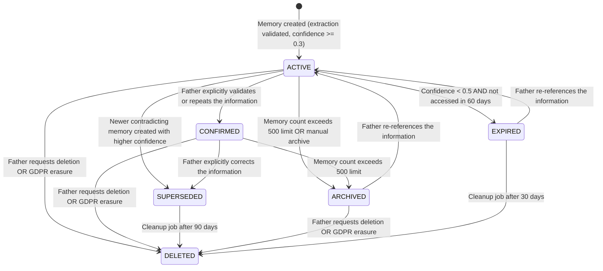

# Requirements Document

## Introduction

**SPEC-004: Memory & Knowledge System**

This specification defines the complete Memory & Knowledge System for the Dad Coach application. It is the product-level specification for how the system stores, manages, evolves, and governs long-term knowledge about each father and his family. While SPEC-002 (Requirement 7) defines the high-level memory rules and SPEC-003 defines how the AI injects memories into prompts, this specification (SPEC-004) defines the comprehensive lifecycle, data model, business rules, and governance of every memory entity in the system.

This document is the definitive memory product bible. Every memory category, lifecycle state, scoring formula, decay curve, conflict resolution rule, privacy boundary, and audit requirement is specified with concrete values. The scope is strictly product behavior — not AI prompt logic (SPEC-003) or infrastructure (SPEC-001).

**Boundary with domain entities:** The Memory_System stores unstructured contextual knowledge. It is NOT the source of truth for data already owned by domain entities (Father, Child, Goal, Mission, Habit). Structured domain facts (e.g., child birth_date, goal status, father phone number) are authoritative in their domain entity. Memories may reference or derive from domain data but never override it.

**AI decision boundary:** Consistent with SPEC-003 Requirement 14, all AI components in the memory pipeline (extraction models, summarization models, embedding generators) produce structured recommendations only. The deterministic application layer validates and executes all memory creation, category assignment, confidence/importance changes, state transitions, conflict resolution, consolidation, and deletion.

## Glossary

- **Memory_System**: The subsystem that stores, consolidates, retrieves, and expires contextual information about each father
- **Memory**: A stored piece of contextual information about a father, child, family, or interaction
- **Memory_Category**: The classification of a memory by its subject domain (IDENTITY, RELATIONSHIP, PREFERENCE, GOAL, CHALLENGE, MILESTONE, CONTEXT, CONVERSATION_SUMMARY, EVENT, HABIT, FAMILY)
- **Memory_Lifecycle**: The ordered sequence of states a memory passes through from creation to deletion
- **Importance_Score**: A numeric value (1-10) indicating how critical a memory is for coaching context
- **Confidence_Score**: A numeric value (0.0-1.0) indicating how certain the system is about a memory's accuracy
- **Memory_Tier**: Classification based on importance: Short-term (1-3), Medium-term (4-6), Long-term (7-10)
- **Decay_Rate**: The rate at which a memory's effective relevance decreases over time without confirmation
- **Confirmation**: An event that validates an existing memory, resetting its decay and boosting confidence
- **Supersession**: The act of replacing an older memory with a newer, corrected version
- **Consolidation**: The process of merging multiple related short-term memories into a single summary memory
- **Duplicate_Detection**: The process of identifying memories that contain semantically equivalent information
- **Memory_Conflict**: A state where two memories contain contradictory information about the same subject
- **Memory_Audit_Log**: An append-only record of all operations performed on memories
- **Memory_Version**: A snapshot of a memory's state before modification, preserved for history
- **Father**: A registered user of the platform, identified by WhatsApp phone number
- **Child**: A child registered under a Father's profile
- **Goal**: A long-term parenting objective defined by the father
- **Habit**: A recurring behavior the father wants to build
- **Coaching_Phase**: FOUNDATION (days 1-14), BUILDING (days 15-42), DEEPENING (days 43-84), MASTERY (day 85+)
- **Retrieval_Context**: The set of metadata and scores used when selecting memories for a coaching session
- **Access_Event**: A recorded instance of a memory being read or included in a coaching context
- **Extraction_Event**: The process of automatically identifying and storing new memories from conversation content
- **Memory_Owner**: The Father entity whose profile the memory belongs to
- **Memory_Subject**: The entity a memory is about (Father, Child, or Family)
- **Semantic_Similarity**: A cosine similarity score (0.0-1.0) between two memory embeddings indicating content overlap
- **Memory_Embedding**: A vector representation of a memory's content used for similarity search and relevance scoring
- **Quiet_Hours**: 21:00-07:00 father's local time
- **Domain_Entity**: An authoritative data record owned by a specific bounded context (Father, Child, Goal, Mission, Habit) — the single source of truth for structured facts
- **Prompt_Injection**: The act of a memory being included in the AI system prompt for a coaching session (the meaningful use event that affects lifecycle)
- **Sensitive_Memory**: A memory classified at HIGH sensitivity that is subject to additional retention, retrieval, and access restrictions

---

## Requirements

### Requirement 1: Memory Categories and Definitions

**User Story:** As a product owner, I want all memory categories precisely defined, so that every piece of stored knowledge has an unambiguous classification that drives retrieval and lifecycle behavior.

#### Acceptance Criteria

1. THE Memory_System SHALL classify every memory into exactly one of the following categories:

   | Category | Definition | Typical Subjects | Default Importance | Examples |
   |----------|-----------|-----------------|-------------------|----------|
   | IDENTITY | Factual biographical information about a person not captured by domain entity fields | Father, Child | 9-10 | Father's profession, school name, child's nickname, personality traits, physical descriptions |
   | RELATIONSHIP | Dynamics, quality, and patterns between father and child | Father-Child pair | 7-8 | "Lucas responds well to humor", "Sofía needs more one-on-one time" |
   | PREFERENCE | Likes, dislikes, interests, and aversions | Father, Child | 5-6 | "Lucas loves dinosaurs", "Father prefers morning missions" |
   | GOAL | Parenting objectives, aspirations, and progress markers | Father | 7-8 | "Wants to reduce screen time for Lucas", "Working on patience" |
   | CHALLENGE | Difficulties, obstacles, and pain points | Father, Child, Family | 6-7 | "Bedtime routine is a struggle", "Lucas has trouble sharing" |
   | MILESTONE | Achievements, breakthroughs, and significant moments | Father, Child | 8-9 | "First time Lucas said 'I love you' unprompted", "30-day streak" |
   | CONTEXT | Situational information about current circumstances | Father, Family | 3-4 | "Father is traveling for work this week", "School exams period" |
   | CONVERSATION_SUMMARY | Condensed record of a completed conversation | Father | 3 | "Discussed bedtime challenges, father felt frustrated but committed to new routine" |
   | EVENT | Scheduled or recurring significant dates and contextual observations about them | Child, Family | 6-8 | "Lucas is excited about turning 7 next week", "Family vacation August 1-15" |
   | HABIT | Recurring behaviors the father is building or tracking | Father | 5-7 | "Reading together before bed 4 nights/week", "Daily breakfast conversation" |
   | FAMILY | Family-wide facts, dynamics, and structural information | Family | 6-8 | "Parents share custody 50/50", "Grandmother lives nearby and helps" |

2. WHEN a memory is created, THE Memory_System SHALL assign exactly one category based on the content classification rules defined in this table
3. IF a memory's content spans multiple categories, THEN THE Memory_System SHALL select the category with the highest specificity (IDENTITY > RELATIONSHIP > GOAL > CHALLENGE > MILESTONE > HABIT > EVENT > PREFERENCE > FAMILY > CONTEXT > CONVERSATION_SUMMARY)
4. THE Memory_System SHALL enforce that CONVERSATION_SUMMARY memories are only created by the system's conversation completion process, never from user extraction
5. THE Memory_System SHALL enforce that MILESTONE memories require a concrete achievement or breakthrough event, not aspirational statements
6. THE Memory_System SHALL NOT store as memories any facts that are authoritative fields on domain entities. Specifically:
   - Child name, birth_date → authoritative in Child entity
   - Father display_name, phone, timezone → authoritative in Father entity
   - Goal description, status, priority → authoritative in Goal entity
   - Habit name, frequency, start_date → authoritative in Habit entity (when the entity exists)
   - Mission title, status, outcome_rating → authoritative in Mission entity
   The Memory_System MAY store contextual observations ABOUT these entities (e.g., "Lucas seems to enjoy school more lately") but SHALL NOT duplicate the structured authoritative data itself.
7. WHEN the coaching system needs a child's birthday or age for upcoming-event logic, it SHALL query the Child entity's birth_date field directly rather than relying on an EVENT memory. EVENT memories about birthdays are permitted only for contextual coaching references (e.g., "Lucas is excited about turning 7") — they are not the source of truth for the date.

---

### Requirement 2: Memory Lifecycle States

**User Story:** As a product owner, I want every memory to follow a well-defined lifecycle, so that the system always knows the current status and valid transitions for any memory.

#### Acceptance Criteria

1. THE Memory_System SHALL enforce the following memory lifecycle state machine:

   Note: Before persisting a memory, the application layer validates extraction output (content length, valid category, confidence >= 0.3, no duplicate detected). Invalid or duplicate extractions are discarded without creating a record. ACTIVE is the first persisted state.

2. WHEN a memory enters ACTIVE state, THE Memory_System SHALL record: created_at, source_conversation_id, extraction_method (AUTO or MANUAL), and initial importance_score and confidence_score
3. WHEN a memory transitions to CONFIRMED state, THE Memory_System SHALL set confidence_score to max(current_confidence, 0.9), reset the decay timer, and increment confirmation_count
4. WHEN a memory transitions to SUPERSEDED state, THE Memory_System SHALL record: superseded_by (reference to new memory), superseded_at timestamp, and preserve the old content in version history
5. WHEN a memory transitions to ARCHIVED state, THE Memory_System SHALL preserve all data but exclude it from retrieval queries and active memory count
6. WHEN a memory transitions to EXPIRED state, THE Memory_System SHALL preserve it for 30 days before automatic deletion, allowing reactivation if referenced
7. WHEN a memory transitions to DELETED state, THE Memory_System SHALL perform complete content erasure within 72 hours, including: memory content field, all version history content_snapshots for that memory, the memory embedding vector, and any cached or queued AI processing data referencing that memory's content. After erasure, only the following metadata SHALL be retained in the audit log: memory_id, father_id, category, subject_type, operation timestamps, and state transitions. Audit metadata entries for deleted memories SHALL be retained for 2 years as a product policy, then permanently deleted.
8. IF a state transition is attempted that is not defined in the state machine, THEN THE Memory_System SHALL reject the transition, log the invalid attempt, and maintain the current state
9. THE Memory_System SHALL log every state transition with: memory_id, from_state, to_state, trigger_reason, triggered_by (system/father), and timestamp

---

### Requirement 3: Memory Creation Rules

**User Story:** As a father, I want the system to automatically capture important information from our conversations, so that I don't need to repeat myself and coaching stays personalized.

#### Acceptance Criteria

1. WHEN a conversation reaches COMPLETED state, THE Memory_System SHALL trigger an Extraction_Event that uses the AI model to analyze the conversation transcript and produce memory recommendations. The application layer validates each recommendation before persisting (per Requirement 25).
2. WHEN a conversation reaches EXPIRED state with at least 2 father messages, THE Memory_System SHALL trigger an Extraction_Event on the partial transcript
3. THE Memory_System SHALL extract a maximum of 5 new memories per conversation to prevent memory flooding
4. THE Memory_System SHALL extract a minimum of 1 memory per completed conversation (the CONVERSATION_SUMMARY is always created)
5. WHEN extracting memories, THE Memory_System SHALL prioritize extraction in this order: (1) explicit identity facts stated by father, (2) corrections to existing memories, (3) new relationship dynamics, (4) goal-related statements, (5) preferences and interests, (6) situational context
6. THE Memory_System SHALL create memories only from information explicitly stated or clearly implied by the father — never from AI-generated coaching content or questions
7. WHEN a Father provides information during onboarding, THE Memory_System SHALL create memories immediately after each onboarding step completes (not waiting for full onboarding completion)
8. THE Memory_System SHALL assign source_type to each created memory: CONVERSATION_EXTRACTION (auto-extracted), ONBOARDING (from onboarding flow), FATHER_CORRECTION (explicit correction), SYSTEM_GENERATED (summaries, milestones), MISSION_OUTCOME (from mission completion)
9. WHEN a mission reaches COMPLETED state with an outcome_rating and reflection, THE Memory_System SHALL create one memory capturing the mission outcome and any notable observations
10. THE Memory_System SHALL perform duplicate detection before creating any new memory: if Semantic_Similarity > 0.85 with an existing ACTIVE or CONFIRMED memory of the same category for the same subject, THE Memory_System SHALL update the existing memory's confidence instead of creating a duplicate
11. WHEN a Father explicitly states a fact prefixed with correction language ("actually", "no, it's", "I was wrong", "correction"), THE Memory_System SHALL create the memory with confidence_score 1.0 and supersede any conflicting existing memory immediately
12. THE Memory_System SHALL never create memories from: AI-generated text, system notifications, error messages, or template responses

---

### Requirement 4: Importance Scoring Rules

**User Story:** As a product owner, I want precise importance scoring, so that the most valuable memories always surface in coaching context and low-value memories expire appropriately.

#### Acceptance Criteria

1. THE Memory_System SHALL assign importance_score (1-10) at creation using these category-based rules:

   | Category | Score Range | Scoring Criteria |
   |----------|-------------|-----------------|
   | IDENTITY | 9-10 | Child nickname = 10; Father profession = 9; School name = 9; Physical descriptions = 9; Personality traits = 9 |
   | MILESTONE | 8-9 | Phase transition = 9; Goal completion = 9; Streak milestone (30+ days) = 8; First-time events = 9; Breakthrough moments = 9 |
   | RELATIONSHIP | 7-8 | Communication patterns = 8; Conflict patterns = 8; Bonding preferences = 7; Quality time descriptions = 7 |
   | GOAL | 7-8 | Primary goal = 8; Secondary goal = 7; Sub-goals = 7; Goal progress markers = 7 |
   | FAMILY | 6-8 | Custody arrangement = 8; Family structure = 8; Extended family dynamics = 6; Living situation = 7 |
   | CHALLENGE | 6-7 | Recurring behavioral issues = 7; One-time difficulties = 6; Parenting skill gaps = 7; External stressors = 6 |
   | EVENT | 6-8 | Birthday context = 6; Holidays = 6; School events = 6; Vacations = 7; Medical appointments = 7 |
   | HABIT | 5-7 | Established habits (30+ days) = 7; Building habits (7-29 days) = 6; New habits (< 7 days) = 5 |
   | PREFERENCE | 5-6 | Child interests = 6; Child aversions = 6; Father scheduling preferences = 5; Activity preferences = 5 |
   | CONTEXT | 3-4 | Work schedule changes = 4; Travel plans = 4; Temporary circumstances = 3; Weather/seasonal mentions = 3 |
   | CONVERSATION_SUMMARY | 3 | Always 3 (fixed) |

2. THE Memory_System SHALL allow importance_score to increase (never decrease) based on these events:
   - Memory referenced by father in 3+ separate conversations: +1 (max 10)
   - Memory linked to an active goal: +1 (max 10)
   - Memory is a precondition for another high-importance memory: +1 (max 10)
3. THE Memory_System SHALL cap importance_score at 10 and floor at 1
4. WHEN importance_score changes, THE Memory_System SHALL re-evaluate the memory's tier classification and adjust expiration accordingly
5. THE Memory_System SHALL recalculate tier assignment whenever importance_score changes: Short-term (1-3), Medium-term (4-6), Long-term (7-10)
6. WHEN a memory is promoted from Short-term to Medium-term tier, THE Memory_System SHALL extend its expiration from 90 days to 180 days from the promotion date
7. WHEN a memory is promoted from Medium-term to Long-term tier, THE Memory_System SHALL remove its expiration entirely

---

### Requirement 5: Confidence Scoring Rules

**User Story:** As a product owner, I want precise confidence scoring, so that the system accurately represents certainty about stored information and handles uncertainty appropriately.

#### Acceptance Criteria

1. THE Memory_System SHALL assign initial confidence_score (0.0-1.0) at creation using these source-based rules:

   | Source Evidence | Initial Confidence | Examples |
   |----------------|-------------------|----------|
   | Directly stated by father | 1.0 | "My son's name is Lucas", "He goes to Lincoln School" |
   | Explicitly corrected by father | 1.0 | "Actually, his birthday is March 15", "No, she prefers art not music" |
   | Confirmed during onboarding | 1.0 | Structured data collection during registration |
   | Inferred from clear context | 0.8 | Father says "after picking him up from school" → child attends school |
   | Derived from mission outcome | 0.7 | Child enjoyed outdoor activity → preference for outdoors |
   | Inferred from ambiguous context | 0.5 | Father mentions "the usual struggle" → there's a recurring challenge |
   | Derived from tone/sentiment | 0.4 | Father sounds frustrated about bedtime → bedtime may be a challenge |
   | Speculative / weak inference | 0.3 | Single mention without confirmation |

2. THE Memory_System SHALL increase confidence_score only from the following evidence sources:
   - Father repeats the same information in a later conversation (new user evidence): confidence = min(1.0, current + 0.2)
   - Father explicitly confirms when the AI references the memory in conversation (explicit confirmation): confidence = 1.0
   - A deterministic domain event validates the memory (e.g., mission completion confirms a child interest): confidence = min(1.0, current + 0.1)
   The system's repeated retrieval or injection of a memory into AI prompts SHALL NOT by itself increase confidence. Only new supporting user evidence, explicit father confirmation, authoritative onboarding data, or deterministic domain events may increase confidence.
3. THE Memory_System SHALL decrease confidence_score when:
   - A contradicting statement is detected: reduce by 0.3 (minimum 0.0)
   - Memory has not been accessed in 60+ days and confidence < 0.7: reduce by 0.1 per 30 additional days
   - Father responds ambiguously when AI references the memory ("I guess", "maybe"): reduce by 0.1
4. WHEN confidence_score reaches 0.0, THE Memory_System SHALL transition the memory to EXPIRED regardless of importance_score (this applies to Short-term and Medium-term tiers; for Long-term tier memories, see Requirement 6 criteria 7 for the stricter expiration rules)
5. WHEN confidence_score drops below 0.5 AND the memory has not been meaningfully used in 60 days, THE Memory_System SHALL transition it to EXPIRED — for Short-term and Medium-term tiers (as defined in SPEC-002). For Long-term tier memories, see Requirement 6 criteria 7 for the stricter rules that apply instead.
6. THE Memory_System SHALL never modify confidence_score of a memory in SUPERSEDED or DELETED state
7. THE Memory_System SHALL record confidence change history: memory_id, old_confidence, new_confidence, change_reason, timestamp
8. WHEN a memory has confidence_score between 0.3 and 0.5 and is selected for retrieval, THE Memory_System SHALL flag it as "uncertain" in the retrieval metadata to inform the Context_Manager

---

### Requirement 6: Memory Decay and Aging

**User Story:** As a product owner, I want memories to naturally decay when not confirmed or accessed, so that outdated information doesn't pollute coaching context.

#### Acceptance Criteria

1. THE Memory_System SHALL apply tier-based expiration policies:

   | Tier | Importance Range | Base Expiration | Condition |
   |------|-----------------|-----------------|-----------|
   | Short-term | 1-3 | 90 days from creation | Unless promoted or accessed |
   | Medium-term | 4-6 | 180 days from creation | Unless promoted or accessed |
   | Long-term | 7-10 | Never expires | Only removed by supersession, correction, or deletion |

2. WHEN a memory is meaningfully used (Injected into or Referenced in a coaching session), THE Memory_System SHALL reset its expiration timer to the full tier duration from the use date
3. THE Memory_System SHALL apply confidence decay to memories not accessed within their decay window:

   | Tier | Decay Start (days since last access) | Decay Rate (per 30 days) |
   |------|--------------------------------------|--------------------------|
   | Short-term | 30 days | -0.15 confidence per 30 days |
   | Medium-term | 60 days | -0.10 confidence per 30 days |
   | Long-term | 90 days | -0.05 confidence per 30 days |

4. THE Memory_System SHALL run a daily decay evaluation job during the configured low-traffic maintenance window (default: 02:00 UTC) that:
   - Identifies memories past their decay start threshold
   - Applies the appropriate confidence reduction
   - Transitions memories to EXPIRED if they meet expiration criteria (confidence < 0.5 AND not accessed in 60 days)
   - Logs all decay actions to the audit log
5. WHEN a memory in CONFIRMED state has been confirmed 3+ times, THE Memory_System SHALL halve its decay rate (the memory is considered highly reliable)
6. WHEN a memory's subject is a child and the child's age crosses a significant threshold (starts school at 5-6, enters puberty at 11-13, becomes teenager at 13), THE Memory_System SHALL flag PREFERENCE and CONTEXT memories about that child for review — reducing their confidence by 0.2 (children's preferences change rapidly during transitions)
7. THE Memory_System SHALL exempt the following from confidence decay AND time-based expiration: IDENTITY memories with confidence 1.0 (hard facts like names and schools), FAMILY structure memories with confidence >= 0.9, and active GOAL memories linked to a non-completed goal entity. These Long-term memories never transition to EXPIRED through decay alone. However, they remain subject to: explicit father correction (supersession), explicit father deletion request, GDPR erasure, and confidence reduction from detected contradiction (Requirement 7). If a Long-term memory's confidence is reduced below 0.5 through contradiction, it transitions to EXPIRED only if the contradiction was explicit (father correction language detected). Implicit contradictions reduce confidence but do not expire Long-term memories — they are flagged for confirmation instead.
8. WHEN a Father's status transitions to PAUSED, THE Memory_System SHALL suspend all decay processing for that father's memories for the duration of the pause
9. WHEN a Father's status transitions to CHURNED, THE Memory_System SHALL continue decay processing but at 50% rate (preserving memories in case of reactivation)

---

### Requirement 7: Memory Conflicts and Contradiction Resolution

**User Story:** As a father, I want the system to handle contradicting information intelligently, so that outdated facts don't confuse coaching and corrections are always honored.

#### Acceptance Criteria

1. THE Memory_System SHALL detect conflicts by comparing new memory content against existing ACTIVE and CONFIRMED memories of the same category and subject using Semantic_Similarity > 0.7 combined with contradiction detection (negation patterns, mutually exclusive values, or differing quantities)
2. WHEN an explicit correction is detected (father uses correction language), THE Memory_System SHALL:
   - Create the new memory with confidence_score 1.0
   - Transition the old memory to SUPERSEDED state
   - Record the supersession link (new_memory_id → old_memory_id)
   - A version history entry is created automatically per Requirement 10 criteria 6 (preserved until the SUPERSEDED memory is eventually deleted per Requirement 2 criteria 7)
3. WHEN an implicit contradiction is detected (father states something different without correction language), THE Memory_System SHALL:
   - Create the new memory with confidence based on source evidence rules (Requirement 5)
   - Reduce the older memory's confidence by 0.3 (minimum 0.0)
   - If the older memory's confidence drops below 0.3 after reduction: transition it to SUPERSEDED
   - If the older memory's confidence remains >= 0.3: keep both memories active with conflict flag
4. WHEN two conflicting memories are both ACTIVE with confidence >= 0.5, THE Memory_System SHALL mark them with a conflict_group_id linking them together
5. THE Memory_System SHALL resolve conflict_groups during the weekly consolidation job by:
   - If one memory has been accessed more recently (within 14 days) and the other has not: supersede the unaccessed memory
   - If both have been accessed recently: retain both until father provides clarification
   - If neither has been accessed in 30+ days: expire the lower-confidence memory
6. THE Memory_System SHALL never auto-resolve conflicts for IDENTITY category memories (names, birthdays, schools) — these require explicit father confirmation
7. WHEN a conflict involves a GOAL memory (e.g., "wants to reduce screen time" vs "decided screen time is fine"), THE Memory_System SHALL retain the most recent statement and supersede the older one, as goals naturally evolve
8. THE Memory_System SHALL track conflict resolution history: conflict_group_id, memories_involved, resolution_method (explicit_correction, implicit_supersession, decay_resolution, manual_resolution), resolved_at

---

### Requirement 8: Memory Consolidation and Merging

**User Story:** As a product owner, I want the system to consolidate redundant and fragmented memories into coherent summaries, so that the memory store stays efficient and contextually useful.

#### Acceptance Criteria

1. THE Memory_System SHALL run a consolidation job weekly (default: Sunday, during the configured maintenance window) per father that performs the following operations in order:
   - Phase 1: Merge short-term memories (importance 1-3) older than 14 days with Semantic_Similarity > 0.7 into summary memories
   - Phase 2: Consolidate CONVERSATION_SUMMARY memories older than 30 days into Weekly Consolidation Summaries (per Requirement 14 criteria 3)
   - Phase 3: Identify and merge duplicate memories across all tiers (Semantic_Similarity > 0.85)
   - Phase 4: Clean up SUPERSEDED memories older than 90 days (transition to DELETED)
   - Phase 5: Clean up EXPIRED memories older than 30 days (transition to DELETED)
2. WHEN merging memories, THE Memory_System SHALL create a new consolidated memory with:
   - Content: AI-generated summary of all source memories
   - Importance_score: max(importance_scores of source memories)
   - Confidence_score: average(confidence_scores of source memories)
   - Category: the most specific category among source memories
   - Source references: array of original memory_ids that were merged
   - created_at: timestamp of the oldest source memory (preserving temporal context)
3. WHEN merging non-summary memories, THE Memory_System SHALL follow the merge rules in criteria 2. WHEN creating Weekly or Monthly Consolidation Summaries, THE Memory_System SHALL follow the format and rules defined in Requirement 14.
4. THE Memory_System SHALL merge a maximum of 10 memories in a single consolidation operation — if more qualify, process in batches of 10
5. WHEN consolidation reduces a father's active memory count, THE Memory_System SHALL log: father_id, memories_before, memories_after, memories_merged_count, memories_deleted_count
6. THE Memory_System SHALL never consolidate: IDENTITY memories (each fact must remain distinct), MILESTONE memories (each achievement is unique), EVENT memories with future dates (upcoming events must remain separate)
7. THE Memory_System SHALL preserve version history for all source memories that are merged, allowing reconstruction of original memories if needed
8. WHEN a merged memory's combined confidence is below 0.5, THE Memory_System SHALL transition it directly to EXPIRED instead of creating a low-confidence consolidated memory

---

### Requirement 9: Duplicate Detection

**User Story:** As a product owner, I want the system to prevent storing the same information multiple times, so that memory slots are used efficiently and retrieval is not polluted with redundancy.

#### Acceptance Criteria

1. WHEN a new memory is about to be created, THE Memory_System SHALL compute Semantic_Similarity between the new memory's embedding and all ACTIVE and CONFIRMED memories for the same father, same category, and same subject
2. WHEN Semantic_Similarity > 0.85, THE Memory_System SHALL treat the new memory as a duplicate and:
   - If the existing memory has lower confidence: update the existing memory's confidence to max(existing, new) and update last_confirmed_at
   - If the existing memory has equal or higher confidence: discard the new memory and log the duplicate detection event
   - In both cases: do NOT create a new memory record
3. WHEN Semantic_Similarity is between 0.70 and 0.85, THE Memory_System SHALL treat the new memory as a potential update:
   - If content adds new detail to the existing memory: update the existing memory's content to incorporate the new detail, boost confidence by 0.1
   - If content is simply a rephrasing: discard the new memory (treat as duplicate)
4. WHEN Semantic_Similarity < 0.70, THE Memory_System SHALL treat the new memory as distinct and create it normally
5. THE Memory_System SHALL perform duplicate detection only within the same father's memories — never cross-father comparison
6. THE Memory_System SHALL perform duplicate detection within 500ms per memory creation to not block the extraction pipeline
7. THE Memory_System SHALL log all duplicate detection decisions: new_memory_content_hash, matched_memory_id, similarity_score, decision (created/merged/discarded), timestamp

---

### Requirement 10: Memory Updates and Confirmation Flow

**User Story:** As a father, I want the system to strengthen its knowledge when I confirm information and gracefully update when things change, so that the coaching context stays accurate over time.

#### Acceptance Criteria

1. WHEN the AI references a memory in a coaching message and the father responds affirmatively (explicit or implicit agreement), THE Memory_System SHALL record a confirmation event: increment confirmation_count, set last_confirmed_at to current timestamp, and boost confidence to min(1.0, current + 0.1)
2. WHEN the AI references a memory and the father corrects it, THE Memory_System SHALL trigger the explicit correction flow (Requirement 7, criteria 2)
3. WHEN the AI references a memory and the father responds ambiguously ("I think so", "maybe", "not sure"), THE Memory_System SHALL reduce confidence by 0.1 and NOT increment confirmation_count
4. WHEN a memory has been confirmed 3+ times across separate conversations, THE Memory_System SHALL transition it to CONFIRMED state if currently ACTIVE
5. THE Memory_System SHALL track the following update metadata per memory: last_updated_at, update_count, last_confirmed_at, confirmation_count, last_accessed_at, access_count
6. WHEN updating a memory's content (not just metadata), THE Memory_System SHALL:
   - Create a version history entry preserving the old content, old confidence, old importance, and timestamp
   - Update the memory's content with the new information
   - Set last_updated_at to current timestamp
   - Increment update_count
7. THE Memory_System SHALL retain a maximum of 5 version history entries per memory — when exceeded, the oldest version is permanently deleted
8. WHEN a CONFIRMED memory is updated (content change, not just confidence), THE Memory_System SHALL transition it back to ACTIVE state (requiring re-confirmation)

---

### Requirement 11: Memory Subject Types

**User Story:** As a product owner, I want memories organized by subject type, so that retrieval can be targeted to the relevant context (father, specific child, or family-wide).

#### Acceptance Criteria

1. THE Memory_System SHALL assign every memory exactly one subject_type from: FATHER, CHILD, FAMILY
2. THE Memory_System SHALL assign memories with subject_type CHILD a child_id reference linking to the specific child the memory is about
3. WHEN a memory is about a specific child, THE Memory_System SHALL validate that the referenced child_id belongs to the memory's owner (Father)
4. THE Memory_System SHALL apply these subject_type assignment rules:

   | Memory Content About | Subject Type | Required Reference |
   |---------------------|--------------|-------------------|
   | Father's personal traits, preferences, profession | FATHER | father_id |
   | Father's parenting style, coaching preferences | FATHER | father_id |
   | Specific child's traits, interests, school | CHILD | child_id |
   | Specific child's behavioral patterns | CHILD | child_id |
   | Father-child interaction patterns | CHILD | child_id (the child involved) |
   | Family structure, custody, household | FAMILY | father_id |
   | Multi-child dynamics (sibling relationships) | FAMILY | father_id |
   | Extended family involvement | FAMILY | father_id |

5. WHEN retrieving memories for a mission targeting a specific child, THE Memory_System SHALL prioritize: (1) memories with subject_type CHILD matching that child_id, (2) memories with subject_type FAMILY, (3) memories with subject_type FATHER relevant to coaching style
6. WHEN a child is ARCHIVED (removed from active profile), THE Memory_System SHALL retain CHILD memories about that child but exclude them from standard retrieval — they remain accessible only if the father re-references the child
7. THE Memory_System SHALL enforce that IDENTITY memories about children include the child_id reference — IDENTITY memories without a subject reference are rejected during creation
8. WHEN a Father has multiple children, THE Memory_System SHALL maintain the 500 active memory limit across ALL subject types combined (not per child)

---

### Requirement 12: Goal and Habit Memories

**User Story:** As a father, I want the system to track my parenting goals and habits over time, so that coaching stays aligned with my evolving priorities and celebrates my progress.

#### Acceptance Criteria

1. WHEN a Father states a new parenting goal during any conversation, THE Memory_System SHALL create a GOAL memory with importance_score 7-8, linking it to the Father's goal entity if one exists
2. WHEN a Father reports progress on a goal, THE Memory_System SHALL update the existing GOAL memory's content to reflect the latest progress state rather than creating a new memory
3. WHEN a Father explicitly abandons or changes a goal, THE Memory_System SHALL transition the old GOAL memory to SUPERSEDED and create a new GOAL memory reflecting the change
4. WHEN a goal is completed (all related missions achieved), THE Memory_System SHALL:
   - Transition the GOAL memory to SUPERSEDED state (the goal is complete, its history is preserved)
   - Create a NEW separate MILESTONE memory with importance_score 9, confidence_score 1.0, content reflecting the achievement and completion date, and a reference to the original goal_id
   - The GOAL memory's version history preserves the full goal journey
5. THE Memory_System SHALL create HABIT memories when the father mentions recurring behaviors, assigning importance based on duration:
   - Habit mentioned once: importance 5, confidence 0.5 (aspirational, not yet established)
   - Habit confirmed for 7+ days: importance 6, confidence 0.8
   - Habit confirmed for 30+ days: importance 7, confidence 1.0
6. WHEN a Father reports breaking a habit or stopping a routine, THE Memory_System SHALL update the HABIT memory's content and reduce importance by 1 (minimum 5) rather than superseding it — habits can be resumed
7. THE Memory_System SHALL link GOAL memories to related HABIT memories using a goal_id reference, enabling retrieval of all habits associated with a goal
8. WHEN a HABIT memory has not been referenced in 30 days, THE Memory_System SHALL flag it for confirmation in the next coaching interaction ("Are you still doing X?")

---

### Requirement 13: Event Memories

**User Story:** As a father, I want the system to remember important dates and events, so that coaching can reference upcoming occasions and generate timely missions.

#### Acceptance Criteria

1. THE Memory_System SHALL classify EVENT memories into sub-types: BIRTHDAY (recurring annual), SCHOOL_EVENT (one-time or recurring), VACATION (date range), MEDICAL (appointments), CELEBRATION (milestones and achievements), CUSTOM (father-defined events)
2. WHEN a Father mentions a child's birthday in conversation context (e.g., "Lucas is excited about turning 7"), THE Memory_System SHALL create an EVENT memory with sub-type BIRTHDAY, importance_score 6, confidence_score 0.9. This memory captures contextual coaching value (excitement, party plans, gift wishes) — it is NOT the source of truth for the child's birth_date, which is authoritative in the Child entity. Upcoming-birthday detection for mission generation and scheduling SHALL query the Child entity's birth_date directly.
3. THE Memory_System SHALL store EVENT memories with structured date fields: event_date (for single-day events) or event_start_date and event_end_date (for range events), and is_recurring (boolean)
4. WHEN an EVENT memory has is_recurring = true, THE Memory_System SHALL automatically advance the event_date to the next occurrence after it passes (e.g., birthday rolls to next year)
5. WHEN a non-recurring EVENT memory's date passes and has not been accessed in 7 days after the event, THE Memory_System SHALL reduce its importance by 2 (minimum 3) — past events become context, not active triggers
6. THE Memory_System SHALL make EVENT memories with future dates within 7 days available to the Mission_Engine and Coaching_Engine via a dedicated upcoming_events retrieval query
7. WHEN an EVENT memory has a date within 3 days, THE Memory_System SHALL boost its retrieval score by +3 to the composite ranking score, ensuring it surfaces in coaching context
8. THE Memory_System SHALL never expire EVENT memories with is_recurring = true regardless of tier (birthdays and recurring events are permanent)
9. WHEN a Father mentions travel or vacation dates, THE Memory_System SHALL create an EVENT memory with sub-type VACATION and flag the date range for the scheduling system (missions and notifications adapt during vacations)

---

### Requirement 14: Conversation Summaries and Long-term Summaries

**User Story:** As a product owner, I want conversations compressed into efficient summaries and long-term patterns captured, so that coaching continuity is maintained without consuming excessive memory slots.

#### Acceptance Criteria

1. THE Memory_System SHALL produce four distinct summary types, each with a single owning process and schedule:

   | Summary Type | Owner Process | Schedule | Source of Truth |
   |-------------|--------------|----------|-----------------|
   | Conversation Summary Memory | Extraction pipeline | On conversation COMPLETED | Memory_System (one per completed conversation) |
   | Weekly Consolidation Summary | Weekly consolidation job | Weekly (default: Sunday, during maintenance window) | Memory_System (replaces individual conversation summaries older than 30 days) |
   | Monthly Consolidation Summary | Monthly consolidation job | Monthly (default: 1st of month, during maintenance window) | Memory_System (replaces weekly consolidation summaries older than 60 days) |
   | User-facing Weekly Summary | Weekly_Summary delivery process (SPEC-002 Req 10) | Monday 08:00 father's local time | Coaching_Engine (reads from Memory_System but is NOT a memory itself) |

2. WHEN a conversation reaches COMPLETED state, THE Memory_System extraction pipeline SHALL create exactly one Conversation Summary Memory with:
   - Content: 1-3 sentence summary of the conversation's topic, outcome, and emotional tone
   - Importance_score: 3 (fixed)
   - Confidence_score: 0.9 (fixed)
   - Category: CONVERSATION_SUMMARY
   - Metadata: conversation_type, message_count, duration_minutes, father_emotional_tone (positive/neutral/negative)
   This is the ONLY process that creates Conversation Summary Memories.

3. THE weekly consolidation job (Requirement 8) SHALL consolidate Conversation Summary Memories older than 30 days into Weekly Consolidation Summaries. Each Weekly Consolidation Summary covers one calendar week (Monday-Sunday) and contains:
   - Total conversations count for that week
   - Key themes discussed
   - Overall emotional trend
   - Missions completed and outcomes
   - Notable events or decisions
   - Importance_score: 4
   - Confidence_score: 0.9
   - Category: CONVERSATION_SUMMARY
   The weekly consolidation job is the ONLY process that creates Weekly Consolidation Summaries.

4. THE monthly consolidation job (default: 1st of each month, during maintenance window) SHALL consolidate Weekly Consolidation Summaries older than 60 days into Monthly Consolidation Summaries containing:
   - Total conversations and engagement trend for that month
   - Coaching phase progress
   - Goals progress
   - Key relationship insights
   - Behavioral patterns observed
   - Importance_score: 5
   - Confidence_score: 0.9
   - Category: CONVERSATION_SUMMARY
   The monthly consolidation job is the ONLY process that creates Monthly Consolidation Summaries.

5. WHEN a Weekly Consolidation Summary is created, THE Memory_System SHALL transition the source Conversation Summary Memories to ARCHIVED state
6. WHEN a Monthly Consolidation Summary is created, THE Memory_System SHALL transition the source Weekly Consolidation Summaries to ARCHIVED state
7. THE Memory_System SHALL retain a maximum of 4 Weekly Consolidation Summaries and 6 Monthly Consolidation Summaries in ACTIVE state per father — older summaries transition to ARCHIVED
8. THE User-facing Weekly Summary (delivered Monday at 08:00 per SPEC-002 Requirement 10) is NOT a memory. It is a transient coaching delivery that reads data from the Memory_System and from domain entities (metrics, streaks, mission counts). The Memory_System does not create or store a memory for this delivery.
9. WHEN generating consolidation summaries, THE Memory_System SHALL use the AI model with a dedicated summarization prompt that extracts structured fields — the AI returns a recommendation and the application layer validates and persists it
10. WHEN the User-facing Weekly Summary is being generated (every Monday at 08:00 father's local time), THE Memory_System SHALL provide:
    - New memories created this week (count by category)
    - Memories confirmed this week (count)
    - Memories expired this week (count)
    - Key relationship insights added (top 3 RELATIONSHIP memories from the week)
    - Active goals progress (GOAL memories with recent updates)
    - Upcoming events within next 7 days (EVENT memories)
    - Current capacity utilization (active_count / 500)
11. THE Memory_System SHALL contribute a "Memory Highlights" section to the Weekly_Summary containing:
    - The most impactful new memory of the week (highest importance_score among memories created this week)
    - A "remember when" reference to a positive MILESTONE memory (randomly selected from existing milestones, cycling through all milestones over time)
    - Any upcoming EVENT memories within the next 7 days with celebration suggestions
12. WHEN the father has fewer than 20 active memories (early in the coaching journey), THE Memory_System SHALL skip the "Memory Highlights" section and instead provide encouraging context about how the system is learning about the family
13. THE Memory_System SHALL complete the Weekly_Summary data retrieval within the time budget required to not delay the scheduled summary delivery

---

### Requirement 15: Memory Capacity and Archival

**User Story:** As a product owner, I want strict memory limits enforced per father, so that the system remains performant and cost-effective while preserving the most valuable knowledge.

#### Acceptance Criteria

1. THE Memory_System SHALL enforce a maximum of 500 active memories per Father (ACTIVE + CONFIRMED states combined)
2. WHEN creating a new memory would exceed the 500 limit, THE Memory_System SHALL archive the lowest-scoring memory using the combined score formula: `importance_score × confidence_score × recency_factor` where recency_factor = max(0.1, 1.0 - (days_since_last_access × 0.01))
3. THE Memory_System SHALL never auto-archive memories with importance_score >= 9 (IDENTITY facts) or memories in CONFIRMED state with confidence 1.0 — if limit is reached and only such memories remain, the system SHALL reject the new memory creation and log an alert
4. THE Memory_System SHALL provide the following capacity distribution guidance (soft targets, not hard limits per category):
   - IDENTITY: up to 50 memories (10% — professions, schools, nicknames, personality traits)
   - RELATIONSHIP: up to 75 memories (15% — dynamics per child)
   - PREFERENCE: up to 75 memories (15% — interests per child + father)
   - GOAL: up to 30 memories (6%)
   - CHALLENGE: up to 40 memories (8%)
   - MILESTONE: up to 50 memories (10%)
   - HABIT: up to 30 memories (6%)
   - EVENT: up to 40 memories (8%)
   - CONTEXT: up to 40 memories (8%)
   - CONVERSATION_SUMMARY: up to 40 memories (8% — recent + weekly + monthly)
   - FAMILY: up to 30 memories (6%)
5. WHEN a father's memory count reaches 450 (90% capacity), THE Memory_System SHALL trigger an early consolidation run to proactively merge and archive low-value memories
6. THE Memory_System SHALL maintain a separate count of ARCHIVED memories per father with no upper limit — archived memories are stored but not counted against the 500 limit and not included in retrieval
7. WHEN a father's ARCHIVED memory count exceeds 2000, THE Memory_System SHALL permanently delete archived memories older than 1 year that have never been reactivated

---

### Requirement 16: Retrieval and Search Behavior

**User Story:** As a product owner, I want memory retrieval to be fast, relevant, and contextually appropriate, so that the AI always has the right knowledge at the right time.

#### Acceptance Criteria

1. THE Memory_System SHALL support the following retrieval modes:
   - **Ranked retrieval**: Return top N memories by composite score (default mode for coaching sessions)
   - **Category-filtered retrieval**: Return top N memories of a specific category
   - **Subject-filtered retrieval**: Return memories about a specific child or the father
   - **Temporal retrieval**: Return memories created or accessed within a date range
   - **Event retrieval**: Return EVENT memories with dates within a specified window
   - **Keyword search**: Return memories whose content matches specific keywords or phrases
2. THE Memory_System SHALL compute the composite retrieval score as: `(importance_score × 0.5) + (recency_factor × 0.3) + (relevance_to_topic × 0.2)` where:
   - importance_score: normalized to 0-1 by dividing by 10
   - recency_factor: `max(0, 1.0 - (days_since_last_access × 0.05))` — reaches 0 at 20 days without access
   - relevance_to_topic: cosine similarity between memory embedding and query/conversation embedding, normalized to 0-1
3. THE Memory_System retrieval performance SHALL NOT introduce noticeable latency into the coaching flow. Retrieval must complete well within the overall 30-second response latency budget defined in SPEC-002. Concrete latency targets are defined in the Tech Design or operational SLAs.
4. THE Memory_System SHALL distinguish the following access levels, only the last two of which constitute meaningful use affecting lifecycle:
   - **Searched**: Memory was evaluated during a retrieval query but not returned (no lifecycle effect)
   - **Returned**: Memory was included in retrieval results to the application layer (no lifecycle effect)
   - **Injected**: Memory was included in an AI prompt for a coaching session (meaningful use — updates last_accessed_at, increments access_count, resets expiration timer)
   - **Referenced**: Memory content was explicitly mentioned by the AI in a message shown to the father (meaningful use — same effects as Injected)
   - **Confirmed**: Father explicitly validates the memory content (strongest signal — handled by Requirement 10 confirmation flow)
   Only Injected and Referenced events SHALL update last_accessed_at and access_count. Only these events SHALL reset the expiration timer for tier-based expiration.
5. WHEN retrieving memories for a coaching session, THE Memory_System SHALL apply the diversity constraint: maximum 5 memories per category in a single retrieval result set
6. WHEN retrieving memories for a mission targeting a specific child, THE Memory_System SHALL boost memories with matching child_id by +0.2 to the composite score
7. THE Memory_System SHALL exclude memories with confidence_score < 0.3 from all retrieval results regardless of other scores
8. THE Memory_System SHALL exclude memories in SUPERSEDED, EXPIRED, ARCHIVED, or DELETED states from standard retrieval — only ACTIVE and CONFIRMED memories are retrievable
9. WHEN the retrieval query context indicates the conversation is about a specific child, THE Memory_System SHALL apply topic relevance bonus: +0.15 for RELATIONSHIP memories about that child, +0.1 for PREFERENCE memories about that child
10. THE Memory_System SHALL maintain pre-computed embeddings for all ACTIVE and CONFIRMED memories, updating embeddings when memory content changes

---

### Requirement 17: Memory Privacy and Data Protection

**User Story:** As a father, I want my family's private information handled securely and my data rights respected, so that I can trust the system with sensitive personal details.

#### Acceptance Criteria

1. THE Memory_System SHALL enforce strict data isolation: a father's memories are NEVER accessible to any other father's coaching sessions, retrieval queries, or analytics
2. THE Memory_System SHALL encrypt all memory content at rest using industry-standard encryption with per-father isolation. Specific encryption algorithms and key management are Tech Design decisions.
3. THE Memory_System SHALL encrypt all memory content in transit using TLS 1.2 or higher
4. WHEN a Father requests "what do you know about me" or similar inquiry, THE Memory_System SHALL provide a structured summary of stored memories grouped by category and subject, presented via the coaching conversation
5. WHEN a Father requests deletion of a specific memory ("forget that", "delete what I said about X"), THE Memory_System SHALL:
   - Identify the matching memory by content similarity to the deletion request
   - Transition the memory to DELETED state
   - Confirm the deletion to the father in the conversation
   - Hard-delete the content within 72 hours
6. WHEN a Father requests full account deletion (right to erasure), THE Memory_System SHALL:
   - Transition ALL memories for that father to DELETED state
   - Within 72 hours, perform complete content erasure: all memory content fields, all version history content_snapshots, all embedding vectors, all cached or queued AI processing data, and any derived summary content where the deleted facts could be reconstructed
   - Delete all embeddings associated with that father
   - Retain only anonymized aggregate analytics (memory count, category distribution, average lifetime)
   - Retain non-content audit log metadata (memory_id, category, timestamps, operation types) for 2 years as a product policy, then permanently delete
7. WHEN a Father requests data export (GDPR right to portability), THE Memory_System SHALL provide all active and archived memory content in a structured JSON format within 30 days
8. THE Memory_System SHALL never share memory content with services beyond the approved configured AI and embedding providers, subject to privacy configuration and data-processing agreements. Content is shared with these providers solely for the purposes of generating coaching responses, extracting memories, and computing embeddings.
9. THE Memory_System SHALL classify memory content into sensitivity levels:
   - HIGH: Medical information, custody details, conflict descriptions, mental health references
   - MEDIUM: Relationship dynamics, behavioral challenges, school performance
   - LOW: Interests, preferences, routine facts, scheduling
10. THE Memory_System SHALL never log HIGH sensitivity memory content in application logs — only memory_id and category may appear in logs
11. THE Memory_System SHALL retain non-content audit log metadata for deleted memories for 2 years as a product policy, then permanently delete. Audit entries SHALL never contain memory content after the 72-hour erasure window completes.
12. WHEN memory content is sent to any AI or embedding provider for processing, THE Memory_System SHALL not include the father's phone number, full name, or other PII in the same request — use internal IDs only

---

### Requirement 18: Memory Auditing and Version History

**User Story:** As a product owner, I want a complete audit trail of all memory operations, so that the system's behavior is traceable and any issues can be investigated.

#### Acceptance Criteria

1. THE Memory_System SHALL maintain an append-only Memory_Audit_Log recording every operation on every memory with these fields:
   - audit_id (UUID)
   - memory_id
   - father_id
   - operation_type: CREATE, UPDATE_CONTENT, UPDATE_CONFIDENCE, UPDATE_IMPORTANCE, STATE_TRANSITION, ACCESS, MERGE, DELETE, ARCHIVE, RESTORE
   - from_state (nullable for CREATE)
   - to_state (nullable for non-transitions)
   - trigger_type: SYSTEM_EXTRACTION, FATHER_CORRECTION, CONSOLIDATION_JOB, DECAY_JOB, CAPACITY_ENFORCEMENT, GDPR_REQUEST, FATHER_REQUEST, CONFLICT_RESOLUTION
   - triggered_by: system or father_id
   - metadata (JSON): operation-specific details (e.g., old_confidence, new_confidence, similarity_score)
   - timestamp
2. THE Memory_System SHALL write audit log entries synchronously with memory operations — if the audit log write fails, the memory operation SHALL be rolled back
3. THE Memory_System SHALL retain audit log entries (metadata only, never content) for 2 years as a product policy, after which they are permanently deleted. This applies uniformly to all audit entries regardless of the memory's current state.
4. THE Memory_System SHALL maintain version history per memory with a maximum of 5 versions:
   - version_number (sequential starting at 1)
   - content_snapshot (full memory content at that version)
   - confidence_at_version
   - importance_at_version
   - changed_at
   - change_reason (same as trigger_type)
   WHEN a memory transitions to DELETED state, all version history content_snapshots for that memory SHALL be erased within the same 72-hour content erasure window (Requirement 2 criteria 7).
5. WHEN a memory's content is updated, THE Memory_System SHALL create a new version entry before applying the update
6. WHEN version history exceeds 5 entries, THE Memory_System SHALL delete the oldest version (version 1 shifts to version 2, etc.)
7. THE Memory_System SHALL provide audit statistics per father on request: total_memories_created, total_memories_expired, total_memories_deleted, total_conflicts_resolved, total_consolidations, average_memory_lifetime_days
8. THE Memory_System SHALL generate a monthly audit summary per father (for internal monitoring only, not shown to father): memory churn rate, decay patterns, conflict frequency, capacity utilization trend

---

### Requirement 19: Memory Retrieval Metadata

**User Story:** As a product owner, I want rich metadata attached to every retrieval result, so that downstream systems (Context_Manager, Decision_Engine) can make informed decisions about which memories to include and how to present them.

#### Acceptance Criteria

1. WHEN the Memory_System returns memories from a retrieval query, each memory result SHALL include the following metadata:
   - memory_id
   - category
   - subject_type (FATHER, CHILD, FAMILY)
   - child_id (if subject_type = CHILD)
   - content (the memory text)
   - importance_score
   - confidence_score
   - composite_retrieval_score (the computed ranking score)
   - state (ACTIVE or CONFIRMED)
   - created_at
   - last_accessed_at
   - last_confirmed_at (nullable)
   - confirmation_count
   - access_count
   - days_since_creation
   - days_since_last_access
   - is_uncertain (boolean: true if confidence < 0.5)
   - has_conflict (boolean: true if memory belongs to an unresolved conflict_group)
   - source_type (CONVERSATION_EXTRACTION, ONBOARDING, FATHER_CORRECTION, SYSTEM_GENERATED, MISSION_OUTCOME)
2. THE Memory_System SHALL sort retrieval results by composite_retrieval_score descending
3. WHEN a memory has has_conflict = true, THE Memory_System SHALL include the conflicting memory_id in the metadata so the Context_Manager can handle the conflict appropriately
4. WHEN a memory has is_uncertain = true, THE Memory_System SHALL include a suggested_action field: "CONFIRM" (ask father to validate) or "IGNORE" (do not use in prompt)
5. THE Memory_System SHALL include retrieval_summary metadata with every query response: total_memories_searched, memories_returned, categories_represented, average_confidence of results, query_execution_time_ms

---

### Requirement 20: Business Rules and Operational Constraints

**User Story:** As a product owner, I want clear operational rules governing the memory system, so that behavior is predictable, cost-effective, and aligned with product goals.

#### Acceptance Criteria

1. THE Memory_System SHALL process all Extraction_Events asynchronously after the conversation response has been delivered to the father — memory extraction must NOT add latency to conversation responses
2. THE Memory_System SHALL complete memory extraction within 30 seconds of the conversation reaching COMPLETED state
3. THE Memory_System SHALL use a maximum of 1 AI API call per Extraction_Event for memory extraction (batch extraction, not per-memory calls)
4. THE Memory_System SHALL use a maximum of 1 AI API call per consolidation merge operation
5. THE Memory_System SHALL rate-limit embedding generation to a maximum of 50 embeddings per father per day
6. THE Memory_System SHALL maintain memory embeddings as dense vectors compatible with cosine similarity search. The specific vector dimension and embedding model are Tech Design decisions.
7. THE Memory_System SHALL recompute memory embeddings only when memory content changes — never on metadata-only updates
8. WHEN the AI provider is unavailable during an Extraction_Event, THE Memory_System SHALL queue the extraction for retry with exponential backoff (1m, 5m, 15m, 60m) and maximum 4 retries
9. IF all extraction retries fail, THE Memory_System SHALL log the failure, skip extraction for that conversation, and alert operations — the conversation transcript is preserved for manual extraction if needed
10. THE Memory_System SHALL perform all scheduled jobs (decay, consolidation, cleanup) during the configured low-traffic maintenance window (default: 02:00-05:00 UTC) to minimize impact on real-time operations. Specific schedule times are operational configuration.
11. THE Memory_System SHALL enforce that no single memory's content exceeds 500 characters — longer information must be split into multiple memories or summarized
12. THE Memory_System SHALL enforce that CONVERSATION_SUMMARY memories do not exceed 300 characters
13. THE Memory_System SHALL maintain a per-father memory operation rate limit of 20 write operations per hour (creation + updates) to prevent abuse or extraction loops
14. THE Memory_System SHALL track and report the following operational metrics daily:
    - Total memories created (by category)
    - Total memories expired
    - Total memories deleted
    - Total conflicts detected
    - Total consolidation merges performed
    - Average extraction latency
    - Embedding generation count and cost
    - Capacity utilization distribution (histogram of father memory counts)

---

### Requirement 21: Memory System Initialization and Onboarding

**User Story:** As a new father, I want the system to begin building knowledge from our very first conversation, so that coaching personalizes quickly.

#### Acceptance Criteria

1. WHEN a Father completes onboarding, THE Memory_System SHALL create the following initial memories from collected onboarding data (note: name, birth_date, and phone are stored authoritatively in their domain entities — memories capture only contextual observations not covered by domain fields):
   - GOAL memory for the stated primary parenting goal (importance 8, confidence 1.0)
   - PREFERENCE memory for preferred coaching time (importance 5, confidence 1.0)
   - PREFERENCE memory for coaching style (importance 5, confidence 1.0)
   - CHALLENGE memory for stated biggest challenge, if provided (importance 7, confidence 1.0)
   - PREFERENCE memory for each child's interests, if provided (importance 6, confidence 1.0, per child)
   - CONTEXT memory for any family situation context shared during onboarding (importance 4, confidence 1.0)
   The following are NOT stored as memories because they are domain entity fields: father display_name (Father entity), child names (Child entity), child birth_dates (Child entity), father phone number (Father entity).
2. WHEN onboarding completes, THE Memory_System SHALL have between 3 and 12 initial memories depending on number of children and optional information provided
3. THE Memory_System SHALL create onboarding memories with source_type = ONBOARDING and mark them as CONFIRMED state immediately (since the father just directly provided this information)
4. WHEN a Father with CHURNED status reactivates, THE Memory_System SHALL perform a controlled reactivation (NOT a blanket restore of all archived memories):
   - Step 1: Identify the father's current ACTIVE + CONFIRMED memory count (which may be below 500 due to decay during churn period)
   - Step 2: Restore ARCHIVED memories in priority order (highest importance × confidence first) UP TO the 500-memory limit, excluding:
     - Memories archived by capacity enforcement with importance_score <= 3 (low-value, do not restore by default)
     - Weekly and Monthly Consolidation Summary memories older than 90 days (historical summaries stay archived)
     - Memories the father manually archived before churning (preserve manual intent)
   - Step 3: Apply a staleness confidence reduction of -0.2 to all restored CONTEXT, PREFERENCE, GOAL and HABIT memories (these categories are most likely outdated after extended absence). If a CONFIRMED memory's confidence drops below 0.9 after this reduction, it transitions back to ACTIVE state (requiring re-confirmation).
   - Step 4: Flag restored GOAL and HABIT memories for confirmation in the first coaching interactions ("Are you still working on X?")
   - Step 5: Keep all EXPIRED memories as EXPIRED (they were already invalid)
   - Step 6: Generate a "welcome back" retrieval set of the father's top 5 memories by importance for the reactivation conversation
5. WHEN a Father has been inactive for 60+ days (CHURNED), THE Memory_System SHALL apply a one-time staleness reduction of 0.2 confidence to all still-ACTIVE CONTEXT and PREFERENCE memories during the reactivation process (not during the churn period itself — decay processing at 50% rate handles gradual decay per Requirement 6 criteria 9)

---

### Requirement 22: Memory Data Model

**User Story:** As a product owner, I want the memory data model precisely defined at the logical level, so that the domain contracts are unambiguous regardless of storage technology.

#### Acceptance Criteria

1. THE Memory_System SHALL store each memory with the following logical fields:

   | Field | Logical Type | Required | Description |
   |-------|------|----------|-------------|
   | memory_id | Unique Identifier | Yes | Unique identifier |
   | father_id | Reference (Father) | Yes | Owner of the memory |
   | child_id | Reference (Child) | No | Subject child (null if FATHER or FAMILY subject) |
   | category | Enumeration (11 values) | Yes | One of the 11 defined categories |
   | subject_type | Enumeration (FATHER, CHILD, FAMILY) | Yes | Subject classification |
   | content | Text (max 500 chars) | Yes | The memory's textual content |
   | importance_score | Integer (1-10) | Yes | Importance rating |
   | confidence_score | Decimal (0.0-1.0) | Yes | Certainty rating |
   | state | Enumeration (lifecycle states) | Yes | Current lifecycle state |
   | source_type | Enumeration (5 values) | Yes | How the memory was created |
   | source_conversation_id | Reference (Conversation) | No | Conversation that generated this memory |
   | superseded_by | Reference (Memory) | No | Reference to the memory that replaced this one |
   | conflict_group_id | Unique Identifier | No | Links conflicting memories together |
   | goal_id | Reference (Goal) | No | Related goal entity (for GOAL and HABIT categories) |
   | event_date | Date | No | For EVENT memories: the event date |
   | event_end_date | Date | No | For range events: end date |
   | is_recurring | Boolean | No | For EVENT memories: annual recurrence |
   | embedding | Vector | No | Semantic embedding for similarity search |
   | confirmation_count | Integer (>= 0) | Yes | Number of times confirmed (default 0) |
   | access_count | Integer (>= 0) | Yes | Number of times meaningfully used (default 0) |
   | created_at | Timestamp | Yes | Creation timestamp |
   | last_updated_at | Timestamp | Yes | Last content or metadata update |
   | last_confirmed_at | Timestamp | No | Last confirmation event |
   | last_accessed_at | Timestamp | No | Last meaningful use (Injected or Referenced) |
   | expires_at | Timestamp | No | Computed expiration (null for Long-term tier) |

2. THE Memory_System SHALL support efficient queries by: (father_id + state), (father_id + category + state), (father_id + subject_type + child_id + state), (father_id + expires_at), and embedding similarity search. Specific index types and database technology are Tech Design decisions.
3. THE Memory_System SHALL enforce referential integrity: father_id must reference an existing Father, child_id must reference a Child belonging to that Father, source_conversation_id must reference an existing Conversation
4. THE Memory_System SHALL support vector similarity search using cosine distance for memory embeddings. The specific vector storage technology and index configuration are Tech Design decisions.
5. THE Memory_System SHALL compute and store expires_at based on tier: created_at + 90 days (Short-term), created_at + 180 days (Medium-term), NULL (Long-term) — updated when tier changes or memory is meaningfully used

---

### Requirement 23: Edge Cases and Error Handling

**User Story:** As a product owner, I want all memory system edge cases handled gracefully, so that the system remains robust regardless of data patterns or timing scenarios.

#### Acceptance Criteria

1. WHEN the extraction AI produces an invalid memory (empty content, content > 500 chars, invalid category), THE Memory_System SHALL discard the invalid memory, log the extraction error, and continue processing remaining memories from the same extraction
2. WHEN duplicate detection fails (embedding service unavailable), THE Memory_System SHALL create the memory without duplicate check and flag it for deferred duplicate detection in the next consolidation run
3. WHEN a Father has 0 active memories (e.g., new registration before onboarding), THE Memory_System SHALL return an empty retrieval result gracefully — the coaching system must function without memory context
4. WHEN consolidation encounters a memory that changed state between job start and merge attempt, THE Memory_System SHALL skip that memory and log the race condition — never merge a memory that is no longer ACTIVE
5. WHEN a Father's child is archived (removed) and memories reference that child_id, THE Memory_System SHALL:
   - Retain the memories (do not delete)
   - Exclude them from standard retrieval (treat as soft-archived)
   - Restore them to normal retrieval if the child is un-archived
6. WHEN the 500 memory limit is reached and capacity enforcement cannot find any archivable memories (all are high-importance CONFIRMED), THE Memory_System SHALL:
   - Log an alert for operations
   - Reject the new automatic memory creation (do not exceed 500)
   - Add metadata to the father's profile: capacity_full = true
   - Trigger an emergency consolidation run within 1 hour
7. WHILE capacity_full = true, THE Memory_System SHALL:
   - Continue accepting and executing: father-initiated corrections (FATHER_CORRECTION source_type), explicit deletion requests, GDPR erasure operations, safety/privacy-mandated operations, and supersession from explicit corrections
   - Reject ONLY: automatic extraction of new memories (CONVERSATION_EXTRACTION, MISSION_OUTCOME source_types) and system-generated memories (except CONVERSATION_SUMMARY which replaces itself weekly)
   - The emergency consolidation SHALL NOT archive CONFIRMED memories with confidence 1.0, IDENTITY memories, or MILESTONE memories
   - If emergency consolidation cannot free capacity after 3 attempts (3 consecutive weekly runs), THE Memory_System SHALL alert operations for manual intervention and continue rejecting automatic extraction
   - WHEN any deletion, supersession, or archival reduces active count below 500, THE Memory_System SHALL clear capacity_full = false and resume normal extraction
8. WHEN two Extraction_Events fire simultaneously for the same father (e.g., two conversations complete at the same time), THE Memory_System SHALL process them sequentially using a per-father lock to prevent duplicate creation race conditions
9. WHEN a memory's embedding generation fails, THE Memory_System SHALL store the memory without an embedding, exclude it from similarity-based queries, and queue it for embedding retry (maximum 3 retries over 24 hours)
10. IF embedding retry fails 3 times, THE Memory_System SHALL generate a simple keyword-based fallback index for that memory (extracted nouns and entities) to enable basic keyword search
11. WHEN the decay job identifies more than 50 memories to expire in a single run for one father, THE Memory_System SHALL cap expiration at 50 per run and process remaining in the next daily run — preventing sudden mass memory loss
12. WHEN a Father sends a message in a language other than the expected language and the extraction produces memories in the unexpected language, THE Memory_System SHALL store them as-is (content language does not affect memory behavior)
13. WHEN the Memory_System detects that a father's memory distribution is heavily skewed (>60% in one category), THE Memory_System SHALL log a distribution alert and apply a -0.1 retrieval penalty to the over-represented category to encourage diversity in coaching context

---

### Requirement 24: Sensitive Memory Policy

**User Story:** As a product owner, I want explicit rules for highly sensitive information, so that safety-event records are handled separately from normal coaching memories with appropriate retention, access, and privacy controls.

#### Acceptance Criteria

1. THE Memory_System SHALL classify the following content categories as requiring Sensitive_Memory handling:

   | Sensitivity Class | Examples | May Become Long-term Memory? | Permitted Retention | Included in Normal Coaching Prompts? |
   |------------------|---------|------------------------------|--------------------|------------------------------------|
   | CRISIS_SELF_HARM | Suicidal ideation, self-harm intent, expressions of hopelessness with finality | No | 30 days maximum, then hard-deleted | No — never injected into coaching context |
   | CHILD_SAFETY | Suspected abuse, neglect, descriptions of harm to children | No | 90 days maximum (human review required before deletion) | No — never injected into coaching context |
   | DOMESTIC_VIOLENCE | Descriptions of violence between adults in the household | No | 30 days maximum | No — never injected into coaching context |
   | MEDICAL | Health conditions, diagnoses, medications, developmental concerns | Yes (if father-initiated and importance >= 7) | Standard tier-based expiration | Yes, but only factual references (e.g., "Lucas has ADHD diagnosis") — never medical advice |
   | MENTAL_HEALTH | Depression, anxiety, therapy references, emotional disorders | Conditional (only factual status, not crisis content) | Standard tier-based expiration for factual; 30 days for crisis-adjacent | Only factual status (e.g., "Father sees a therapist on Wednesdays") |
   | CUSTODY_LEGAL | Custody arrangements, divorce proceedings, legal disputes, court orders | Yes (structural facts only) | Standard tier-based expiration | Only structural facts (e.g., "shared custody 50/50") — never legal opinions |
   | SEXUAL_CONTENT_MINORS | Any sexual content involving or referencing children | Never stored | Immediately discarded — no memory created | Never — extraction must reject |

2. WHEN the Safety_Layer (SPEC-003) classifies an inbound message as CRISIS or CHILD_SAFETY, THE Memory_System SHALL:
   - NOT create normal coaching memories from that conversation's content
   - Create exactly one restricted safety-event record (separate from the normal memory store) containing: event_type, timestamp, father_id, and a minimal factual summary (max 100 chars, no verbatim quotes)
   - Mark the safety-event record as requiring human review
   - The safety-event record SHALL NOT be retrievable by the normal memory retrieval pipeline and SHALL NOT be injected into AI coaching prompts

3. THE Memory_System SHALL enforce that CRISIS_SELF_HARM and DOMESTIC_VIOLENCE safety-event records are:
   - Accessible only to the human escalation queue (not the AI coaching system)
   - Hard-deleted (content and all) after 30 days unless a human reviewer flags for extended retention
   - Never included in data exports (GDPR portability) unless specifically requested by the father with explicit written consent

4. THE Memory_System SHALL enforce that CHILD_SAFETY safety-event records are:
   - Accessible only to the human escalation queue
   - Retained for 90 days to allow human review and any mandatory reporting
   - Hard-deleted after 90 days unless extended by human decision
   - Never included in standard data exports

5. WHEN extracting memories from a conversation that contained sensitive content but also contained normal coaching content, THE Memory_System SHALL:
   - Extract normal coaching memories from the non-sensitive portions of the conversation
   - Skip extraction from message segments classified as sensitive by the Safety_Layer
   - Create the standard CONVERSATION_SUMMARY but exclude sensitive content from the summary text

6. THE Memory_System SHALL NOT require explicit consent for storing MEDICAL or CUSTODY_LEGAL memories when the father voluntarily shares this information during coaching. However, these memories SHALL be:
   - Flagged with sensitivity_level = HIGH in their metadata
   - Excluded from any aggregated analytics or reporting
   - Prioritized for deletion when the father requests selective memory removal

7. THE Memory_System SHALL ensure that sensitive safety-event records and normal coaching memories remain in separate storage concerns:
   - Safety-event records have their own retention rules (defined above)
   - Safety-event records have their own access controls (human reviewers only)
   - Safety-event records are NOT counted against the 500-memory limit
   - Safety-event records do NOT participate in consolidation, decay, or normal lifecycle processing
   - Normal memories about a father's wellbeing (e.g., "Father mentioned feeling stressed about work") follow standard memory lifecycle and ARE included in coaching context

8. WHEN content classified as SEXUAL_CONTENT_MINORS is detected during extraction, THE Memory_System SHALL immediately discard the extraction result, log a security event, and flag for human review. No memory of any kind SHALL be persisted from such content.

---

### Requirement 25: AI Decision Boundaries for Memory Operations

**User Story:** As a product owner, I want explicit separation between AI recommendations and memory state changes, so that the memory system is predictable, auditable, and consistent with SPEC-003's architecture.

#### Acceptance Criteria

1. THE Memory_System SHALL treat all AI model outputs (extraction, summarization, embedding, conflict detection) as structured recommendations that the deterministic application layer validates before execution. Consistent with SPEC-003 Requirement 14, the AI SHALL NEVER directly create, modify, transition, or delete memory records.

2. THE Memory_System's application layer SHALL validate the following before acting on AI recommendations:
   - Memory creation: content length <= 500 chars, valid category, valid subject_type, importance within category range, confidence within source evidence range, no duplicate detected, capacity not exceeded
   - Category assignment: matches the category definition table (Requirement 1), does not duplicate domain entity data (Requirement 1 criteria 6)
   - Confidence changes: only from permitted sources (Requirement 5 criteria 2), within valid range (0.0-1.0)
   - Importance changes: only increases from permitted events (Requirement 4 criteria 2), within 1-10 range
   - State transitions: valid per state machine (Requirement 2), all preconditions met
   - Conflict resolution: contradiction evidence present, correct supersession links
   - Consolidation: source memories all in ACTIVE state, merge output within size limits
   - Deletion: authorized by father request, GDPR, or retention policy

3. WHEN an AI recommendation fails validation, THE Memory_System SHALL:
   - Log the invalid recommendation with full context (input, output, validation failure reason)
   - Discard the invalid recommendation
   - NOT retry with the same input (preventing loops)
   - Continue processing remaining recommendations from the same batch (e.g., other memories from the same extraction)

4. THE Memory_System SHALL expose its AI interactions as typed contracts consistent with SPEC-003 Requirement 14:
   - `extractMemories(conversation: CompletedConversation) → MemoryExtractionRecommendation[]`
   - `summarizeMemories(memories: Memory[]) → SummaryRecommendation`
   - `detectContradiction(new_content: string, existing: Memory) → ContradictionAssessment`
   - `classifySensitivity(content: string) → SensitivityClassification`
   Each function is stateless — all context is passed as input, no hidden state.

5. THE Memory_System application layer SHALL own exclusively: memory record persistence, state machine enforcement, confidence/importance arithmetic, expiration timer management, capacity limit enforcement, audit log writes, and deletion execution. The AI layer SHALL NEVER have write access to the memory store.
