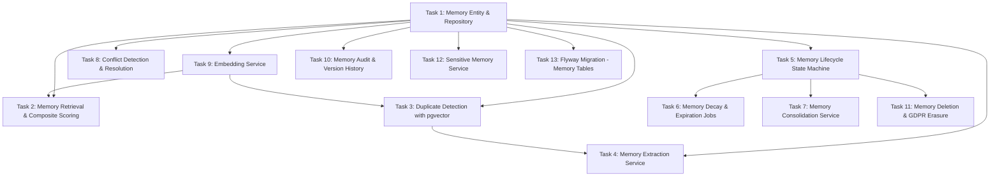

# Tasks — Memory & Knowledge System

## Task Dependency Graph

## Tasks

### Task 1: Memory Entity & Repository
- **Description**: Implement the Memory JPA entity with all fields (category, subject_type, content, scores, state, embedding vector, timestamps), and the repository with native query support for pgvector operations.
- **Files to create/modify**:
  - `backend/src/main/java/com/dadcoach/memory/Memory.java`
  - `backend/src/main/java/com/dadcoach/memory/MemoryVersion.java`
  - `backend/src/main/java/com/dadcoach/memory/MemoryRepository.java`
  - `backend/src/main/java/com/dadcoach/memory/dto/MemoryDto.java`
  - `backend/src/main/java/com/dadcoach/memory/mapper/MemoryMapper.java`
- **Acceptance criteria**:
  - [ ] Memory entity maps to `memories` table with all columns
  - [ ] Content field limited to 500 characters (CHECK constraint)
  - [ ] importance_score between 1-10, confidence_score between 0.0-1.0
  - [ ] State field with allowed values: ACTIVE, CONFIRMED, SUPERSEDED, ARCHIVED, EXPIRED, DELETED
  - [ ] Embedding stored as vector(1536) type
  - [ ] Repository supports findByFatherId, findByCategory, findByState queries
  - [ ] MapStruct mapper for entity↔DTO conversion
- **Dependencies**: None

### Task 2: Memory Retrieval & Composite Scoring
- **Description**: Implement the MemoryRetriever with composite score calculation (importance×0.5 + recency×0.3 + relevance×0.2) and diversity enforcement (max 5 per category).
- **Files to create/modify**:
  - `backend/src/main/java/com/dadcoach/memory/retrieval/MemoryRetriever.java`
  - `backend/src/main/java/com/dadcoach/memory/retrieval/CompositeScoreCalculator.java`
  - `backend/src/main/java/com/dadcoach/memory/retrieval/RetrievalMetadata.java`
  - `backend/src/main/java/com/dadcoach/memory/dto/RetrievalResultDto.java`
- **Acceptance criteria**:
  - [ ] Composite score formula: (importance/10 × 0.5) + (recency_factor × 0.3) + (relevance × 0.2)
  - [ ] Recency factor: max(0, 1.0 - (days_since_last_access × 0.05))
  - [ ] Results ordered by descending composite score
  - [ ] No single category appears more than 5 times
  - [ ] Memories with confidence < 0.3 excluded
  - [ ] Top-scoring memory always included if token budget allows
  - [ ] access_count and last_accessed_at updated on retrieval
- **Dependencies**: Task 1

### Task 3: Duplicate Detection with pgvector
- **Description**: Implement the DuplicateDetector using pgvector cosine similarity to identify duplicate (>0.85) or potential update (0.70-0.85) memories before creation.
- **Files to create/modify**:
  - `backend/src/main/java/com/dadcoach/memory/extraction/DuplicateDetector.java`
  - `backend/src/main/java/com/dadcoach/memory/extraction/DuplicateResult.java`
- **Acceptance criteria**:
  - [ ] Cosine similarity > 0.85 → DUPLICATE (reject creation)
  - [ ] Cosine similarity 0.70-0.85 → POTENTIAL_UPDATE (consider supersession)
  - [ ] Cosine similarity < 0.70 → DISTINCT (allow creation)
  - [ ] Search scoped by father_id, category, subject_type
  - [ ] Uses native SQL with pgvector `<=>` operator
  - [ ] Falls back gracefully if embedding not available (skip duplicate check)
- **Dependencies**: Task 1, Task 9

### Task 4: Memory Extraction Service
- **Description**: Implement the MemoryExtractionService that processes extraction requests from the conversation engine outbox, validates AI recommendations via ExtractionValidator, and persists new memories.
- **Files to create/modify**:
  - `backend/src/main/java/com/dadcoach/memory/extraction/MemoryExtractionService.java`
  - `backend/src/main/java/com/dadcoach/memory/extraction/ExtractionValidator.java`
- **Acceptance criteria**:
  - [ ] Processes extraction asynchronously (never blocks conversation response)
  - [ ] ExtractionValidator validates every AI recommendation before persistence
  - [ ] Domain entity data (names, birthdays, phone) rejected as memories
  - [ ] Each extracted memory checked for duplicates before creation
  - [ ] Invalid AI output discarded; valid memories from same batch still created
  - [ ] 500-memory capacity checked before creation (archive lowest if full)
  - [ ] Audit entry created for every new memory
- **Dependencies**: Task 1, Task 3

### Task 5: Memory Lifecycle State Machine
- **Description**: Implement memory state transitions (ACTIVE → CONFIRMED, ACTIVE → SUPERSEDED, ACTIVE → ARCHIVED, ACTIVE → EXPIRED, * → DELETED) with transition validation.
- **Files to create/modify**:
  - `backend/src/main/java/com/dadcoach/memory/lifecycle/MemoryStateTransition.java`
  - `backend/src/main/java/com/dadcoach/memory/MemoryService.java`
  - `backend/src/main/java/com/dadcoach/memory/MemoryServiceImpl.java`
- **Acceptance criteria**:
  - [ ] Only defined transitions allowed (invalid ones rejected)
  - [ ] confirmMemory: ACTIVE → CONFIRMED, increments confirmation_count
  - [ ] supersedeMemory: creates new memory, old → SUPERSEDED with superseded_by link
  - [ ] Confidence only increases from explicit evidence (never from system usage)
  - [ ] All state changes create version history entries
  - [ ] MemoryService implements the public interface from design
- **Dependencies**: Task 1

### Task 6: Memory Decay & Expiration Jobs
- **Description**: Implement the daily confidence decay job and the expiration service that transitions expired memories.
- **Files to create/modify**:
  - `backend/src/main/java/com/dadcoach/memory/lifecycle/MemoryDecayService.java`
  - `backend/src/main/java/com/dadcoach/memory/lifecycle/MemoryExpirationService.java`
- **Acceptance criteria**:
  - [ ] Decay runs daily during maintenance window
  - [ ] Processes fathers in batches to avoid lock contention
  - [ ] Expiration checks `expires_at` for ACTIVE memories past their date
  - [ ] Expired memories transition to EXPIRED state
  - [ ] Skips memories that changed state since job start (race condition protection)
  - [ ] Logs processed counts and any errors
- **Dependencies**: Task 5

### Task 7: Memory Consolidation Service
- **Description**: Implement the weekly consolidation job that merges related memories, creates summary memories, and archives low-value duplicates.
- **Files to create/modify**:
  - `backend/src/main/java/com/dadcoach/memory/lifecycle/MemoryConsolidationService.java`
- **Acceptance criteria**:
  - [ ] Runs weekly during maintenance window
  - [ ] Identifies memories with high similarity within same father+category
  - [ ] Merges overlapping memories into consolidated entries
  - [ ] Creates weekly/monthly summary memories
  - [ ] Archives original memories after consolidation (not deleted)
  - [ ] Processes fathers in batches
  - [ ] Skips memories that changed state during processing
- **Dependencies**: Task 5

### Task 8: Conflict Detection & Resolution
- **Description**: Implement the ConflictDetector that identifies contradictory memories and manages conflict groups.
- **Files to create/modify**:
  - `backend/src/main/java/com/dadcoach/memory/conflict/ConflictDetector.java`
  - `backend/src/main/java/com/dadcoach/memory/conflict/ConflictGroup.java`
- **Acceptance criteria**:
  - [ ] Detects contradictions between memories of same subject
  - [ ] Groups conflicting memories under a conflict_group_id
  - [ ] Newer memory with higher confidence wins (supersedes older)
  - [ ] Both memories kept if confidence is similar (flagged for confirmation)
  - [ ] Contradiction detected → confidence of older memory reduced by 0.3
- **Dependencies**: Task 1

### Task 9: Embedding Service
- **Description**: Implement the EmbeddingService that generates vector embeddings via AI provider, with a retry queue for failed embedding attempts.
- **Files to create/modify**:
  - `backend/src/main/java/com/dadcoach/memory/embedding/EmbeddingService.java`
  - `backend/src/main/java/com/dadcoach/memory/embedding/EmbeddingQueue.java`
- **Acceptance criteria**:
  - [ ] Generates 1536-dimension embeddings via OpenAI text-embedding-ada-002
  - [ ] Memory stored without embedding on failure (excluded from similarity search)
  - [ ] Retry queue: 3 attempts over 24 hours for failed embeddings
  - [ ] Batch embedding support for efficiency
  - [ ] Graceful degradation when embedding service unavailable
- **Dependencies**: Task 1

### Task 10: Memory Audit & Version History
- **Description**: Implement the append-only audit log and version history tracking for all memory operations.
- **Files to create/modify**:
  - `backend/src/main/java/com/dadcoach/memory/audit/MemoryAuditService.java`
  - `backend/src/main/java/com/dadcoach/memory/audit/MemoryAuditEntry.java`
  - `backend/src/main/java/com/dadcoach/memory/audit/MemoryAuditRepository.java`
- **Acceptance criteria**:
  - [ ] Audit log is append-only (no updates or deletes)
  - [ ] Written synchronously with memory operations (rollback on audit failure)
  - [ ] Records: operation_type, from_state, to_state, trigger_type, triggered_by
  - [ ] Version history snapshots content, confidence, importance at each change
  - [ ] Queryable by father_id and time range
- **Dependencies**: Task 1

### Task 11: Memory Deletion & GDPR Erasure
- **Description**: Implement soft-delete with deferred erasure: immediate state transition to DELETED, 72-hour background job for content nullification, embedding deletion, and version history purge.
- **Files to create/modify**:
  - `backend/src/main/java/com/dadcoach/memory/lifecycle/MemoryDeletionService.java`
- **Acceptance criteria**:
  - [ ] `deleteMemory()`: immediate transition to DELETED state
  - [ ] `deleteAllForFather()`: GDPR full erasure for a father
  - [ ] Background job runs within 72 hours to erase: content, embedding, version history
  - [ ] Erasure nullifies content field, removes embedding vector
  - [ ] All version history snapshots purged
  - [ ] Audit entry preserved (records deletion event, not content)
- **Dependencies**: Task 5

### Task 12: Sensitive Memory Service
- **Description**: Implement the SensitiveMemoryService for safety event records stored separately from normal memories, with review workflow.
- **Files to create/modify**:
  - `backend/src/main/java/com/dadcoach/memory/sensitive/SensitiveMemoryService.java`
  - `backend/src/main/java/com/dadcoach/memory/sensitive/SafetyEventRecord.java`
  - `backend/src/main/java/com/dadcoach/memory/sensitive/SafetyEventRepository.java`
- **Acceptance criteria**:
  - [ ] Safety events stored in separate `safety_event_records` table
  - [ ] Records include: event_type, summary (≤100 chars), requires_review flag
  - [ ] Expiration enforced on safety records
  - [ ] Review workflow: reviewed_by, reviewed_at fields
  - [ ] Never mixed into normal memory retrieval
  - [ ] Queryable by father_id for support use cases
- **Dependencies**: Task 1

### Task 13: Flyway Migration - Memory Tables
- **Description**: Create the Flyway migration for all memory-related tables: memories (with pgvector), memory_versions, memory_audit_log, safety_event_records.
- **Files to create/modify**:
  - `backend/src/main/resources/db/migration/V4__memory_knowledge_system.sql`
- **Acceptance criteria**:
  - [ ] pgvector extension created (`CREATE EXTENSION IF NOT EXISTS vector`)
  - [ ] memories table with vector(1536) column and all fields from design
  - [ ] IVFFlat index on embedding column (lists=50)
  - [ ] memory_versions table with unique(memory_id, version_number)
  - [ ] memory_audit_log table with indexes on father_id
  - [ ] safety_event_records table with expiration index
  - [ ] All CHECK constraints from design applied
  - [ ] Migration runs successfully with pgvector extension enabled
- **Dependencies**: Task 1
