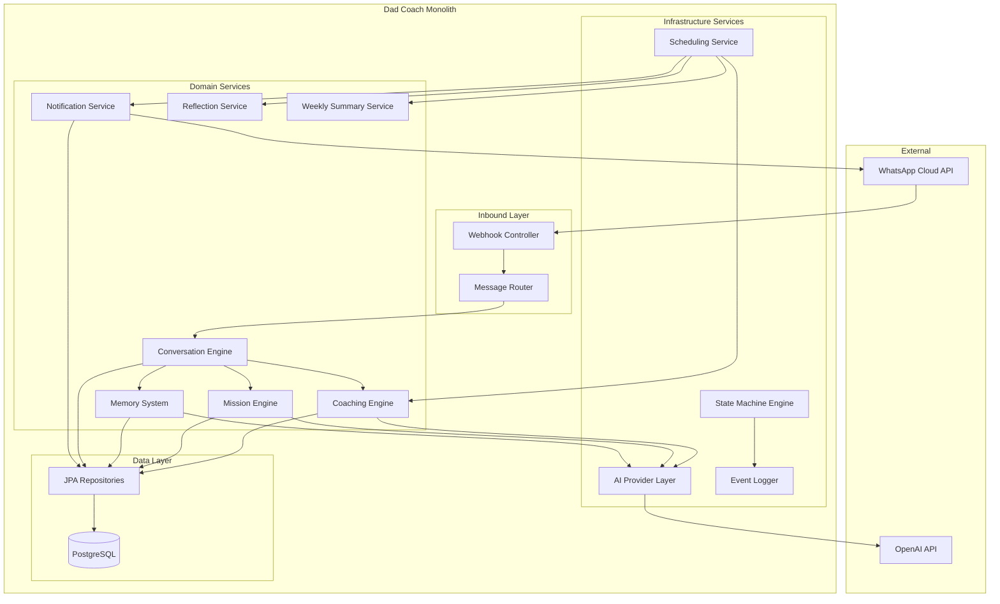
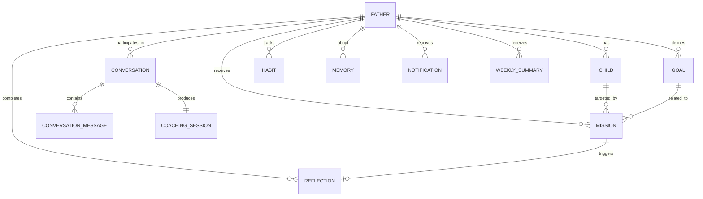

# Design Document: Product Domain & Business Logic

## Overview

This design defines the complete domain model, service architecture, database schema, AI integration, scheduling subsystem, and business rules for the Dad Coach platform. The system is a WhatsApp-first AI coaching application for fathers, built as a modular Spring Boot monolith (Java 21, Spring Boot 4.1.0, PostgreSQL).

The design extends the existing v0.1.0 foundation (webhook verification and message persistence) into a full-featured coaching platform with:

- **Domain entities**: Father, Child, Mission, Goal, Habit, Memory, Conversation, Notification, Coaching Session, Reflection, Weekly Summary
- **State machines**: Governing lifecycle transitions for Father, Onboarding, Mission, Conversation, Coaching Session, and Habit
- **Service layer**: Coaching Engine, Mission Engine, Memory System, Conversation Engine, Notification Service, Scheduling
- **AI integration**: OpenAI GPT-4o / GPT-4o-mini with prompt templates and token management
- **Scheduling**: Daily coaching, weekly summaries, inactivity checks, notification delivery

The system communicates exclusively via WhatsApp (existing integration) and stores all data in PostgreSQL with Flyway-managed migrations.

---

## Architecture

### High-Level System Architecture



### Module Structure

```
com.dadcoach/
├── common/                    # Shared utilities, exceptions, base entities
├── config/                    # Application configuration
├── webhook/                   # WhatsApp webhook controller (existing)
├── whatsapp/                  # WhatsApp outbound service (existing)
├── domain/
│   ├── father/                # Father entity, repository, service
│   ├── child/                 # Child entity, repository, service
│   ├── mission/               # Mission entity, state machine, repository, service
│   ├── goal/                  # Goal entity, repository, service
│   ├── habit/                 # Habit entity, state machine, repository, service
│   ├── memory/                # Memory entity, repository, service
│   ├── conversation/          # Conversation entity, state machine, repository, service
│   ├── notification/          # Notification entity, repository, service
│   ├── reflection/            # Reflection entity, service
│   └── weeklysummary/         # Weekly summary entity, service
├── coaching/                  # Coaching Engine, phase logic, scoring
├── missionengine/             # Mission generation, difficulty adaptation
├── memorysystem/              # Memory retrieval, consolidation, expiration
├── conversationengine/        # Conversation lifecycle, routing, context
├── ai/                        # AI provider abstraction, prompt templates, token mgmt
├── scheduling/                # Scheduled jobs, cron configuration
└── statemachine/              # State machine infrastructure, audit logging
```

### Design Decisions

| Decision | Choice | Rationale |
|----------|--------|-----------|
| State machine impl | Enum-based with transition validator | Simpler than Spring State Machine for our domain; full audit logging |
| AI abstraction | Strategy pattern per model | Allows GPT-4o/mini selection per conversation type; future model swaps |
| Memory ranking | In-app scoring formula | Sufficient for v1; pluggable interface for future pgvector migration |
| Scheduling | Spring `@Scheduled` + timezone-aware job dispatch | Sufficient for single-instance monolith; upgradable to distributed scheduler |
| Event logging | Append-only `state_transition_log` table | Supports audit trail and future ML training |
| Quiet hours | Computed at notification dispatch time | Simpler than complex scheduling; respects dynamic timezone changes |

---

## Components and Interfaces

### 1. State Machine Engine

Centralized state transition validation and audit logging for all domain entities.

```java
public interface StateMachineEngine {
    /**
     * Attempt a state transition. Returns the new state or throws InvalidTransitionException.
     */
    <S extends Enum<S>> S transition(
        String entityType, Long entityId, S currentState, S targetState, String triggerReason
    );

    /**
     * Get valid transitions from a given state.
     */
    <S extends Enum<S>> Set<S> validTransitions(Class<S> stateEnum, S currentState);
}
```

### 2. Coaching Engine

Orchestrates daily coaching flow, phase progression, and engagement adaptation.

```java
public interface CoachingEngine {
    /** Determine and deliver daily coaching content for a Father. */
    void deliverDailyCoaching(Long fatherId);

    /** Determine current coaching phase based on days since activation. */
    CoachingPhase computePhase(Father father);

    /** Evaluate engagement trend (RISING, FALLING, STABLE) over last 7 days. */
    EngagementTrend evaluateEngagementTrend(Long fatherId);

    /** Adapt coaching intensity based on engagement score history. */
    void adaptIntensity(Long fatherId);

    /** Select AI model based on conversation type. */
    AiModel selectModel(ConversationType conversationType);
}
```

### 3. Mission Engine

Generates age-appropriate, context-aware missions with difficulty adaptation.

```java
public interface MissionEngine {
    /** Generate a mission for a specific child considering all context factors. */
    Mission generateMission(Long fatherId, Long childId);

    /** Adapt difficulty based on recent mission outcomes. */
    int adaptDifficulty(Long fatherId, Long childId, int currentDifficulty);

    /** Validate equitable distribution across children. */
    boolean isDistributionEquitable(Long fatherId, int windowDays);

    /** Select next child for mission assignment ensuring fairness. */
    Long selectNextChild(Long fatherId);
}
```

### 4. Memory System

Stores, retrieves, consolidates, and expires contextual memories.

```java
public interface MemorySystem {
    /** Store a new memory extracted from conversation. */
    Memory createMemory(Long fatherId, MemoryCategory category,
                        String content, int importanceScore, double confidenceScore);

    /** Retrieve top N memories ranked by composite score for context. */
    List<Memory> retrieveTopMemories(Long fatherId, String topic, int limit);

    /** Run weekly consolidation job. */
    void consolidateMemories(Long fatherId);

    /** Supersede an existing memory with corrected information. */
    Memory supersedeMemory(Long existingMemoryId, String newContent);

    /** Expire memories below confidence threshold. */
    void expireLowConfidenceMemories();
}
```

### 5. Conversation Engine

Manages conversation lifecycle, message routing, and context building.

```java
public interface ConversationEngine {
    /** Start a new conversation (queued if one is active, unless DIFFICULT_SITUATION). */
    Conversation startConversation(Long fatherId, ConversationType type, String trigger);

    /** Process an inbound message within the active conversation. */
    ConversationResponse processMessage(Long fatherId, String messageContent);

    /** Check for conversation expiration across all active conversations. */
    void checkExpirations();

    /** Build AI context for a conversation (memories + structured data + history). */
    AiContext buildContext(Conversation conversation);
}
```

### 6. Notification Service

Handles scheduling, quiet hours enforcement, rate limiting, and delivery.

```java
public interface NotificationService {
    /** Schedule a notification respecting quiet hours and rate limits. */
    Notification scheduleNotification(Long fatherId, NotificationType type,
                                      String content, Instant scheduledFor);

    /** Dispatch due notifications (called by scheduler). */
    void dispatchDueNotifications();

    /** Retry failed notifications with exponential backoff. */
    void retryFailedNotifications();

    /** Check daily notification count for a father. */
    int getDailyNotificationCount(Long fatherId, LocalDate date);
}
```

### 7. AI Provider Layer

Abstracts AI model interaction with prompt template management and token budgeting.

```java
public interface AiProvider {
    /** Send a completion request with the given context and model. */
    AiResponse complete(AiRequest request);

    /** Estimate token count for a given text. */
    int estimateTokens(String text);
}

public record AiRequest(
    AiModel model,
    String systemPrompt,
    List<AiMessage> conversationHistory,
    int maxResponseTokens,
    String promptVersion
) {}

public enum AiModel {
    GPT_4O("gpt-4o", 4096),
    GPT_4O_MINI("gpt-4o-mini", 4096);

    private final String modelId;
    private final int maxContextTokens;
}
```

### 8. Scheduling Service

Timezone-aware job dispatcher for daily coaching, weekly summaries, and maintenance.

```java
public interface SchedulingService {
    /** Find all fathers whose daily coaching time is now in their timezone. */
    List<Father> findFathersDueForDailyCoaching(Instant now);

    /** Find all fathers due for weekly summary (Monday 08:00 local). */
    List<Father> findFathersDueForWeeklySummary(Instant now);

    /** Find fathers whose inactivity threshold has been crossed. */
    List<Father> findInactiveFathers(int inactiveDays);

    /** Find expired conversations. */
    List<Conversation> findExpiredConversations(Instant now);
}
```

---

## Data Models

### Entity Relationship Diagram



### Database Schema (Flyway Migrations)

#### V2__domain_entities.sql

```sql
-- Extend father table
ALTER TABLE father
    ADD COLUMN status VARCHAR(20) NOT NULL DEFAULT 'NOT_STARTED',
    ADD COLUMN onboarding_state VARCHAR(30) DEFAULT 'NOT_STARTED',
    ADD COLUMN coaching_phase VARCHAR(20) DEFAULT 'FOUNDATION',
    ADD COLUMN coaching_style VARCHAR(20) DEFAULT 'BALANCED',
    ADD COLUMN preferred_coaching_time TIME DEFAULT '08:00',
    ADD COLUMN timezone VARCHAR(64) DEFAULT 'Asia/Jerusalem',
    ADD COLUMN locale VARCHAR(10) DEFAULT 'he',
    ADD COLUMN engagement_score INT DEFAULT 0,
    ADD COLUMN coaching_streak INT DEFAULT 0,
    ADD COLUMN longest_streak INT DEFAULT 0,
    ADD COLUMN activation_date DATE,
    ADD COLUMN last_interaction_at TIMESTAMPTZ,
    ADD COLUMN pause_until DATE,
    ADD COLUMN metadata JSONB DEFAULT '{}';

-- Child table
CREATE TABLE child (
    id BIGSERIAL PRIMARY KEY,
    father_id BIGINT NOT NULL REFERENCES father(id),
    name VARCHAR(120) NOT NULL,
    birth_date DATE NOT NULL,
    gender VARCHAR(10),
    interests TEXT[] DEFAULT '{}',
    challenges TEXT[] DEFAULT '{}',
    relationship_quality INT DEFAULT 3 CHECK (relationship_quality BETWEEN 1 AND 5),
    status VARCHAR(20) NOT NULL DEFAULT 'ACTIVE',
    created_at TIMESTAMPTZ NOT NULL DEFAULT NOW(),
    updated_at TIMESTAMPTZ NOT NULL DEFAULT NOW()
);
CREATE INDEX idx_child_father ON child(father_id);

-- Goal table
CREATE TABLE goal (
    id BIGSERIAL PRIMARY KEY,
    father_id BIGINT NOT NULL REFERENCES father(id),
    title VARCHAR(200) NOT NULL,
    description TEXT,
    category VARCHAR(30) NOT NULL,
    priority INT NOT NULL CHECK (priority BETWEEN 1 AND 5),
    status VARCHAR(20) NOT NULL DEFAULT 'ACTIVE',
    progress_percentage INT NOT NULL DEFAULT 0,
    estimated_total_missions INT NOT NULL,
    completed_related_missions INT NOT NULL DEFAULT 0,
    created_at TIMESTAMPTZ NOT NULL DEFAULT NOW(),
    completed_at TIMESTAMPTZ
);
CREATE INDEX idx_goal_father_status ON goal(father_id, status);

-- Habit table
CREATE TABLE habit (
    id BIGSERIAL PRIMARY KEY,
    father_id BIGINT NOT NULL REFERENCES father(id),
    title VARCHAR(200) NOT NULL,
    description TEXT,
    frequency VARCHAR(20) NOT NULL DEFAULT 'DAILY',
    status VARCHAR(20) NOT NULL DEFAULT 'ACTIVE',
    current_streak INT NOT NULL DEFAULT 0,
    longest_streak INT NOT NULL DEFAULT 0,
    total_completions INT NOT NULL DEFAULT 0,
    last_completed_at TIMESTAMPTZ,
    created_at TIMESTAMPTZ NOT NULL DEFAULT NOW()
);
CREATE INDEX idx_habit_father_status ON habit(father_id, status);

-- Mission table
CREATE TABLE mission (
    id BIGSERIAL PRIMARY KEY,
    father_id BIGINT NOT NULL REFERENCES father(id),
    child_id BIGINT NOT NULL REFERENCES child(id),
    goal_id BIGINT REFERENCES goal(id),
    title VARCHAR(200) NOT NULL,
    description TEXT NOT NULL,
    category VARCHAR(30) NOT NULL,
    difficulty INT NOT NULL CHECK (difficulty BETWEEN 1 AND 5),
    estimated_minutes INT NOT NULL,
    status VARCHAR(20) NOT NULL DEFAULT 'ASSIGNED',
    outcome_rating INT CHECK (outcome_rating BETWEEN 1 AND 5),
    outcome_notes TEXT,
    prompt_version VARCHAR(50),
    assigned_at TIMESTAMPTZ NOT NULL DEFAULT NOW(),
    expires_at TIMESTAMPTZ NOT NULL,
    accepted_at TIMESTAMPTZ,
    completed_at TIMESTAMPTZ
);
CREATE INDEX idx_mission_father_status ON mission(father_id, status);
CREATE INDEX idx_mission_child ON mission(child_id);
CREATE INDEX idx_mission_father_assigned ON mission(father_id, assigned_at);

-- Memory table
CREATE TABLE memory (
    id BIGSERIAL PRIMARY KEY,
    father_id BIGINT NOT NULL REFERENCES father(id),
    child_id BIGINT REFERENCES child(id),
    category VARCHAR(40) NOT NULL,
    content TEXT NOT NULL,
    importance_score INT NOT NULL CHECK (importance_score BETWEEN 1 AND 10),
    confidence_score NUMERIC(3,2) NOT NULL CHECK (confidence_score BETWEEN 0.0 AND 1.0),
    status VARCHAR(20) NOT NULL DEFAULT 'ACTIVE',
    access_count INT NOT NULL DEFAULT 0,
    last_accessed_at TIMESTAMPTZ,
    superseded_by BIGINT REFERENCES memory(id),
    expires_at TIMESTAMPTZ,
    created_at TIMESTAMPTZ NOT NULL DEFAULT NOW()
);
CREATE INDEX idx_memory_father_status ON memory(father_id, status);
CREATE INDEX idx_memory_father_category ON memory(father_id, category);
CREATE INDEX idx_memory_expires ON memory(expires_at) WHERE status = 'ACTIVE';

-- Conversation table (replaces ad-hoc conversation_message usage)
CREATE TABLE conversation (
    id BIGSERIAL PRIMARY KEY,
    father_id BIGINT NOT NULL REFERENCES father(id),
    type VARCHAR(30) NOT NULL,
    status VARCHAR(20) NOT NULL DEFAULT 'ACTIVE',
    objective TEXT,
    summary TEXT,
    message_count INT NOT NULL DEFAULT 0,
    expires_at TIMESTAMPTZ NOT NULL,
    created_at TIMESTAMPTZ NOT NULL DEFAULT NOW(),
    completed_at TIMESTAMPTZ
);
CREATE INDEX idx_conversation_father_status ON conversation(father_id, status);
CREATE INDEX idx_conversation_expires ON conversation(expires_at) WHERE status = 'ACTIVE';

-- Update conversation_message to link to conversation
ALTER TABLE conversation_message
    ADD COLUMN conversation_id BIGINT REFERENCES conversation(id),
    ADD COLUMN role VARCHAR(20) DEFAULT 'USER';

-- Coaching session (outcome metadata for completed conversations)
CREATE TABLE coaching_session (
    id BIGSERIAL PRIMARY KEY,
    conversation_id BIGINT NOT NULL REFERENCES conversation(id),
    father_id BIGINT NOT NULL REFERENCES father(id),
    outcome VARCHAR(30) NOT NULL,
    model_used VARCHAR(30) NOT NULL,
    total_tokens INT NOT NULL DEFAULT 0,
    context_memories_used BIGINT[] DEFAULT '{}',
    notes TEXT,
    created_at TIMESTAMPTZ NOT NULL DEFAULT NOW()
);
CREATE INDEX idx_coaching_session_father ON coaching_session(father_id);

-- Notification table
CREATE TABLE notification (
    id BIGSERIAL PRIMARY KEY,
    father_id BIGINT NOT NULL REFERENCES father(id),
    type VARCHAR(30) NOT NULL,
    channel VARCHAR(20) NOT NULL DEFAULT 'WHATSAPP',
    status VARCHAR(20) NOT NULL DEFAULT 'SCHEDULED',
    content TEXT NOT NULL,
    priority INT NOT NULL DEFAULT 5,
    scheduled_for TIMESTAMPTZ NOT NULL,
    delivered_at TIMESTAMPTZ,
    retry_count INT NOT NULL DEFAULT 0,
    created_at TIMESTAMPTZ NOT NULL DEFAULT NOW()
);
CREATE INDEX idx_notification_status_scheduled ON notification(status, scheduled_for);
CREATE INDEX idx_notification_father_day ON notification(father_id, scheduled_for);

-- Reflection table
CREATE TABLE reflection (
    id BIGSERIAL PRIMARY KEY,
    father_id BIGINT NOT NULL REFERENCES father(id),
    conversation_id BIGINT REFERENCES conversation(id),
    mission_id BIGINT REFERENCES mission(id),
    type VARCHAR(20) NOT NULL,
    emotional_tone VARCHAR(20),
    insights TEXT,
    created_at TIMESTAMPTZ NOT NULL DEFAULT NOW()
);
CREATE INDEX idx_reflection_father ON reflection(father_id);

-- Weekly summary table
CREATE TABLE weekly_summary (
    id BIGSERIAL PRIMARY KEY,
    father_id BIGINT NOT NULL REFERENCES father(id),
    week_start DATE NOT NULL,
    week_end DATE NOT NULL,
    missions_assigned INT NOT NULL DEFAULT 0,
    missions_completed INT NOT NULL DEFAULT 0,
    missions_skipped INT NOT NULL DEFAULT 0,
    engagement_score INT NOT NULL DEFAULT 0,
    coaching_streak INT NOT NULL DEFAULT 0,
    highlights TEXT,
    focus_areas TEXT,
    content TEXT NOT NULL,
    delivered_at TIMESTAMPTZ,
    created_at TIMESTAMPTZ NOT NULL DEFAULT NOW(),
    UNIQUE(father_id, week_start)
);

-- State transition audit log
CREATE TABLE state_transition_log (
    id BIGSERIAL PRIMARY KEY,
    entity_type VARCHAR(30) NOT NULL,
    entity_id BIGINT NOT NULL,
    from_state VARCHAR(30) NOT NULL,
    to_state VARCHAR(30) NOT NULL,
    trigger_reason VARCHAR(200),
    created_at TIMESTAMPTZ NOT NULL DEFAULT NOW()
);
CREATE INDEX idx_state_log_entity ON state_transition_log(entity_type, entity_id);

-- Engagement event log (append-only)
CREATE TABLE engagement_event (
    id BIGSERIAL PRIMARY KEY,
    father_id BIGINT NOT NULL REFERENCES father(id),
    event_type VARCHAR(30) NOT NULL,
    event_data JSONB DEFAULT '{}',
    created_at TIMESTAMPTZ NOT NULL DEFAULT NOW()
);
CREATE INDEX idx_engagement_event_father_date ON engagement_event(father_id, created_at);
```

### Key Domain Enums

```java
public enum FatherStatus {
    NOT_STARTED, ONBOARDING, ACTIVE, PAUSED, CHURNED, REACTIVATED, DELETED
}

public enum OnboardingState {
    NOT_STARTED, NAME_COLLECTED, CHILDREN_REGISTERED, GOALS_SET, SCHEDULE_SET, COMPLETED
}

public enum CoachingPhase {
    FOUNDATION(1, 14),   // Days 1-14
    BUILDING(15, 42),    // Days 15-42
    DEEPENING(43, 84),   // Days 43-84
    MASTERY(85, Integer.MAX_VALUE);  // Day 85+

    private final int startDay;
    private final int endDay;
}

public enum MissionStatus {
    ASSIGNED, ACCEPTED, SKIPPED, EXPIRED, IN_PROGRESS, COMPLETED, ABANDONED, REFLECTED
}

public enum ConversationStatus {
    ACTIVE, COMPLETED, EXPIRED, ABANDONED
}

public enum ConversationType {
    ONBOARDING, DAILY_COACHING, FOLLOW_UP, REFLECTION,
    INACTIVITY_CHECK, CELEBRATION, DIFFICULT_SITUATION
}

public enum CoachingSessionOutcome {
    ACTIVE, OBJECTIVE_MET, PARTIALLY_MET, NOT_MET, FATHER_DISENGAGED, ERROR
}

public enum HabitStatus {
    ACTIVE, PAUSED, COMPLETED, ARCHIVED
}

public enum GoalCategory {
    CONNECTION(15), COMMUNICATION(20), DISCIPLINE(25), EDUCATION(20),
    HEALTH(15), EMOTIONAL(20), INDEPENDENCE(15), FUN(10), ROUTINE(30), CUSTOM(20);

    private final int estimatedMissions;
}

public enum NotificationType {
    DAILY_COACHING, MISSION_REMINDER, CELEBRATION, WEEKLY_SUMMARY,
    INACTIVITY_CHECK, BIRTHDAY_REMINDER, REACTIVATION, DIFFICULT_SITUATION
}

public enum MemoryCategory {
    IDENTITY_FACT, RELATIONSHIP_DYNAMIC, PREFERENCE, SITUATIONAL_CONTEXT,
    TRANSIENT_STATE, CONVERSATION_SUMMARY, GOAL_RELATED, BEHAVIORAL_PATTERN
}

public enum CoachingStyle {
    GENTLE, BALANCED, DIRECT, MOTIVATIONAL
}
```

### Scoring Formulas

**Engagement Score** (recalculated daily, 7-day rolling window):
```
engagement_score = min(100,
    (messages_sent_7d × 2) +
    (missions_completed_7d × 15) +
    (reflections_completed_7d × 10) +
    (min(streak_days, 10))
)
```

**Memory Ranking** (for top-15 retrieval):
```
rank = (importance_score × 0.5) + (recency_factor × 0.3) + (relevance_to_topic × 0.2)
where recency_factor = max(0, 1.0 - (days_since_creation × 0.05))
```

**Goal Progress**:
```
progress_percentage = min(100, (completed_related_missions / estimated_total_missions) × 100)
```

**Mission Completion Rate** (30-day rolling):
```
rate = missions_assigned > 0 ? (missions_completed / missions_assigned) × 100 : 0
```

**Relationship Progress** per child (30-day rolling):
```
progress = completed_missions > 0
    ? (average(outcome_rating) / 5) × 100
    : 50
```

**Consistency Score** (30-day rolling):
```
consistency = (days_with_interaction / 30) × 100
```

---


## Correctness Properties

*A property is a characteristic or behavior that should hold true across all valid executions of a system — essentially, a formal statement about what the system should do. Properties serve as the bridge between human-readable specifications and machine-verifiable correctness guarantees.*

### Property 1: E.164 Phone Number Validation

*For any* string input, it should be accepted as a valid Father phone number if and only if it matches the E.164 pattern `^\+[1-9]\d{1,14}$`.

**Validates: Requirements 1.2**

### Property 2: Engagement Score Formula Correctness

*For any* combination of (messages_sent_7d, missions_completed_7d, reflections_completed_7d, streak_days) where all values are non-negative integers, the computed engagement_score should equal `min(100, messages*2 + missions*15 + reflections*10 + min(streak, 10))`.

**Validates: Requirements 1.9, 9.2**

### Property 3: Coaching Phase Computation

*For any* number of days since Father activation (days >= 1), the computed coaching phase should be: FOUNDATION for 1-14, BUILDING for 15-42, DEEPENING for 43-84, MASTERY for 85+. Phase transitions are forward-only.

**Validates: Requirements 4.2, 4.12**

### Property 4: Child Age Dynamic Computation

*For any* valid birth_date (between 0 and 18 years in the past), the computed age should equal the floor of years between birth_date and current date. The birth_date validation should reject dates outside this range.

**Validates: Requirements 2.3, 2.4**

### Property 5: Birthday Detection

*For any* child with a birth_date, the system should detect an upcoming birthday when the month-day anniversary is within 7 calendar days of the current date (including year wrap-around for late December births with early January anniversaries).

**Validates: Requirements 2.7**

### Property 6: Developmental Age Bracket Classification

*For any* child age (0-18), the computed developmental bracket should be: 0-2=INFANT, 3-5=PRESCHOOL, 6-8=EARLY_SCHOOL, 9-11=PRE_TEEN, 12-14=EARLY_TEEN, 15-18=TEENAGER.

**Validates: Requirements 12.9**

### Property 7: State Machine Transition Validity

*For any* entity type (Father, Mission, Conversation, Habit) in any current state, attempting a transition not defined in the state machine should be rejected, the current state should be preserved, and the invalid attempt should be logged. Conversely, all defined transitions should succeed.

**Validates: Requirements 11.7, 11.8**

### Property 8: Pause Duration Capping

*For any* requested pause duration (positive integer days), the effective pause should be `min(requested, 30)` days.

**Validates: Requirements 1.7**

### Property 9: Inactivity-to-Churn Transition

*For any* ACTIVE Father whose last_interaction_at is more than 21 days before the current time, the inactivity checker should transition their status to CHURNED.

**Validates: Requirements 1.4, 10.7**

### Property 10: Mission Difficulty Bounded by Phase

*For any* Father in a given coaching phase, all generated missions should have difficulty within: FOUNDATION=[1,2], BUILDING=[1,3], DEEPENING=[2,4], MASTERY=[2,5].

**Validates: Requirements 6.3, 6.4, 6.5, 6.6**

### Property 11: Mission Difficulty Adaptation

*For any* completed mission with outcome_rating, the next mission's difficulty should be: rating 4-5 → `min(current+1, phase_max)`, rating 1-2 → `max(current-1, 1)`, rating 3 → unchanged. After 3 consecutive skipped/expired missions, difficulty decreases by 1 and category changes.

**Validates: Requirements 6.16, 6.17, 6.11**

### Property 12: Mission Category Non-Repetition

*For any* child over any 7-day window, no mission category should appear more than 2 times in the missions assigned to that child.

**Validates: Requirements 6.7**

### Property 13: Mission Expiration by Day of Week

*For any* mission, if assigned on a weekday (Mon-Fri), expires_at should be assignment_time + 24 hours. If assigned on a weekend (Sat-Sun), expires_at should be assignment_time + 48 hours.

**Validates: Requirements 6.12**

### Property 14: Mission Time Constraint by Day of Week

*For any* weekday mission, estimated_minutes should be ≤ 30. For any weekend mission, estimated_minutes may be up to 120.

**Validates: Requirements 6.8, 6.9**

### Property 15: Equitable Mission Distribution

*For any* Father with N active children (N > 1), over any 7-day period, each child should receive at least `floor(total_missions_in_period / N) - 1` missions.

**Validates: Requirements 6.13, 10.8**

### Property 16: Single Active Mission Per Child

*For any* child at any point in time, the count of missions in non-terminal status (ASSIGNED, ACCEPTED, IN_PROGRESS) should be at most 1.

**Validates: Requirements 6.15**

### Property 17: Memory Tier Expiration Rules

*For any* memory with a given importance_score, the expiration should be: score 1-3 → created_at + 90 days, score 4-6 → created_at + 180 days, score 7-10 → no expiration (null expires_at).

**Validates: Requirements 7.2**

### Property 18: Memory Confidence Decay on Contradiction

*For any* existing memory with confidence_score C where a contradiction is detected, the updated confidence should be `max(0.0, C - 0.3)`.

**Validates: Requirements 7.9**

### Property 19: Memory Ranking Order

*For any* set of active memories for a Father and a given topic, the retrieval should return at most 15 memories ordered by descending composite score: `(importance × 0.5) + (recency_factor × 0.3) + (relevance × 0.2)` where `recency_factor = max(0, 1.0 - (days_since_creation × 0.05))`.

**Validates: Requirements 7.6**

### Property 20: Memory Capacity Limit

*For any* Father, the count of active memories should never exceed 500. When the limit is reached, the memory with the lowest `importance_score × confidence_score` should be archived first.

**Validates: Requirements 7.11**

### Property 21: Single Active Conversation Per Father

*For any* Father at any point in time, the count of conversations with status ACTIVE should be at most 1. A DIFFICULT_SITUATION conversation preempts (closes) the existing active conversation.

**Validates: Requirements 8.2**

### Property 22: Conversation Message Limit

*For any* conversation, the count of outbound (system-sent) messages should never exceed 8.

**Validates: Requirements 8.5, 10.3**

### Property 23: Quiet Hours Enforcement

*For any* notification with scheduled_for time falling between 21:00 and 07:00 in the Father's local timezone, the effective delivery time should be rescheduled to 07:00 the following morning.

**Validates: Requirements 10.1, 14.1**

### Property 24: Daily Notification Rate Limit

*For any* Father on any calendar day, the count of proactive notifications sent should not exceed 5. Replies within active conversations are excluded from this count.

**Validates: Requirements 10.2**

### Property 25: Notification Priority Deconfliction

*For any* set of N notifications queued for the same Father at the same scheduled_for time, only the highest-priority notification should be sent at that time. The remaining N-1 notifications should be rescheduled at 2-hour intervals in priority order.

**Validates: Requirements 14.7**

### Property 26: Coaching Streak Calculation

*For any* sequence of daily interaction flags (message sent or mission completed per calendar day in Father's timezone), the coaching_streak should equal the count of consecutive `true` values ending at the current day.

**Validates: Requirements 9.1**

### Property 27: Goal Progress Computation

*For any* goal with category C, the progress_percentage should equal `min(100, (completed_related_missions / GoalCategory.C.estimatedMissions) × 100)`.

**Validates: Requirements 9.5, 16.3**

### Property 28: Habit Streak Reset Rules

*For any* habit with a given frequency, the streak should reset under these conditions: DAILY → 1 day missed, WEEKDAYS → any weekday missed, WEEKENDS → both Sat and Sun missed, WEEKLY → full 7 days pass without completion. At 66 consecutive completions, status transitions to COMPLETED.

**Validates: Requirements 16.6, 16.7**

### Property 29: AI Model Selection by Conversation Type

*For any* conversation type, the selected AI model should be: GPT-4o for {ONBOARDING, DIFFICULT_SITUATION, REFLECTION}, GPT-4o-mini for {DAILY_COACHING, FOLLOW_UP, CELEBRATION, INACTIVITY_CHECK}.

**Validates: Requirements 17.6**

### Property 30: Context Token Budget

*For any* coaching session, the total token count of (system prompt + memories + conversation history) should not exceed 2000 tokens.

**Validates: Requirements 17.4**

### Property 31: Weekly Summary Exclusion Filter

*For any* Father with status in {PAUSED, CHURNED, DELETED}, no weekly summary should be generated.

**Validates: Requirements 13.7**

### Property 32: Capacity Limits

*For any* Father, the count of active goals should not exceed 5, the count of active habits should not exceed 5, and the count of active children should not exceed 8.

**Validates: Requirements 16.1, 16.5, 2.2**

### Property 33: Message Batching

*For any* sequence of inbound messages from a Father where 3 or more arrive within a 10-second window, the system should batch them into a single combined input, waiting 5 seconds after the final message before processing.

**Validates: Requirements 12.13**

### Property 34: AI Rate Limiting

*For any* Father on any calendar day, the total AI API calls should not exceed 20.

**Validates: Requirements 10.12**

### Property 35: Daily Reflection Limit

*For any* Father on any calendar day, at most 1 reflection conversation should be triggered.

**Validates: Requirements 18.4**

---

## Error Handling

### AI Provider Failures

| Scenario | Strategy | Fallback |
|----------|----------|----------|
| AI API timeout | Exponential backoff: 1s, 2s, 4s, 8s, 16s (max 5 attempts) | Pre-written fallback message in Father's locale |
| AI API rate limit (429) | Respect Retry-After header, queue for later | Defer to next scheduled interaction |
| AI API content filter | Log violation, use neutral fallback response | Do not retry with same input |
| Invalid JSON response | Retry once with explicit JSON instruction | Use template-based response |
| Token budget exceeded | Truncate oldest conversation history, retry | Summarize context and retry |

### State Machine Errors

- **Invalid transition attempt**: Log with entity_type, entity_id, attempted_from, attempted_to; throw `InvalidStateTransitionException`; maintain current state
- **Concurrent modification**: Use optimistic locking (`@Version` on entities); retry once on `OptimisticLockException`
- **Orphaned state**: Scheduled job detects conversations ACTIVE beyond 2× their expiration time; force-expires them

### Data Integrity

- **Duplicate webhook delivery**: Idempotency via `provider_message_id` deduplication (INSERT ON CONFLICT DO NOTHING)
- **Missing Father for inbound message**: Auto-create with NOT_STARTED status (never reject messages)
- **Exceeded memory capacity**: Archive lowest-scored memories in batch; never lose data, only make it inactive
- **Concurrent mission assignment**: SELECT FOR UPDATE on child's active missions before INSERT

### Notification Delivery Failures

- **WhatsApp API error**: Retry schedule: 5min, 30min, 2h (max 3 retries)
- **All retries exhausted**: Mark FAILED, create operations alert, do not re-queue
- **Outside 24-hour window**: Switch to approved template message; if no template matches, defer to next eligible window

### External Service Unavailability

- **PostgreSQL connection loss**: Spring retry with circuit breaker; queue inbound messages in memory (bounded to 100)
- **OpenAI downtime**: Fallback message, alert, and deferred processing queue

### Crisis Detection

- When message content matches crisis keywords (self-harm, abuse, violence patterns):
  1. Immediately respond with locale-appropriate crisis hotline numbers
  2. Flag account for human operations review (1-hour SLA)
  3. Do NOT continue AI-generated coaching for that conversation
  4. Log as priority-1 operations event

---

## Testing Strategy

### Testing Approach

This feature uses a **dual testing approach**:

1. **Property-based tests** — Verify universal correctness properties using randomly generated inputs (100+ iterations per property)
2. **Unit tests** — Verify specific examples, edge cases, and integration points
3. **Integration tests** — Verify AI provider interaction, database operations, and WhatsApp delivery

### Property-Based Testing

**Library**: [jqwik](https://jqwik.net/) (Java property-based testing framework, integrates with JUnit 5)

**Configuration**:
- Minimum 100 iterations per property test
- Each test tagged with: `@Tag("Feature: product-domain-business-logic, Property {N}: {title}")`
- Custom arbitraries for domain objects (Father, Child, Mission, Memory)

**Properties to implement** (referencing design properties):

| Property # | Test Class | What's Generated |
|-----------|-----------|-----------------|
| 1 | `PhoneValidationPropertyTest` | Random strings, E.164 patterns |
| 2 | `EngagementScorePropertyTest` | Random (messages, missions, reflections, streak) tuples |
| 3 | `CoachingPhasePropertyTest` | Random day counts (1-1000) |
| 4, 5, 6 | `ChildAgePropertyTest` | Random birth dates, current dates |
| 7 | `StateMachinePropertyTest` | Random states and transition attempts |
| 8, 9 | `FatherLifecyclePropertyTest` | Random durations, interaction timestamps |
| 10, 11, 12, 13, 14 | `MissionRulesPropertyTest` | Random phases, difficulties, categories, days |
| 15, 16 | `MissionDistributionPropertyTest` | Random multi-child scenarios |
| 17, 18, 19, 20 | `MemorySystemPropertyTest` | Random memories with scores, dates |
| 21, 22 | `ConversationRulesPropertyTest` | Random conversation sequences |
| 23, 24, 25 | `NotificationRulesPropertyTest` | Random times, notification queues |
| 26, 27, 28 | `ProgressMetricsPropertyTest` | Random interaction histories |
| 29, 30 | `AiIntegrationPropertyTest` | Random conversation types, context sizes |
| 31, 32, 33, 34, 35 | `BusinessRulesPropertyTest` | Random states, message sequences |

### Unit Tests

Focus areas for example-based tests:
- **State machine transitions**: Each valid and invalid transition tested individually
- **Onboarding flow**: Step-by-step progression through all states
- **Scheduling edge cases**: Timezone boundaries, DST transitions, quiet hours boundaries
- **Equitable distribution algorithm**: Specific multi-child scenarios
- **Memory consolidation**: Merging logic with specific overlapping memories
- **Crisis detection**: Keyword matching with locale-specific patterns
- **Emoji interpretation**: Specific emoji-to-intent mappings

### Integration Tests

- **AI Provider**: Mock OpenAI responses, verify prompt construction and token counting
- **WhatsApp delivery**: Mock WhatsApp API, verify template selection and message formatting
- **Database**: Testcontainers with PostgreSQL, verify Flyway migrations and repository queries
- **Scheduling**: Verify timezone-aware job dispatch with fixed clocks
- **End-to-end flows**: Full onboarding, daily coaching, mission lifecycle with mocked AI

### Test Infrastructure

```xml
<!-- Additional test dependencies for pom.xml -->
<dependency>
    <groupId>net.jqwik</groupId>
    <artifactId>jqwik</artifactId>
    <version>1.9.1</version>
    <scope>test</scope>
</dependency>
<dependency>
    <groupId>org.testcontainers</groupId>
    <artifactId>postgresql</artifactId>
    <version>1.20.4</version>
    <scope>test</scope>
</dependency>
<dependency>
    <groupId>org.testcontainers</groupId>
    <artifactId>junit-jupiter</artifactId>
    <version>1.20.4</version>
    <scope>test</scope>
</dependency>
```
