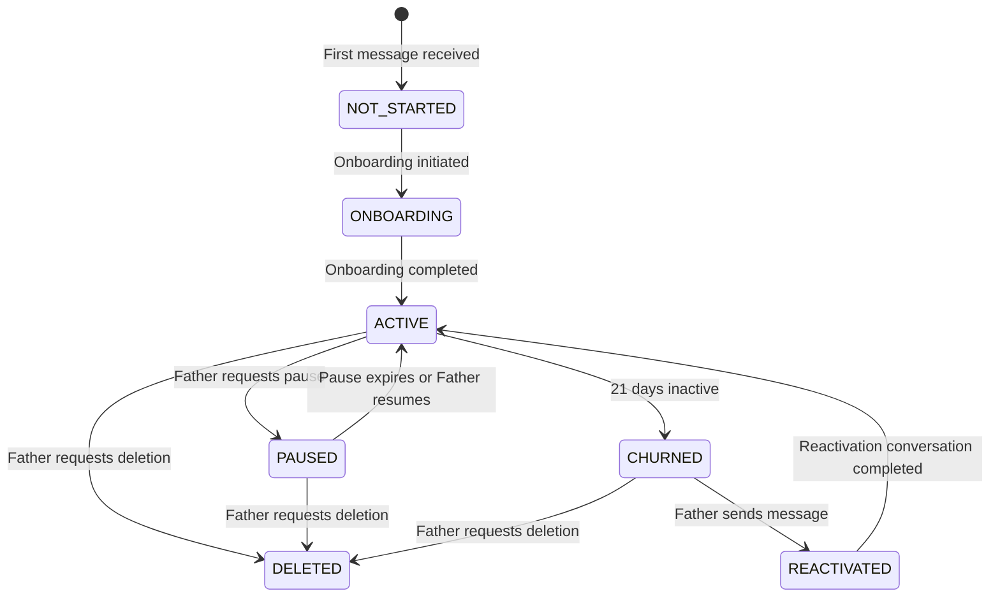
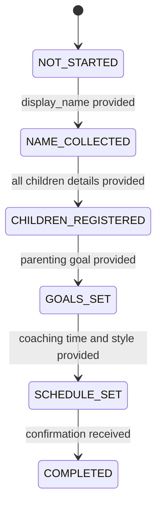
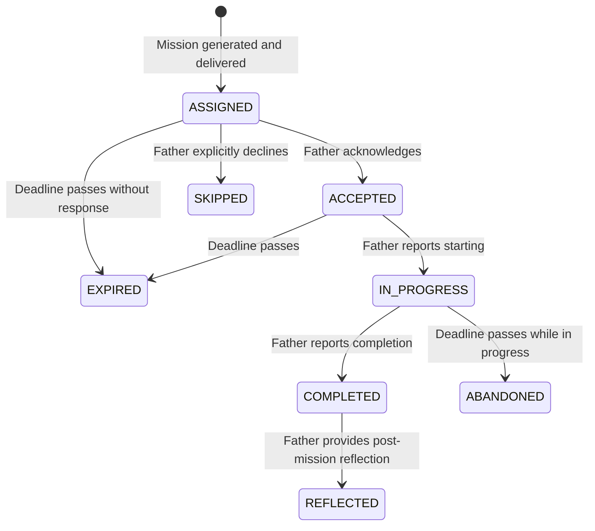
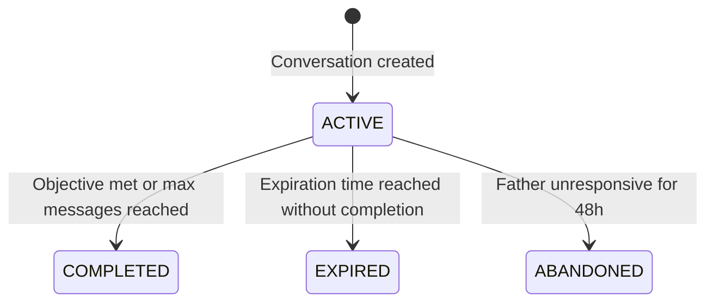
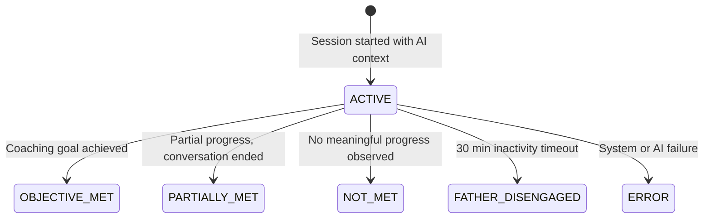
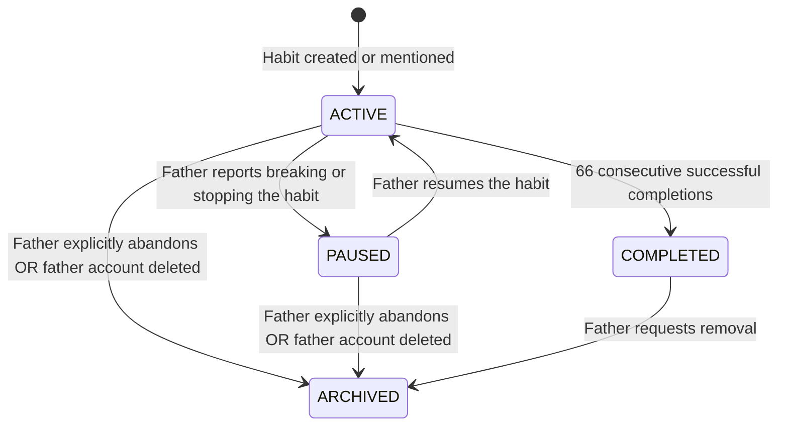

# Requirements Document

## Introduction

**Product Domain & Business Logic (SPEC-002)**

This specification defines the complete product domain model, business logic, and behavioral rules for the Dad Coach application. Dad Coach is a WhatsApp-first AI coaching platform that helps fathers build stronger relationships with their children through daily micro-missions, reflective conversations, and progressive coaching phases. This document serves as the definitive product bible — every entity, state machine, business rule, and edge case is specified with concrete values and formulas. The production-foundation spec (SPEC-001) handles infrastructure; this spec (SPEC-002) defines what the system does.

## Glossary

- **Dad_Coach**: The WhatsApp-first AI coaching application for fathers
- **Coaching_Engine**: The subsystem that determines what coaching content to deliver, when, and how
- **Mission_Engine**: The subsystem that generates age-appropriate micro-missions for fathers to complete with their children
- **Memory_System**: The subsystem that stores, consolidates, retrieves, and expires contextual information about each father
- **Conversation_Engine**: The subsystem that manages the lifecycle and flow of all conversation types
- **Father**: A registered user of the platform, identified by WhatsApp phone number
- **Child**: A child registered under a Father's profile
- **Mission**: A specific, actionable activity for a father to do with a child
- **Goal**: A long-term parenting objective defined by the father
- **Habit**: A recurring behavior the father wants to build
- **Reflection**: A structured self-assessment conversation about a completed mission or period
- **Memory**: A stored piece of contextual information about a father, child, or interaction
- **Coaching_Session**: A bounded conversational interaction with a specific coaching objective
- **Weekly_Summary**: An automated weekly progress report sent to the father
- **Notification**: A scheduled or triggered outbound message to the father
- **Onboarding_Flow**: The registration and setup conversation sequence for new fathers
- **Coaching_Phase**: A progressive stage in the father's coaching journey
- **Importance_Score**: A numeric value (1-10) indicating how critical a memory is for coaching context
- **Confidence_Score**: A numeric value (0.0-1.0) indicating how certain the system is about a memory's accuracy
- **Engagement_Score**: A composite metric (0-100) measuring a father's active participation
- **Quiet_Hours**: The daily window (21:00-07:00 father's local time) during which no outbound messages are sent
- **Coaching_Streak**: Consecutive calendar days where the father had at least one meaningful interaction

---

## Requirements

### Requirement 1: Father Entity and Lifecycle

**User Story:** As a father, I want to create and manage my coaching profile, so that the system can personalize coaching to my situation.

#### Acceptance Criteria

1. WHEN a new WhatsApp message arrives from an unregistered phone number, THE Dad_Coach SHALL create a Father record with status NOT_STARTED and initiate the Onboarding_Flow
2. THE Dad_Coach SHALL store Father phone numbers exclusively in E.164 format matching the pattern `^\+[1-9]\d{1,14}$`
3. WHEN a Father completes onboarding, THE Dad_Coach SHALL transition the Father status from ONBOARDING to ACTIVE
4. WHEN a Father has no interaction for 21 consecutive days, THE Dad_Coach SHALL transition the Father status to CHURNED
5. WHEN a Father with CHURNED status sends a message, THE Dad_Coach SHALL transition the Father status to REACTIVATED and initiate a reactivation conversation
6. WHEN a Father requests account deletion, THE Dad_Coach SHALL transition status to DELETED, anonymize personal data within 72 hours, and retain only aggregate analytics
7. WHEN a Father requests a pause, THE Dad_Coach SHALL transition status to PAUSED for the requested duration up to a maximum of 30 days
8. WHEN a PAUSED Father's pause duration expires, THE Dad_Coach SHALL transition status back to ACTIVE and send a welcome-back notification
9. THE Dad_Coach SHALL recalculate the Father's Engagement_Score daily at 00:00 in the Father's timezone using a 7-day rolling window
10. THE Dad_Coach SHALL support the following coaching_style values: GENTLE, BALANCED, DIRECT, MOTIVATIONAL with BALANCED as the default

---

### Requirement 2: Child Registration and Management

**User Story:** As a father, I want to register my children's profiles, so that coaching and missions are age-appropriate and personalized.

#### Acceptance Criteria

1. WHEN a Father provides a child's name and birth date during onboarding or profile update, THE Dad_Coach SHALL create a Child record linked to that Father
2. THE Dad_Coach SHALL enforce a maximum of 8 children per Father
3. THE Dad_Coach SHALL compute a child's age dynamically from birth_date relative to the current date, never storing age as a static field
4. THE Dad_Coach SHALL validate that a child's birth_date is between 0 and 18 years in the past
5. WHEN a Father requests to remove a child, THE Dad_Coach SHALL transition the Child status to ARCHIVED and exclude that child from future mission generation
6. THE Dad_Coach SHALL use a child's interests and challenges to inform Mission_Engine selections
7. WHEN a child's birthday is within 7 days, THE Dad_Coach SHALL generate a birthday-themed mission and send a reminder notification
8. THE Dad_Coach SHALL allow a Father to update a child's interests and challenges at any time via conversation

---

### Requirement 3: Onboarding Flow

**User Story:** As a new father, I want a guided setup conversation, so that the system understands my family and coaching needs.

#### Acceptance Criteria

1. WHEN onboarding begins, THE Conversation_Engine SHALL create a conversation of type ONBOARDING with a 48-hour expiration
2. THE Onboarding_Flow SHALL collect the following information in sequence: display_name, number of children, each child's name and birth_date, primary parenting goal, biggest parenting challenge, preferred coaching time, preferred coaching style
3. WHEN the Father provides their display_name, THE Dad_Coach SHALL transition onboarding_state from NOT_STARTED to NAME_COLLECTED
4. WHEN the Father provides all children's details, THE Dad_Coach SHALL transition onboarding_state to CHILDREN_REGISTERED
5. WHEN the Father provides their parenting goal, THE Dad_Coach SHALL transition onboarding_state to GOALS_SET
6. WHEN the Father provides their preferred schedule, THE Dad_Coach SHALL transition onboarding_state to SCHEDULE_SET
7. WHEN all required information is collected, THE Dad_Coach SHALL transition onboarding_state to COMPLETED and Father status to ACTIVE
8. IF the Father provides an ambiguous or incomplete answer, THEN THE Conversation_Engine SHALL ask one clarifying follow-up question per step
9. IF the onboarding conversation expires (48 hours without completion), THEN THE Dad_Coach SHALL save collected progress, transition conversation state to EXPIRED, and send a reminder notification after 24 hours
10. WHEN onboarding completes, THE Dad_Coach SHALL generate the first mission within 5 minutes and deliver it with a personalized welcome message
11. THE Onboarding_Flow SHALL accept free-form text responses and extract structured data using the AI model
12. IF the Father skips an optional field (coaching_style, challenges), THEN THE Dad_Coach SHALL use default values: BALANCED for coaching_style, empty array for challenges
13. WHEN onboarding resumes after expiration, THE Conversation_Engine SHALL continue from the last completed state, not restart

---

### Requirement 4: Coaching Engine Philosophy and Phases

**User Story:** As a father, I want coaching that adapts to my growth journey, so that I receive progressively deeper guidance.

#### Acceptance Criteria

1. THE Coaching_Engine SHALL follow a positive psychology framework emphasizing strengths, small wins, and progressive challenge
2. THE Coaching_Engine SHALL maintain four Coaching_Phases: FOUNDATION (days 1-14), BUILDING (days 15-42), DEEPENING (days 43-84), MASTERY (day 85+)
3. WHILE a Father is in FOUNDATION phase, THE Coaching_Engine SHALL focus on establishing routines, simple quality-time missions, and building coaching trust
4. WHILE a Father is in BUILDING phase, THE Coaching_Engine SHALL introduce communication-focused missions, habit formation, and emotional awareness exercises
5. WHILE a Father is in DEEPENING phase, THE Coaching_Engine SHALL address relationship challenges, conflict resolution, and advanced bonding activities
6. WHILE a Father is in MASTERY phase, THE Coaching_Engine SHALL focus on maintaining gains, fostering child independence, and long-term relationship vision
7. WHEN a Father's engagement_score drops below 30 for 5 consecutive days, THE Coaching_Engine SHALL reduce coaching intensity by decreasing mission difficulty by 1 level and sending shorter messages
8. WHEN a Father's engagement_score exceeds 80 for 7 consecutive days, THE Coaching_Engine SHALL increase challenge by offering optional bonus missions
9. THE Coaching_Engine SHALL adapt message tone based on coaching_style preference: GENTLE (empathetic, validating, longer), BALANCED (supportive, encouraging, moderate), DIRECT (concise, action-focused, brief), MOTIVATIONAL (energetic, challenging, bold)
10. THE Coaching_Engine SHALL never use shame, guilt, or negative comparison as coaching techniques
11. WHEN a Father reports a difficult situation (conflict, behavioral issue, emotional crisis), THE Coaching_Engine SHALL prioritize empathetic listening for at least 2 exchanges before offering solutions
12. THE Coaching_Engine SHALL phase-transition only forward; a Father cannot regress to an earlier phase

---

### Requirement 5: Daily Coaching Flow

**User Story:** As a father, I want daily coaching interactions, so that I stay engaged and make consistent progress.

#### Acceptance Criteria

1. THE Coaching_Engine SHALL send one daily coaching message at the Father's preferred_coaching_time (default: 08:00 local time)
2. THE daily coaching message SHALL contain exactly one of: a new mission, a follow-up on yesterday's mission, a reflection prompt, or an encouraging insight based on context
3. WHEN deciding daily content, THE Coaching_Engine SHALL use the following priority order: (1) follow-up on incomplete mission from previous day, (2) celebration of newly completed mission, (3) new mission assignment, (4) reflection prompt if no mission assigned for 3+ days
4. THE Coaching_Engine SHALL select daily content by evaluating: current coaching phase, active goals, recent mission outcomes (last 7 days), engagement trend (rising/falling/stable), child birthdays within 7 days, day of week, and seasonal context
5. WHEN a Father responds to a daily message, THE Coaching_Engine SHALL continue the conversation with a maximum of 5 back-and-forth exchanges before closing with a summary or action item
6. IF a Father does not respond to a daily message within 8 hours, THEN THE Dad_Coach SHALL not send a follow-up until the next scheduled daily time
7. THE Coaching_Engine SHALL vary message length: weekday messages target 50-100 words, weekend messages may extend to 150 words for richer activity descriptions
8. WHEN it is a weekend (Saturday or Sunday), THE Coaching_Engine SHALL prefer longer, adventure-style missions that involve the whole family

---

### Requirement 6: Mission Engine Generation

**User Story:** As a father, I want relevant, achievable missions, so that I have concrete actions to strengthen my relationship with each child.

#### Acceptance Criteria

1. WHEN the Mission_Engine generates a mission, THE Mission_Engine SHALL consider: child's computed age, child's interests, father's active goals, current coaching phase, day of week, estimated time availability, previous mission categories (last 14 days), mission success history (last 30 days), and child's relationship_quality rating
2. THE Mission_Engine SHALL assign difficulty levels 1-5 where: Level 1 = 5-10 minutes passive activity, Level 2 = 10-20 minutes simple interaction, Level 3 = 20-30 minutes active engagement, Level 4 = 30-60 minutes planned activity, Level 5 = 60-120 minutes adventure or project
3. WHILE a Father is in FOUNDATION phase, THE Mission_Engine SHALL generate only difficulty 1-2 missions
4. WHILE a Father is in BUILDING phase, THE Mission_Engine SHALL generate difficulty 1-3 missions
5. WHILE a Father is in DEEPENING phase, THE Mission_Engine SHALL generate difficulty 2-4 missions
6. WHILE a Father is in MASTERY phase, THE Mission_Engine SHALL generate difficulty 2-5 missions
7. THE Mission_Engine SHALL not repeat the same mission category more than 2 times in a 7-day window per child
8. WHEN a mission is assigned on a weekday (Monday-Friday), THE Mission_Engine SHALL prefer missions with estimated_minutes of 30 or less
9. WHEN a mission is assigned on a weekend (Saturday-Sunday), THE Mission_Engine SHALL allow missions with estimated_minutes up to 120
10. WHEN a child's birthday is within 7 days, THE Mission_Engine SHALL generate a CELEBRATION category mission specific to that child's age and interests
11. WHEN a Father has skipped or let expire 3 consecutive missions for a child, THE Mission_Engine SHALL reduce difficulty by 1 level and switch to a different category for the next mission
12. THE Mission_Engine SHALL set mission expiration: weekday missions expire 24 hours after assignment, weekend missions expire 48 hours after assignment
13. WHEN generating missions for a Father with multiple children, THE Mission_Engine SHALL distribute missions equitably: over any 7-day period, no child shall receive fewer than `floor(total_missions / num_children) - 1` missions
14. THE Mission_Engine SHALL generate missions using the configured AI provider with structured JSON output containing: title (max 200 chars), description (action steps), category, difficulty, and estimated_minutes
15. THE Mission_Engine SHALL assign a maximum of 1 active mission per child at any time
16. WHEN a Father completes a mission with outcome_rating of 4 or 5, THE Mission_Engine SHALL increase the next mission's difficulty by 1 level (capped at phase maximum)
17. WHEN a Father completes a mission with outcome_rating of 1 or 2, THE Mission_Engine SHALL decrease the next mission's difficulty by 1 level (minimum 1)

---

### Requirement 7: Memory System

**User Story:** As a father, I want the coach to remember my family context, so that conversations feel personal and coaching builds on previous interactions.

#### Acceptance Criteria

1. WHEN a Father shares a fact about themselves, their child, or their family situation during any conversation, THE Memory_System SHALL create a Memory record with appropriate category, importance_score, and confidence_score
2. THE Memory_System SHALL classify memories into three tiers: Short-term (importance 1-3, expires in 90 days), Medium-term (importance 4-6, expires in 180 days), Long-term (importance 7-10, never expires)
3. WHEN a Memory has confidence_score below 0.5 and has not been accessed in 60 days, THE Memory_System SHALL transition it to EXPIRED
4. WHEN multiple memories in the same category for the same father contain overlapping information, THE Memory_System SHALL consolidate them into a single memory retaining the highest importance_score and averaging the confidence_scores
5. THE Memory_System SHALL run a consolidation job every 7 days that merges short-term memories with importance 1-3 into summary memories
6. WHEN retrieving context for a coaching session, THE Memory_System SHALL return the top 15 memories ranked by: `(importance_score × 0.5) + (recency_factor × 0.3) + (relevance_to_topic × 0.2)` where recency_factor = max(0, 1.0 - (days_since_creation × 0.05))
7. WHEN a Father explicitly corrects information (e.g., "actually his name is..."), THE Memory_System SHALL supersede the old memory and create a new one with confidence_score 1.0
8. THE Memory_System SHALL extract memories automatically from conversation content using the AI model after each conversation reaches COMPLETED state
9. WHEN the Memory_System detects a contradiction between a new statement and an existing memory, THE Memory_System SHALL reduce the confidence_score of the older memory by 0.3 (minimum 0.0) and store the new memory
10. THE Memory_System SHALL increment access_count and update last_accessed_at each time a memory is included in a coaching session's context
11. THE Memory_System SHALL enforce a maximum of 500 active memories per Father; when exceeded, memories with the lowest combined score (importance × confidence) are archived first
12. WHEN a conversation reaches COMPLETED state, THE Memory_System SHALL create one summary memory with category CONVERSATION_SUMMARY, importance_score 3, and confidence_score 0.9
13. THE Memory_System SHALL assign importance_score using these rules: explicit identity facts (name, birthday, school) = 9-10; relationship dynamics = 7-8; preferences and interests = 5-6; situational context = 3-4; transient states (mood, weather mention) = 1-2
14. THE Memory_System SHALL assign confidence_score: directly stated by father = 1.0; inferred from clear context = 0.8; inferred from ambiguous context = 0.5; speculative = 0.3

---

### Requirement 8: Conversation Engine Lifecycle

**User Story:** As a father, I want natural, purposeful conversations, so that coaching feels like talking to a knowledgeable friend rather than a chatbot.

#### Acceptance Criteria

1. THE Conversation_Engine SHALL support the following conversation types:

   - **ONBOARDING**: Trigger = first message from unregistered phone number; Objective = collect Father profile and family information; Exit = all required data collected OR 48-hour expiration
   - **DAILY_COACHING**: Trigger = scheduled daily coaching time; Objective = deliver coaching content and maintain engagement; Exit = Father acknowledges OR 5 exchanges completed OR 24-hour expiration
   - **FOLLOW_UP**: Trigger = 24 hours after mission assignment if not completed, or immediately after mission completion; Objective = gather mission outcome and emotional response; Exit = Father provides feedback OR 2 prompts go unanswered
   - **REFLECTION**: Trigger = Sunday at Father's preferred_coaching_time OR coaching phase transition; Objective = guided self-assessment of the week; Exit = Father completes reflection responses OR 24-hour expiration
   - **INACTIVITY_CHECK**: Trigger = 3 days without Father message; Objective = gentle re-engagement; Exit = Father responds OR 48 hours pass without response
   - **CELEBRATION**: Trigger = streak milestone (7, 14, 21, 30, 60, 90 days), goal completion, mission outcome_rating 5, or child birthday; Objective = positive reinforcement and motivation; Exit = Father acknowledges
   - **DIFFICULT_SITUATION**: Trigger = Father reports conflict, distress, or asks for help with a problem; Objective = empathetic support followed by practical guidance; Exit = Father indicates feeling supported OR requests to change topic

2. THE Conversation_Engine SHALL enforce exactly one active conversation per Father; if a new conversation is triggered while one is active, the new one queues unless it is type DIFFICULT_SITUATION (which preempts)
3. WHEN a conversation reaches COMPLETED state, THE Conversation_Engine SHALL generate a text summary and store it as a Memory
4. WHEN a Father sends a message that signals urgent need (keywords: "help", "emergency", "fight", "crying", "scared") during any conversation, THE Conversation_Engine SHALL close the current conversation and start a DIFFICULT_SITUATION conversation
5. THE Conversation_Engine SHALL limit outbound messages to a maximum of 8 per conversation before auto-completing
6. IF a conversation expires without completion, THEN THE Conversation_Engine SHALL transition it to EXPIRED and generate a partial summary noting what was and wasn't accomplished
7. THE Conversation_Engine SHALL include relevant memories (top 15 by ranking) as context in the system prompt for every AI response within a conversation

---

### Requirement 9: Progress Tracking Metrics

**User Story:** As a father, I want to see my progress, so that I stay motivated and understand my growth.

#### Acceptance Criteria

1. THE Dad_Coach SHALL calculate Coaching_Streak as consecutive calendar days (in Father's timezone) where the Father sent at least one message OR completed at least one mission
2. THE Dad_Coach SHALL calculate Engagement_Score using the formula: `min(100, (messages_sent_7d × 2) + (missions_completed_7d × 15) + (reflections_completed_7d × 10) + (min(streak_days, 10)))` recalculated daily
3. THE Dad_Coach SHALL calculate Mission_Completion_Rate as: `(missions_completed / missions_assigned) × 100` over a rolling 30-day window, returning 0 if no missions assigned
4. THE Dad_Coach SHALL calculate Relationship_Progress per child as: `(average(outcome_rating of completed missions for that child over last 30 days) / 5) × 100`, returning 50 if no completed missions
5. THE Dad_Coach SHALL calculate Goal_Progress as: `(related_missions_completed / estimated_total_missions_for_goal) × 100` where estimated_total_missions is derived from goal category (CONNECTION=15, COMMUNICATION=20, DISCIPLINE=25, EDUCATION=20, HEALTH=15, EMOTIONAL=20, INDEPENDENCE=15, FUN=10, ROUTINE=30, CUSTOM=20)
6. THE Dad_Coach SHALL calculate Consistency_Score as: `(days_with_interaction / total_days_since_activation) × 100` over a rolling 30-day window
7. WHEN a Father reaches a streak milestone (7, 14, 21, 30, 60, 90 days), THE Dad_Coach SHALL trigger a CELEBRATION conversation
8. WHEN a Father's Mission_Completion_Rate drops below 40% over a 14-day window, THE Coaching_Engine SHALL reduce mission frequency to every other day instead of daily
9. THE Dad_Coach SHALL include all calculated metrics in the Weekly_Summary content delivered every Monday
10. THE Dad_Coach SHALL update longest_streak on the Father record whenever coaching_streak exceeds it

---

### Requirement 10: Business Rules and Operational Constraints

**User Story:** As a product owner, I want clear operational boundaries, so that the system behaves predictably and respects user preferences.

#### Acceptance Criteria

1. THE Dad_Coach SHALL enforce Quiet_Hours between 21:00 and 07:00 in the Father's local timezone — no outbound messages shall be sent during this window; scheduled messages falling in this window are delayed to 07:00
2. THE Dad_Coach SHALL send a maximum of 5 proactive outbound notifications per Father per day (conversation replies within active conversations do not count toward this limit)
3. THE Dad_Coach SHALL send a maximum of 8 outbound messages within any single conversation
4. WHEN a Father has been inactive for 3 days, THE Dad_Coach SHALL send one INACTIVITY_CHECK notification with a warm, low-pressure tone
5. WHEN a Father has been inactive for 7 days, THE Dad_Coach SHALL send a second check referencing a specific child or recent positive memory
6. WHEN a Father has been inactive for 14 days, THE Dad_Coach SHALL send a final re-engagement message with emotional content (e.g., referencing child's upcoming milestone)
7. WHEN a Father has been inactive for 21 consecutive days, THE Dad_Coach SHALL mark the Father as CHURNED and cease all outbound messages
8. THE Dad_Coach SHALL distribute missions equitably across multiple children: over any 7-day period, no child shall receive fewer than `floor(total_missions / num_active_children) - 1` missions
9. WHEN a Father requests to change coaching_style, THE Dad_Coach SHALL apply the change to all subsequent messages starting immediately
10. WHEN a Father requests to change preferred_coaching_time, THE Dad_Coach SHALL apply the change starting the next calendar day
11. THE Dad_Coach SHALL process inbound messages with a maximum latency of 30 seconds from receipt to first AI response
12. THE Dad_Coach SHALL rate-limit AI API calls to a maximum of 20 requests per Father per day
13. IF the AI provider is unavailable, THEN THE Dad_Coach SHALL retry with exponential backoff (1s, 2s, 4s, 8s, 16s) for a maximum of 5 attempts
14. IF all AI retries fail, THEN THE Dad_Coach SHALL send a pre-written fallback message ("Estoy teniendo un momento técnico — te respondo pronto 💪") and create an operations alert
15. THE Dad_Coach SHALL support fathers with multiple active goals by rotating coaching focus: primary goal (priority 1) receives attention 4 days per week, secondary goal (priority 2) receives 2 days per week, and 1 day per week is reserved for exploration or fun missions unrelated to goals
16. THE Dad_Coach SHALL generate and deliver exactly one Weekly_Summary per Father every Monday at 08:00 in the Father's timezone covering the prior Monday-Sunday period
17. THE Dad_Coach SHALL respect WhatsApp's 24-hour messaging window: messages outside this window must use approved WhatsApp templates

---

### Requirement 11: State Machines

**User Story:** As a developer, I want all state transitions formally defined, so that the system never enters an invalid or ambiguous state.

#### Acceptance Criteria

1. THE Dad_Coach SHALL enforce the following Father status state machine:

2. THE Dad_Coach SHALL enforce the following Onboarding state machine:

3. THE Dad_Coach SHALL enforce the following Mission state machine:

4. THE Dad_Coach SHALL enforce the following Conversation state machine:

5. THE Dad_Coach SHALL enforce the following Coaching_Session state machine. Note: A Coaching_Session is outcome metadata computed when a Conversation completes — it is NOT a separate entity with an independent lifecycle running in parallel to the Conversation. The Conversation state machine (criteria 4) governs the active interaction; the Coaching_Session state captures the assessed outcome after completion.

6. THE Dad_Coach SHALL enforce the following Habit state machine:

7. IF a state transition is attempted that is not defined in the applicable state machine, THEN THE Dad_Coach SHALL reject the transition, log the invalid attempt with entity_type and entity_id, and maintain the current state
8. THE Dad_Coach SHALL log every successful state transition with: entity_type, entity_id, from_state, to_state, trigger_reason, and timestamp for audit purposes

---

### Requirement 12: Edge Cases and Error Handling

**User Story:** As a product owner, I want all edge cases handled gracefully, so that the system remains robust regardless of user behavior patterns.

#### Acceptance Criteria

1. WHEN a Father ignores all messages for 3 consecutive days, THE Dad_Coach SHALL send one gentle INACTIVITY_CHECK message and then wait without sending additional messages until day 7
2. WHEN a Father stops replying mid-conversation (no response for 24 hours), THE Conversation_Engine SHALL transition the conversation to EXPIRED, generate a partial summary, and not initiate a new conversation for 24 hours
3. WHEN a Father completes a mission within 5 minutes of assignment for a mission with difficulty 3 or higher, THE Dad_Coach SHALL ask one brief verification question about the experience before marking the mission COMPLETED
4. WHEN a Father has multiple children and sends a message about a different child than the current mission targets, THE Conversation_Engine SHALL acknowledge the context switch, preserve the original mission state, and respond about the mentioned child
5. WHEN a Father's timezone changes (detected via explicit request), THE Dad_Coach SHALL recalculate all scheduled notifications for the new timezone effective the next calendar day
6. WHEN a Father indicates they are on vacation, THE Dad_Coach SHALL pause daily coaching messages for the stated duration (maximum 30 days), not reset the coaching streak for up to 7 vacation days, and send a welcome-back message when the period ends
7. WHEN a child's birthday arrives (computed from birth_date), THE Dad_Coach SHALL send a celebration message, generate a birthday-themed mission, and ensure mission generation uses the new age bracket
8. WHEN a holiday is detected based on the Father's locale, THE Dad_Coach SHALL adjust mission suggestions to be holiday-appropriate and reduce difficulty by 1 level for that day
9. WHEN a child ages into a new developmental bracket (0-2 infant, 3-5 preschool, 6-8 early-school, 9-11 pre-teen, 12-14 early-teen, 15-18 teenager), THE Mission_Engine SHALL update mission templates and categories to match the new developmental stage
10. WHEN a Father requests account deletion, THE Dad_Coach SHALL: immediately stop all outbound messages, anonymize personal data within 72 hours (display_name to "deleted_user_[hash8]", phone to NULL, children names to "child_1" etc.), retain anonymized aggregate statistics, and permanently delete all Memory records and conversation content
11. WHEN a Father sends a message in a language other than their configured locale, THE Dad_Coach SHALL respond in the configured locale and offer to update the language preference
12. IF the system detects potential crisis indicators in a message (keywords matching self-harm, abuse, or violence patterns), THEN THE Dad_Coach SHALL provide locale-appropriate crisis hotline numbers, express concern, and flag the account for human operations review within 1 hour
13. WHEN a Father sends 3 or more messages within 10 seconds, THE Dad_Coach SHALL wait 5 seconds after the final message before processing the batch as a single combined input
14. WHEN a Father attempts to register with a phone number previously associated with a DELETED account, THE Dad_Coach SHALL create a completely new Father record with no data from the deleted profile
15. WHEN the daily coaching scheduler fires but the Father already has an ACTIVE conversation, THE Dad_Coach SHALL skip the scheduled message and attempt delivery 4 hours later; if still active, defer to the next day
16. WHEN a Father has no active children (all ARCHIVED), THE Dad_Coach SHALL pause mission generation, notify the Father, and prompt them to add or reactivate a child
17. IF a Father's inbound message contains only emojis or media without text, THEN THE Dad_Coach SHALL interpret common patterns (👍 = positive acknowledgment, ❌ = decline, ❓ = needs clarification, ❤️ = emotional positive) and respond contextually

---

### Requirement 13: Weekly Summary Generation

**User Story:** As a father, I want a weekly progress report, so that I can see my growth and plan for the next week.

#### Acceptance Criteria

1. THE Dad_Coach SHALL generate exactly one Weekly_Summary per Father every Monday at 08:00 in the Father's timezone
2. THE Weekly_Summary SHALL cover the period from the previous Monday 00:00 to Sunday 23:59 in the Father's timezone
3. THE Weekly_Summary SHALL include: missions_assigned count, missions_completed count, missions_skipped count, current engagement_score, current coaching_streak, highlights (top 3 achievements from the week), and focus_areas (1-2 personalized suggestions for the coming week)
4. THE Weekly_Summary SHALL be personalized using the Father's display_name, children's names, and relevant memories from the week
5. THE Weekly_Summary content SHALL be formatted as a single WhatsApp message not exceeding 500 words
6. WHEN a Father has zero activity in the summary week, THE Weekly_Summary SHALL still be generated with an encouraging tone referencing a previous positive interaction or upcoming opportunity
7. THE Dad_Coach SHALL not generate a Weekly_Summary for Fathers with status PAUSED, CHURNED, or DELETED

---

### Requirement 14: Notification Scheduling and Delivery

**User Story:** As a father, I want timely, respectful notifications, so that I stay engaged without feeling overwhelmed.

#### Acceptance Criteria

1. THE Dad_Coach SHALL schedule all notifications respecting Quiet_Hours (21:00-07:00 Father's local time) — any notification whose scheduled_for falls within quiet hours is rescheduled to 07:00 the following morning
2. THE Dad_Coach SHALL enforce a maximum of 5 proactive notifications per Father per day (replies within active conversations are excluded from this count)
3. THE Dad_Coach SHALL use WhatsApp-approved message templates for notifications sent outside the 24-hour conversational window
4. WHEN a notification delivery fails, THE Dad_Coach SHALL retry at intervals: 5 minutes, 30 minutes, 2 hours (maximum 3 retry attempts)
5. IF all notification delivery retries fail, THEN THE Dad_Coach SHALL mark the notification as FAILED and create an operations alert for manual investigation
6. THE Dad_Coach SHALL prioritize queued notifications in this order: DIFFICULT_SITUATION responses (1), DAILY_COACHING (2), MISSION_REMINDER (3), CELEBRATION (4), WEEKLY_SUMMARY (5), INACTIVITY_CHECK (6), BIRTHDAY_REMINDER (7), REACTIVATION (8)
7. WHEN multiple notifications are queued for the same Father at the same scheduled_for time, THE Dad_Coach SHALL send only the highest-priority notification and reschedule others at 2-hour intervals

---

### Requirement 15: Future Extensibility Design

**User Story:** As a product owner, I want the architecture to support future capabilities, so that we can expand without rebuilding core systems.

#### Acceptance Criteria

1. THE Dad_Coach SHALL design the Memory_System with a pluggable retrieval interface, so that vector-database backends (e.g., pgvector, Pinecone) can replace the scoring algorithm without changing the retrieval API contract
2. THE Dad_Coach SHALL store all conversation content with a locale field, so that multi-language support requires only adding translation capabilities without schema changes
3. THE Dad_Coach SHALL define a Notification channel field (defaulting to WHATSAPP), so that future channels (SMS, push notification, email, voice) require only implementing a new channel adapter
4. THE Dad_Coach SHALL structure coaching phase logic behind a strategy interface, so that A/B testing of alternative phase progressions requires only configuration changes
5. THE Dad_Coach SHALL store all calculated metrics with timestamps in an event-sourced format, so that future analytics dashboards can reconstruct historical trends
6. THE Dad_Coach SHALL separate AI prompt construction from business logic into a dedicated prompt template layer, so that model swaps (GPT-5, Claude, Gemini, local models) require only prompt adapter changes
7. THE Dad_Coach SHALL include an extensible metadata JSONB field on the Father entity, so that future features (subscription_tier, spouse_id, therapist_reference, premium_features) can be added without schema migrations
8. THE Dad_Coach SHALL expose coaching session data with content separated from presentation format, so that future voice coaching can use the same content with audio rendering
9. THE Dad_Coach SHALL version all mission generation prompts, so that A/B testing of mission effectiveness is possible by comparing outcomes across prompt versions
10. THE Dad_Coach SHALL store all engagement events as an append-only event log, so that future ML models can train on behavioral patterns for churn prediction and personalization

---

### Requirement 16: Goal and Habit Management

**User Story:** As a father, I want to set parenting goals and build habits, so that coaching is directed toward outcomes I care about.

#### Acceptance Criteria

1. THE Dad_Coach SHALL allow a Father to maintain a maximum of 5 active goals simultaneously
2. WHEN a Father defines a new goal via conversation, THE Dad_Coach SHALL assign it a priority (1-5, where 1 is highest) and estimate the total missions needed based on goal category: CONNECTION=15, COMMUNICATION=20, DISCIPLINE=25, EDUCATION=20, HEALTH=15, EMOTIONAL=20, INDEPENDENCE=15, FUN=10, ROUTINE=30, CUSTOM=20
3. THE Dad_Coach SHALL update Goal progress_percentage automatically when a related mission is completed: `progress = min(100, (completed_related_missions / estimated_total_missions) × 100)`
4. WHEN a Goal reaches 100% progress, THE Dad_Coach SHALL transition it to COMPLETED state and trigger a CELEBRATION conversation
5. THE Dad_Coach SHALL allow a Father to maintain a maximum of 5 active habits simultaneously
6. THE Dad_Coach SHALL track Habit streaks with the following reset rules: DAILY frequency resets if one day is missed; WEEKDAYS resets if any weekday is missed; WEEKENDS resets if both Saturday and Sunday are missed; WEEKLY resets if the entire 7-day period passes without completion
7. WHEN a Habit reaches 66 consecutive successful completions, THE Dad_Coach SHALL transition it to COMPLETED (habit considered formed) and trigger a CELEBRATION conversation
8. THE Dad_Coach SHALL integrate habit check-ins into the daily coaching flow: the daily message includes a brief habit reminder 3 days per week (Monday, Wednesday, Friday for DAILY habits; contextually for other frequencies)
9. WHEN a Father has goals that appear to conflict (detected by the AI model), THE Coaching_Engine SHALL address the tension by alternating focus on each goal in a balanced rotation

---

### Requirement 17: Coaching Session Context and AI Integration

**User Story:** As a father, I want every coaching interaction to feel informed and contextual, so that the AI understands my history and family situation.

#### Acceptance Criteria

1. WHEN creating a Coaching_Session, THE Coaching_Engine SHALL retrieve the top 15 memories from the Memory_System using the ranking formula and include them in the AI system prompt
2. THE Coaching_Engine SHALL include the following structured context in every AI prompt: Father's display_name, current coaching_phase, coaching_style preference, active goal titles (max 3), all children's names and computed ages, current coaching_streak, and the outcome of the most recent mission
3. THE Coaching_Engine SHALL record all memory IDs used in context_memories_used for each session to enable future retrieval analysis
4. THE Coaching_Engine SHALL limit total context (system prompt + memories + conversation history) to 2000 tokens to maintain response quality and cost efficiency
5. WHEN a coaching session conversation exceeds 5 user-AI exchanges, THE Coaching_Engine SHALL summarize prior exchanges into a compact context and continue with the summary rather than full history
6. THE Coaching_Engine SHALL select AI model based on conversation type: GPT-4o for ONBOARDING, DIFFICULT_SITUATION, and REFLECTION (higher quality); GPT-4o-mini for DAILY_COACHING, FOLLOW_UP, CELEBRATION, and INACTIVITY_CHECK (cost efficiency)
7. THE Coaching_Engine SHALL log model_used and total_tokens for every session to enable cost monitoring and optimization

---

### Requirement 18: Reflection System

**User Story:** As a father, I want structured reflection opportunities, so that I can process my parenting experiences and deepen self-awareness.

#### Acceptance Criteria

1. THE Dad_Coach SHALL trigger a MISSION reflection conversation 2 hours after a Father reports mission completion (if within Quiet_Hours, delayed to 07:00 the next morning)
2. THE Dad_Coach SHALL trigger a WEEKLY reflection every Sunday at the Father's preferred_coaching_time
3. THE Dad_Coach SHALL trigger a PHASE reflection when a Father transitions between coaching phases
4. THE Dad_Coach SHALL allow a maximum of 1 reflection conversation per Father per calendar day
5. THE Reflection conversation SHALL present 2-3 open-ended questions tailored to the reflection type: MISSION reflections ask about the experience and the child's reaction; WEEKLY reflections ask about the week's highlight and one improvement area; PHASE reflections ask about observed growth and aspirations for the next phase
6. WHEN a Father completes a reflection, THE Dad_Coach SHALL generate AI-powered insights identifying patterns across recent reflections and store them as a Memory with importance_score 6 and confidence_score 0.9
7. THE Dad_Coach SHALL track the emotional_tone field across reflections to detect trends (improving, stable, declining over 4-week window) and adjust coaching approach: declining tone triggers more supportive messaging and easier missions

