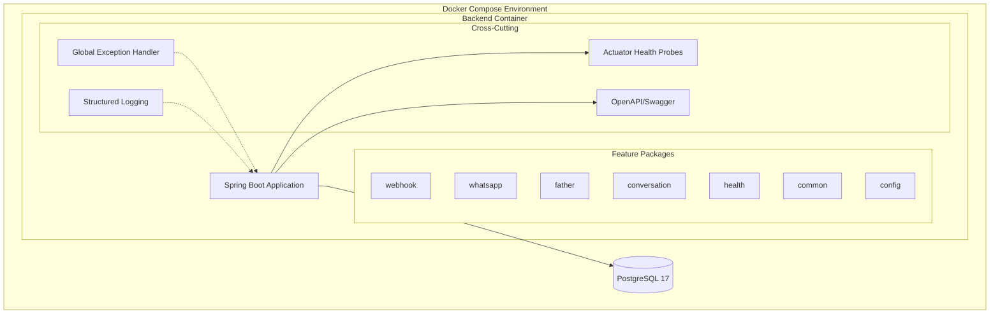
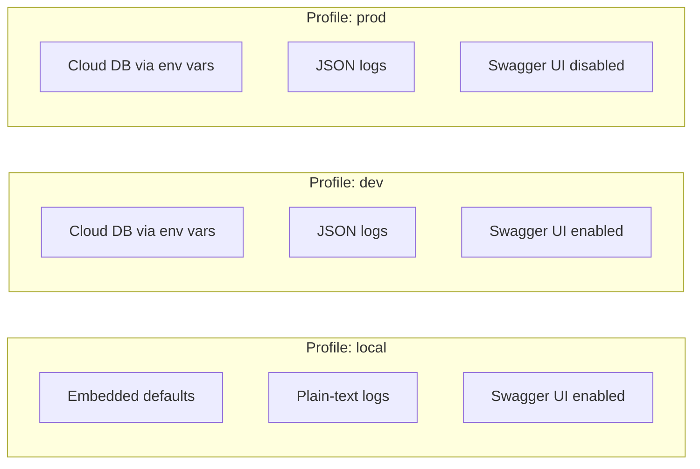
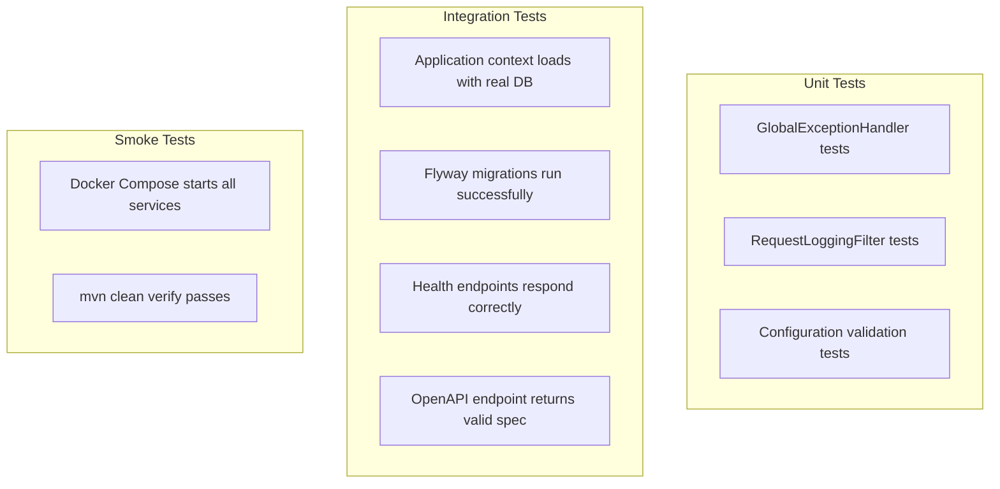

# Design Document: Production Foundation

## Overview

This design establishes the production-grade foundation for the Dad Coach backend — a Spring Boot 4.1.0 / Java 21 monolith using package-by-feature architecture. The scope is strictly infrastructure, architecture, and quality tooling; no new business logic is introduced. The foundation provides: standardized project structure, environment-driven configuration, Docker-based development environment, Flyway migrations, OpenAPI documentation, RFC 9457 Problem Details error handling, structured JSON logging, health probes, testing infrastructure with Testcontainers, and code quality conventions.

All future features (conversation memory, AI coaching, scheduling, child registration) will build upon this foundation without requiring structural changes.

### Design Decisions

| Decision | Choice | Rationale |
|----------|--------|-----------|
| Architecture style | Package-by-feature monolith | Each domain owns its full vertical slice; easy to extract to microservices later |
| DTO mapping | MapStruct (compile-time) | Zero runtime overhead, compile-time type safety, IDE support |
| API docs | SpringDoc OpenAPI 2.x | Auto-generates from code, supports Spring Boot 4.x, provides Swagger UI |
| Error format | RFC 9457 Problem Details via Spring's built-in support | Standard format, Spring Boot 4.x has native ProblemDetail support |
| Logging | Logback with JSON encoder (logstash-logback-encoder) | Structured logs for production observability; plain text for local dev |
| Testing | JUnit 5 + Mockito + Testcontainers | Industry standard; real DB for integration tests |
| Docker build | Multi-stage with eclipse-temurin:21 | Minimal image size, reproducible builds |

## Architecture



### Package Structure

```
com.dadcoach/
├── DadCoachApplication.java          # Entry point
├── common/                           # Shared utilities, base classes, global handlers
│   ├── GlobalExceptionHandler.java   # RFC 9457 Problem Details
│   ├── RequestLoggingFilter.java     # HTTP request/response logging
│   └── package-info.java
├── config/                           # Application-wide configuration beans
│   ├── OpenApiConfig.java            # SpringDoc configuration
│   ├── WhatsAppProperties.java       # WhatsApp config properties
│   └── HttpClientConfig.java         # RestClient builder config
├── webhook/                          # WhatsApp webhook handling
│   └── WhatsAppWebhookController.java
├── whatsapp/                         # WhatsApp API client
│   ├── WhatsAppService.java
│   ├── WhatsAppController.java
│   └── SendTextRequest.java
├── father/                           # Father domain (entity, repo — populated later)
├── conversation/                     # Conversation domain (entity, repo — populated later)
└── health/                           # Custom health indicators (if needed)
```

### Spring Profile Strategy



## Components and Interfaces

### 1. Global Exception Handler (`common/GlobalExceptionHandler.java`)

Replaces the existing `ApiExceptionHandler` with RFC 9457 Problem Details support using Spring's built-in `ProblemDetail` class.

```java
@RestControllerAdvice
public class GlobalExceptionHandler extends ResponseEntityExceptionHandler {

    // Validation errors → 400 with field-level details
    @Override
    protected ResponseEntity<Object> handleMethodArgumentNotValid(...) { ... }

    // Resource not found → 404
    @ExceptionHandler(EntityNotFoundException.class)
    ProblemDetail handleNotFound(EntityNotFoundException ex, HttpServletRequest request) { ... }

    // Catch-all → 500 without stack trace exposure
    @ExceptionHandler(Exception.class)
    ProblemDetail handleGeneral(Exception ex, HttpServletRequest request) { ... }
}
```

**Key behaviors:**
- All responses use `Content-Type: application/problem+json`
- Includes `type`, `title`, `status`, `detail`, `instance` fields
- Never exposes internal stack traces to clients
- Logs full exception at ERROR level internally

### 2. Request Logging Filter (`common/RequestLoggingFilter.java`)

A servlet filter that logs every HTTP request with method, path, status, and duration.

```java
@Component
@Order(Ordered.HIGHEST_PRECEDENCE)
public class RequestLoggingFilter extends OncePerRequestFilter {
    // Logs: {"method":"POST","path":"/webhooks/whatsapp","status":200,"durationMs":45}
}
```

### 3. OpenAPI Configuration (`config/OpenApiConfig.java`)

Configures SpringDoc with application metadata and conditional activation.

```java
@Configuration
@Profile("!prod")
public class OpenApiConfig {
    @Bean
    public OpenAPI dadCoachOpenAPI() {
        return new OpenAPI()
            .info(new Info()
                .title("Dad Coach API")
                .version("0.1.0")
                .description("Dad Coach backend API"));
    }
}
```

### 4. Actuator Health Configuration

Configured via `application.yml` to expose liveness and readiness probes at:
- `/actuator/health` — general health
- `/actuator/health/liveness` — liveness probe for container orchestrators
- `/actuator/health/readiness` — readiness probe (includes DB connectivity)

### 5. Testcontainers Base Class (`test/.../IntegrationTestBase.java`)

Provides a reusable base for integration tests with a shared PostgreSQL container.

```java
@SpringBootTest
@Testcontainers
public abstract class IntegrationTestBase {
    @Container
    static PostgreSQLContainer<?> postgres = new PostgreSQLContainer<>("postgres:17-alpine");

    @DynamicPropertySource
    static void configureProperties(DynamicPropertyRegistry registry) {
        registry.add("spring.datasource.url", postgres::getJdbcUrl);
        registry.add("spring.datasource.username", postgres::getUsername);
        registry.add("spring.datasource.password", postgres::getPassword);
    }
}
```

## Data Models

### Configuration Properties

| Property | Source | Default (local) | Required |
|----------|--------|-----------------|----------|
| `DB_URL` | env var | `jdbc:postgresql://localhost:5432/dadcoach` | Yes |
| `DB_USERNAME` | env var | `dadcoach` | Yes |
| `DB_PASSWORD` | env var | `dadcoach` | Yes |
| `WHATSAPP_PHONE_NUMBER_ID` | env var | — | Yes |
| `WHATSAPP_ACCESS_TOKEN` | env var | — | Yes |
| `WHATSAPP_VERIFY_TOKEN` | env var | `dad-coach-secret` | No |
| `WHATSAPP_API_VERSION` | env var | `v25.0` | No |
| `SPRING_PROFILES_ACTIVE` | env var | `local` | No |
| `SERVER_PORT` | env var | `8080` | No |

### Problem Details Response Schema

```json
{
  "type": "about:blank",
  "title": "Bad Request",
  "status": 400,
  "detail": "Validation failed for field 'phone': must not be blank",
  "instance": "/api/fathers"
}
```

### Database Schema (existing — V1)

The existing Flyway migration `V1__initial_schema.sql` defines:
- `father` — core user entity (phone, display_name, timestamps)
- `conversation_message` — message history (direction, content, provider reference)

No new migrations are introduced in this foundation spec. Future features add their own migrations.

### Docker Compose Service Topology

```yaml
services:
  postgres:    # PostgreSQL 17 with health check, named volume
  backend:     # Spring Boot app, depends_on postgres healthy
```

## Error Handling

### Strategy

All error handling flows through a single `GlobalExceptionHandler` (replacing the existing `ApiExceptionHandler`) that produces RFC 9457 Problem Details responses.

### Error Categories

| Error Type | HTTP Status | Handling |
|------------|-------------|----------|
| Validation failure (`@Valid`) | 400 | Field-level details in Problem Details `detail` field |
| Resource not found | 404 | Entity type and ID in `detail` |
| Unhandled exception | 500 | Generic message to client; full stack trace logged internally |
| Method not allowed | 405 | Standard Spring handling with Problem Details format |
| Unsupported media type | 415 | Standard Spring handling with Problem Details format |

### Logging on Errors

- 4xx errors: logged at WARN level with request context
- 5xx errors: logged at ERROR level with full exception stack trace
- Never log sensitive data (tokens, passwords) in error context

## Testing Strategy

### Why Property-Based Testing Is Not Applicable

This feature is infrastructure and configuration — it defines project structure, Docker setup, environment configuration, error format, logging, and health endpoints. There are no pure functions with varying input spaces or universal properties to validate across generated inputs. The appropriate testing strategies are:

- **Integration tests**: Verify the full stack boots, Flyway runs, health endpoints respond
- **Example-based unit tests**: Verify specific error handling scenarios produce correct Problem Details format
- **Smoke tests**: Verify Docker Compose starts, Swagger UI is accessible, profiles activate correctly

### Test Architecture



### Test Plan

| Test | Type | Validates |
|------|------|-----------|
| `ApplicationContextIntegrationTest` | Integration | App boots, Flyway runs, context loads (Req 10.4, 13.1) |
| `HealthEndpointIntegrationTest` | Integration | Health, liveness, readiness return UP (Req 9.1-9.4) |
| `GlobalExceptionHandlerTest` | Unit | Validation → 400, NotFound → 404, General → 500 with Problem Details (Req 7.1-7.4) |
| `OpenApiIntegrationTest` | Integration | `/v3/api-docs` returns valid JSON (Req 6.2, 13.4) |
| `ProfileActivationTest` | Unit | Correct beans active per profile (Req 3.1) |

### Dependencies

| Dependency | Scope | Purpose |
|------------|-------|---------|
| `spring-boot-starter-test` | test | JUnit 5, Mockito, MockMvc |
| `testcontainers` (PostgreSQL) | test | Real DB for integration tests |
| `rest-assured` (optional) | test | Fluent HTTP assertions |

### Test Execution

- `mvn test` — unit tests only (fast, no containers)
- `mvn verify` — unit + integration tests (starts Testcontainers PostgreSQL)
- Integration tests are identified by naming convention `*IntegrationTest.java` or `@Tag("integration")`

### Key Conventions

1. Each integration test class extends `IntegrationTestBase` for shared PostgreSQL container
2. Unit tests use Mockito for dependency isolation
3. No placeholder tests (`contextPlaceholder`) — every test asserts real behavior
4. Tests follow Arrange-Act-Assert pattern
5. Minimum 100 iterations NOT required (no PBT) — example-based tests with meaningful assertions
