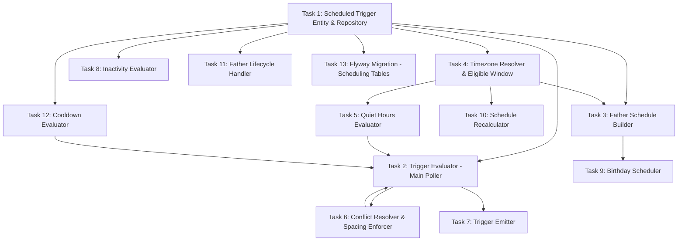

# Tasks — Scheduling & Automation

## Task Dependency Graph

## Tasks

### Task 1: Scheduled Trigger Entity & Repository
- **Description**: Implement the ScheduledTrigger and TriggerHistory JPA entities with all fields (automation_type, fire_at, window_expires_at, priority, status, context JSONB) and repository interfaces.
- **Files to create/modify**:
  - `backend/src/main/java/com/dadcoach/scheduler/entity/ScheduledTrigger.java`
  - `backend/src/main/java/com/dadcoach/scheduler/entity/TriggerHistory.java`
  - `backend/src/main/java/com/dadcoach/scheduler/repository/ScheduledTriggerRepository.java`
  - `backend/src/main/java/com/dadcoach/scheduler/repository/TriggerHistoryRepository.java`
  - `backend/src/main/java/com/dadcoach/scheduler/config/SchedulerProperties.java`
- **Acceptance criteria**:
  - [ ] ScheduledTrigger entity with: automation_type, fire_at (UTC), window_expires_at, priority, status, context JSONB
  - [ ] Status values: SCHEDULED, FIRED, MISSED, CANCELLED
  - [ ] TriggerHistory entity for audit trail
  - [ ] Repository: findDue(now, limit), findByFatherAndStatus
  - [ ] SchedulerProperties: poll interval, maintenance window, default times
  - [ ] fire_at stored in UTC (computed from local timezone)
- **Dependencies**: None

### Task 2: Trigger Evaluator - Main Poller
- **Description**: Implement the TriggerEvaluator that runs every 30 seconds, finds due triggers, groups by father, applies precondition checks, resolves conflicts, and emits the winning trigger.
- **Files to create/modify**:
  - `backend/src/main/java/com/dadcoach/scheduler/TriggerEvaluator.java`
- **Acceptance criteria**:
  - [ ] Polls every 30 seconds (configurable via property)
  - [ ] Fetches due triggers (fire_at <= now AND status = SCHEDULED), batch of 100
  - [ ] Groups by father for per-father conflict resolution
  - [ ] Checks preconditions: father status must be eligible (ACTIVE)
  - [ ] Precondition failed → mark MISSED with reason
  - [ ] After conflict resolution, exactly one trigger per father fires per cycle
  - [ ] Remaining triggers deferred or discarded
- **Dependencies**: Task 1, Task 5, Task 6, Task 12

### Task 3: Father Schedule Builder
- **Description**: Implement the FatherScheduleBuilder that creates the initial trigger schedule when a father completes onboarding (daily coaching at preferred_time ± 15min randomization).
- **Files to create/modify**:
  - `backend/src/main/java/com/dadcoach/scheduler/schedule/FatherScheduleBuilder.java`
- **Acceptance criteria**:
  - [ ] Creates daily coaching trigger at preferred_coaching_time ± 15min
  - [ ] Randomization applied at schedule creation time (persisted, not re-randomized on retry)
  - [ ] Weekly summary trigger: Monday 08:00 local
  - [ ] All triggers computed in father's local timezone, stored as UTC
  - [ ] Schedule created on onboarding completion event
  - [ ] First trigger scheduled for next eligible day
- **Dependencies**: Task 1, Task 4

### Task 4: Timezone Resolver & Eligible Window
- **Description**: Implement the TimezoneResolver (local→UTC conversion, DST-safe) and EligibleWindowEvaluator (07:00-21:00 local check).
- **Files to create/modify**:
  - `backend/src/main/java/com/dadcoach/scheduler/timing/TimezoneResolver.java`
  - `backend/src/main/java/com/dadcoach/scheduler/timing/EligibleWindowEvaluator.java`
- **Acceptance criteria**:
  - [ ] Converts local time to UTC using father's configured timezone
  - [ ] Handles DST transitions correctly (uses java.time ZoneId)
  - [ ] Eligible window: 07:00-21:00 in father's local time
  - [ ] Times outside eligible window deferred to 07:00 next day
  - [ ] All computation in local; final storage in UTC
- **Dependencies**: None

### Task 5: Quiet Hours Evaluator
- **Description**: Implement the QuietHoursEvaluator that checks whether a given UTC time falls within the father's quiet hours (21:00-07:00 local) and defers triggers appropriately.
- **Files to create/modify**:
  - `backend/src/main/java/com/dadcoach/scheduler/timing/QuietHoursEvaluator.java`
- **Acceptance criteria**:
  - [ ] Quiet hours: 21:00-07:00 in father's local timezone
  - [ ] `isQuietHours(fatherId, Instant utcTime)` → boolean
  - [ ] Triggers during quiet hours deferred to 07:00 local next morning
  - [ ] Safety check: if fire_at somehow in quiet hours, defer and log scheduling error
  - [ ] Custom quiet hours per father supported (future)
- **Dependencies**: Task 4

### Task 6: Conflict Resolver & Spacing Enforcer
- **Description**: Implement the ConflictResolver (priority-based single-winner selection when multiple triggers due for same father) and SpacingEnforcer (4-hour minimum gap between proactive messages).
- **Files to create/modify**:
  - `backend/src/main/java/com/dadcoach/scheduler/conflict/ConflictResolver.java`
  - `backend/src/main/java/com/dadcoach/scheduler/conflict/SpacingEnforcer.java`
- **Acceptance criteria**:
  - [ ] Multiple triggers for same father → highest priority wins
  - [ ] Priority defined per automation_type (configurable)
  - [ ] Exactly one trigger fires per father per evaluation cycle
  - [ ] 4-hour minimum gap between proactive messages enforced
  - [ ] proactive_messages_today counter READ from Conversation Engine (single source of truth)
  - [ ] Spacing violation → defer trigger, don't discard
- **Dependencies**: Task 1

### Task 7: Trigger Emitter
- **Description**: Implement the TriggerEmitter that writes fired triggers as Automation_Trigger entries to the side-effect outbox for consumption by the Conversation Engine.
- **Files to create/modify**:
  - `backend/src/main/java/com/dadcoach/scheduler/TriggerEmitter.java`
- **Acceptance criteria**:
  - [ ] Writes to the shared side_effect_outbox table (SPEC-005 format)
  - [ ] Trigger payload includes: automation_type, father_id, conversation_type, child_id (if applicable)
  - [ ] Conversation Engine processes triggers via same pipeline as inbound messages
  - [ ] Guarantees Session_Lock acquisition and precondition checking
  - [ ] Marks trigger as FIRED with fired_at timestamp
  - [ ] Writes history entry to trigger_history table
- **Dependencies**: Task 2

### Task 8: Inactivity Evaluator
- **Description**: Implement the InactivityEvaluator that computes inactivity thresholds (3/7/14/21 days) from father's last_interaction_at and creates one-time triggers when thresholds are crossed.
- **Files to create/modify**:
  - `backend/src/main/java/com/dadcoach/scheduler/inactivity/InactivityEvaluator.java`
- **Acceptance criteria**:
  - [ ] Runs hourly (evaluates all active fathers)
  - [ ] Thresholds: 3, 7, 14, 21 days since last_interaction_at
  - [ ] Creates one-time INACTIVITY trigger when threshold crossed
  - [ ] No duplicate: checks no pending INACTIVITY trigger exists before creation
  - [ ] Any father message resets ALL pending inactivity triggers (cancel them)
  - [ ] 21-day threshold triggers CHURN consideration
- **Dependencies**: Task 1

### Task 9: Birthday Scheduler
- **Description**: Implement the BirthdayScheduler that computes birthday triggers 7 days before each child's birthday and recalculates when children are added/modified.
- **Files to create/modify**:
  - `backend/src/main/java/com/dadcoach/scheduler/schedule/BirthdayScheduler.java`
- **Acceptance criteria**:
  - [ ] Birthday trigger fires 7 days before child's birthday
  - [ ] Handles year wrap-around (Dec/Jan boundary)
  - [ ] Recalculates on child add/update/delete events
  - [ ] One trigger per child per year
  - [ ] Includes child_id in trigger context
  - [ ] Computed in father's timezone, stored as UTC
- **Dependencies**: Task 3

### Task 10: Schedule Recalculator
- **Description**: Implement the ScheduleRecalculator that handles timezone changes and preference updates by cancelling pending triggers and recomputing the schedule.
- **Files to create/modify**:
  - `backend/src/main/java/com/dadcoach/scheduler/schedule/ScheduleRecalculator.java`
- **Acceptance criteria**:
  - [ ] Timezone change → cancel all pending triggers, recompute for next day
  - [ ] Preferred time change → cancel daily coaching trigger, reschedule with new time
  - [ ] DST transition handling: recompute affected triggers
  - [ ] Cancelled triggers logged with reason RECALCULATED
  - [ ] New schedule starts from next eligible time slot
- **Dependencies**: Task 4

### Task 11: Father Lifecycle Handler
- **Description**: Implement the FatherLifecycleHandler that responds to father status transitions (ACTIVE→PAUSED: suspend triggers, PAUSED→ACTIVE: reactivate, CHURNED: cancel all).
- **Files to create/modify**:
  - `backend/src/main/java/com/dadcoach/scheduler/lifecycle/FatherLifecycleHandler.java`
- **Acceptance criteria**:
  - [ ] ACTIVE → PAUSED: suspend all SCHEDULED triggers (status → CANCELLED with reason PAUSED)
  - [ ] PAUSED → ACTIVE: rebuild schedule from scratch
  - [ ] ACTIVE → CHURNED: cancel all triggers permanently
  - [ ] CHURNED → REACTIVATED: rebuild schedule
  - [ ] Listens to father status change events
  - [ ] Never fires triggers for non-ACTIVE fathers
- **Dependencies**: Task 1

### Task 12: Cooldown Evaluator
- **Description**: Implement the CooldownEvaluator that enforces post-conversation cooldowns before next proactive trigger (configurable per completion type).
- **Files to create/modify**:
  - `backend/src/main/java/com/dadcoach/scheduler/timing/CooldownEvaluator.java`
- **Acceptance criteria**:
  - [ ] After EXPIRED conversation: 24h cooldown
  - [ ] After ABANDONED conversation: 48h cooldown
  - [ ] After COMPLETED conversation: 0s cooldown (immediate)
  - [ ] Cooldown checked before trigger emission
  - [ ] If in cooldown → defer trigger past cooldown period
  - [ ] Cooldown values configurable via application.yml
- **Dependencies**: Task 1

### Task 13: Flyway Migration - Scheduling Tables
- **Description**: Create the Flyway migration for scheduling tables: scheduled_triggers and trigger_history.
- **Files to create/modify**:
  - `backend/src/main/resources/db/migration/V8__scheduling_automation.sql`
- **Acceptance criteria**:
  - [ ] scheduled_triggers table with all columns from design
  - [ ] Index on (fire_at, status) WHERE status = 'SCHEDULED'
  - [ ] Index on (father_id, status)
  - [ ] trigger_history table with index on (father_id, created_at DESC)
  - [ ] Status CHECK constraint on scheduled_triggers
  - [ ] Migration runs successfully against PostgreSQL
- **Dependencies**: Task 1
