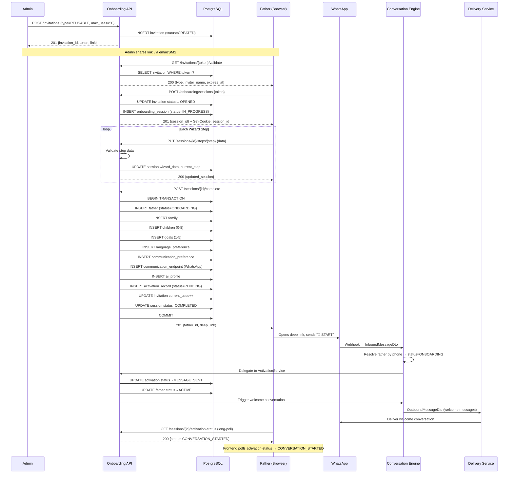
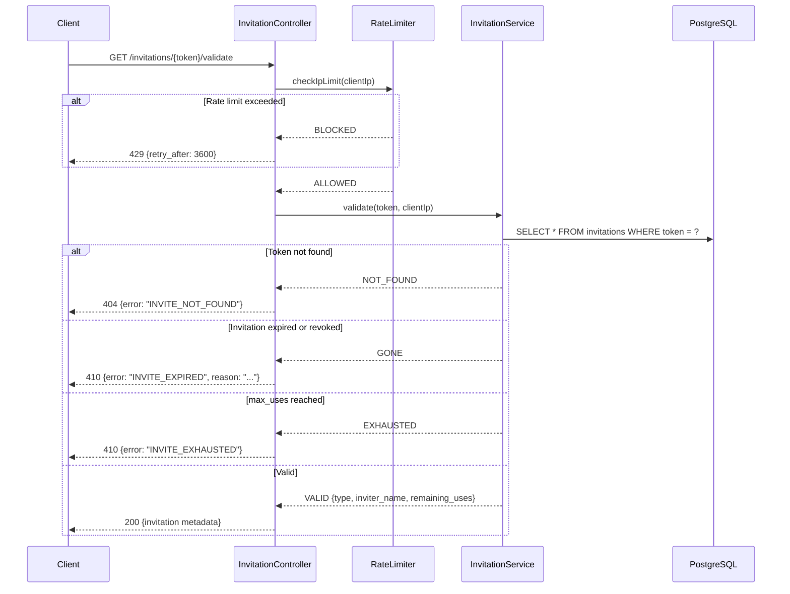
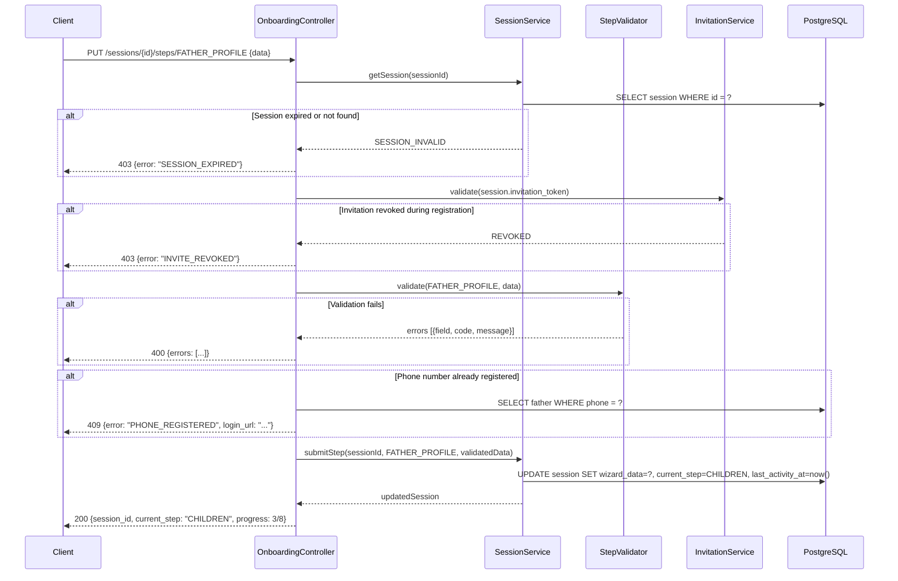
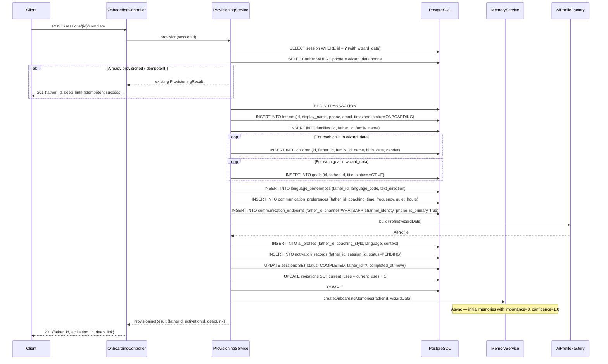
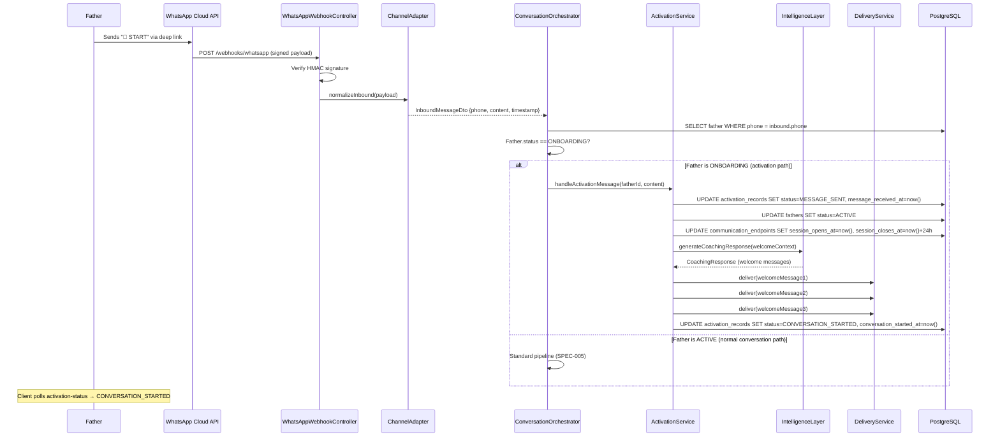
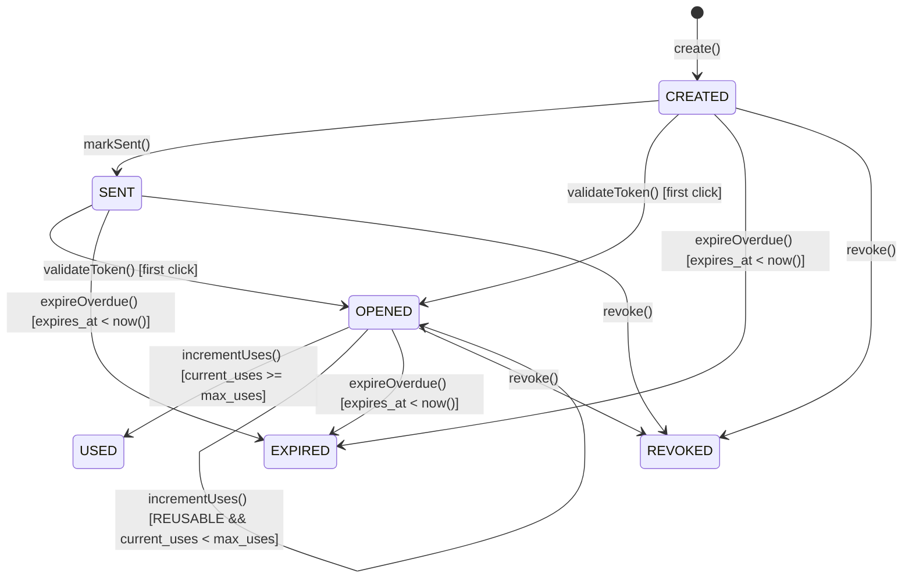
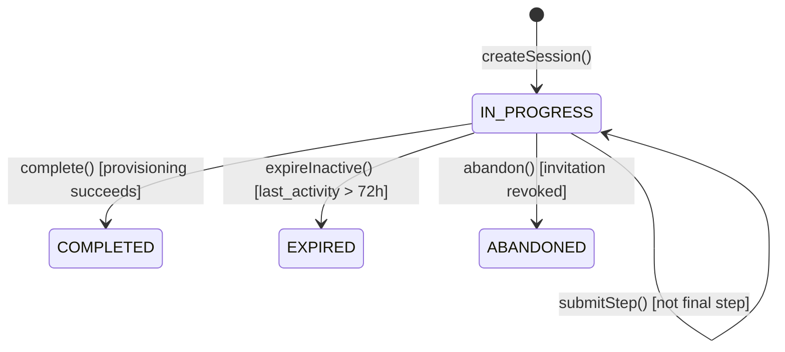
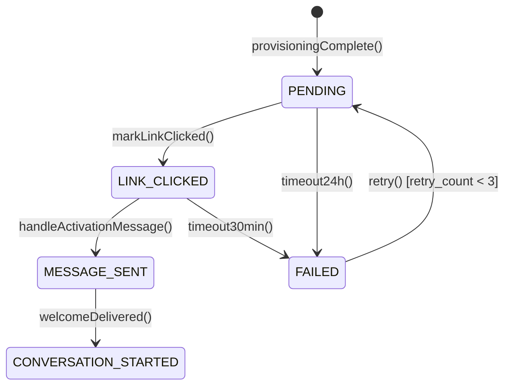

# Technical Design — User Onboarding & Activation

## Architecture

### Overview

The User Onboarding & Activation subsystem implements the backend services for the registration journey: invitation validation, multi-step wizard API, automatic provisioning of all domain entities, and WhatsApp activation handshake. It operates within the Spring Boot monolith as a set of services coordinating across the Father domain (SPEC-002), Communication Channel (SPEC-006), Conversation Engine (SPEC-005), Intelligence Layer (SPEC-003), and Memory System (SPEC-004).

**This design covers the backend only.** The frontend (web registration wizard) will be specified and implemented separately in the dad-coach-web project. This subsystem exposes a REST API consumed by that frontend.

The subsystem is stateful (server-side wizard sessions) but idempotent — every operation can be safely retried. It exposes a REST API consumed by the frontend registration wizard (SPA) and integrates with the Communication Channel's webhook path for activation detection.

### Architecture Decisions

**AD-1: Server-Side Session State** — Wizard progress is stored in PostgreSQL (not client-side). This enables resume across devices, prevents data tampering, and supports the 72-hour session TTL with server-controlled expiration. The session cookie is a random 256-bit ID referencing the server record.

**AD-2: Single Atomic Transaction for Provisioning** — All entities created during provisioning (Father, Family, Children, Goals, Preferences, AI_Profile, Communication_Endpoint, Memories) are persisted in one database transaction. If any creation fails, the entire transaction rolls back. This guarantees no orphaned partial state.

**AD-3: Invitation Token as URL Identifier** — The invitation token (32 Base62 chars, ~190 bits entropy) is used directly in URLs. No secondary lookup table or indirection. The token column has a unique index for O(1) lookup.

**AD-4: Activation via Webhook Listener** — Activation detection piggybacks on the existing WhatsApp webhook (SPEC-006). When the Communication Channel normalizes an inbound message, the Conversation Engine (SPEC-005) checks if the sender is in ONBOARDING status and delegates to the Activation Service before standard pipeline processing.

**AD-5: Long-Polling for Activation Status** — The activation status endpoint uses server-side long-polling (30s hold) rather than WebSockets. This avoids infrastructure complexity while reducing frontend polling overhead from 3s intervals to near-instant notification.

**AD-6: Scheduled Expiration Jobs** — Invitation expiration and session cleanup run as Spring `@Scheduled` jobs during off-peak hours (02:00 UTC). They process in batches to avoid lock contention with active registration flows.

**AD-7: Encryption at Rest for Wizard Data** — The `wizard_data` JSONB field is encrypted with AES-256-GCM before persistence using a JPA `AttributeConverter`. The encryption key is managed via application properties (externalized in production).

**AD-8: Localization via Spring MessageSource** — Translations are stored as `messages_{locale}.properties` resource bundles. The `MessageSource` is configured for runtime reload without application restart. The frontend receives pre-rendered localized content from the API.

### Package Structure

```
com.dadcoach.onboarding/
├── OnboardingController.java            # REST endpoints for wizard flow
├── InvitationController.java            # REST endpoints for invitation management
├── invitation/
│   ├── InvitationService.java           # Invitation CRUD, validation, lifecycle
│   ├── InvitationTokenGenerator.java    # CSPRNG Base62 token generation
│   ├── Invitation.java                  # JPA entity
│   ├── InvitationRepository.java        # Spring Data JPA repository
│   ├── InvitationStatus.java            # Enum: CREATED, SENT, OPENED, USED, EXPIRED, REVOKED
│   ├── InvitationType.java              # Enum: SINGLE_USE, REUSABLE
│   └── InvitationExpirationJob.java     # @Scheduled daily expiration
├── session/
│   ├── OnboardingSessionService.java    # Session lifecycle, step transitions
│   ├── OnboardingSession.java           # JPA entity
│   ├── OnboardingSessionRepository.java
│   ├── WizardStep.java                  # Enum: WELCOME...ACTIVATION
│   ├── SessionStatus.java              # Enum: IN_PROGRESS, COMPLETED, EXPIRED, ABANDONED
│   ├── WizardDataEncryptor.java         # AES-256-GCM AttributeConverter
│   └── SessionCleanupJob.java           # @Scheduled session expiration
├── wizard/
│   ├── StepValidator.java               # Per-step input validation
│   ├── StepValidationResult.java        # Validation result with field errors
│   └── WizardData.java                  # Typed accessor for wizard_data JSONB
├── provisioning/
│   ├── ProvisioningService.java         # Atomic entity creation orchestration
│   ├── ProvisioningResult.java          # Result record with created entity IDs
│   └── AiProfileFactory.java           # Builds AI_Profile from wizard data
├── activation/
│   ├── ActivationService.java           # Activation lifecycle management
│   ├── ActivationRecord.java            # JPA entity
│   ├── ActivationRecordRepository.java
│   ├── ActivationStatus.java            # Enum: PENDING...FAILED
│   ├── ActivationListener.java          # Listens for inbound activation messages
│   └── ActivationTimeoutJob.java        # @Scheduled 30min/24h timeout handling
├── localization/
│   ├── LocalizationService.java         # Message resolution + interpolation
│   ├── LanguagePreference.java          # JPA entity
│   └── TextDirection.java               # Enum: RTL, LTR
├── security/
│   ├── OnboardingRateLimiter.java       # IP and phone-based rate limiting
│   ├── CsrfTokenService.java           # Synchronizer token pattern
│   └── InputSanitizer.java             # XSS prevention utilities
└── dto/
    ├── InvitationValidationResponse.java
    ├── SessionCreateRequest.java
    ├── SessionCreateResponse.java
    ├── StepSubmissionRequest.java
    ├── StepSubmissionResponse.java
    ├── ProvisioningResponse.java
    ├── ActivationStatusResponse.java
    └── ErrorResponse.java
```

## Components and Interfaces

### InvitationService

```java
public interface InvitationService {
    Invitation create(InvitationCreateRequest request, UUID createdBy);
    InvitationValidationResult validate(String token, String clientIp);
    void markOpened(UUID invitationId);
    void incrementUses(UUID invitationId);
    void revoke(UUID invitationId, UUID revokedBy);
    void expireOverdue();  // Called by scheduled job
}
```

### OnboardingSessionService

```java
public interface OnboardingSessionService {
    OnboardingSession create(String invitationToken, String clientIp, String userAgent);
    OnboardingSession getSession(UUID sessionId);
    OnboardingSession submitStep(UUID sessionId, WizardStep step, Map<String, Object> data);
    OnboardingSession navigateBack(UUID sessionId, WizardStep targetStep);
    void expireInactiveSessions();  // Called by scheduled job
    Optional<OnboardingSession> findByPhoneNumber(String phoneNumber);
}
```

### ProvisioningService

```java
public interface ProvisioningService {
    /**
     * Creates all domain entities from completed wizard data in a single transaction.
     * Idempotent: returns existing result if phone_number already provisioned.
     */
    @Transactional
    ProvisioningResult provision(UUID sessionId);
}
```

### ActivationService

```java
/**
 * Orchestrator for the activation flow. Coordinates between domain services
 * (FatherService, SessionWindowService, ConversationEngine) without owning
 * business logic itself.
 */
public interface ActivationService {
    ActivationRecord createPendingActivation(UUID fatherId, UUID sessionId);
    void markLinkClicked(UUID activationId);
    ActivationStatusResponse getStatus(UUID sessionId);  // Supports long-polling
    void handleActivationMessage(UUID fatherId, String messageContent);
    void handleActivationTimeout(UUID activationId);
    String generateDeepLink(UUID fatherId, String language);
}
```

### LocalizationService

```java
public interface LocalizationService {
    String getMessage(String key, String language, Object... args);
    Map<String, String> getStepMessages(WizardStep step, String language);
    TextDirection getTextDirection(String language);
    String getDateFormat(String language);
    String getTimeFormat(String language);
}
```

### Integration Points

| Subsystem | Interface | Direction | Purpose |
|-----------|-----------|-----------|---------|
| Father Domain (SPEC-002) | `FatherRepository.save()` | Outbound | Create Father entity during provisioning |
| Communication Channel (SPEC-006) | `CommunicationEndpointRepository.save()` | Outbound | Create WhatsApp endpoint during provisioning |
| Conversation Engine (SPEC-005) | `ConversationOrchestrator.processMessage()` | Inbound | Activation message routed through existing pipeline |
| Intelligence Layer (SPEC-003) | `IntelligenceLayer.generateCoachingResponse()` | Outbound | Generate welcome conversation after activation |
| Memory System (SPEC-004) | `MemoryService.triggerExtraction()` | Outbound | Create initial onboarding memories |
| Communication Channel (SPEC-006) | `DeliveryService.deliver()` | Outbound | Send welcome message via WhatsApp |

## Sequence Diagrams

### Full Invitation → Registration → Provisioning → Activation Flow



### Invitation Validation Sequence



### Step Submission Sequence



### Provisioning Sequence



### WhatsApp Activation Sequence



## Domain Model

### Entity Relationship Diagram

```mermaid
erDiagram
    INVITATION ||--o{ ONBOARDING_SESSION : "spawns"
    ONBOARDING_SESSION ||--o| FATHER : "provisions"
    ONBOARDING_SESSION ||--|| ACTIVATION_RECORD : "triggers"
    FATHER ||--|| LANGUAGE_PREFERENCE : "has"
    FATHER ||--|| COMMUNICATION_PREFERENCE : "has"
    FATHER ||--|| COMMUNICATION_ENDPOINT : "registered via"
    FATHER ||--o{ CHILD : "parents"
    FATHER ||--o{ GOAL : "pursues"
    FATHER ||--|| AI_PROFILE : "configured with"
    FATHER ||--|| FAMILY : "belongs to"
    FAMILY ||--o{ CHILD : "contains"

    INVITATION {
        uuid invitation_id PK
        string token UK "32 char Base62"
        enum type "SINGLE_USE, REUSABLE"
        enum status "CREATED, SENT, OPENED, USED, EXPIRED, REVOKED"
        uuid created_by FK
        timestamp created_at
        timestamp expires_at
        int max_uses
        int current_uses
        jsonb metadata
    }

    ONBOARDING_SESSION {
        uuid session_id PK
        uuid invitation_id FK
        uuid father_id FK "nullable until provisioning"
        enum current_step "WELCOME..ACTIVATION"
        enum status "IN_PROGRESS, COMPLETED, EXPIRED, ABANDONED"
        jsonb wizard_data "encrypted AES-256-GCM"
        string language "he, en"
        timestamp started_at
        timestamp last_activity_at
        timestamp completed_at
        timestamp expires_at
        string ip_address
        string user_agent
    }

    ACTIVATION_RECORD {
        uuid activation_id PK
        uuid father_id FK UK
        uuid session_id FK
        enum status "PENDING, LINK_CLICKED, MESSAGE_SENT, CONVERSATION_STARTED, FAILED"
        timestamp deep_link_generated_at
        timestamp link_clicked_at
        timestamp message_received_at
        timestamp conversation_started_at
        int retry_count
        string failure_reason
    }

    LANGUAGE_PREFERENCE {
        uuid preference_id PK
        uuid father_id FK UK
        string language_code "BCP 47"
        string date_format
        string time_format
        enum text_direction "RTL, LTR"
        timestamp updated_at
    }

    COMMUNICATION_PREFERENCE {
        uuid preference_id PK
        uuid father_id FK UK
        time preferred_coaching_time
        enum notification_frequency "DAILY, EVERY_OTHER_DAY, TWICE_WEEKLY"
        time quiet_hours_start
        time quiet_hours_end
        boolean email_notifications
        timestamp updated_at
    }
```

### JPA Entity Design

```java
// --- Invitation Entity ---
@Entity
@Table(name = "invitations", indexes = {
    @Index(name = "idx_invitations_token", columnList = "token", unique = true),
    @Index(name = "idx_invitations_status_expires", columnList = "status, expires_at")
})
public class Invitation {
    @Id
    @GeneratedValue
    private UUID invitationId;  // UUID v7

    @Column(nullable = false, unique = true, length = 32)
    private String token;

    @Enumerated(EnumType.STRING)
    @Column(nullable = false, length = 15)
    private InvitationType type;

    @Enumerated(EnumType.STRING)
    @Column(nullable = false, length = 10)
    private InvitationStatus status;

    @Column(nullable = false)
    private UUID createdBy;

    @Column(nullable = false)
    private Instant createdAt;

    @Column(nullable = false)
    private Instant expiresAt;

    @Column(nullable = false)
    private Integer maxUses;

    @Column(nullable = false)
    private Integer currentUses = 0;

    @JdbcTypeCode(SqlTypes.JSON)
    private Map<String, Object> metadata;
}

// --- Onboarding Session Entity ---
@Entity
@Table(name = "onboarding_sessions", indexes = {
    @Index(name = "idx_sessions_invitation", columnList = "invitation_id"),
    @Index(name = "idx_sessions_father", columnList = "father_id"),
    @Index(name = "idx_sessions_status_expires", columnList = "status, expires_at")
})
public class OnboardingSession {
    @Id
    @GeneratedValue
    private UUID sessionId;  // UUID v7

    @Column(nullable = false)
    private UUID invitationId;

    private UUID fatherId;  // Nullable until provisioning

    @Enumerated(EnumType.STRING)
    @Column(nullable = false, length = 20)
    private WizardStep currentStep;

    @Enumerated(EnumType.STRING)
    @Column(nullable = false, length = 15)
    private SessionStatus status;

    @Convert(converter = WizardDataEncryptor.class)
    @JdbcTypeCode(SqlTypes.JSON)
    @Column(columnDefinition = "bytea")
    private WizardData wizardData;

    @Column(length = 5)
    private String language;

    @Column(nullable = false)
    private Instant startedAt;

    @Column(nullable = false)
    private Instant lastActivityAt;

    private Instant completedAt;

    @Column(nullable = false)
    private Instant expiresAt;

    @Column(length = 45)
    private String ipAddress;

    @Column(length = 500)
    private String userAgent;
}

// --- Activation Record Entity ---
@Entity
@Table(name = "activation_records", indexes = {
    @Index(name = "idx_activation_father", columnList = "father_id", unique = true),
    @Index(name = "idx_activation_status", columnList = "status")
})
public class ActivationRecord {
    @Id
    @GeneratedValue
    private UUID activationId;  // UUID v7

    @Column(nullable = false, unique = true)
    private UUID fatherId;

    @Column(nullable = false)
    private UUID sessionId;

    @Enumerated(EnumType.STRING)
    @Column(nullable = false, length = 25)
    private ActivationStatus status;

    private Instant deepLinkGeneratedAt;
    private Instant linkClickedAt;
    private Instant messageReceivedAt;
    private Instant conversationStartedAt;

    @Column(nullable = false)
    private Integer retryCount = 0;

    @Column(length = 200)
    private String failureReason;
}
```

## Database Schema (Flyway Migration)

```sql
-- V007_001__create_onboarding_tables.sql

-- Invitation table
CREATE TABLE invitations (
    invitation_id       UUID PRIMARY KEY DEFAULT gen_random_uuid(),
    token               VARCHAR(32) NOT NULL,
    type                VARCHAR(15) NOT NULL,  -- SINGLE_USE, REUSABLE
    status              VARCHAR(10) NOT NULL DEFAULT 'CREATED',
    created_by          UUID NOT NULL,
    created_at          TIMESTAMPTZ NOT NULL DEFAULT now(),
    expires_at          TIMESTAMPTZ NOT NULL,
    max_uses            INTEGER NOT NULL DEFAULT 1,
    current_uses        INTEGER NOT NULL DEFAULT 0,
    metadata            JSONB,
    CONSTRAINT uq_invitations_token UNIQUE (token),
    CONSTRAINT chk_invitations_type CHECK (type IN ('SINGLE_USE', 'REUSABLE')),
    CONSTRAINT chk_invitations_status CHECK (status IN ('CREATED', 'SENT', 'OPENED', 'USED', 'EXPIRED', 'REVOKED')),
    CONSTRAINT chk_invitations_uses CHECK (current_uses >= 0 AND current_uses <= max_uses)
);

CREATE INDEX idx_invitations_status_expires ON invitations(status, expires_at)
    WHERE status NOT IN ('EXPIRED', 'REVOKED', 'USED');
CREATE INDEX idx_invitations_created_by ON invitations(created_by);

-- Onboarding session table
CREATE TABLE onboarding_sessions (
    session_id          UUID PRIMARY KEY DEFAULT gen_random_uuid(),
    invitation_id       UUID NOT NULL REFERENCES invitations(invitation_id),
    father_id           UUID,  -- Nullable until provisioning; FK added after fathers table exists
    current_step        VARCHAR(20) NOT NULL DEFAULT 'WELCOME',
    status              VARCHAR(15) NOT NULL DEFAULT 'IN_PROGRESS',
    wizard_data         BYTEA,  -- AES-256-GCM encrypted JSONB
    language            VARCHAR(5),
    started_at          TIMESTAMPTZ NOT NULL DEFAULT now(),
    last_activity_at    TIMESTAMPTZ NOT NULL DEFAULT now(),
    completed_at        TIMESTAMPTZ,
    expires_at          TIMESTAMPTZ NOT NULL,
    ip_address          VARCHAR(45),
    user_agent          VARCHAR(500),
    CONSTRAINT chk_sessions_step CHECK (current_step IN (
        'WELCOME', 'LANGUAGE', 'FATHER_PROFILE', 'CHILDREN', 'GOALS', 'PREFERENCES', 'REVIEW', 'ACTIVATION'
    )),
    CONSTRAINT chk_sessions_status CHECK (status IN ('IN_PROGRESS', 'COMPLETED', 'EXPIRED', 'ABANDONED'))
);

CREATE INDEX idx_sessions_invitation ON onboarding_sessions(invitation_id);
CREATE INDEX idx_sessions_father ON onboarding_sessions(father_id) WHERE father_id IS NOT NULL;
CREATE INDEX idx_sessions_status_expires ON onboarding_sessions(status, expires_at)
    WHERE status = 'IN_PROGRESS';

-- Activation record table
CREATE TABLE activation_records (
    activation_id           UUID PRIMARY KEY DEFAULT gen_random_uuid(),
    father_id               UUID NOT NULL UNIQUE,
    session_id              UUID NOT NULL REFERENCES onboarding_sessions(session_id),
    status                  VARCHAR(25) NOT NULL DEFAULT 'PENDING',
    deep_link_generated_at  TIMESTAMPTZ,
    link_clicked_at         TIMESTAMPTZ,
    message_received_at     TIMESTAMPTZ,
    conversation_started_at TIMESTAMPTZ,
    retry_count             INTEGER NOT NULL DEFAULT 0,
    failure_reason          VARCHAR(200),
    CONSTRAINT chk_activation_status CHECK (status IN (
        'PENDING', 'LINK_CLICKED', 'MESSAGE_SENT', 'CONVERSATION_STARTED', 'FAILED'
    )),
    CONSTRAINT chk_activation_retry CHECK (retry_count >= 0 AND retry_count <= 3)
);

CREATE INDEX idx_activation_status ON activation_records(status) WHERE status IN ('PENDING', 'LINK_CLICKED');
```

```sql
-- V007_002__create_preference_tables.sql

-- Language preference table
CREATE TABLE language_preferences (
    preference_id       UUID PRIMARY KEY DEFAULT gen_random_uuid(),
    father_id           UUID NOT NULL UNIQUE,
    language_code       VARCHAR(5) NOT NULL DEFAULT 'he',
    date_format         VARCHAR(20) NOT NULL DEFAULT 'dd/MM/yyyy',
    time_format         VARCHAR(20) NOT NULL DEFAULT 'HH:mm',
    text_direction      VARCHAR(3) NOT NULL DEFAULT 'RTL',
    updated_at          TIMESTAMPTZ NOT NULL DEFAULT now(),
    CONSTRAINT chk_lang_direction CHECK (text_direction IN ('RTL', 'LTR')),
    CONSTRAINT chk_lang_code CHECK (language_code IN ('he', 'en'))
);

-- Communication preference table
CREATE TABLE communication_preferences (
    preference_id           UUID PRIMARY KEY DEFAULT gen_random_uuid(),
    father_id               UUID NOT NULL UNIQUE,
    preferred_coaching_time TIME NOT NULL DEFAULT '08:00',
    notification_frequency  VARCHAR(20) NOT NULL DEFAULT 'DAILY',
    quiet_hours_start       TIME NOT NULL DEFAULT '21:00',
    quiet_hours_end         TIME NOT NULL DEFAULT '07:00',
    email_notifications     BOOLEAN NOT NULL DEFAULT true,
    updated_at              TIMESTAMPTZ NOT NULL DEFAULT now(),
    CONSTRAINT chk_notification_freq CHECK (notification_frequency IN ('DAILY', 'EVERY_OTHER_DAY', 'TWICE_WEEKLY'))
);
```

## API Contracts

### GET /api/v1/invitations/{token}/validate

**Response 200:**
```json
{
  "invitation_type": "REUSABLE",
  "inviter_name": "David",
  "expires_at": "2025-03-15T00:00:00Z",
  "remaining_uses": 42
}
```

**Response 404:**
```json
{
  "error": {
    "code": "INVITE_NOT_FOUND",
    "message": "This invitation link is invalid."
  }
}
```

**Response 410:**
```json
{
  "error": {
    "code": "INVITE_EXPIRED",
    "message": "This invitation has expired.",
    "details": {
      "expired_at": "2025-01-15T00:00:00Z"
    }
  }
}
```

**Response 429:**
```json
{
  "error": {
    "code": "RATE_LIMIT_EXCEEDED",
    "message": "Too many attempts. Please try again later.",
    "details": {
      "retry_after": 3600
    }
  }
}
```

### POST /api/v1/onboarding/sessions

**Request:**
```json
{
  "invitation_token": "aBcDeFgHiJkLmNoPqRsTuVwXyZ012345"
}
```

**Response 201:**
```json
{
  "session_id": "019462a8-7b3f-7000-8000-000000000001",
  "current_step": "WELCOME",
  "status": "IN_PROGRESS",
  "language": null,
  "progress": {
    "current": 1,
    "total": 8
  },
  "expires_at": "2025-01-18T12:00:00Z"
}
```
Headers: `Set-Cookie: ONBOARDING_SESSION=<256-bit-random>; HttpOnly; Secure; SameSite=Strict; Path=/api/v1/onboarding`

### PUT /api/v1/onboarding/sessions/{sessionId}/steps/{step}

**Request (FATHER_PROFILE step):**
```json
{
  "display_name": "דוד כהן",
  "phone_number": "+972541234567",
  "email": "david@example.com",
  "timezone": "Asia/Jerusalem"
}
```

**Request (CHILDREN step):**
```json
{
  "children": [
    {
      "child_name": "נועם",
      "birth_date": "2019-05-12",
      "gender": "MALE",
      "interests": ["LEGO", "dinosaurs"],
      "challenges": ["bedtime-resistance"]
    },
    {
      "child_name": "מיכל",
      "birth_date": "2021-11-03",
      "gender": "FEMALE",
      "interests": ["drawing"],
      "challenges": []
    }
  ]
}
```

**Request (GOALS step):**
```json
{
  "goals": [
    "spend-more-quality-time",
    "improve-communication",
    "be-more-patient"
  ],
  "custom_goals": ["teach them about nature"]
}
```

**Request (PREFERENCES step):**
```json
{
  "coaching_style": "GENTLE",
  "preferred_coaching_time": "08:00",
  "notification_frequency": "DAILY",
  "quiet_hours_start": "21:00",
  "quiet_hours_end": "07:00"
}
```

**Response 200 (all steps):**
```json
{
  "session_id": "019462a8-7b3f-7000-8000-000000000001",
  "current_step": "CHILDREN",
  "status": "IN_PROGRESS",
  "progress": {
    "current": 4,
    "total": 8
  },
  "completed_steps": ["WELCOME", "LANGUAGE", "FATHER_PROFILE"],
  "wizard_data_summary": {
    "language": "he",
    "display_name": "דוד כהן",
    "phone_masked": "****4567",
    "children_count": 0,
    "goals_count": 0
  }
}
```

**Response 400 (validation error):**
```json
{
  "error": {
    "code": "VALIDATION_FAILED",
    "message": "Invalid input data",
    "field_errors": [
      {
        "field": "phone_number",
        "code": "INVALID_E164",
        "message": "Phone number must be in E.164 format (e.g., +972541234567)"
      },
      {
        "field": "display_name",
        "code": "TOO_SHORT",
        "message": "Display name must be at least 2 characters"
      }
    ]
  }
}
```

**Response 422 (step out of order):**
```json
{
  "error": {
    "code": "STEP_OUT_OF_ORDER",
    "message": "Cannot submit GOALS before completing FATHER_PROFILE",
    "details": {
      "current_step": "LANGUAGE",
      "attempted_step": "GOALS",
      "required_next": "FATHER_PROFILE"
    }
  }
}
```

### POST /api/v1/onboarding/sessions/{sessionId}/complete

**Response 201:**
```json
{
  "father_id": "019462a8-8c4f-7000-8000-000000000002",
  "activation_id": "019462a8-8c4f-7000-8000-000000000003",
  "deep_link": "https://wa.me/972501234567?text=%F0%9F%9A%80%20START",
  "activation_status": "PENDING",
  "whatsapp_number": "+972501234567"
}
```

**Response 409 (idempotent duplicate):**
```json
{
  "father_id": "019462a8-8c4f-7000-8000-000000000002",
  "activation_id": "019462a8-8c4f-7000-8000-000000000003",
  "deep_link": "https://wa.me/972501234567?text=%F0%9F%9A%80%20START",
  "activation_status": "PENDING",
  "whatsapp_number": "+972501234567",
  "already_provisioned": true
}
```

### GET /api/v1/onboarding/sessions/{sessionId}/activation-status

Supports long-polling: the server holds the connection for up to 30 seconds waiting for a status change. If no change occurs, returns current status.

**Response 200:**
```json
{
  "activation_status": "CONVERSATION_STARTED",
  "timestamps": {
    "pending_at": "2025-01-15T10:00:00Z",
    "link_clicked_at": "2025-01-15T10:00:15Z",
    "message_received_at": "2025-01-15T10:00:22Z",
    "conversation_started_at": "2025-01-15T10:00:25Z"
  },
  "estimated_wait_seconds": 0
}
```

### POST /api/v1/onboarding/sessions/{sessionId}/activation/retry

**Response 200:**
```json
{
  "deep_link": "https://wa.me/972501234567?text=%F0%9F%9A%80%20START",
  "retry_count": 1,
  "max_retries": 3
}
```

**Response 429 (max retries exceeded):**
```json
{
  "error": {
    "code": "MAX_RETRIES_EXCEEDED",
    "message": "Maximum activation retries reached. Please contact support.",
    "details": {
      "retry_count": 3,
      "support_url": "/support"
    }
  }
}
```

### POST /api/v1/invitations (Authenticated)

**Request:**
```json
{
  "type": "REUSABLE",
  "max_uses": 50
}
```

**Response 201:**
```json
{
  "invitation_id": "019462a8-9d5f-7000-8000-000000000004",
  "token": "aBcDeFgHiJkLmNoPqRsTuVwXyZ012345",
  "link": "https://dadcoach.app/join/aBcDeFgHiJkLmNoPqRsTuVwXyZ012345",
  "type": "REUSABLE",
  "max_uses": 50,
  "expires_at": "2025-04-15T00:00:00Z",
  "status": "CREATED"
}
```

### Validation Rules Summary

| Step | Field | Rules |
|------|-------|-------|
| FATHER_PROFILE | display_name | Required, 2-50 chars, Unicode letters + spaces |
| FATHER_PROFILE | phone_number | Required, E.164 format `^\+[1-9]\d{1,14}$` |
| FATHER_PROFILE | email | Optional, RFC 5322 format |
| FATHER_PROFILE | timezone | Required, valid IANA timezone ID |
| CHILDREN | child_name | Required per child, 2-30 chars |
| CHILDREN | birth_date | Required per child, 0-18 years ago |
| CHILDREN | gender | Optional, enum: MALE, FEMALE, OTHER, PREFER_NOT_TO_SAY |
| CHILDREN | children[] | Min 0, max 8 entries |
| GOALS | goals[] | 1-5 selections from predefined + custom |
| GOALS | custom_goals[] | Max 100 chars each |
| PREFERENCES | coaching_style | Enum: GENTLE, BALANCED, DIRECT, MOTIVATIONAL |
| PREFERENCES | preferred_coaching_time | HH:mm format, 30-min intervals |
| PREFERENCES | notification_frequency | Enum: DAILY, EVERY_OTHER_DAY, TWICE_WEEKLY |
| PREFERENCES | quiet_hours_start/end | HH:mm format |

## Security Design

### Token Generation

```java
@Component
public class InvitationTokenGenerator {
    private static final SecureRandom CSPRNG = new SecureRandom();
    private static final String BASE62_CHARS = 
        "0123456789ABCDEFGHIJKLMNOPQRSTUVWXYZabcdefghijklmnopqrstuvwxyz";
    private static final int TOKEN_LENGTH = 32;  // ~190 bits entropy

    public String generate() {
        var sb = new StringBuilder(TOKEN_LENGTH);
        for (int i = 0; i < TOKEN_LENGTH; i++) {
            sb.append(BASE62_CHARS.charAt(CSPRNG.nextInt(BASE62_CHARS.length())));
        }
        return sb.toString();
    }
}
```

### Session Management

- **Session Identification**: 256-bit random ID stored in `HttpOnly; Secure; SameSite=Strict` cookie
- **Server-side storage**: All session data in PostgreSQL (no client-side wizard state as source of truth)
- **Session TTL**: 72 hours from last activity (sliding expiration on each step submit)
- **Cookie scope**: Path restricted to `/api/v1/onboarding` to avoid leaking to other endpoints
- **Cookie name**: `ONBOARDING_SESSION` (not a generic `JSESSIONID`)

### Rate Limiting Implementation

```java
@Component
public class OnboardingRateLimiter {
    // Backed by a database table for distributed consistency (single instance sufficient at launch)
    // Alternative: Caffeine cache for single-instance deployments

    /**
     * IP-based rate limit for invitation validation.
     * 10 attempts per IP per hour.
     */
    public boolean checkIpLimit(String ipAddress) { /* ... */ }

    /**
     * Phone-based rate limit for registration attempts.
     * 5 attempts per phone per hour.
     */
    public boolean checkPhoneLimit(String phoneNumber) { /* ... */ }
}
```

Rate limit storage:
```sql
CREATE TABLE rate_limit_entries (
    id              UUID PRIMARY KEY DEFAULT gen_random_uuid(),
    key_type        VARCHAR(10) NOT NULL,  -- 'IP', 'PHONE'
    key_value       VARCHAR(50) NOT NULL,
    attempts        INTEGER NOT NULL DEFAULT 1,
    window_start    TIMESTAMPTZ NOT NULL DEFAULT now(),
    CONSTRAINT uq_rate_limit UNIQUE (key_type, key_value, window_start)
);

CREATE INDEX idx_rate_limit_window ON rate_limit_entries(window_start)
    WHERE window_start > now() - INTERVAL '1 hour';
```

### CSRF Protection

- **Pattern**: Synchronizer Token Pattern
- **Token generation**: Random 128-bit token generated per session, stored server-side
- **Delivery**: Token sent in response body of POST /sessions (not a cookie — prevents BREACH attack via compression)
- **Validation**: Required in `X-CSRF-Token` header on all state-changing requests (PUT, POST, DELETE)
- **Token rotation**: New token generated on each successful provisioning completion

### Input Validation Strategy

| Layer | Responsibility |
|-------|---------------|
| Controller | Content-Type validation, JSON parsing, size limits (max body 64KB) |
| DTO validation | Jakarta Bean Validation annotations (`@NotBlank`, `@Pattern`, `@Size`) |
| StepValidator | Business rule validation (E.164 format, age range, step ordering) |
| JPA | Constraint validation at persistence layer (unique, check constraints) |
| Output encoding | All responses use Jackson serialization (auto-escapes HTML entities in JSON strings) |

Additional security headers on all onboarding responses:
```
Content-Security-Policy: default-src 'self'; script-src 'self'; style-src 'self' 'unsafe-inline'
X-Content-Type-Options: nosniff
X-Frame-Options: DENY
Strict-Transport-Security: max-age=31536000; includeSubDomains
Referrer-Policy: strict-origin-when-cross-origin
```

## Localization Architecture

### Resource Bundle Structure

```
src/main/resources/
├── messages.properties                  # Fallback (English)
├── messages_en.properties               # English
├── messages_he.properties               # Hebrew
├── onboarding/
│   ├── wizard_en.properties             # Wizard-specific English messages
│   ├── wizard_he.properties             # Wizard-specific Hebrew messages
│   ├── validation_en.properties         # Validation error messages (English)
│   ├── validation_he.properties         # Validation error messages (Hebrew)
│   ├── activation_en.properties         # Activation messages (English)
│   └── activation_he.properties         # Activation messages (Hebrew)
└── goals/
    ├── goals_en.properties              # Predefined goal labels (English)
    └── goals_he.properties              # Predefined goal labels (Hebrew)
```

### Example Bundle Content

```properties
# wizard_he.properties
wizard.welcome.title=ברוך הבא ל-Dad Coach
wizard.welcome.greeting=שלום {father_name}! {inviter_name} הזמין אותך להצטרף.
wizard.welcome.cta=בואו נתחיל
wizard.language.title=באיזו שפה תרצה שנדבר?
wizard.father_profile.title=ספר לנו קצת על עצמך
wizard.father_profile.phone.label=מספר הטלפון שלך ב-WhatsApp
wizard.father_profile.phone.help=הזן את מספר הוואטסאפ שלך כולל קידומת מדינה
wizard.children.title=ספר לנו על הילדים שלך
wizard.children.skip=אדלג על זה בינתיים
wizard.goals.title=מה הכי חשוב לך כאבא?
wizard.review.title=בדוק שהכל נכון
wizard.review.edit=עריכה
wizard.activation.title=מעולה! בואו נתחיל לדבר
wizard.activation.cta=התחל שיחה ב-WhatsApp
```

### RTL/LTR Handling

The API returns a `text_direction` field in the session response after language selection. The frontend uses this to apply `dir="rtl"` or `dir="ltr"` on the root layout.

Backend responsibilities:
- Return `text_direction: "RTL"` for Hebrew, `"LTR"` for English
- All message interpolation respects Unicode bidirectional markers when needed
- Number sequences within Hebrew text remain LTR (standard Hebrew typographic convention)

```java
@Component
public class LocalizationServiceImpl implements LocalizationService {
    private final MessageSource messageSource;
    
    private static final Map<String, TextDirection> DIRECTION_MAP = Map.of(
        "he", TextDirection.RTL,
        "en", TextDirection.LTR
    );
    
    private static final Map<String, String> DATE_FORMAT_MAP = Map.of(
        "he", "dd/MM/yyyy",
        "en", "MM/dd/yyyy"
    );

    @Override
    public String getMessage(String key, String language, Object... args) {
        Locale locale = Locale.forLanguageTag(language);
        try {
            return messageSource.getMessage(key, args, locale);
        } catch (NoSuchMessageException e) {
            log.warn("Missing translation: key={}, language={}", key, language);
            return messageSource.getMessage(key, args, Locale.ENGLISH);  // Fallback
        }
    }

    @Override
    public TextDirection getTextDirection(String language) {
        return DIRECTION_MAP.getOrDefault(language, TextDirection.LTR);
    }
}
```

### Message Interpolation

Messages use named placeholders for proper word-order support across languages:

```java
// English: "Welcome, David! You have 2 children registered."
// Hebrew:  "!ברוך הבא, דוד! נרשמו 2 ילדים"
// Key: wizard.review.summary = Welcome, {father_name}! You have {child_count} children registered.

getMessage("wizard.review.summary", "en", Map.of("father_name", "David", "child_count", 2));
```

The implementation uses Spring's `MessageSource` with `{0}`, `{1}` positional args. Named placeholders are resolved to positional by the `LocalizationService` before calling `MessageSource`.

## State Machines

### Invitation State Machine



**Implementation:**
```java
public enum InvitationStatus {
    CREATED, SENT, OPENED, USED, EXPIRED, REVOKED;

    private static final Map<InvitationStatus, Set<InvitationStatus>> TRANSITIONS = Map.of(
        CREATED, Set.of(SENT, OPENED, EXPIRED, REVOKED),
        SENT, Set.of(OPENED, EXPIRED, REVOKED),
        OPENED, Set.of(USED, EXPIRED, REVOKED),  // Also OPENED→OPENED for reusable
        USED, Set.of(),     // Terminal
        EXPIRED, Set.of(),  // Terminal
        REVOKED, Set.of()   // Terminal
    );

    public boolean canTransitionTo(InvitationStatus target) {
        if (this == OPENED && target == OPENED) return true;  // Reusable self-transition
        return TRANSITIONS.getOrDefault(this, Set.of()).contains(target);
    }
}
```

### Onboarding Session State Machine



**Step Progression Rules:**
```java
public enum WizardStep {
    WELCOME(1, true),
    LANGUAGE(2, true),
    FATHER_PROFILE(3, true),
    CHILDREN(4, false),
    GOALS(5, false),
    PREFERENCES(6, false),
    REVIEW(7, true),
    ACTIVATION(8, true);

    private final int order;
    private final boolean required;

    public WizardStep next() {
        return values()[this.ordinal() + 1];  // Linear progression
    }

    public boolean canSkip() {
        return !required;
    }

    public boolean canNavigateBackTo(WizardStep target) {
        return target.order < this.order;  // Can always go back
    }

    public boolean canSubmitFrom(WizardStep currentStep) {
        // Must be current step OR an allowed skip-ahead (only for optional steps)
        return this == currentStep.next() || (this == currentStep && this.canSkip());
    }
}
```

### Activation State Machine



**Implementation:**
```java
public enum ActivationStatus {
    PENDING, LINK_CLICKED, MESSAGE_SENT, CONVERSATION_STARTED, FAILED;

    private static final Map<ActivationStatus, Set<ActivationStatus>> TRANSITIONS = Map.of(
        PENDING, Set.of(LINK_CLICKED, FAILED),
        LINK_CLICKED, Set.of(MESSAGE_SENT, FAILED),
        MESSAGE_SENT, Set.of(CONVERSATION_STARTED),
        CONVERSATION_STARTED, Set.of(),  // Terminal success
        FAILED, Set.of(PENDING)          // Retry allowed
    );

    public boolean canTransitionTo(ActivationStatus target) {
        return TRANSITIONS.getOrDefault(this, Set.of()).contains(target);
    }
}
```

## Integration Points

### 1. Activation Triggers Conversation Engine (SPEC-005)

The Conversation Engine's existing `ConversationOrchestrator.processMessage()` pipeline already resolves fathers by phone number. The integration adds an activation check early in the pipeline:

```java
// Inside ConversationOrchestrator.processMessage()
Father father = fatherRepository.findByPhone(inbound.phone());

if (father.getStatus() == FatherStatus.ONBOARDING) {
    // Delegate to activation flow instead of standard conversation pipeline
    activationService.handleActivationMessage(father.getId(), inbound.content());
    return;  // Welcome conversation is sent by ActivationService directly
}

// ... standard pipeline continues for ACTIVE fathers
```

After activation completes, the ActivationService triggers the welcome conversation:

```java
// Inside ActivationService.handleActivationMessage()
// ActivationService acts as orchestrator — delegates business logic to domain services
public void handleActivationMessage(UUID fatherId, String content) {
    // 1. Update activation record (own concern)
    var activation = activationRepository.findByFatherId(fatherId);
    activation.transitionTo(ActivationStatus.MESSAGE_SENT);
    activation.setMessageReceivedAt(Instant.now());

    // 2. Delegate father status transition to FatherService
    fatherService.activate(fatherId);

    // 3. Delegate session window opening to SessionWindowService (SPEC-006)
    var endpoint = endpointRepository.findPrimaryByFatherId(fatherId);
    sessionWindowService.openWindow(endpoint);

    // 4. Delegate welcome conversation to ConversationEngine (SPEC-005)
    var welcomeContext = buildWelcomeContext(fatherId);
    conversationEngine.startWelcomeConversation(fatherId, welcomeContext);

    // 5. Complete activation (own concern)
    activation.transitionTo(ActivationStatus.CONVERSATION_STARTED);
    activation.setConversationStartedAt(Instant.now());
}
```

### 2. Provisioning Creates Communication Endpoint (SPEC-006)

During provisioning, the system creates a `CommunicationEndpoint` entity (from SPEC-006) for the father's WhatsApp channel:

```java
// Inside ProvisioningService.provision()
var endpoint = CommunicationEndpoint.builder()
    .fatherId(father.getId())
    .channel("WHATSAPP")
    .channelIdentity(wizardData.getPhoneNumber())  // E.164 format
    .isPrimary(true)
    .registeredAt(Instant.now())
    .build();
communicationEndpointRepository.save(endpoint);
```

This endpoint is then used by the `ChannelRouter` (SPEC-006) to deliver messages to this father via WhatsApp.

### 3. AI Profile Connects to Intelligence Layer (SPEC-003)

The `AiProfileFactory` constructs an AI profile that the Intelligence Layer (SPEC-003) uses for context assembly:

```java
@Component
public class AiProfileFactory {
    public AiProfile buildFromWizardData(WizardData data, UUID fatherId) {
        return AiProfile.builder()
            .fatherId(fatherId)
            .coachingStyle(data.getCoachingStyle().orElse(CoachingStyle.BALANCED))
            .language(data.getLanguage())
            .childrenContext(buildChildrenContext(data.getChildren()))
            .goalsContext(buildGoalsContext(data.getGoals()))
            .personalityBrief(derivePersonalityBrief(data.getCoachingStyle()))
            .build();
    }

    private String buildChildrenContext(List<ChildData> children) {
        // Produces: "Noam (5, boy, loves LEGO and dinosaurs, struggles with bedtime)"
        return children.stream()
            .map(c -> String.format("%s (%d, %s%s%s)",
                c.name(), c.age(),
                c.gender() != null ? c.gender().label() + ", " : "",
                !c.interests().isEmpty() ? "loves " + String.join(" and ", c.interests()) : "",
                !c.challenges().isEmpty() ? ", struggles with " + String.join(" and ", c.challenges()) : ""
            ))
            .collect(Collectors.joining("; "));
    }
}
```

### 4. Onboarding Memories Created (SPEC-004)

After provisioning, initial memories are created via the Memory System:

```java
// Inside ProvisioningService — post-transaction async
@Async
public void createOnboardingMemories(UUID fatherId, WizardData wizardData) {
    var memories = new ArrayList<MemoryCreateRequest>();

    // Father identity memory
    memories.add(MemoryCreateRequest.builder()
        .fatherId(fatherId)
        .content("Father's name is " + wizardData.getDisplayName())
        .category(MemoryCategory.IDENTITY)
        .importanceScore(8)
        .confidenceScore(1.0)
        .source(MemorySource.EXPLICIT)
        .build());

    // Child memories
    for (var child : wizardData.getChildren()) {
        memories.add(MemoryCreateRequest.builder()
            .fatherId(fatherId)
            .content(buildChildMemoryContent(child))
            .category(MemoryCategory.FAMILY)
            .importanceScore(8)
            .confidenceScore(1.0)
            .source(MemorySource.EXPLICIT)
            .childId(child.getId())
            .build());
    }

    // Goals memory
    memories.add(MemoryCreateRequest.builder()
        .fatherId(fatherId)
        .content("Parenting goals: " + String.join(", ", wizardData.getGoalLabels()))
        .category(MemoryCategory.GOALS)
        .importanceScore(8)
        .confidenceScore(1.0)
        .source(MemorySource.EXPLICIT)
        .build());

    // Coaching preferences memory
    memories.add(MemoryCreateRequest.builder()
        .fatherId(fatherId)
        .content("Prefers " + wizardData.getCoachingStyle() + " coaching style. " +
                 "Best time for coaching: " + wizardData.getPreferredCoachingTime())
        .category(MemoryCategory.PREFERENCES)
        .importanceScore(8)
        .confidenceScore(1.0)
        .source(MemorySource.EXPLICIT)
        .build());

    memoryService.bulkCreate(memories);
}
```

## Database Migration Plan

### Migration Script Structure

All migrations follow the naming convention `V007_NNN__description.sql` to group under SPEC-007:

| Script | Purpose |
|--------|---------|
| `V007_001__create_onboarding_tables.sql` | Invitation, onboarding_session, activation_record tables |
| `V007_002__create_preference_tables.sql` | Language_preference, communication_preference tables |
| `V007_003__create_rate_limit_table.sql` | Rate limiting entries table |
| `V007_004__add_father_status_onboarding.sql` | Add ONBOARDING to father status enum (if not exists) |
| `V007_005__add_invitation_audit_log.sql` | Audit log table for invitation token validation attempts |

### Audit Log Table

```sql
-- V007_005__add_invitation_audit_log.sql

CREATE TABLE invitation_audit_log (
    id              UUID PRIMARY KEY DEFAULT gen_random_uuid(),
    token_hash      VARCHAR(64) NOT NULL,  -- SHA-256 of token (not plaintext)
    action          VARCHAR(20) NOT NULL,  -- VALIDATE, CREATE, REVOKE, EXPIRE
    result          VARCHAR(10) NOT NULL,  -- SUCCESS, FAILURE
    failure_reason  VARCHAR(50),
    ip_address      VARCHAR(45) NOT NULL,
    user_agent      VARCHAR(500),
    created_at      TIMESTAMPTZ NOT NULL DEFAULT now()
);

CREATE INDEX idx_audit_token ON invitation_audit_log(token_hash, created_at DESC);
CREATE INDEX idx_audit_ip ON invitation_audit_log(ip_address, created_at DESC);

-- Partition by month for efficient cleanup (keep 90 days)
-- At launch scale, a simple DELETE WHERE created_at < now() - 90 days is sufficient
```

### Foreign Key Strategy

The onboarding tables reference the `fathers` table which is created by SPEC-002 migrations. The ordering ensures:
1. SPEC-002 migrations run first (fathers table exists)
2. SPEC-006 migrations create communication_endpoints table
3. SPEC-007 migrations add onboarding-specific tables with FKs

The `onboarding_sessions.father_id` FK is added as a deferred constraint (nullable column, FK enforced only when non-null) to support the creation flow where the session exists before the father is provisioned.

## Error Handling

| Scenario | Handling |
|----------|----------|
| Invitation token not found | 404 with `INVITE_NOT_FOUND` code |
| Invitation expired | 410 with `INVITE_EXPIRED` code and expiration timestamp |
| Invitation revoked mid-registration | 403 with `INVITE_REVOKED` code; session invalidated |
| Session expired (72h inactivity) | 403 with `SESSION_EXPIRED` code; client shows "Start Over" |
| Step validation failure | 400 with field-level errors array |
| Phone number already registered | 409 with `PHONE_REGISTERED` code and login URL |
| Provisioning transaction failure | 500 with `PROVISIONING_FAILED`; safe to retry (idempotent) |
| Rate limit exceeded (IP) | 429 with `Retry-After` header (3600 seconds) |
| Rate limit exceeded (phone) | 429 with `Retry-After` header (3600 seconds) |
| Activation timeout (30 min) | Transition to FAILED; offer retry on web UI |
| Activation timeout (24 hours) | Send reminder email; keep account in ONBOARDING |
| WhatsApp delivery failure | Log + retry via SPEC-006 delivery retry mechanism |
| Network timeout on step submit | Client retries; server is idempotent (same data = same result) |
| Concurrent session for same phone | Return existing session (last-write-wins on wizard_data) |

## Correctness Properties

- Invitation token is validated on EVERY step transition — not just initial click. A revoked invitation mid-flow stops the registration.
- Provisioning is atomic: all entities created in one transaction or none are created. No orphaned partial state.
- Provisioning is idempotent: re-submitting with the same phone returns existing result without duplicates.
- Activation message detection works for ANY first message from an ONBOARDING father, not just the "🚀 START" pattern. This prevents blocking fathers who type a different first message.
- Session cookie is HttpOnly + Secure + SameSite=Strict: inaccessible to JavaScript, never sent cross-origin.
- Wizard data is encrypted at rest (AES-256-GCM): personal data is protected before Father entity exists.
- Rate limits are enforced before any database lookup: prevents timing-based token enumeration.
- All state transitions validate allowed transitions: invalid transitions throw and are never persisted.
- The activation long-poll endpoint cannot be used to detect whether other phone numbers are registered (session-scoped, requires valid session cookie).

## Scheduled Jobs

| Job | Schedule | Action |
|-----|----------|--------|
| `InvitationExpirationJob` | Daily 02:00 UTC | Transition invitations where `expires_at < now()` to EXPIRED |
| `SessionCleanupJob` | Every 6 hours | Transition sessions where `last_activity_at < now() - 72h` to EXPIRED |
| `ActivationTimeoutJob` | Every 15 minutes | Transition activations: LINK_CLICKED > 30min → FAILED; PENDING > 24h → FAILED |
| `RateLimitCleanupJob` | Hourly | DELETE rate_limit_entries where `window_start < now() - 2h` |
| `AuditLogCleanupJob` | Weekly | DELETE invitation_audit_log where `created_at < now() - 90 days` |

## Configuration Properties

```yaml
dadcoach:
  onboarding:
    invitation:
      single-use-ttl-days: 7
      reusable-ttl-days: 90
      default-max-uses-reusable: 50
    session:
      ttl-hours: 72
      cookie-name: ONBOARDING_SESSION
    activation:
      whatsapp-number: "+972501234567"
      activation-message-pattern: "^(🚀\\s*START|START|התחל)$"
      link-click-timeout-minutes: 30
      full-timeout-hours: 24
      max-retries: 3
      long-poll-timeout-seconds: 30
    rate-limit:
      ip-max-per-hour: 10
      phone-max-per-hour: 5
    security:
      wizard-data-encryption-key: "${ONBOARDING_ENCRYPTION_KEY}"
      csrf-token-length: 128
    localization:
      default-language: "he"
      supported-languages: "he,en"
      fallback-language: "en"
```
