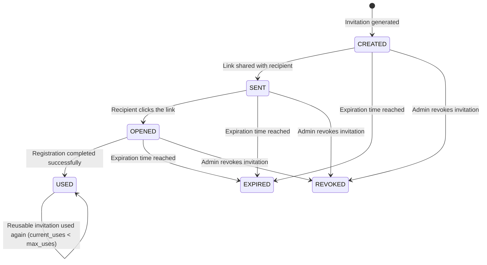
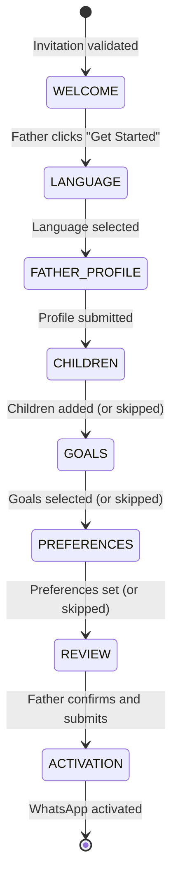
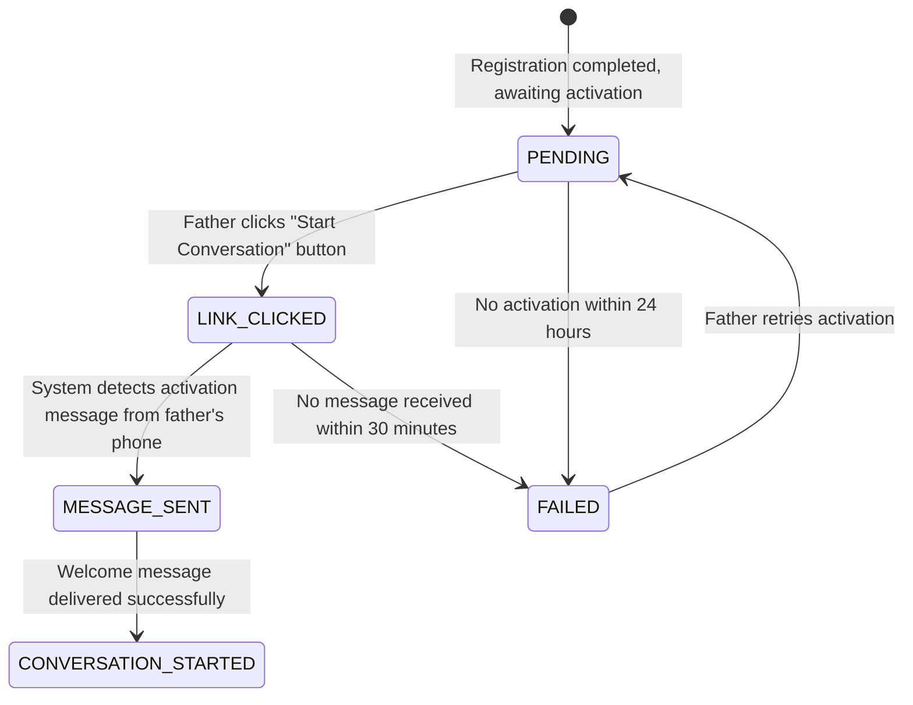

# Requirements Document

## Introduction

**SPEC-007: User Onboarding & Activation**

This specification defines the backend services for user onboarding in the Dad Coach platform — from invitation through registration, automatic provisioning, and WhatsApp activation. It replaces and extends the conversation-based onboarding flow defined in SPEC-002 Requirement 3 with a structured API-driven registration flow, invitation system, and seamless WhatsApp activation.

The onboarding experience is designed to feel like a modern consumer application: a father receives a single invitation link, completes registration, and immediately starts coaching via WhatsApp — with zero administrator involvement at any step.

**This specification covers the backend only.** It defines the REST API contracts, domain model, business logic, provisioning, and activation services. The frontend (web registration wizard UI) will be specified separately in the dad-coach-web project.

**Scope boundaries:**
- SPEC-001 defines infrastructure and deployment
- SPEC-002 defines domain entities, state machines, and business rules (Father, Child, Goal entities)
- SPEC-003 defines AI prompt assembly, model routing, and output contracts
- SPEC-004 defines memory lifecycle, storage, and retrieval
- SPEC-005 defines conversation orchestration
- SPEC-006 defines communication channels (WhatsApp delivery, templates, session rules)
- SPEC-007 (this document) defines invitation, registration API, provisioning, and WhatsApp activation (backend)
- SPEC-008 defines the application API layer
- Dashboard and frontend UI are out of scope for this specification

**Relationship to SPEC-002:** This spec supersedes SPEC-002 Requirement 3 (Onboarding Flow) for all new registrations. The conversation-based onboarding in SPEC-002 remains as a fallback for fathers who message the WhatsApp number directly without a prior web registration. SPEC-007 handles web-initiated onboarding; SPEC-002 handles WhatsApp-initiated onboarding.

**Relationship to SPEC-006:** Upon activation, this spec triggers the first Template_Message delivery via the Communication_Channel (SPEC-006). The WhatsApp deep-link and activation handshake are defined here; message delivery mechanics are owned by SPEC-006.

## Glossary

- **Invitation**: A secure, shareable artifact that grants access to the Dad Coach registration wizard. An invitation has a lifecycle (CREATED → SENT → OPENED → USED → EXPIRED/REVOKED) and may be single-use or reusable.
- **Invitation_Token**: A cryptographically secure, URL-safe string (Base62, 32 characters) that uniquely identifies an Invitation and is embedded in the invitation link.
- **Onboarding_Session**: A server-side session tracking a father's progress through the registration wizard. Persists wizard state across page reloads and browser sessions.
- **Registration_Wizard**: The multi-step web-based registration form that collects father profile, children, goals, and preferences.
- **Wizard_Step**: A single screen/stage in the Registration_Wizard. Steps: WELCOME, LANGUAGE, FATHER_PROFILE, CHILDREN, GOALS, PREFERENCES, REVIEW, ACTIVATION.
- **Activation_Status**: The state of a father's WhatsApp connection after registration: PENDING, LINK_CLICKED, MESSAGE_SENT, CONVERSATION_STARTED, FAILED.
- **Language_Preference**: The father's selected UI and conversation language (he = Hebrew, en = English).
- **Communication_Preference**: The father's settings for notification timing, frequency, and quiet hours.
- **Provisioning**: The automatic creation of all required entities (Father, Family, Children, Preferences, AI Profile, Goals) upon registration completion.
- **Deep_Link**: A WhatsApp click-to-chat URL (`https://wa.me/{number}?text={message}`) that opens WhatsApp with a pre-filled activation message.
- **Activation_Message**: The pre-defined message a father sends to the Dad Coach WhatsApp number to complete activation (e.g., "🚀 START").
- **Beta_Invitation**: A reusable invitation with a usage cap, used during beta launch to control growth.
- **Referral_Code**: A unique code associated with an existing father, enabling tracking of invitation sources (future extension).
- **E164_Phone**: A phone number in E.164 format matching `^\+[1-9]\d{1,14}$` (per SPEC-002 Requirement 1 criteria 2).
- **Family**: A logical grouping entity connecting a Father to their Children and shared family context.
- **AI_Profile**: The initial AI configuration for a father including coaching_style, language, and conversation context (per SPEC-003).
- **Idempotency_Key**: A unique key preventing duplicate processing of the same operation (per SPEC-005).

---

## Requirements

### Requirement 1: Invitation System

**User Story:** As a product owner, I want a secure invitation system that controls access to registration, so that growth is managed and invitation sources are trackable.

#### Acceptance Criteria

1. THE Invitation_System SHALL support two invitation types: SINGLE_USE (consumed after one successful registration) and REUSABLE (can be used up to a configured maximum number of times).

2. WHEN an Invitation is created, THE Invitation_System SHALL generate an Invitation_Token as a cryptographically secure, URL-safe Base62 string of exactly 32 characters using a CSPRNG (Cryptographically Secure Pseudo-Random Number Generator).

3. THE Invitation_System SHALL construct the invitation link in the format: `https://{domain}/join/{invitation_token}`

4. EACH Invitation SHALL contain:
   - invitation_id: UUID primary key
   - token: the 32-character Invitation_Token (unique, indexed)
   - type: SINGLE_USE or REUSABLE
   - created_by: the father_id or admin_id who created the invitation
   - created_at: creation timestamp
   - expires_at: expiration timestamp
   - max_uses: maximum number of registrations allowed (1 for SINGLE_USE; configurable for REUSABLE, default 50)
   - current_uses: number of completed registrations using this invitation
   - status: CREATED, SENT, OPENED, USED, EXPIRED, REVOKED
   - metadata: JSON object for referral_code, campaign_name, or other tracking data

5. THE Invitation_System SHALL enforce the following expiration policies:
   - SINGLE_USE invitations: expire after 7 days from creation
   - REUSABLE invitations: expire after 90 days from creation
   - Expired invitations cannot be used regardless of remaining uses

6. THE Invitation_System SHALL track the invitation lifecycle through the following states:

7. WHEN a father clicks an invitation link, THE Invitation_System SHALL validate: (a) the token exists, (b) the invitation status is not EXPIRED or REVOKED, (c) current_uses < max_uses, (d) expires_at > current time. If any check fails, the API returns an appropriate error response.

8. WHEN a SINGLE_USE invitation is used successfully (registration completed), THE Invitation_System SHALL transition its status to USED and reject any subsequent attempts.

9. WHEN a REUSABLE invitation reaches max_uses, THE Invitation_System SHALL transition its status to USED and reject subsequent attempts.

10. THE Invitation_System SHALL run a scheduled job daily at 02:00 UTC to transition all invitations where expires_at < current_time from their current status to EXPIRED.

11. WHEN an admin revokes an invitation, THE Invitation_System SHALL immediately transition the invitation status to REVOKED and invalidate any active Onboarding_Sessions associated with that invitation token.

12. THE Invitation entity SHALL include a JSONB metadata field for future extensibility (referral codes, campaign tracking, beta cohorts). For MVP, this field is optional and unused by core logic.

---

### Requirement 2: Registration Wizard

**User Story:** As a new father, I want a guided, multi-step registration process, so that I can set up my profile quickly and start coaching without confusion.

#### Acceptance Criteria

1. THE Registration_Wizard SHALL present the following steps in order: WELCOME → LANGUAGE → FATHER_PROFILE → CHILDREN → GOALS → PREFERENCES → REVIEW → ACTIVATION

2. THE Registration_Wizard SHALL track progress through the Onboarding_Session with the following state machine:

3. THE WELCOME step SHALL accept data containing: acknowledgment of the welcome (no user input required beyond proceeding to next step). The API returns inviter's name (if available from invitation metadata) and value proposition text for the frontend to render.

4. THE LANGUAGE step SHALL accept a language_code selection. Supported values: "he" (Hebrew, default), "en" (English). The selected language affects all subsequent API response messages.

5. THE FATHER_PROFILE step SHALL validate:
   - display_name: required, 2-50 characters, Unicode letters and spaces only
   - phone_number: required, validated as E164_Phone format
   - email: optional, validated as RFC 5322 format
   - timezone: required, valid IANA timezone ID (default: Asia/Jerusalem)

6. THE CHILDREN step SHALL validate per child (minimum 0, maximum 8 per SPEC-002 Requirement 2 criteria 2):
   - child_name: required, 2-30 characters
   - birth_date: required, validated between 0-18 years ago (per SPEC-002 Requirement 2 criteria 4)
   - gender: optional (MALE, FEMALE, OTHER, PREFER_NOT_TO_SAY)
   - interests: optional, array of strings
   - challenges: optional, array of strings
   This step is optional and can be skipped.

7. THE GOALS step SHALL validate (multi-select, 1-5 selections from predefined list + custom):
   - Predefined goals: spend-more-quality-time, improve-communication, build-stronger-emotional-connection, handle-conflicts-better, create-family-routines, support-child-development, be-more-patient
   - Custom goal: free text, max 100 characters
   This step is optional (defaults to "spend-more-quality-time").

8. THE PREFERENCES step SHALL validate:
   - coaching_style: enum GENTLE, BALANCED, DIRECT, MOTIVATIONAL (default: BALANCED per SPEC-002 Requirement 1 criteria 10)
   - preferred_coaching_time: HH:mm format, 30-minute intervals (default: 08:00)
   - notification_frequency: enum DAILY, EVERY_OTHER_DAY, TWICE_WEEKLY (default: DAILY)
   - quiet_hours_start: HH:mm format (default: 21:00 per SPEC-002 Quiet_Hours)
   - quiet_hours_end: HH:mm format (default: 07:00 per SPEC-002 Quiet_Hours)
   This step is optional (all defaults applied when skipped).

9. THE REVIEW step represents the final confirmation before provisioning. The API returns a summary of all collected wizard_data for the frontend to display. No additional data is submitted in this step.

10. THE ACTIVATION step is triggered after provisioning completes. The API returns the WhatsApp Deep_Link and begins tracking activation status (defined in Requirement 4).

11. THE Registration_Wizard SHALL allow backward navigation to any previously completed step without losing entered data.

12. THE Registration_Wizard SHALL mark steps as REQUIRED (WELCOME, LANGUAGE, FATHER_PROFILE) or OPTIONAL (CHILDREN, GOALS, PREFERENCES). Optional steps display a "Skip for now" button that advances to the next step with defaults applied.

13. THE Onboarding_Session SHALL persist all wizard state server-side, enabling:
    - Resume after page reload (session cookie or token-based identification)
    - Resume after browser close (within session expiration)
    - Resume on a different device (by re-clicking the invitation link, identified by phone number)

14. THE Onboarding_Session SHALL expire after 72 hours of inactivity (no step progression). Upon expiration, the invitation remains valid (if not expired/revoked) and the father can restart the wizard by clicking the link again.

15. WHEN the Registration_Wizard detects a phone_number that is already registered in the system, THE Registration_Wizard SHALL display a message: "This phone number is already registered. Would you like to log in instead?" with a link to the login flow.

---

### Requirement 3: Automatic Provisioning

**User Story:** As a new father, I want everything set up automatically when I complete registration, so that I can start using Dad Coach immediately without waiting for any manual steps.

#### Acceptance Criteria

1. WHEN the father confirms registration on the REVIEW step, THE Provisioning_System SHALL create all required entities in a single atomic transaction. If any entity creation fails, the entire transaction rolls back and the father sees an error with a "Try Again" option.

2. THE Provisioning_System SHALL create the following entities upon successful registration:

   | Entity | Source | Details |
   |--------|--------|---------|
   | Father | FATHER_PROFILE step | status=ONBOARDING, phone in E.164, display_name, email, timezone |
   | Family | Auto-generated | family_name = "{display_name}'s Family", created_at |
   | Child (0-8) | CHILDREN step | Each child linked to Father and Family |
   | Language_Preference | LANGUAGE step | language_code (he/en), affects AI and UI |
   | Communication_Preference | PREFERENCES step | coaching_time, notification_frequency, quiet_hours |
   | Goal (1-5) | GOALS step | Each selected goal as a Goal entity with status ACTIVE |
   | AI_Profile | Derived | coaching_style, language, initial system prompt context |
   | Onboarding_Memory | Derived | Initial memory entries from registration data (per SPEC-004) |

3. THE Provisioning_System SHALL create the Father entity with status ONBOARDING (not ACTIVE). The transition to ACTIVE occurs only after WhatsApp activation completes (Requirement 4).

4. THE Provisioning_System SHALL generate an AI_Profile containing:
   - coaching_style: from PREFERENCES step (or BALANCED default)
   - language: from LANGUAGE step
   - children_context: summary of children's names, ages, interests, challenges
   - goals_context: selected parenting goals as coaching priorities
   - personality_brief: derived from coaching_style selection

5. THE Provisioning_System SHALL create initial Onboarding_Memory entries (per SPEC-004) containing:
   - Father's name and how they want to be addressed
   - Each child's name, age, interests, and challenges
   - Stated parenting goals
   - Preferred coaching style and schedule
   These memories have importance_score=8 and confidence_score=1.0 (explicitly provided by father).

6. THE Provisioning_System SHALL complete all entity creation within 3 seconds from confirmation. If creation exceeds 3 seconds, it is logged as a performance warning for operational monitoring.

7. THE Provisioning_System SHALL be idempotent: if the father re-submits the REVIEW step (e.g., due to network timeout and retry), the system detects the existing entities via phone_number match and returns success without creating duplicates.

8. THE Provisioning_System SHALL assign the father's phone number as their Communication_Endpoint on the WHATSAPP channel (per SPEC-006 Requirement 1 criteria 6) with is_primary=true.

---

### Requirement 4: WhatsApp Activation

**User Story:** As a new father, I want to seamlessly transition from web registration to WhatsApp, so that I can immediately start my coaching conversation without manual steps.

#### Acceptance Criteria

1. WHEN provisioning completes, THE Activation_System SHALL create an ActivationRecord with status PENDING and generate a WhatsApp Deep_Link for the frontend to present.

2. THE Deep_Link SHALL be in the format: `https://wa.me/{dad_coach_whatsapp_number}?text={activation_message}` where activation_message is URL-encoded and equals "🚀 START" (or the localized equivalent).

3. THE Activation process SHALL track status through the following state machine:

4. WHEN the Communication_Channel (SPEC-006) receives a message matching the Activation_Message pattern from a phone number with Father status ONBOARDING, THE Activation_System SHALL orchestrate the following by delegating to domain services:
   - Delegate to FatherService: transition Father status from ONBOARDING to ACTIVE
   - Delegate to SessionWindowService: open the WhatsApp session window
   - Delegate to ConversationEngine: trigger the Welcome Conversation (criteria 5)
   - Update ActivationRecord status to MESSAGE_SENT, then CONVERSATION_STARTED

5. THE Activation_System SHALL trigger a Welcome Conversation via the Conversation_Engine (SPEC-005) containing:
   - A personalized greeting using the father's display_name and selected language
   - A brief summary of what Dad Coach will do ("I'm here to help you be the father you want to be")
   - The first coaching question based on the father's stated goals
   - The first suggested mission (generated by Mission_Engine per SPEC-002 Requirement 6)

6. THE Activation_System SHALL deliver the Welcome Conversation within 5 seconds of receiving the Activation_Message. This message is delivered as a free-form message (Session_Window is OPEN since the father just sent a message per SPEC-006 Requirement 8).

7. IF the father does not send the Activation_Message within 30 minutes of the Deep_Link generation, THEN THE Activation_System SHALL transition status to FAILED. The API returns the FAILED status with available retry options.

8. IF the father does not complete activation within 24 hours of registration, THEN THE Activation_System SHALL:
   - Transition Activation_Status to FAILED
   - Send a reminder email (if email was provided) with the activation Deep_Link
   - The father's account remains in ONBOARDING status

9. THE Activation_System SHALL support activation without the Deep_Link: if a father messages the Dad Coach WhatsApp number from a phone matching an ONBOARDING father record, the system treats any first message as the activation trigger (not just the Activation_Message pattern).

10. THE activation-status API endpoint SHALL support long-polling with a 30-second timeout: the server holds the connection until status changes or timeout, enabling near-instant notification to the frontend without frequent polling.

---

### Requirement 5: Localization

**User Story:** As a father, I want the entire experience in my preferred language, so that coaching feels natural and personal regardless of which language I speak.

#### Acceptance Criteria

1. THE Onboarding_System SHALL support Hebrew (he) and English (en) as initial languages, with architecture supporting additional languages without code changes (configuration-only addition).

2. WHEN the father selects a language in the LANGUAGE step, THE Registration_Wizard SHALL immediately render all subsequent steps in the selected language including: labels, placeholders, validation messages, button text, help text, and error messages.

3. THE Language_Preference SHALL affect the following system components:

   | Component | Effect |
   |-----------|--------|
   | API Responses | All localized messages returned in selected language |
   | AI Conversations | System prompts and coaching delivered in selected language (per SPEC-003) |
   | Notifications | Emails and WhatsApp messages in selected language |
   | Template_Messages | WhatsApp templates use language-specific variants (per SPEC-006 Requirement 9) |
   | Validation messages | API error messages returned in selected language |
   | Date/time formatting | Locale-appropriate formats (DD/MM/YYYY for Hebrew, MM/DD/YYYY for English) |
   | Text direction | RTL metadata for Hebrew, LTR for English (returned in API responses for frontend use) |

4. THE Localization_System SHALL provide text_direction metadata (RTL/LTR) in API responses so the frontend can render layouts accordingly.

5. THE Localization_System SHALL store translations as resource bundles (key-value pairs) loadable at runtime without application restart.

6. WHEN a translation key is missing for the selected language, THE Localization_System SHALL fall back to English (en) and log a warning for operational awareness.

7. THE Localization_System SHALL support parameterized messages with named placeholders (e.g., "Welcome, {father_name}!") supporting proper word order for each language.

8. THE Language_Preference SHALL be modifiable after registration via API. Changing language immediately updates: future AI conversations, future notifications. Past conversation history remains in the original language.

---

### Requirement 6: Security

**User Story:** As a product owner, I want the onboarding process secured against abuse, so that invitation tokens cannot be forged, registration cannot be replayed, and user data is protected.

#### Acceptance Criteria

1. THE Invitation_Token SHALL be generated using a CSPRNG with at least 192 bits of entropy (32 Base62 characters provide ~190 bits), making brute-force guessing computationally infeasible.

2. THE Invitation_System SHALL rate-limit invitation link access: maximum 10 attempts per IP address per hour. Exceeding this limit returns HTTP 429 with a Retry-After header.

3. THE Registration_Wizard SHALL rate-limit form submissions: maximum 5 registration attempts per phone number per hour. This prevents automated registration spam.

4. THE Onboarding_Session SHALL be identified by a secure, HttpOnly, SameSite=Strict session cookie with a random 256-bit session ID. Session data is stored server-side only.

5. THE Registration_Wizard SHALL validate the Invitation_Token on every step transition (not just the initial click), preventing use of expired or revoked invitations mid-registration.

6. THE Provisioning_System SHALL prevent replay attacks: if a registration request arrives with a phone_number that already has a COMPLETED Onboarding_Session, the system returns the existing father record without creating duplicates (idempotency per Requirement 3 criteria 7).

7. THE Onboarding_System SHALL implement CSRF protection on all form submissions using the Synchronizer Token Pattern (unique per-session CSRF token validated server-side).

8. THE Registration_Wizard SHALL sanitize all user input against XSS: HTML entities escaped in all rendered output, Content-Security-Policy headers enforced, no inline scripts.

9. THE Onboarding_System SHALL transmit all data exclusively over HTTPS (TLS 1.3). HTTP requests SHALL be redirected to HTTPS with HSTS headers (max-age=31536000, includeSubDomains).

10. THE Onboarding_System SHALL implement privacy-by-design:
    - Collect only data necessary for coaching (no unnecessary personal data)
    - Display clear data usage explanations on each step
    - Provide consent checkboxes for: data processing (required), marketing communications (optional)
    - Store consent records with timestamps for GDPR audit trail

11. THE Registration_Wizard SHALL mask the phone number in all client-side displays after initial entry (show only last 4 digits: ****1234) to prevent shoulder-surfing.

12. THE Invitation_System SHALL log all token validation attempts (success and failure) with: IP address, timestamp, token (hashed), user-agent, and result — for security auditing.

---

### Requirement 7: Domain Model

**User Story:** As a developer, I want clearly defined domain entities for the onboarding subsystem, so that implementation is unambiguous and consistent with the existing domain model (SPEC-002).

#### Acceptance Criteria

1. THE Onboarding_System SHALL define the Invitation entity with the following structure:

   | Field | Type | Constraints |
   |-------|------|-------------|
   | invitation_id | UUID | Primary key |
   | token | String(32) | Unique, indexed, Base62 |
   | type | Enum | SINGLE_USE, REUSABLE |
   | status | Enum | CREATED, SENT, OPENED, USED, EXPIRED, REVOKED |
   | created_by | UUID | FK to Father or Admin |
   | created_at | Timestamp | Not null |
   | expires_at | Timestamp | Not null |
   | max_uses | Integer | Default 1 for SINGLE_USE, configurable for REUSABLE |
   | current_uses | Integer | Default 0 |
   | metadata | JSONB | Nullable, for referral_code, campaign, beta_cohort |

2. THE Onboarding_System SHALL define the Onboarding_Session entity with the following structure:

   | Field | Type | Constraints |
   |-------|------|-------------|
   | session_id | UUID | Primary key |
   | invitation_id | UUID | FK to Invitation |
   | father_id | UUID | FK to Father (nullable until provisioning) |
   | current_step | Enum | WELCOME, LANGUAGE, FATHER_PROFILE, CHILDREN, GOALS, PREFERENCES, REVIEW, ACTIVATION |
   | status | Enum | IN_PROGRESS, COMPLETED, EXPIRED, ABANDONED |
   | wizard_data | JSONB | Accumulated wizard input (encrypted at rest) |
   | language | String(2) | Selected language code |
   | started_at | Timestamp | Not null |
   | last_activity_at | Timestamp | Updated on each step transition |
   | completed_at | Timestamp | Nullable, set on completion |
   | expires_at | Timestamp | started_at + 72 hours |
   | ip_address | String | Client IP for security auditing |
   | user_agent | String | Client user-agent for analytics |

3. THE Onboarding_System SHALL define the Activation_Record entity with the following structure:

   | Field | Type | Constraints |
   |-------|------|-------------|
   | activation_id | UUID | Primary key |
   | father_id | UUID | FK to Father, unique |
   | session_id | UUID | FK to Onboarding_Session |
   | status | Enum | PENDING, LINK_CLICKED, MESSAGE_SENT, CONVERSATION_STARTED, FAILED |
   | deep_link_generated_at | Timestamp | When the Deep_Link was created |
   | link_clicked_at | Timestamp | Nullable |
   | message_received_at | Timestamp | Nullable |
   | conversation_started_at | Timestamp | Nullable |
   | retry_count | Integer | Default 0, max 3 |
   | failure_reason | String | Nullable, set on FAILED |

4. THE Onboarding_System SHALL define the Language_Preference entity with the following structure:

   | Field | Type | Constraints |
   |-------|------|-------------|
   | preference_id | UUID | Primary key |
   | father_id | UUID | FK to Father, unique |
   | language_code | String(5) | BCP 47 language tag (he, en) |
   | date_format | String | Locale pattern (dd/MM/yyyy, MM/dd/yyyy) |
   | time_format | String | HH:mm (24h) or hh:mm a (12h) |
   | text_direction | Enum | RTL, LTR |
   | updated_at | Timestamp | Not null |

5. THE Onboarding_System SHALL define the Communication_Preference entity with the following structure:

   | Field | Type | Constraints |
   |-------|------|-------------|
   | preference_id | UUID | Primary key |
   | father_id | UUID | FK to Father, unique |
   | preferred_coaching_time | Time | Default 08:00 |
   | notification_frequency | Enum | DAILY, EVERY_OTHER_DAY, TWICE_WEEKLY |
   | quiet_hours_start | Time | Default 21:00 |
   | quiet_hours_end | Time | Default 07:00 |
   | email_notifications | Boolean | Default true (if email provided) |
   | updated_at | Timestamp | Not null |

6. ALL domain entities SHALL use UUID v7 (time-ordered) as primary keys for database index efficiency and natural ordering.

7. THE wizard_data field in Onboarding_Session SHALL be encrypted at rest using AES-256-GCM, as it contains personal data before the Father entity is fully provisioned.

---

### Requirement 8: REST API

**User Story:** As a frontend developer, I want well-defined API endpoints for the onboarding flow, so that the web registration wizard can communicate reliably with the backend.

#### Acceptance Criteria

1. THE Onboarding_API SHALL expose the following endpoints:

   | Method | Path | Purpose |
   |--------|------|---------|
   | GET | /api/v1/invitations/{token}/validate | Validate invitation token and return invitation metadata |
   | POST | /api/v1/onboarding/sessions | Create a new Onboarding_Session (requires valid invitation token) |
   | GET | /api/v1/onboarding/sessions/{sessionId} | Get current session state and wizard_data |
   | PUT | /api/v1/onboarding/sessions/{sessionId}/steps/{step} | Submit data for a specific wizard step |
   | POST | /api/v1/onboarding/sessions/{sessionId}/complete | Trigger provisioning and finalize registration |
   | GET | /api/v1/onboarding/sessions/{sessionId}/activation-status | Poll activation status |
   | POST | /api/v1/onboarding/sessions/{sessionId}/activation/retry | Regenerate activation Deep_Link |
   | POST | /api/v1/invitations | Create a new invitation (authenticated, admin or father) |
   | DELETE | /api/v1/invitations/{invitationId} | Revoke an invitation (authenticated, admin only) |

2. WHEN GET /api/v1/invitations/{token}/validate is called, THE API SHALL return:
   - HTTP 200 with: invitation type, inviter display_name (if available), expiration status, remaining uses
   - HTTP 404 if token does not exist
   - HTTP 410 (Gone) if invitation is EXPIRED or REVOKED with a reason field
   - HTTP 429 if rate limit exceeded

3. WHEN POST /api/v1/onboarding/sessions is called with a valid invitation token, THE API SHALL:
   - Create an Onboarding_Session in IN_PROGRESS status
   - Transition invitation status to OPENED (if currently CREATED or SENT)
   - Return HTTP 201 with session_id and a secure session cookie
   - Return HTTP 409 if the phone number (when provided later) is already registered

4. WHEN PUT /api/v1/onboarding/sessions/{sessionId}/steps/{step} is called, THE API SHALL:
   - Validate the step data against the schema for that step (Requirement 2 criteria 5-8)
   - Persist validated data to the session's wizard_data
   - Update current_step and last_activity_at
   - Return HTTP 200 with the updated session state
   - Return HTTP 400 with field-level validation errors if data is invalid
   - Return HTTP 403 if the session is EXPIRED or the invitation has been revoked
   - Return HTTP 422 if attempting to submit a step out of order (skipping required steps)

5. WHEN POST /api/v1/onboarding/sessions/{sessionId}/complete is called, THE API SHALL:
   - Trigger the Provisioning_System (Requirement 3)
   - Return HTTP 201 with the created father_id and activation Deep_Link
   - Return HTTP 409 if provisioning detects a duplicate (idempotent success)
   - Return HTTP 500 if provisioning fails (with a retry-safe error indicating the client can retry)

6. WHEN GET /api/v1/onboarding/sessions/{sessionId}/activation-status is called, THE API SHALL return:
   - HTTP 200 with: current Activation_Status, timestamps for each state transition, and estimated_wait (seconds until timeout)
   - This endpoint supports long-polling with a 30-second timeout: the server holds the connection until status changes or timeout, reducing polling overhead

7. ALL Onboarding_API responses SHALL include:
   - Content-Type: application/json
   - X-Request-Id header for request tracing
   - Consistent error response format: `{"error": {"code": "INVITE_EXPIRED", "message": "...", "field": "...", "details": {...}}}`

8. THE Onboarding_API SHALL validate Content-Type: application/json on all request bodies and return HTTP 415 (Unsupported Media Type) for non-JSON requests.

9. THE Onboarding_API SHALL document all endpoints using OpenAPI 3.1 specification, consistent with the existing SpringDoc configuration (per README).

---

### Requirement 9: Backend API Behavior

**User Story:** As a frontend developer, I want the backend API to provide clear, consistent responses with proper error handling and validation, so that I can build a smooth registration experience.

#### Acceptance Criteria

1. THE Onboarding_API SHALL return field-level validation errors with: field name, error code, and localized error message (using the session's selected language).

2. THE Onboarding_API SHALL return appropriate HTTP status codes for all error conditions:
   - 400: Validation errors (field-level details in response body)
   - 403: Session expired or invitation revoked
   - 404: Resource not found
   - 409: Duplicate phone number (with hint to use login)
   - 410: Invitation expired or revoked
   - 415: Unsupported Content-Type
   - 422: Step submitted out of order
   - 429: Rate limit exceeded (with Retry-After header)
   - 500: Internal server error (safe to retry)

3. THE Onboarding_API SHALL support session resume: if a session cookie identifies an existing IN_PROGRESS session, the GET session endpoint returns the current state and wizard_data, enabling the frontend to restore the user's place.

4. THE Onboarding_API SHALL mask the phone_number in all responses after initial submission (show only last 4 digits: ****1234) to prevent shoulder-surfing.

5. THE Onboarding_API SHALL return progress metadata with each step response: current step number, total steps, list of completed steps, and whether the current step is required or optional.

6. THE Provisioning_System SHALL complete all entity creation within 3 seconds from the complete request. If creation exceeds this target, it is logged as a warning for operational monitoring.

---

### Requirement 10: Success Experience

**User Story:** As a new father, I want to feel welcomed and supported immediately after onboarding, so that I'm motivated to engage with the coaching from day one.

#### Acceptance Criteria

1. WHEN activation completes (Activation_Status = CONVERSATION_STARTED), THE Activation_System SHALL trigger delivery of the following within 60 seconds:
   - WhatsApp: personalized welcome message with father's name and first coaching question
   - WhatsApp: first suggested mission tailored to the father's children and goals

2. THE Welcome Conversation on WhatsApp SHALL be structured as:
   - Message 1: Warm personal greeting in selected language ("Hey {name}! 👋 I'm Dad Coach...")
   - Message 2: Brief context acknowledgment ("I see you have {child_count} amazing kids...")
   - Message 3: First coaching question related to top goal ("Tell me about a recent moment with {child_name} that made you proud")
   - Message 4 (after reply): First mission suggestion with accept/modify/skip interactive buttons

3. THE first AI recommendation SHALL be generated based on:
   - The father's selected goals (priority weighting)
   - Children's ages (age-appropriate activities)
   - Current day of week and time (contextual relevance)
   - Coaching style preference (tone matching)

4. THE first suggested mission SHALL be:
   - Difficulty level 1 (easiest — FOUNDATION phase per SPEC-002 Requirement 4)
   - Duration: 5-10 minutes (low commitment for first interaction)
   - Related to the father's primary goal
   - Targeted at the father's oldest child (if multiple children registered)
   - Delivered via WhatsApp as an interactive message with Accept/Skip buttons

5. WHEN the father accepts the first mission via WhatsApp, THE Coaching_Engine SHALL:
   - Confirm acceptance with an encouraging message
   - Set a follow-up reminder for the chosen coaching time (or 4 hours later if no time set)

6. THE Success_Experience SHALL track the following activation metrics:
   - Time from registration_complete to first_whatsapp_message (target: < 10 seconds)
   - Time from first_message to first_reply (father's engagement latency)
   - Whether first mission was accepted, modified, or skipped

---

### Requirement 11: Future Extensions

**User Story:** As a product owner, I want the onboarding architecture to support planned future capabilities without requiring structural changes, so that we can iterate rapidly on growth features.

#### Acceptance Criteria

1. THE Invitation_System SHALL be designed to support the following future extensions without schema migrations:
   - **Premium Plans**: invitation metadata field can carry plan_type (FREE, PREMIUM, ENTERPRISE) affecting provisioning defaults
   - **Family Invitations**: a father can invite a co-parent or caregiver who shares access to the same Family entity
   - **Referral Rewards**: referral_code in metadata enables tracking chains; reward logic is external to onboarding
   - **Campaign Tracking**: metadata supports utm_source, utm_medium, utm_campaign for marketing attribution
   - **Beta Invitations**: reusable invitations with configurable max_uses (default 100), shorter expiration (30 days), and beta_cohort field in metadata for analytics segmentation

2. THE Registration flow SHALL be designed to support the following future extensions without structural changes:
   - **Additional Steps**: new wizard steps can be inserted between existing steps via configuration (step ordering is data-driven, not hardcoded)
   - **OAuth Login**: FATHER_PROFILE step can be pre-filled from Google/Apple/Facebook profile data; phone_number remains required
   - **Multiple Caregivers**: FAMILY step (future) allows inviting additional caregivers during registration
   - **Premium Features**: PLAN_SELECTION step (future) inserted before REVIEW for paid tier selection

3. THE Provisioning_System SHALL be designed to support the following future extensions:
   - **Additional Communication Channels**: provisioning creates endpoints for configured channels (currently WhatsApp only; future: SMS, Telegram, web chat)
   - **Enterprise Onboarding**: bulk provisioning from CSV/API with pre-filled profiles and organization-level defaults
   - **Mobile App**: activation can occur via mobile app deep-link instead of WhatsApp deep-link; the activation mechanism is configurable per client type
   - **Dashboard**: a future backend EPIC will define dashboard-specific provisioning (default widgets, initial dashboard state)

4. THE Localization_System SHALL be designed to support:
   - **Additional Languages**: new languages added by providing a translation resource bundle without code changes
   - **Regional Variants**: language tags support region (he-IL, en-US, en-GB) for locale-specific date/number formatting
   - **AI Language Mixing**: fathers who speak multiple languages can receive coaching in a blend (future — requires SPEC-003 changes)

5. THE Domain Model SHALL use JSONB metadata fields on Invitation and Onboarding_Session entities to store extension-specific data without schema migrations. All metadata access SHALL go through typed accessor methods with explicit defaults for missing keys.

6. THE Onboarding_API SHALL version all endpoints under /api/v1/ and support future /api/v2/ additions without breaking existing clients. New capabilities are added as new fields (additive changes) or new endpoints, never by modifying existing response contracts.

7. THE Security model SHALL support future OAuth integration by:
   - Keeping phone_number as the canonical identifier regardless of auth method
   - Storing auth_provider (PHONE, GOOGLE, APPLE) on the Father entity (defaulting to PHONE)
   - Session management decoupled from authentication method
