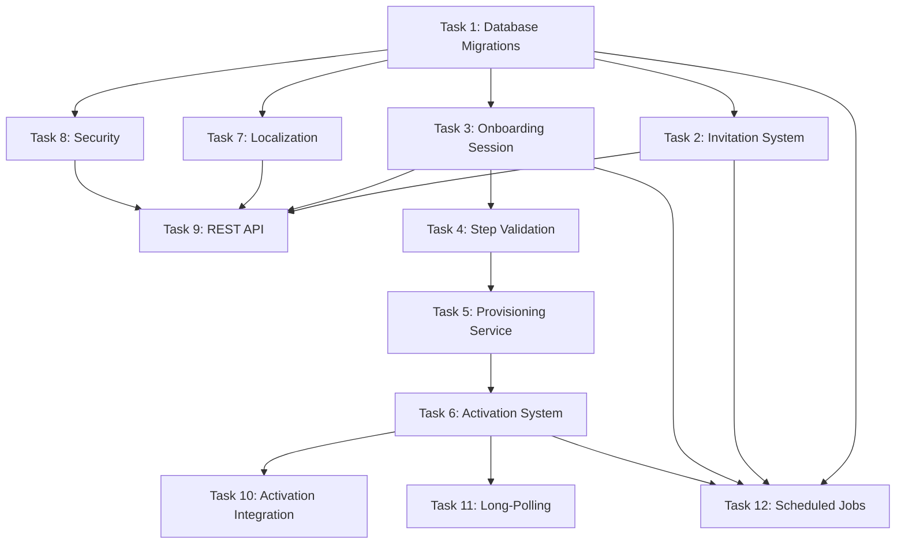

# Implementation Plan

## Overview

Implementation of the User Onboarding & Activation backend subsystem (SPEC-007) for the Dad Coach application. This subsystem covers the backend services for: invitation generation and validation, multi-step registration wizard API with server-side sessions, automatic provisioning of all domain entities in a single atomic transaction, WhatsApp activation handshake, localization (Hebrew + English with RTL/LTR metadata), and security hardening (rate limiting, CSRF, encryption). It integrates with the Communication Channel (SPEC-006), Conversation Engine (SPEC-005), Intelligence Layer (SPEC-003), and Memory System (SPEC-004).

**Scope:** Backend only. No frontend/UI code. No dashboard provisioning. ActivationService is an orchestrator delegating to domain services.

## Task Dependency Graph



```json
{
  "waves": [
    {"tasks": [1]},
    {"tasks": [2, 3, 7, 8]},
    {"tasks": [4]},
    {"tasks": [5]},
    {"tasks": [6]},
    {"tasks": [9, 11]},
    {"tasks": [10, 12]}
  ]
}
```

## Tasks

- [x] 1. Database Migrations
  - [x] 1.1 Create `V007_001__create_onboarding_tables.sql` — invitations table with token unique index, onboarding_sessions table with encrypted wizard_data (BYTEA), activation_records table with status constraints and partial indexes
  - [x] 1.2 Create `V007_002__create_preference_tables.sql` — language_preferences table (father_id unique, language_code, text_direction) and communication_preferences table (father_id unique, coaching_time, frequency, quiet hours)
  - [x] 1.3 Create `V007_003__create_rate_limit_table.sql` — rate_limit_entries table with compound unique constraint on (key_type, key_value, window_start) and partial index on active windows
  - [x] 1.4 Create `V007_004__add_father_status_onboarding.sql` — add ONBOARDING value to father status enum if not already present
  - [x] 1.5 Create `V007_005__add_invitation_audit_log.sql` — invitation_audit_log table with token_hash (SHA-256), action, result, IP, user-agent, and indexes on token_hash and ip_address
  - [x] 1.6 Verify all migrations run successfully against PostgreSQL using Flyway and confirm FK ordering with existing SPEC-002/SPEC-006 tables

- [x] 2. Invitation System
  - [x] 2.1 Create `InvitationTokenGenerator` component using SecureRandom CSPRNG to produce 32-character Base62 URL-safe tokens (~190 bits entropy)
  - [x] 2.2 Create `Invitation` JPA entity mapping to invitations table with fields: invitation_id (UUID v7), token, type (SINGLE_USE/REUSABLE), status, created_by, created_at, expires_at, max_uses, current_uses, metadata (JSONB)
  - [x] 2.3 Create `InvitationStatus` enum with state transition validation (CREATED→SENT→OPENED→USED, plus EXPIRED/REVOKED terminals)
  - [x] 2.4 Create `InvitationType` enum (SINGLE_USE, REUSABLE)
  - [x] 2.5 Create `InvitationRepository` (Spring Data JPA) with findByToken, findExpiredInvitations (status not terminal and expires_at < now)
  - [x] 2.6 Create `InvitationService` implementing: create (with expiration policy per type), validate (token exists + not expired/revoked + uses remaining), markOpened, incrementUses, revoke, expireOverdue
  - [x] 2.7 Enforce expiration policies: SINGLE_USE=7 days, REUSABLE=90 days (Req 1 criteria 5). Beta-specific expiration is a future extension.
  - [x] 2.8 Implement invitation validation logic checking all 4 conditions: token exists, status not terminal, current_uses < max_uses, expires_at > now (Req 1 criteria 7)

- [x] 3. Onboarding Session
  - [x] 3.1 Create `OnboardingSession` JPA entity with fields: session_id (UUID v7), invitation_id, father_id (nullable), current_step, status, wizard_data (encrypted BYTEA), language, started_at, last_activity_at, completed_at, expires_at, ip_address, user_agent
  - [x] 3.2 Create `WizardStep` enum with order, required/optional flag, next(), canSkip(), canNavigateBackTo(), canSubmitFrom() logic (Req 2 criteria 1, 11, 12)
  - [x] 3.3 Create `SessionStatus` enum (IN_PROGRESS, COMPLETED, EXPIRED, ABANDONED)
  - [x] 3.4 Create `WizardDataEncryptor` as JPA AttributeConverter implementing AES-256-GCM encryption/decryption for the wizard_data field (Req 7 criteria 7)
  - [x] 3.5 Create `WizardData` typed accessor class for structured access to the JSONB wizard data (display_name, phone, children, goals, preferences)
  - [x] 3.6 Create `OnboardingSessionRepository` with findBySessionId, findByInvitationId, findByPhoneNumber (for resume detection)
  - [x] 3.7 Create `OnboardingSessionService` implementing: create (with 72h TTL), getSession, submitStep (validates invitation on each transition), navigateBack, expireInactiveSessions, findByPhoneNumber
  - [x] 3.8 Implement session cookie management: 256-bit random ID, HttpOnly, Secure, SameSite=Strict, Path=/api/v1/onboarding, cookie name ONBOARDING_SESSION (Req 6 criteria 4)

- [x] 4. Step Validation
  - [x] 4.1 Create `StepValidator` interface and `StepValidationResult` with field-level errors (field name, error code, localized message)
  - [x] 4.2 Implement FATHER_PROFILE validator: display_name (2-50 chars, Unicode letters + spaces), phone_number (E.164 regex), email (optional RFC 5322), timezone (valid IANA ID) (Req 2 criteria 5)
  - [x] 4.3 Implement CHILDREN validator: per-child name (2-30 chars), birth_date (0-18 years), gender (optional enum), max 8 children, min 0 (Req 2 criteria 6)
  - [x] 4.4 Implement GOALS validator: 1-5 selections from predefined list + custom goals (max 100 chars each) (Req 2 criteria 7)
  - [x] 4.5 Implement PREFERENCES validator: coaching_style (enum), preferred_coaching_time (HH:mm, 30-min intervals), notification_frequency (enum), quiet_hours (HH:mm) (Req 2 criteria 8)
  - [x] 4.6 Implement duplicate phone number detection — query fathers table by phone, return 409 with login redirect if found (Req 2 criteria 15)

- [x] 5. Provisioning Service
  - [x] 5.1 Create `ProvisioningService` with @Transactional method that creates all entities atomically: Father (status=ONBOARDING), Family, Children (0-8), Goals (1-5), LanguagePreference, CommunicationPreference, CommunicationEndpoint (WhatsApp, is_primary=true), AiProfile, ActivationRecord (Req 3 criteria 1-2)
  - [x] 5.2 Create `ProvisioningResult` record containing all created entity IDs (father_id, family_id, child_ids, goal_ids, activation_id, deep_link)
  - [x] 5.3 Create `AiProfileFactory` that builds AI_Profile from wizard data: coaching_style, language, children_context (names/ages/interests/challenges), goals_context, personality_brief (Req 3 criteria 4)
  - [x] 5.4 Implement idempotency: detect existing Father by phone_number match, return existing ProvisioningResult without creating duplicates (Req 3 criteria 7)
  - [x] 5.5 Implement post-provisioning async memory creation: initial memories (identity, children, goals, preferences) with importance_score=8, confidence_score=1.0 via MemoryService (Req 3 criteria 5)
  - [x] 5.6 Update invitation current_uses and session status=COMPLETED within the provisioning transaction
  - [x] 5.7 Enforce 3-second provisioning SLA — log warning if exceeded (Req 3 criteria 6)

- [x] 6. Activation System
  - [x] 6.1 Create `ActivationRecord` JPA entity with fields: activation_id, father_id (unique), session_id, status, timestamps (deep_link_generated_at, link_clicked_at, message_received_at, conversation_started_at), retry_count, failure_reason
  - [x] 6.2 Create `ActivationStatus` enum with state transition validation (PENDING→LINK_CLICKED→MESSAGE_SENT→CONVERSATION_STARTED, FAILED→PENDING for retry)
  - [x] 6.3 Create `ActivationRecordRepository` with findByFatherId, findBySessionId, findTimedOutActivations
  - [x] 6.4 Create `ActivationService` as an orchestrator: coordinates between FatherService, SessionWindowService, and ConversationEngine. Implements createPendingActivation, markLinkClicked, handleActivationMessage, handleActivationTimeout, getStatus (with long-poll support), generateDeepLink
  - [x] 6.5 Implement deep link generation: `https://wa.me/{number}?text={url_encoded_activation_message}` with localized activation message (Req 4 criteria 2)
  - [x] 6.6 Implement activation retry logic: max 3 retries, regenerate deep link, increment retry_count (Req 4 criteria 7)
  - [x] 6.7 Create `ActivationListener` that intercepts inbound messages from ONBOARDING fathers — any first message triggers activation, not just "🚀 START" pattern (Req 4 criteria 9)

- [x] 7. Localization
  - [x] 7.1 Create `LocalizationService` implementing getMessage (key + language + args), getStepMessages (all messages for a wizard step), getTextDirection, getDateFormat, getTimeFormat
  - [x] 7.2 Create `TextDirection` enum (RTL, LTR) with language-to-direction mapping
  - [x] 7.3 Create `LanguagePreference` JPA entity with fields: preference_id, father_id (unique), language_code (BCP 47), date_format, time_format, text_direction, updated_at
  - [x] 7.4 Create resource bundles: messages_en.properties, messages_he.properties, wizard_en.properties, wizard_he.properties, validation_en.properties, validation_he.properties, activation_en.properties, activation_he.properties, goals_en.properties, goals_he.properties
  - [x] 7.5 Implement fallback behavior: missing key in selected language falls back to English with warning log (Req 5 criteria 6)
  - [x] 7.6 Implement parameterized message interpolation with named placeholders resolved to positional args for MessageSource (Req 5 criteria 7)
  - [x] 7.7 Configure Spring MessageSource for runtime reload without application restart (Req 5 criteria 5)

- [x] 8. Security
  - [x] 8.1 Create `OnboardingRateLimiter` component with IP-based limiting (10 attempts/hour for invitation validation) and phone-based limiting (5 attempts/hour for registration) backed by rate_limit_entries table (Req 6 criteria 2-3)
  - [x] 8.2 Create `CsrfTokenService` implementing Synchronizer Token Pattern: 128-bit random token per session, stored server-side, validated on all state-changing requests via X-CSRF-Token header (Req 6 criteria 7)
  - [x] 8.3 Create `InputSanitizer` utility: HTML entity escaping for all rendered output, Content-Security-Policy enforcement, XSS prevention (Req 6 criteria 8)
  - [x] 8.4 Configure security headers on all onboarding responses: CSP, X-Content-Type-Options: nosniff, X-Frame-Options: DENY, HSTS (max-age=31536000), Referrer-Policy: strict-origin-when-cross-origin (Req 6 criteria 8-9)
  - [x] 8.5 Implement invitation audit logging: log all token validation attempts with hashed token (SHA-256), IP, user-agent, timestamp, and result to invitation_audit_log table (Req 6 criteria 12)
  - [x] 8.6 Implement phone number masking in all client-facing responses (show only last 4 digits: ****1234) (Req 6 criteria 11)

- [x] 9. REST API
  - [x] 9.1 Create `InvitationController` with endpoints: GET /api/v1/invitations/{token}/validate, POST /api/v1/invitations (authenticated), DELETE /api/v1/invitations/{invitationId} (admin only) (Req 8 criteria 1)
  - [x] 9.2 Create `OnboardingController` with endpoints: POST /sessions, GET /sessions/{id}, PUT /sessions/{id}/steps/{step}, POST /sessions/{id}/complete, GET /sessions/{id}/activation-status, POST /sessions/{id}/activation/retry (Req 8 criteria 1)
  - [x] 9.3 Create DTO classes: InvitationValidationResponse, SessionCreateRequest, SessionCreateResponse, StepSubmissionRequest, StepSubmissionResponse, ProvisioningResponse, ActivationStatusResponse, ErrorResponse (Req 8 criteria 7)
  - [x] 9.4 Implement consistent error response format with error code, message, field_errors array, and details object (Req 8 criteria 7)
  - [x] 9.5 Add X-Request-Id header to all responses for request tracing (Req 8 criteria 7)
  - [x] 9.6 Validate Content-Type: application/json on all request bodies, return 415 for non-JSON (Req 8 criteria 8)
  - [x] 9.7 Add OpenAPI 3.1 documentation annotations (SpringDoc) for all endpoints with request/response schemas (Req 8 criteria 9)
  - [x] 9.8 Wire rate limiting, CSRF validation, and invitation re-validation into the controller pipeline

- [x] 10. Activation Integration
  - [x] 10.1 Integrate ActivationListener into ConversationOrchestrator pipeline: check Father.status==ONBOARDING early in processMessage(), delegate to ActivationService (orchestrator) before standard pipeline
  - [x] 10.2 ActivationService delegates welcome conversation to ConversationEngine: after activation, generate personalized welcome via IntelligenceLayer and deliver via DeliveryService (Req 4 criteria 5)
  - [x] 10.3 ActivationService delegates session window opening to SessionWindowService on the CommunicationEndpoint (Req 4 criteria 6)
  - [x] 10.4 ActivationService delegates father status transition to FatherService.activate() (Req 4 criteria 4)
  - [x] 10.5 Trigger initial onboarding memory creation asynchronously post-activation via MemoryService (SPEC-004 integration)

- [x] 11. Long-Polling
  - [x] 11.1 Implement server-side long-polling on GET /sessions/{id}/activation-status: hold connection up to 30 seconds waiting for status change (AD-5)
  - [x] 11.2 Return immediately if status has changed since last poll (compare with client-provided last_status parameter)
  - [x] 11.3 Return current status with timestamps on CONVERSATION_STARTED (Req 4 criteria 10)
  - [x] 11.4 Ensure endpoint is session-scoped (requires valid session cookie) to prevent information leakage about other phone numbers

- [x] 12. Scheduled Jobs
  - [x] 12.1 Create `InvitationExpirationJob` (@Scheduled daily 02:00 UTC): batch transition invitations where expires_at < now() to EXPIRED status (Req 1 criteria 12)
  - [x] 12.2 Create `SessionCleanupJob` (@Scheduled every 6 hours): transition sessions where last_activity_at < now() - 72h to EXPIRED (Req 2 criteria 14)
  - [x] 12.3 Create `ActivationTimeoutJob` (@Scheduled every 15 minutes): transition LINK_CLICKED > 30min → FAILED, PENDING > 24h → FAILED, send reminder email for 24h timeout (Req 4 criteria 7-8)
  - [x] 12.4 Create `RateLimitCleanupJob` (@Scheduled hourly): delete rate_limit_entries where window_start < now() - 2 hours
  - [x] 12.5 Create `AuditLogCleanupJob` (@Scheduled weekly): delete invitation_audit_log entries older than 90 days

## Notes

- **Backend only** — no frontend/UI code, no dashboard provisioning, no web components
- All new code goes in `com.dadcoach.onboarding` package following the design.md package structure
- Flyway migrations use V007_NNN__ prefix to group under SPEC-007
- The wizard_data encryption key is externalized via `dadcoach.onboarding.security.wizard-data-encryption-key` property
- ActivationService is an orchestrator — it delegates business logic to FatherService, SessionWindowService, and ConversationEngine
- Integration with existing SPEC-002 (Father domain), SPEC-004 (Memory), SPEC-005 (Conversation Engine), and SPEC-006 (Communication Channel) follows their existing interfaces
- Activation detection piggybacks on the existing WhatsApp webhook path (SPEC-006) — no new webhook endpoint needed
- Beta invitations, referrals, and campaign tracking are future extensions — metadata field exists but is unused in MVP
